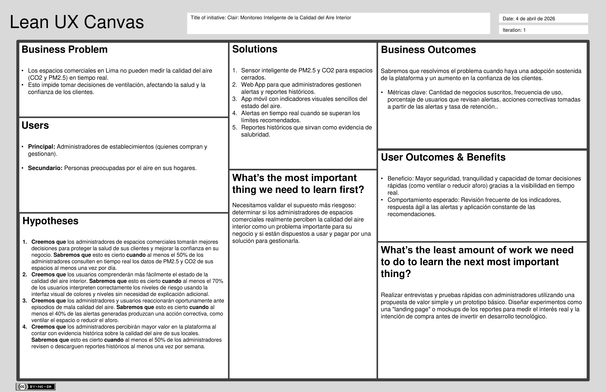

# Capítulo I: Introducción

## 1.1. Startup Profile

### 1.1.1. Descripción de la Startup

En Vanana, creemos firmemente que respirar aire limpio no debería ser un privilegio ni una incógnita, sino una garantía para las personas. Al observar y transitar los espacios comerciales cerrados de Lima Metropolitana, hemos identificado una problemática invisible pero de profundo impacto: la calidad del aire interior suele ser una variable ignorada y descuidada. Nuestro proyecto nace del deseo genuino de proteger la salud de nuestra comunidad frente a los riesgos que representa esta amenaza silenciosa. Nuestro propósito es visibilizar lo invisible, empoderar a las personas para que puedan tomar decisiones conscientes sobre los lugares que habita y frecuenta.

Para materializar este compromiso con nuestra ciudad, hemos desarrollado **Clair**. Más que una herramienta tecnológica, Clair es un sistema integral de monitoreo diseñado para cuidar de las personas.

- **Misión:** Despertar una conciencia colectiva y fomentar el cuidado activo del aire en los espacios que compartimos a diario, democratizando el acceso a la información para proteger la salud y elevar la calidad de vida.

- **Visión:** Convertirnos en la plataforma líder y el principal motor de cambio en el monitoreo de la calidad del aire interior en el Perú, liderando una transformación hacia un futuro.

### 1.1.2. Perfiles de integrantes del equipo

| Foto del estudiante | Nombres y apellidos | Código de estudiante | Descripción |
|------------------------------------------------------------------------------------------------------|-----------------------------------------|----------------------|-------------------------------------------------------------------------------------------------------------------------------------------------------------------------------------------------------------------------------------------------------------------------|
|  | Dante Mateo Aleman Romano | u202319963 | Desarrollador de 20 años y estudiante de Ingeniería de Software, apasionado por Linux. Me encanta crear servicios, configurar máquinas y profundizar en prácticas de seguridad. |
|  | Contreras Peralta, Fabrizio Alessandro | u202319889 | Estudiante de Ingeniería de Software de 21 años, apasionado por resolver problemas con ideas creativas. Tengo un fuerte interés en la automatización de proyectos mediante LLMs y en explorar nuevas herramientas emergentes. |
|  | Curipaco Huayllani, Neil Aldrin Wilhelm | U20231B866 | Soy Neil Curipaco Huayllani, estudiante del 7mo ciclo de Ingeniería de Software en la UPC. Me apasionan los videojuegos, aprender cosas nuevas, escuchar música y mejorar mis habilidades para contribuir al equipo. |
|  | Macavilca Quispe, Ian | U202121325 | Estudiante de Ingeniería de Software de 21 años, enfocado en la optimización y el diseño de aplicaciones web y móviles. Disfruto resolver problemas con soluciones creativas. |
|  | Paiva Quispe, Josue Gonzalo | u202119095 | Estudiante avanzado de Ingeniería de Software en el 8vo ciclo, realizando prácticas preprofesionales como desarrollador web fullstack junior. |

## 1.2. Solution Profile

### 1.2.1 Antecedentes y problemática

La calidad del aire se ha consolidado, a través de los años, como uno de los principales retos de salud pública, adquiriendo matices críticos en metrópolis con alta densidad vehicular. En este contexto, Lima figura recurrentemente entre las ciudades con peor calidad del aire en América Latina. Según reportes de monitoreo global, nuestra capital registra promedios de material particulado fino (PM2.5) que superan de forma sostenida las directrices de la Organización Mundial de la Salud (OMS), llegando en determinadas zonas de la ciudad a exceder hasta en nueve veces el límite máximo recomendado de 5 µg/m³ (IQAir, 2024).

La gravedad de esta exposición radica en la naturaleza del PM2.5. Al medir menos de 2.5 micrómetros de diámetro, estas partículas evaden las defensas respiratorias primarias, penetran profundamente en los alvéolos pulmonares y logran ingresar directamente al torrente sanguíneo. Esta infiltración desencadena inflamación sistémica y estrés oxidativo.

A pesar de estas alarmantes cifras, las estrategias de mitigación y evaluación se han enfocado casi exclusivamente en el ámbito macroscópico. Entidades del gobierno operan redes de monitoreo y estaciones meteorológicas a escala metropolitana que evalúan únicamente la contaminación del exterior. Sin embargo, existe un vacío crítico en la medición a nivel micro, específicamente dentro de las edificaciones donde las personas transcurren más del 80% de su tiempo. La evidencia científica deja en claro que la contaminación ambiental se infiltra en los interiores, sumándose a los contaminantes generados por la propia ocupación humana. El mercado peruano aún no ofrece las soluciones tecnológicas necesarias para gestionar esta variable en espacios comerciales.

El problema central radica principalmente en la incapacidad tecnológica y estructural para monitorear, visibilizar y gestionar la calidad del aire dentro de locales comerciales cerrados en Lima, lo que expone a los ocupantes a riesgos sanitarios y deterioros cognitivos. Para estructurar y delimitar la problemática, se aplicó el marco analítico de las 5 ‘W’s y 2 ‘H’s:

1. What (Qué): Existe una carencia significativa de sistemas de monitoreo de aire de grado industrial que sean asequibles para el sector de servicios. Esto convierte a la contaminación interior en un riesgo invisible, presentando problemas graves como la acumulación de dióxido de carbono (CO2) dentro de un ambiente cerrado y la presencia de PM2.5

2. Who (Quién): Los segmentos directamente afectados son los consumidores y usuarios que permanecen tiempos prolongados en espacios cerrados (gimnasios, restaurantes, _coworkings_ y aulas).

3. Where (Dónde): El problema ocurre en espacios comerciales, educativos e institucionales de uso público situados en Lima Metropolitana

4. When (Cuándo): La exposición es un evento continuo, acentuándose mayormente durante las horas de máxima ocupación operativa de los locales (horas pico).

5. Why (Por qué): Existe una alta barrera de entrada tecnológica; los sensores industriales son sumamente costosos. Segundo, a diferencia de las calificaciones de higiene alimentaria, no existe un mecanismo normativo o comercial que obligue a transparentar la calidad del aire, dejando al consumidor sin capacidad de verificar la salubridad del local antes de ingresar.

6. How (Cómo): La problemática se manifiesta de forma silente y progresiva. En recintos de alta densidad y pobre renovación de aire, se asume erróneamente que el ambiente está purificado solo por contar con aire acondicionado.

7. How Much (Cuánto): La infiltración de aire exterior contaminado somete a los usuarios a niveles de PM2.5 hasta 9 veces superiores a lo tolerable. Por otro, la exhalación humana en espacios cerrados dispara rápidamente el CO2 por encima de las 1000 partes por millón (ppm). Según los estándares de la _American Society of Heating, Refrigerating and Air-Conditioning Engineers_, superar este umbral de 1000 ppm degrada el rendimiento cognitivo, altera la concentración e incrementa la fatiga mental de forma significativa (ASHRAE, 2022).

### 1.2.2 Lean UX Process.

#### 1.2.2.1. Lean UX Problem Statements.

En Lima Metropolitana, la calidad del aire se monitorea principalmente a nivel exterior mediante redes macroscópicas, mientras que los espacios comerciales cerrados carecen de sistemas accesibles que permitan medir y gestionar la calidad del aire interior.

Como consecuencia, administradores y usuarios no cuentan con visibilidad sobre indicadores críticos como PM2.5 y CO2, a pesar de que estos pueden superar significativamente los límites recomendados por organismos como la OMS y ASHRAE, especialmente durante horas de alta ocupación.

Esta falta de información convierte la contaminación del aire interior en un riesgo invisible, generando impactos negativos en la salud respiratoria, el rendimiento cognitivo y la experiencia de los usuarios dentro de estos espacios.

Actualmente, el mercado peruano no ofrece soluciones tecnológicas accesibles que integren monitoreo en tiempo real, visualización clara de datos y recomendaciones accionables, lo que evidencia una brecha entre las necesidades del usuario moderno y la oferta disponible.

Como resultado, los administradores toman decisiones basadas en suposiciones como confiar únicamente en sistemas de aire acondicionado sin garantizar condiciones adecuadas de ventilación y salubridad.

¿Cómo podríamos visibilizar, monitorear y mejorar la calidad del aire interior en espacios comerciales cerrados de Lima mediante una solución tecnológica accesible, en tiempo real y fácil de usar?

#### 1.2.2.2. Lean UX Assumptions.

**User Assumptions**

- Creemos que los usuarios que permanecen en espacios cerrados por largos periodos no son conscientes de la calidad del aire interior, porque no cuentan con información visible ni accesible en tiempo real.
- Creemos que los administradores de espacios comerciales valoran la salud y bienestar de sus clientes, porque esto influye directamente en la percepción de su negocio y en la fidelización
- Creemos que los usuarios prefieren soluciones tecnológicas simples e intuitivas, porque no tienen conocimiento técnico sobre indicadores tecnicos
- Creemos que, si los usuarios reciben información clara y visual sobre la calidad del aire, tomarán decisiones inmediatas para mejorar su entorno.

**User Outcome Assumptions**

- Creemos que, si los usuarios pueden visualizar la calidad del aire en tiempo real, se sentirán más seguros dentro de los espacios que frecuentan, lo que aumentará su confianza en el entorno.
- Creemos que, si los administradores cuentan con datos accesibles sobre la calidad del aire, podrán tomar decisiones operativas para mejorar la ventilación, lo que impactará positivamente en la experiencia del usuario.
- Creemos que, si los usuarios reciben alertas oportunas, modificarán su comportamiento (ventilar, reducir aforo, etc.), lo que contribuirá a mejorar la calidad del aire.

**Business Assumptions**

- Creemos que existe una oportunidad de mercado en Lima Metropolitana, porque actualmente no hay soluciones accesibles de monitoreo de calidad del aire interior.
- Creemos que los negocios están dispuestos a invertir en soluciones que mejoren su reputación, porque la percepción de seguridad y bienestar es un factor diferenciador competitivo.
- Creemos que un modelo de suscripción será viable, porque los usuarios necesitarán acceso continuo a datos, alertas y reportes.
- Creemos que la integración de hardware (sensor) y software (plataforma digital) es viable, porque la tecnología actual permite monitoreo en tiempo real a bajo costo.

**Business Outcome Assumptions**

- Creemos que, si la solución se implementa en espacios comerciales, los negocios mejorarán su percepción de seguridad y confianza frente a los clientes, lo que fortalecerá su posicionamiento.
- Creemos que, si el producto demuestra valor en etapas iniciales, se logrará adopción progresiva en diferentes tipos de locales (gimnasios, restaurantes, coworkings).
- Creemos que el uso continuo de la plataforma generará ingresos recurrentes, porque el servicio depende del monitoreo constante y actualización de datos.

**Feature Assumptions**

- Creemos que un sensor capaz de medir PM2.5 y CO2 en tiempo real es suficiente para generar valor inicial, porque estos son los principales indicadores de calidad del aire interior.
- Creemos que una interfaz basada en indicadores visuales (colores, niveles) facilitará la comprensión del usuario, porque reduce la necesidad de interpretar datos técnicos.
- Creemos que las alertas en tiempo real incentivarán la acción inmediata, porque informan al usuario en el momento en que ocurre el problema.
- Creemos que los reportes históricos serán valorados por los administradores, porque les permitirán demostrar condiciones seguras en sus espacios.
- Creemos que incluir recomendaciones automáticas (ej. abrir ventanas) aumentará el uso de la plataforma, porque guía al usuario sin necesidad de conocimiento previo.

#### 1.2.2.3. Lean UX Hypothesis Statements.

1. **Creemos que** los administradores de espacios comerciales tomarán mejores decisiones para proteger la salud de sus clientes y mejorar la confianza en su negocio. **Sabremos** que esto es cierto cuando al menos el 50% de los administradores consulten en tiempo real los datos de PM2.5 y CO2 de sus espacios al menos una vez por día.
2. **Creemos que** los usuarios comprenderán más fácilmente el estado de la calidad del aire interior. **Sabremos** que esto es cierto **cuando** al menos el 70% de los usuarios interpreten correctamente los niveles de riesgo usando la interfaz visual de colores y niveles sin necesidad de explicación adicional.
3. **Creemos que** los administradores y usuarios reaccionarán oportunamente ante episodios de mala calidad del aire **Sabremos** que esto es cierto **cuando** al menos el 40% de las alertas generadas produzcan una acción correctiva, como ventilar el espacio o reducir el aforo.
4. **Creemos que** los administradores percibirán mayor valor en la plataforma al contar con evidencia histórica sobre la calidad del aire de sus locales. **Sabremos** que esto es cierto **cuando** al menos el 50% de los administradores revisen o descarguen reportes históricos al menos una vez por semana.
5. **Creemos que** los usuarios mejorarán las condiciones de su entorno siguiendo la orientación de la plataforma. **Sabremos** que esto es cierto **cuando** al menos el 40% de los usuarios apliquen las recomendaciones automáticas y registren una mejora en los niveles de calidad del aire durante el periodo de uso.

#### 1.2.2.4. Lean UX Canvas.

## 1.3. Segmentos objetivo

| Segmento Objetivo #1: | Administradores de Establecimientos Públicos y Privados |
| ---------------------- | ------------------------------------------------------------------------------------------------------------------------------------------------------------------------------------------------------------------------------------------------------------------------------------------------------------------------------------------------------------------------------------------------------------------------------------------------------------------------ |
| Aspectos demográficos | Sexo: Indistinto Edad: 25 a 50 años Nivel socioeconómico: Sectores que buscan optimizar costos operativos y cumplir con estándares de salubridad) |
| Aspectos geográficos | Nacionalidad: Peruana Zona geográfica: Lima Metropolitana, especialmente en áreas de alta afluencia y densidad comercial |
| Aspectos psicográficos | Profesionales orientados a la eficiencia y la seguridad ocupacional que buscan diferenciar su local mediante el bienestar de sus clientes. Valoran la transparencia y la tecnología como herramientas para demostrar que sus espacios son seguros frente a "amenazas invisibles" como el CO2 y el PM2.5. Muestran interés en soluciones de bajo costo que ofrezcan un alto valor reputacional. |
| Aspectos conductuales | **Necesidad:** Buscan optimizar el uso de sistemas de aire acondicionado y ventilación para reducir riesgos sanitarios y fatiga mental en sus ocupantes. **Uso de herramientas:** Requieren acceso a una Web App para generar reportes históricos que certifiquen la calidad del aire del establecimiento. **Respuesta:** Actúan de forma inmediata ante alertas móviles cuando el CO2 supera las 1000 ppm para evitar el deterioro cognitivo de sus clientes. |

| Segmento Objetivo #2: | Personas preocupadas por la calidad del aire en el hogar |
| ---------------------- | ------------------------------------------------------------------------------------------------------------------------------------------------------------------------------------------------------------------------------------------------------------------------------------------------------------------------------------------------------------------------------------------------------------------------------------------- |
| Aspectos demográficos | Sexo: Indistinto Edad: 25 a 50 años Nivel socioeconómico: Hogares con acceso a dispositivos móviles y servicios digitales |
| Aspectos geográficos | Nacionalidad: Peruana Zona geográfica: Distritos con alta contaminación vehicular o zonas residenciales densas. Departamento: Lima |
| Aspectos psicográficos | Individuos con una mentalidad preventiva que consideran el aire limpio como un factor crítico para la salud de su familia. Sienten desconfianza de la pureza ambiental en zonas urbanas y buscan "visibilizar" los contaminantes invisibles para reducir riesgos sanitarios. Valoran la seguridad y la paz mental que les brinda el monitoreo constante basado en datos reales. |
| Aspectos conductuales | **Interacción:** Consultan frecuentemente aplicaciones de monitoreo para verificar el estado de su vivienda. **Acción:** Toman decisiones inmediatas ante alertas, como abrir ventanas para reducir el CO2 o cerrarlas ante picos de contaminación externa. **Tecnología:** Prefieren interfaces móviles intuitivas que utilicen indicadores visuales de colores para una comprensión rápida sin requerir conocimientos técnicos. |
