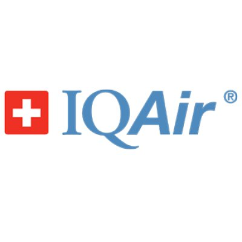

**Artefactos de UX (Cuando corresponda) Cuando corresponda, cada equipo tendrá creado un proyecto en UXPressia, en el cual deben elaborar los artefactos de UX soportados por la herramienta. Capturas en imagen de estos artefactos deben incluirse en el Document Report en las secciones adecuadas y con las explicaciones y análisis que correspondan. Del mismo modo, los diagramas en herramientas indicadas como LucidChart o Figma, deben incluirse como imágenes en el documento junto con su explicación, además de ser mostradas y explicadas en el video de exposición.**

Para los diagramas de EventStorming se utilizará LucidChart / Miro.

# Capítulo II: Requirements Elicitation & Analysis

## 2.1. Competidores.

En esta sección se realiza la identificación y descripción de los principales competidores directos (3 como mínimo) con modelos de negocio basados en productos digitales similares, o en su defecto competidores indirectos con ofertas parcialmente similares

**Airly**
Airly es una empresa de origen polaco que ha consolidado una de las redes de monitoreo de calidad del aire más extensas y dinámicas a nivel global. Su propuesta de valor se fundamenta en la implementación de sensores de alta resistencia diseñados principalmente para entornos exteriores, utilizando algoritmos avanzados de inteligencia artificial para generar pronósticos predictivos y mapas de calor comunitarios de acceso abierto. En el contexto de Lima Metropolitana, se han posicionado como el referente principal para municipalidades y organizaciones gubernamentales (B2G), apalancando una estrategia de *Open Data* que otorga visibilidad masiva a su marca mientras facilita la comercialización de soluciones privadas de monitoreo ambiental para el sector retail y corporativo.

**IQAir** 
Establecida como el estándar de oro global en tecnología de purificación y monitoreo, IQAir es una organización suiza cuya autoridad de marca se sustenta en poseer la base de datos de calidad del aire más consultada del mundo. Su línea de productos, destacando la serie AirVisual, está orientada a un segmento de mercado premium que incluye instituciones de salud privadas, embajadas y corporaciones de alto nivel que requieren una precisión técnica certificada para auditorías de salud ambiental. Su ecosistema se distingue por una integración vertical perfecta entre dispositivos de monitoreo y sistemas de purificación, utilizando su plataforma móvil líder en descargas como un canal de marketing directo para capturar a consumidores de alto poder adquisitivo preocupados por la pureza total del entorno.

**Kaiterra** 
Kaiterra es una compañía especializada en el sector B2B y la gestión de *Smart Buildings*, enfocada en proporcionar soluciones de hardware modular, como el sistema Sensedge, que se integran nativamente con la infraestructura de climatización (HVAC) de grandes edificaciones. Su ventaja competitiva reside en el cumplimiento normativo estricto, siendo sus dispositivos los únicos en el mercado que garantizan puntajes directos para la obtención de certificaciones internacionales de sostenibilidad como LEED, WELL y RESET. Al emplear protocolos de comunicación industrial (BACnet y Modbus), Kaiterra se dirige específicamente a desarrolladoras inmobiliarias y gestores de infraestructura que buscan optimizar el rendimiento del edificio y asegurar estándares de construcción verde, consolidándose como un aliado técnico esencial en proyectos de edificación de clase A+.

### 2.1.1. Análisis competitivo.

<table>
    <thead>
        <tr>
            <th colspan="6">Competitive Analysis Landscape</th>
        </tr>
    </thead>
    <tbody>
        <tr>
            <td colspan="2">¿Por qué llevar a cabo este análisis?</td>
            <td colspan="4">El objetivo es identificar las brechas tecnológicas y de experiencia de usuario en las plataformas actuales de monitoreo de aire en Perú, para validar que la integración de alertas personalizadas de Clair responde a una demanda insatisfecha en espacios cerrados.</td>
        </tr>
        <tr>
            <td colspan="2">(En la cabecera colocar por cada competidor nombre y logo)</td>
            <td>Vanana </td>
            <td>Airly </td>
            <td>IQAir </td>
            <td>Kaiterra </td>
        </tr>
        <tr>
            <td rowspan="2"><strong>Perfil</strong></td>
            <td>Overview</td>
            <td>Clair se enfoca en el microclima de espacios comerciales cerrados, integrando sensores PM2.5/CO2 con una plataforma que prioriza la interpretabilidad visual y la acción correctiva.</td><td>Empresa polaca con una de las redes de sensores de aire más grandes del mundo. En Lima, son el referente en monitoreo de exteriores (calle) mediante mapas de calor comunitarios y datos abiertos.</td><td>Estándar de oro global en tecnología de purificación y monitoreo. Su serie Visual es el dispositivo de referencia para oficinas de alto nivel y sedes corporativas que buscan prestigio y precisión suiza.</td><td>Empresa enfocada exclusivamente en el sector B2B y Smart Buildings. Sus dispositivos, como el Sensedge, están diseñados para ser empotrados en paredes y techos, integrándose directamente con los sistemas de aire acondicionado (HVAC).</td>
        </tr>
        <tr>
            <td>Ventaja competitiva ¿Qué valor ofrece a los clientes?</td>
            <td>Gestión Basada en Evidencia: Ofrece reportes históricos semanales que transforman suposiciones en decisiones de gestión de aforo y ventilación.   Accesibilidad Operativa: Diseñado para administradores que no son expertos en calidad del aire, facilitando una tasa de respuesta del 40% ante alertas.</td><td>Efecto de Red: Sus datos son utilizados por municipalidades y medios de comunicación, lo que les da una visibilidad de marca masiva.   Familiaridad: Los usuarios de Lima ya reconocen sus estaciones en distritos como Miraflores o San Borja.</td><td>Autoridad de Marca: Poseen la base de datos de calidad del aire más consultada del mundo; aparecer en su ranking otorga validación internacional.   Certificación de Datos: Sus sensores están validados para auditorías de salud ambiental de alto rigor.</td><td>Cumplimiento Normativo: Sus productos son los únicos que garantizan puntos directos para certificaciones internacionales de edificios verdes como LEED, WELL y RESET.   Integración BMS: Se comunica mediante protocolos industriales (BACnet, Modbus) con la infraestructura inteligente del edificio.</td>
        </tr>
        <tr>
            <td rowspan="2"><strong>Perfil de Marketing</strong></td>
            <td>Mercado objetivo</td>
            <td>Primario: Administradores de centros comerciales, gimnasios, oficinas y restaurantes en Lima.   Secundario: Personas preocupadas por la calidad del aire en el Hogar. </td><td>Gobiernos municipales, ONGs ambientales y empresas de Retail con fuertes políticas de responsabilidad social (ESG) que operan principalmente en Lima (Miraflores, San Isidro).</td><td>Consumidores de lujo, instituciones de salud privadas y embajadas en Perú que no escatiman en costos para garantizar pureza total.</td><td>Desarrolladoras inmobiliarias corporativas y administradores de Centros Comerciales que necesitan cumplir con estándares internacionales de construcción sostenible.</td>
        </tr>
        <tr>
            <td>Estrategias de marketing</td>
            <td>Estrategia de Gamificación y Reportes: Envío de un "Reporte de Salud Semanal" a los administradores.</td><td>Open Data: Mantener un mapa de acceso gratuito para el ciudadano común, lo que sirve como "caballo de Troya" para vender soluciones privadas a las empresas del entorno.</td><td>Inbound Marketing Global: Uso de su App para enviar notificaciones de alerta de polución en Lima, sugiriendo la compra de sus equipos como solución inmediata.</td><td>Account-Based Marketing (ABM): Campañas dirigidas específicamente a arquitectos y gestores de infraestructura para que incluyan sus sensores en los planos de nuevos proyectos desde la fase de diseño.</td>
        </tr>
        <tr>
            <td rowspan="3"><strong>Perfil de Producto</strong></td>
            <td>Productos & Servicios</td>
            <td>Hardware: Sensor "Clair-V1".   Software: App móvil para usuarios/clientes y Dashboard Web para administradores con reportes históricos semanales.   Servicio: Sistema de alertas inteligentes vía Notificaciones con recomendaciones de ventilación basadas en niveles de ocupación. </td><td>Hardware: Sensores de exterior de alta resistencia y sensores de interior simplificados.  Software: Mapa global de calidad del aire (Airly Map) y API de datos para integración en pantallas publicitarias o webs municipales.  Servicio: Pronóstico de calidad del aire a 24h mediante Inteligencia Artificial.</td><td>Hardware: Monitor AirVisual Pro (pantalla a color de alta resolución incorporada).   Software: Integración con la red global AirVisual.   Servicio: Sincronización automática con purificadores de aire de la misma marca.</td><td>Hardware: Sensedge y Sensedge Mini (sensores modulares calibrables).   Software: Dashboard de nivel industrial con protocolos de seguridad de datos para empresas.   Servicio: Consultoría para obtención de certificaciones WELL, LEED y RESET. Integración total con sistemas HVAC (Aire acondicionado centralizado).</td>
        </tr>
        <tr>
            <td>Precios & Costos</td>
            <td>Modelo Híbrido: Venta del hardware (pago único accesible) + Suscripción mensual "Clair Pro" para acceso a analítica avanzada y reportes históricos (SaaS).</td><td>Modelo B2B/B2G: Contratos anuales de "Aire como Servicio" (Air as a Service) que incluyen mantenimiento y acceso a la plataforma de datos.   Costo Estimado: Suscripciones anuales desde $500 - $1,000 USD por punto de monitoreo.</td><td>Modelo Retail Premium: Venta directa de hardware de alto costo. No suele requerir suscripción para funciones básicas, pero el equipo es costoso.   Costo Estimado: Hardware $280 - $350 USD por unidad.</td><td>Modelo de Proyecto: Presupuestos por volumen para edificios completos o centros comerciales. Incluye planes de reemplazo de módulos de sensores cada 2 años.   Costo Estimado: Proyectos desde $1,500 USD en adelante según la escala del edificio.</td>
        </tr>
        <tr>
            <td>Canales de distribución (Web y/o Móvil)</td>
            <td>Web: Plataforma de gestión centralizada para administradores de múltiples locales.   Móvil: App (iOS/Android) para monitoreo en tiempo real y recepción de alertas.</td><td>Web: Mapa interactivo público y panel de control para clientes corporativos.   Móvil: App Airly (enfocada en el ciudadano que consulta el aire de su zona).</td><td>Web: E-commerce global y base de datos de consulta mundial.   Móvil: App AirVisual (líder en descargas, usada como canal de marketing para vender sus purificadores).</td><td>Web: Dashboard empresarial compatible con protocolos industriales (BACnet, Modbus).   Móvil: App de visualización técnica para gestores de mantenimiento de edificios (Facility Managers).</td>
        </tr>
        <tr>
            <td rowspan="4"><strong>Análisis SWOT</strong></td>
            <td>Fortalezas</td>
            <td>Profundo conocimiento del contexto de Lima; interfaz intuitiva basada en Lean UX; bajo costo de implementación.</td><td>Red de sensores ya establecida en distritos clave de Lima; algoritmos de IA predictiva muy avanzados; fuerte presencia en medios de comunicación.</td><td>Marca número 1 a nivel mundial en confianza; ecosistema completo que conecta monitores con purificadores de aire.</td><td>Único que garantiza puntos para certificaciones LEED/WELL; diseño modular que facilita el mantenimiento en grandes infraestructuras.</td>
        </tr>
        <tr>
            <td>Debilidades</td>
            <td>Marca nueva en el mercado; recursos limitados para I+D comparado con globales; dependencia inicial de la adopción de los administradores.</td><td>Su enfoque principal es el exterior (calle), perdiendo precisión en las dinámicas de flujo de personas dentro de comercios cerrados.</td><td>Precios muy elevados para el mercado promedio peruano; soporte técnico remoto o inexistente en Lima (depende de distribuidores).</td><td>Demasiado complejo y caro para un comercio mediano o pequeño; requiere instalación técnica especializada.</td>
        </tr>
        <tr>
            <td>Oportunidades</td>
            <td>Creciente preocupación por la salud post-pandemia en Lima; falta de soluciones específicas para el sector comercial peruano; posibilidad de crear un "Sello de Calidad de Aire" local.</td><td>Alianzas con municipalidades para integrar datos de interiores en proyectos de "Smart Cities".</td><td>Capturar el mercado de lujo y corporativos transnacionales en San Isidro y Miraflores.</td><td>Crecimiento de la construcción de edificios de oficinas clase A+ en el centro financiero de Lima.</td>
        </tr>
        <tr>
            <td>Amenazas</td>
            <td>Ingreso de clones económicos de China; cambios bruscos en las normativas de salud del gobierno peruano que favorezcan certificaciones internacionales caras.</td><td>Saturación de datos públicos gratuitos que hagan que las empresas no quieran pagar por una versión privada.</td><td>Aparición de sensores de bajo costo con precisión "suficiente" para el usuario común que no requiere estándares suizos.</td><td>Crisis en el sector inmobiliario comercial que detenga la construcción de nuevos edificios "Smart".</td>
        </tr>
    </tbody>
</table>

### 2.1.2. Estrategias y tácticas frente a competidores.

Para afrontar de manera estratégica el panorama competitivo en Lima Metropolitana, Vanana implementará una serie de tácticas ofensivas y defensivas diseñadas para capitalizar las brechas de servicio de los actores globales y mitigar las amenazas del mercado local. 

1. Nuestra principal estrategia se centrará en la especialización sobre el microclima de interiores, diferenciándonos de competidores como Airly, cuyo enfoque principal es el monitoreo de exteriores, mediante el desarrollo de un ecosistema de alertas inteligentes y reportes de gestión de aforo que transforman datos crudos en decisiones operativas inmediatas para administradores de espacios cerrados.

2. Frente a la autoridad de marca de gigantes como IQAir o la complejidad técnica de Kaiterra, Clair se posicionará como una solución de alta precisión técnica, pero de baja barrera de entrada, ofreciendo un modelo de costos híbrido que combina hardware accesible con una suscripción SaaS de analítica avanzada, eliminando la necesidad de grandes inversiones iniciales o personal especializado para su instalación.

3. Para neutralizar la amenaza de dispositivos genéricos de bajo costo, fortaleceremos nuestra propuesta de valor mediante la creación de un "Sello de Calidad de Aire" local y un soporte técnico presencial garantizado en menos de 24 horas, aprovechando nuestra ubicación estratégica en Lima para ofrecer una cercanía y confianza que los proveedores internacionales no pueden replicar.

4. Aprovecharemos la creciente preocupación post-pandemia por la salud ambiental para ejecutar tácticas de marketing de contenidos y alianzas con gremios comerciales, posicionando a Clair no solo como un sensor de IoT, sino como una herramienta indispensable de responsabilidad social y seguridad laboral que protege activamente la salud de la comunidad peruana.

5. Buscaremos ofrecer soluciones prácticas y personalizadas a los locales u hogares que usen Clair con las recomendaciones ofrecidas en la aplicación móvil, para que los usuarios puedan tomar acciones concretas, el resultado de dichas acciones se podrá observar en los reportes históricos semanales.

## 2.2. Entrevistas.

En esta sección se aborda la investigación tomando como base la recolección de información basándonos en entrevistas a representantes de los segmentos objetivo.

### 2.2.1. Diseño de entrevistas.

| Segmento Objetivo #1:      | Administradores de Establecimientos Públicos y Privados                                                                                                                                                                                                                                                                                                                                                                                                                                                                                                                                                                                                                                                                                            |
| -------------------------- | -------------------------------------------------------------------------------------------------------------------------------------------------------------------------------------------------------------------------------------------------------------------------------------------------------------------------------------------------------------------------------------------------------------------------------------------------------------------------------------------------------------------------------------------------------------------------------------------------------------------------------------------------------------------------------------------------------------------------------------------------- |
| Datos Demográficos         | ¿Cuál es su nombre completo y edad? ¿En qué distrito se ubica su establecimiento? ¿Cuál es su cargo actual?                                                                                                                                                                                                                                                                                                                                                                                                                                                                                                                                                                                                                                |
| Ocupación y Background     | ¿Qué tipo de establecimiento administra y cuántas personas lo frecuentan en un día típico? ¿Cuántos empleados trabajan en el local? ¿Cuánto tiempo lleva administrando este tipo de espacio?                                                                                                                                                                                                                                                                                                                                                                                                                                                                                                                                               |
| Perfil Psicográfico        | ¿Cómo toma decisiones cuando detecta un problema que afecta la experiencia de sus clientes o empleados? ¿Qué herramientas digitales usa actualmente para gestionar el local? ¿Qué tan abierto se considera a adoptar nueva tecnología si resuelve un problema concreto?                                                                                                                                                                                                                                                                                                                                                                                                                                                                    |
| Calidad del Aire           | ¿Tiene algún sistema o práctica para controlar la ventilación del local actualmente? ¿Confía en que el aire acondicionado o la ventilación existente es suficiente para mantener un ambiente saludable? ¿Ha recibido quejas de clientes o empleados sobre sensación de calor, aire viciado o incomodidad dentro del local? ¿Ha notado que sus empleados se fatigan, pierden concentración o se quejan de malestar físico durante el horario laboral sin una causa clara? ¿Sabía que en espacios cerrados con alta ocupación el CO2 y las partículas en suspensión pueden superar los límites recomendados por la OMS sin que nadie lo note? ¿Cómo sabría hoy si la calidad del aire de su local está dentro de rangos seguros? |
| Objetivos y Frustraciones  | ¿Qué tan importante considera el bienestar físico de sus clientes y empleados dentro del local para la reputación de su negocio? ¿Existe algún aspecto del ambiente interior que sienta que no puede controlar ni medir actualmente? ¿Cumpliría con estándares de salubridad del aire si existiera una forma sencilla de demostrarlo? ¿Qué tan dispuesto estaría a usar una solución que monitoree el aire en tiempo real y le indique cuándo actuar? ¿Qué condiciones económicas o técnicas tendría que cumplir para considerarla viable?                                                                                                                                                                                         |
| Tecnología y Canales       | ¿Qué dispositivos usa a diario para gestionar el local? ¿Usaría una aplicación que le muestre en tiempo real el estado del aire de su local y le envíe alertas cuando haya riesgo? ¿Le resultaría útil poder generar reportes históricos de calidad del aire para demostrar que su espacio es seguro?                                                                                                                                                                                                                                                                                                                                                                                                                                      |
| Comportamiento de Decisión | ¿Qué lo lleva a invertir en una mejora para el local? ¿Quién más participa en decisiones de equipamiento o tecnología? ¿Recomendaría a otros administradores una solución que le haya dado resultados concretos?                                                                                                                                                                                                                                                                                                                                                                                                                                                                                                                           |
|                            |                                                                                                                                                                                                                                                                                                                                                                                                                                                                                                                                                                                                                                                                                                                                                    |

| Segmento Objetivo #2:      | Personas preocupadas por la calidad del aire en el hogar                                                                                                                                                                                                                                                                                                                                                                                                                                                                                                                                                                                                                               |
| -------------------------- | -------------------------------------------------------------------------------------------------------------------------------------------------------------------------------------------------------------------------------------------------------------------------------------------------------------------------------------------------------------------------------------------------------------------------------------------------------------------------------------------------------------------------------------------------------------------------------------------------------------------------------------------------------------------------------------- |
| Datos Demográficos         | ¿Cuál es su nombre completo y edad? ¿En qué distrito reside? ¿Cuántas personas viven en su hogar y hay niños pequeños o adultos mayores entre ellos?                                                                                                                                                                                                                                                                                                                                                                                                                                                                                                                           |
| Ocupación y Background     | ¿A qué se dedica actualmente? ¿Cuánto tiempo lleva viviendo en su hogar? ¿Cómo describiría su zona en cuanto a tráfico vehicular o densidad urbana?                                                                                                                                                                                                                                                                                                                                                                                                                                                                                                                            |
| Perfil Psicográfico        | ¿Qué tan activo es en tomar decisiones preventivas sobre la salud de su familia? ¿Qué dispositivos tecnológicos usa en casa? ¿Dónde busca información cuando tiene dudas sobre salud o bienestar?                                                                                                                                                                                                                                                                                                                                                                                                                                                                              |
| Calidad del Aire           | ¿Ha sentido que el aire dentro de su hogar se siente cargado o incómodo sin una causa evidente? ¿Alguien en su hogar ha tenido dolores de cabeza frecuentes, cansancio sin razón clara o problemas respiratorios recurrentes? ¿Alguna vez asoció esos síntomas con el ambiente dentro de la casa? ¿Sabe si en su zona los niveles de contaminación exterior afectan también el interior de su hogar? ¿Sabía que el aire interior puede concentrar contaminantes como CO2 o partículas finas por encima de lo recomendado por la OMS, incluso con las ventanas cerradas? ¿Qué hace actualmente para cuidar el ambiente de su hogar y cómo sabe si está funcionando? |
| Objetivos y Frustraciones  | ¿Cuál es su mayor preocupación respecto al ambiente en el que vive su familia? ¿Siente que tiene control real sobre la calidad del aire dentro de su hogar o actúa más por intuición? ¿Qué tendría que pasar para que tomara una acción concreta al respecto? Si pudiera ver en tiempo real cómo está el aire de su casa y recibir recomendaciones simples sobre qué hacer, ¿le resultaría útil? ¿Qué condiciones tendría que cumplir ese dispositivo para que lo considerara una compra justificada?                                                                                                                                                                  |
| Tecnología y Canales       | ¿Qué dispositivos usa más durante el día? ¿Usa alguna app relacionada con salud, bienestar o el hogar? ¿Preferiría ver la información del aire mediante colores, gráficos o notificaciones en su celular? ¿Le resultaría cómodo que el dispositivo le sugiera automáticamente si abrir ventanas, encender ventilación o tomar otra acción?                                                                                                                                                                                                                                                                                                                                 |
| Comportamiento de Decisión | ¿Qué lo llevaría a comprar un dispositivo de monitoreo de aire para su hogar? ¿Ha comprado antes productos orientados a la salud o bienestar del hogar? ¿Quién en su familia participaría en esa decisión? ¿Recomendaría este tipo de solución a alguien cercano?                                                                                                                                                                                                                                                                                                                                                                                                          |

### 2.2.2. Registro de entrevistas.

| Segmento objetivo                                            | Administradores de Establecimientos Públicos y Privados      | Video                       |
| ------------------------------------------------------------ | ------------------------------------------------------------ | --------------------------- |
| Santiago Temoche  | **Datos Demográficos:**  El entrevistado tiene 18 años de edad. Su establecimiento se ubica en el Centro Comercial Arenales, específicamente en el sótano  **Ocupación y Background:**  Se encarga de la atención, ventas y entrega de productos en una tienda de coleccionables. El local es frecuentado por 20 a 30 personas en un día normal y él trabaja de forma fija desde hace 2 a 3 años, con apoyo ocasional de compañeros.  **Perfil Psicográfico:** Ante problemas que afectan la experiencia del cliente, busca soluciones inmediatas que estén a su alcance para asegurar la satisfacción. Se considera abierto a adoptar nueva tecnología "de vez en cuando" si ayuda a mejorar el local, específicamente en temas de ventilación.  **Calidad del Aire:**  Utiliza ventiladores cuando hay mucha afluencia de gente o calor excesivo. Confía en que la ventilación existente es suficiente y solo ha recibido observaciones sobre el calor en tono de broma, no como quejas formales. No sabía que el $CO_2$ puede superar los límites recomendados sin ser notado y admite no saber cómo determinar si el aire está en rangos seguros.  **Objetivos y Frustraciones:**  Considera importante el bienestar de los clientes, ofreciéndoles sillas para descansar y prendiendo el ventilador para que se sientan frescos. Estaría dispuesto a usar una solución de monitoreo en tiempo real siempre que tenga un bajo precio o una buena relación calidad-precio.  **Tecnología y Canales:**  Usa diariamente computadoras y dispositivos POS para la gestión de la tienda. Afirma que le serviría una aplicación con alertas en tiempo real para saber qué arreglar al momento y le resultaría útil generar reportes históricos de seguridad.  **Comportamiento de Decisión:**  El entrevistado muestra disposición a recomendar soluciones que den resultados concretos a otros administradores. | URL: Inicio: Fin: |
| Rafael Barraza  | **Datos Demográficos:**  El entrevistado tiene 39 años de edad. Su establecimiento también se encuentra en el Centro Comercial Arenales, en el distrito de Lince. Su cargo es el de dueño de la tienda.  **Ocupación y Background:**  Administra un local dedicado a la venta de juguetería (peluches, llaveros, *blindboxes*). Recibe entre 30 y 40 personas los días bajos, y hasta 120 personas por día los fines de semana. Lleva administrando este espacio un año y medio.  **Perfil Psicográfico:** Utiliza sistemas POS del BCP para la gestión de pagos, tables y teléfonos celulares y se muestra dispuesto a recibir sugerencias tecnológicas para mejorar la experiencia en su local.  **Calidad del Aire:**  No cuenta con un sistema o práctica específica para controlar la ventilación y no confía en que la ventilación actual sea suficiente para mantener un ambiente saludable. A diferencia de otros casos, sí ha notado que sus empleados experimentan fatiga o malestar físico durante la jornada laboral.  **Objetivos y Frustraciones:**  Siente que actualmente hay aspectos del ambiente que no puede controlar ni medir. Sin embargo, afirma que cumpliría con estándares de salubridad si existiera una forma sencilla de demostrarlo. Estaría dispuesto a usar una solución de monitoreo en tiempo real que le indique cuándo actuar , siempre que sea de fácil funcionamiento y tenga una relación calidad-precio adecuada.  **Tecnología y Canales:**  Los dispositivos tecnológicos que más usa a diario son el celular, tablets y equipos de pago. Mostró interés en el uso de aplicaciones que reporten el estado del aire en tiempo real.  **Comportamiento de Decisión:**  Afirma con seguridad que recomendaría a otros administradores cualquier solución que le haya entregado resultados concretos. | URL: Inicio: Fin: |
| Paul Eslava  | **Datos Demográficos** El entrevistado es Paul Heineck Eslava Escobedo, un profesional de género masculino. Él es ingeniero electrónico egresado de la Universidad Privada Antenor Orrego (UPAO). Actualmente, se desempeña como encargado de 49 laboratorios pertenecientes a la Facultad de Ciencias de la Salud en la Universidad César Vallejo (UCV)  **Ocupación y Background** Su gestión abarca la administración y supervisión de una amplia variedad de espacios académicos especializados, incluyendo los laboratorios de cirugía, simulación básica, histología, patología, química, microbiología y biología.  **Perfil Psicográfico** Se percibe como un profesional pragmático, enfocado en la operatividad diaria y en el mantenimiento preventivo de las instalaciones. Su principal motivación radica en la protección integral, buscando garantizar tanto la bioseguridad de los estudiantes y del personal docente como la preservación de los costosos equipos de laboratorio. Asimismo, demuestra tener un alto grado de comprensión y paciencia frente a los procesos administrativos y las limitaciones presupuestales de su institución, mostrando disposición para implementar soluciones temporales o intermedias mientras se logra la aprobación de proyectos de mejora definitivos.  **Calidad del Aire** En lo que respecta a la gestión del aire interior, la institución no aplica actualmente una normativa nacional o internacional estricta; en su lugar, las medidas adoptadas se basan en los requerimientos prácticos específicos de cada laboratorio. Para controlar los riesgos químicos, hacen uso de campanas de extracción y equipos de bioseguridad diseñados para aislar las partículas tóxicas provenientes de los reactivos. El verdadero reto radica en el control de la temperatura y la ventilación. El hacinamiento, con un aforo promedio de 17 personas por sala, sumado al calor que irradian los equipos tecnológicos, como el uso de hasta tres pantallas de 75 pulgadas por laboratorio, provoca una elevación drástica de la temperatura en estos ambientes cerrados.  **Objetivos y Frustraciones** Su meta principal es alcanzar una climatización óptima y uniforme en la totalidad de los laboratorios. Esto permitiría no solo asegurar el confort de los ocupantes durante las clases, sino también proteger adecuadamente los materiales y equipos sensibles, como los simuladores médicos de látex que se degradan rápidamente con el calor. Su mayor frustración es la imposibilidad de instalar equipos de aire acondicionado de manera inmediata en todos los ambientes debido al alto costo de inversión que esto representa para la universidad. A raíz de esto, se ven en la necesidad de usar ventiladores convencionales, los cuales resultan ruidosos, incómodos y apenas mitigan la sensación térmica en un sesenta por ciento, sin llegar a resolver el problema de fondo.  **Tecnología y Canales** El equipamiento tecnológico del que disponen en la actualidad se compone de campanas para la extracción de partículas, ventiladores mecánicos estándar y unidades de aire acondicionado ubicadas de manera exclusiva en los laboratorios de mayor criticidad. Entre las alternativas tecnológicas que están evaluando a futuro, destaca la propuesta de implementar un sistema centralizado de aire acondicionado que distribuya el frío a través de mangas, lo cual optimizaría el consumo eléctrico frente a la opción de instalar equipos individuales en cada uno de los 49 espacios. El entrevistado considera que el escenario ideal incluiría un sistema de monitoreo automatizado en tiempo real y continuo, respaldado por equipos de redundancia para prevenir fallos, aunque reconoce que la universidad todavía no cuenta con la infraestructura tecnológica para ello.  **Comportamiento de Decisión** Dentro de la estructura organizacional, su función consiste en identificar las necesidades técnicas de los laboratorios y plantear las propuestas de solución, pero no ostenta el poder de decisión final para las compras. Cualquier inversión significativa, como la modernización de los sistemas de climatización, debe ser escalada y aprobada por la gerencia general de la universidad. En consecuencia, la ejecución de estos proyectos se lleva a cabo de forma progresiva, sujeta siempre a la disponibilidad de recursos económicos y logísticos. Bajo este esquema, las decisiones de priorización se basan en la urgencia técnica, otorgando preferencia de instalación a los laboratorios donde el riesgo de daño material es inminente debido a la sensibilidad térmica de los equipos albergados. | URL: Inicio: Fin: |

| Segmento objetivo                                            | Personas preocupadas por la calidad del aire en el hogar     | Video                       |
| ------------------------------------------------------------ | ------------------------------------------------------------ | --------------------------- |
| Guliana Nisbet Curipaco Huayllani  | **Datos Demográficos:**  La entrevistada tiene 29 años de edad , vive en el distrito de Chorrillos y comparte su hogar con otra persona adulta, por lo que no convive con niños ni adultos mayores.  **Ocupación y Background:**  Actualmente se desempeña como médico residente de psiquiatría en el Hospital San José. Lleva viviendo cuatro meses en su hogar actual en Chorrillos, habiendo residido anteriormente en Bellavista, Callao. Describe su zona como "fatal" respecto al tráfico vehicular debido a las limitadas vías de acceso y señala que existe una alta densidad urbana con mucha gente alrededor.  **Perfil Psicográfico:**  Se considera regularmente activa en la toma de decisiones preventivas para la salud de su familia. En su hogar utiliza diversos dispositivos como televisor inteligente, laptops, tablets, celulares y una lavadora con conexión Wi-Fi. Debido a su profesión médica, busca información de bienestar exclusivamente en páginas con evidencia científica , aunque también consulta redes sociales y a colegas de otras especialidades para mantenerse actualizada.  **Calidad del Aire:**  Desde que se mudó a Chorrillos, percibe que el aire es más seco, caliente y con mayor presencia de polvo que en su vivienda anterior. Ha experimentado una activación de su rinitis alérgica , la cual asocia directamente al ambiente actual de su casa , y menciona que la persona con la que vive padece de asma. Aunque no ha revisado datos objetivos sobre la contaminación exterior, sospecha que esta afecta el interior de su hogar. Por temor a los insectos (mosquitos y polillas), mantiene las ventanas cerradas con cortinas, lo que la lleva a imaginar que los contaminantes se concentran más en el interior. Para mitigar estas molestias, emplea ventiladores y un enfriador portátil, aunque admite no saber si son realmente efectivos.  **Objetivos y Frustraciones:**  Su mayor preocupación es la concentración de polvo y de $CO_2$ en el ambiente debido a la falta de ventilación. Reconoce que actúa por intuición y no tiene un control real sobre la calidad del aire. Tomaría una acción concreta si sus episodios de rinitis se incrementaran o si su acompañante sufriera una crisis de asma. Considera que sería muy útil ver la calidad del aire en tiempo real , siempre que el dispositivo sea portátil, duradero y fácil de entender, ya sea mediante dígitos o letras.  **Tecnología y Canales:**  Los dispositivos que más utiliza durante el día son el celular y el televisor inteligente , aunque no usa aplicaciones relacionadas con la salud o el hogar. Preferiría visualizar la información del aire en su celular mediante notificaciones y el uso de colorimetría para facilitar la interpretación visual. Valora que la aplicación utilice un lenguaje coloquial y comprensible para todos , y le resultaría cómodo recibir sugerencias automáticas sobre qué acciones realizar.  **Comportamiento de Decisión:**  Estaría dispuesta a adquirir el dispositivo si tiene un precio adecuado, un tamaño portátil y ofrece opciones de acción simples. Aunque no ha comprado antes productos similares (más allá de equipos para ejercicio) , recomendaría esta solución en el Perú, notando que en países como Corea o Japón el uso de sensores de polución es una práctica rutinaria debido a la evidencia de su impacto en la salud. | URL: Inicio: Fin: |
| Geraldine Curipaco  | **Datos Demográficos:**  La entrevistada tiene 26 años de edad, reside en el distrito de Jesús María y vive en un hogar conformado por tres personas, donde no hay presencia de niños ni adultos mayores.  **Ocupación y Background:**  Se desempeña como ingeniera de software en una entidad bancaria. Reside en su vivienda actual desde hace aproximadamente 6 años. Describe su zona con presencia de tráfico vehicular, especialmente en horas punta, y menciona que vive en un edificio grande rodeado de muchas personas.  **Perfil Psicográfico:** No se considera una persona muy activa en la toma de decisiones preventivas de salud, indicando que no se alarma rápidamente ante situaciones médicas. Utiliza cotidianamente celular, laptop y televisión inteligente. Para resolver dudas de salud o bienestar, recurre a búsquedas generales en Internet o consulta a la inteligencia artificial Perplexity.  **Calidad del Aire:**  Si bien no siente el aire "cargado" de forma constante, nota que en ciertos días la ciudad amanece con olores extraños. Padece de alergias que se activan principalmente por las mañanas. Asocia estos síntomas con la humedad y los cambios de estación. Es consciente de que la contaminación exterior afecta el interior de su hogar y ha percibido el ambiente cargado en momentos de alta polución. Aunque no conocía específicamente el impacto del $CO_2$, sí estaba al tanto de la contaminación general en interiores. Actualmente no utiliza ningún dispositivo como purificadores o humedecedores para mejorar el ambiente de su casa.  **Objetivos y Frustraciones:**  No manifiesta una preocupación profunda respecto al aire, ya que ha tratado de controlar sus alergias mediante medicamentos. Admite no tener un control real sobre la calidad del aire. Tomaría una acción concreta si sus alergias persistieran durante todo el día y le impidieran respirar con normalidad, lo que la obligaría a acudir al médico. Considera útil visualizar el nivel de contaminación en tiempo real para saber qué actividades realizar, dado su limitado conocimiento previo sobre el tema.  **Tecnología y Canales:**  Utiliza principalmente el celular y la laptop durante el día, pero no emplea aplicaciones de salud o bienestar. Preferiría recibir la información del aire a través de notificaciones en su celular. Asimismo, le resultaría muy cómodo que el dispositivo le sugiriera pasos a seguir de forma automática, como abrir ventanas o encender la ventilación.  **Comportamiento de Decisión:**  La decisión de compra dependería de que el dispositivo sea accesible económicamente y ofrezca instrucciones detalladas "paso a paso". Compraría el monitor de aire si llegara a enfermarse por un periodo prolongado. Ella sería la única encargada de tomar la decisión de compra en su familia. Finalmente, si el producto le resultara efectivo, lo recomendaría a familiares y amigos que también padezcan de alergias. | URL: Inicio: Fin: |
| Dana Sofía Cabrera Sosa  | **Datos Demográficos:**  La entrevistada tiene 27 años de edad, reside en la provincia de Ayacucho y vive en un hogar conformado por dos personas, donde no hay presencia de niños pequeños ni adultos mayores.  **Ocupación y Background:**  Dana se desempeña actualmente como médico y trabaja en un hospital. Reside en su vivienda actual desde hace aproximadamente un año y medio. Describe su zona con niveles regulares tanto de tráfico vehicular como de densidad urbana.  **Perfil Psicográfico:** Se considera una persona bastante activa en la toma de decisiones preventivas sobre la salud de su familia. Los dispositivos tecnológicos que utiliza en casa incluyen celulares, laptops y parlantes. Debido a su formación y labor en el sector salud, busca información confiable sobre bienestar en guías de práctica médica y artículos científicos (*papers*) **Calidad del Aire:**  La entrevistada manifiesta no haber sentido el aire de su hogar cargado o incómodo, y señala que nadie en su casa ha presentado síntomas como dolores de cabeza o problemas respiratorios recurrentes. Aunque desconoce si la contaminación exterior afecta el interior de su vivienda, es consciente de que el aire en espacios cerrados puede concentrar contaminantes como $CO_2$ o partículas finas. Actualmente, sus únicas acciones para cuidar el ambiente son la limpieza general y abrir las ventanas, admitiendo que no cuenta con ninguna medida de control técnica.  **Objetivos y Frustraciones:**  Su mayor preocupación ambiental actual es la contaminación sonora, debido a la cercanía de un centro de convenciones que genera ruido excesivo durante sus eventos. Respecto al aire, admite no tener un control real sobre su calidad, por lo que considera que sería bastante útil contar con un sistema que le permita visualizar el estado del aire en tiempo real y recibir recomendaciones. Para justificar la compra de un dispositivo, este debería ofrecer un conteo de $CO_2$ en tiempo real y ser útil al brindar sugerencias de acción.  **Tecnología y Canales:**  Los dispositivos que más utiliza durante el día son la laptop y el celular. En cuanto a la visualización de datos, preferiría recibir la información a través de una combinación de colores y notificaciones en su teléfono móvil. Además, afirma que le resultaría cómodo que el dispositivo sugiriera automáticamente acciones preventivas, como ventilar los ambientes. **Comportamiento de Decisión:**  Su principal motivación para adquirir un dispositivo de monitoreo sería la prevención de la salud. Aunque no ha comprado productos similares anteriormente por falta de conocimiento sobre su existencia en el mercado, se muestra dispuesta a recomendar este tipo de solución a personas cercanas tras conocer la propuesta del proyecto. | URL: Inicio: Fin: |

### 2.2.3. Análisis de entrevistas.

| Segmento objetivo                                        | **Características objetivas**                                | Características subjetivas                                   |
| -------------------------------------------------------- | ------------------------------------------------------------ | ------------------------------------------------------------ |
| Administradores de Establecimientos Públicos y Privados  | - Localización del segmento: alrededor del 67% de los administradores entrevistados operan en zonas urbanas de Lima Metropolitana, en entornos comerciales de alta concurrencia. - Tipo de establecimiento: cerca del 67% administra negocios de retail presencial (tiendas con atención al público). - Flujo de personas: aproximadamente el 67% reporta una afluencia base de 20 a 40 clientes por día, y cerca del 33% registra picos de alta demanda en días punta. - Antigüedad en el rol: cerca del 67% tiene entre 1 y 3 años de experiencia gestionando su local. - Uso de herramientas digitales: alrededor del 67% utiliza de forma cotidiana celular y sistemas POS para operar el negocio. - Manejo de ventilación: cerca del 67% no cuenta con un protocolo técnico formal para control de aire interior; alrededor del 33% aplica medidas reactivas (por ejemplo, ventiladores). - Capacidad de medición del aire: aproximadamente el 67% reconoce que hoy no dispone de indicadores objetivos para verificar si la calidad del aire está en rangos seguros. - Impacto en personal/operación: cerca del 33% reporta fatiga o malestar en colaboradores asociado al ambiente interior. - Apertura a solución tecnológica: alrededor del 67% muestra disposición a usar monitoreo en tiempo real, condicionado a facilidad de uso y precio accesible. - Difusión por recomendación: cerca del 67% afirma que recomendaría la solución si observa resultados concretos. | - Orientación a la resolución inmediata de problemas: alrededor del 67% prioriza acciones rápidas cuando percibe afectación en la experiencia del cliente. - Apertura a adoptar tecnología útil: aproximadamente el 67% muestra disposición a incorporar nuevas soluciones si resuelven un problema concreto del local. - Valoración del bienestar como parte de la experiencia del cliente: cerca del 67% considera que mantener comodidad térmica y ambiente agradable impacta positivamente en la percepción del negocio. - Percepción de bajo control sobre la calidad del aire: alrededor del 67% siente que existen variables del ambiente interior que no puede controlar con precisión. - Conciencia parcial del riesgo invisible (CO2/partículas): aproximadamente el 67% evidencia conocimiento limitado o incompleto sobre contaminación interior no perceptible. - Confianza heterogénea en la ventilación actual: se observa una percepción dividida; cerca del 33% confía en la ventilación existente, mientras que otro 33% expresa desconfianza. - Sensibilidad a la relación valor-precio: alrededor del 67% condiciona la adopción de la solución a que sea económicamente viable y fácil de justificar. - Preferencia por soluciones simples y accionables: aproximadamente el 67% valora herramientas que indiquen claramente cuándo actuar, sin requerir conocimientos técnicos avanzados. - Disposición a recomendar por evidencia de resultados: cerca del 67% afirma que recomendaría la solución solo si observa mejoras concretas en su operación. |
| Personas preocupadas por la calidad del aire en el hogar | - Rango etario: el segmento entrevistado se concentra en adultos jóvenes, entre 26 y 29 años. - Distribución geográfica: aproximadamente 67% reside en distritos urbanos de Lima Metropolitana y alrededor de 33% en provincia (Ayacucho). - Composición del hogar: cerca del 67% vive en hogares de 2 a 3 personas. - Presencia de población vulnerable en casa: en torno al 100% reporta hogares sin niños pequeños ni adultos mayores. - Perfil ocupacional: alrededor del 67% trabaja en el sector salud y aproximadamente 33% en el sector tecnológico. - Dispositivos de uso diario: cerca del 100% utiliza celular y laptop como dispositivos principales. - Condición ambiental del entorno residencial: aproximadamente 67% reporta zonas con tráfico vehicular alto o moderado y densidad urbana relevante. - Síntomas respiratorios/alérgicos en el hogar: cerca del 67% reporta alergias, rinitis o sensibilidad respiratoria asociada al ambiente. - Monitoreo técnico del aire en casa: alrededor del 100% no cuenta con dispositivos especializados (monitor, purificador/humidificador con medición). - Prácticas actuales de manejo ambiental: cerca del 67% aplica medidas domésticas no instrumentadas (ventilación manual, limpieza, ventiladores/enfriador). - Uso de apps específicas de salud/aire en el hogar: aproximadamente 67% no utiliza aplicaciones dedicadas a este fin. - Canal preferido de visualización de datos: alrededor del 100% prefiere recibir información mediante celular (notificaciones y/o códigos de color). | - Percepción de control limitado sobre la calidad del aire: alrededor del 100% expresa que actualmente actúa sin una medición clara y siente bajo control real del ambiente interior. - Motivación principal de adopción: cerca del 67% se activa por síntomas respiratorios/alérgicos propios o de convivientes; aproximadamente 33% lo enfoca en prevención general. - Nivel de preocupación heterogéneo: alrededor del 67% muestra preocupación media-alta por el aire interior, mientras cerca del 33% reporta preocupación baja hasta que aparezcan síntomas persistentes. - Actitud frente a soluciones tecnológicas: aproximadamente 100% valora positivamente una solución si entrega información comprensible y recomendaciones accionables. - Preferencia por simplicidad cognitiva: cerca del 100% prefiere interpretación simple (colores/notificaciones/lenguaje claro) en lugar de datos técnicos complejos. - Barreras de adopción percibidas: alrededor del 67% condiciona la compra a precio accesible y facilidad de uso; el valor percibido aumenta cuando hay evidencia de utilidad práctica. - Disparadores de decisión de compra: cerca del 67% compraría ante agravamiento de síntomas o impacto directo en salud diaria; aproximadamente 33% compraría por criterio preventivo. - Disposición a recomendación social: alrededor del 100% manifiesta intención de recomendar la solución si observa resultados concretos en bienestar o control del hogar. - Fuentes de confianza para decidir: cerca del 67% prioriza evidencia técnica/científica para validar utilidad; alrededor del 33% combina fuentes generales digitales. - Expectativa sobre la propuesta de valor: aproximadamente 100% espera que la herramienta no solo informe, sino que también indique qué hacer y cuándo actuar. |

## 2.3. Needfinding.

En esta sección el equipo explica y presenta los artefactos resultantes del proceso de análisis de la información recolectada. Aquí se incluye secciones internas para User Personas, User Task Matrix, User Journey Maps, Empathy Mapping y As-Is Scenario Mapping.

### 2.3.1. User Personas.

En esta sección se presenta el User Task Matrix, que concentra las tareas que los User Persona (que representan a cada segmento) realizan para cumplir sus objetivos. No confundir tareas (tasks) con opciones o características de software, pues las tareas deben ser realizadas por los segmentos independientemente de la existencia de su solución de software. Esta sección inicia con una introducción donde se establece los segmentos que se están considerando. El cuadro debe incluir como columna cada User Persona y para cada una como sub-columnas, la Frecuencia y la Importancia de cada tarea (task). Como filas se colocan las tareas identificadas. Luego del cuadro se realiza una explicación resaltando las tareas con mayor frecuencia e importancia, principales diferencias y coincidencias entre lo realizado por los User Personas. 

### 2.3.2. User Task Matrix.

Se incluye el proceso de Needfinding junto con análisis de la competencia. Las entrevistas se registrarán en video y se editarán para construir el video de evidencia de entrevistas. El análisis de dichas entrevistas servirá de base para la identificación de necesidades y la construcción de los User Persona para cada segmento objetivo, así como la construcción del User Task Matrix, los User Journey Map para los User Persona identificados, así como los Empathy Maps, Big Picture EventStorming y Ubiquitous Language. 

### 2.3.3. User Journey Mapping.

En esta sección se elabora los User Journey Maps (uno por cada User Persona). La sección inicia con una introducción que resume el end-to-end journey que se pretende ilustrar. Debe incluirse capturas de imagen de los diagramas elaborados en la herramienta indicada. En este caso se elabora las versiones As-Is de los User Journey Maps, es decir los journey de cada segmento representado para la situación actual, sin que exista su solución. Cada User Journey Map debe vincularse con el User Persona correspondiente (cuya ficha de User Persona también debe haberse elaborado en la misma herramienta indicada).

### 2.3.4. Empathy Mapping.

En esta sección, el equipo resume el proceso de elaboración y presenta capturas de los Empathy Maps realizados en la herramienta indicada, para cada uno de los User Personas. El proceso de elaboración incluye la preparación, colocar al centro el User Persona. Colocar en la sección correspondiente en la herramienta cada observación de los miembros del equipo sobre el User Persona, buscando responder las preguntas ¿Con quién estamos empatizando? ¿Qué necesita hacer? ¿Qué está diciendo? ¿Qué está viendo? ¿Qué está haciendo? ¿Qué está escuchando? ¿Cómo se siente y qué piensa? Identificar Pains y Gains en base a las preguntas ¿Qué le  14/47 V1.0 preocupa? Y ¿Qué puede ayudar a resolver sus problemas? ¿Qué puede convencerlo de que somos la alternativa correcta? ¿Qué dice?

## 2.4. Big Picture EventStorming.

En esta sección el equipo introduce, resume el proceso realizado por el equipo y presenta capturas y explicaciones de las etapas del Big Picture Event Storming. En una sesión colaborativa, el equipo se enfoca en entender el dominio del negocio en general, plasmando los eventos significativos y sus relaciones. Es una primera aproximación visual de alto nivel que explora el landscape del negocio, identificando procesos clave, exponiendo potenciales problemas u oportunidades. En https://bit.ly/bpes-guide encontrará un Step-by-Step Guide para realizar el proceso.

## 2.5. Ubiquitous Language.

En esta sección el equipo redacta un glosario de términos y conceptos con definiciones utilizadas en el business domain, sin ambigüedad, relacionados al área de especialidad o sector en el que se establecen el problema y la solución. Mantener un glosario de este tipo completo y actualizado, permite que se comuniquen claramente todos los miembros y stakeholders en el equipo. Solo debe incluirse términos del dominio, no términos técnicos del área de ingeniería de software. Los términos deben estar en inglés (puede incluirse adicionalmente el término equivalente en español entre paréntesis). La definición correspondiente al término puede estar en español. Eric Evans habla sobre Ubiquitous Language en su libro Domain-Driven Design: Tackling Complexity in the Heart of Software2 .