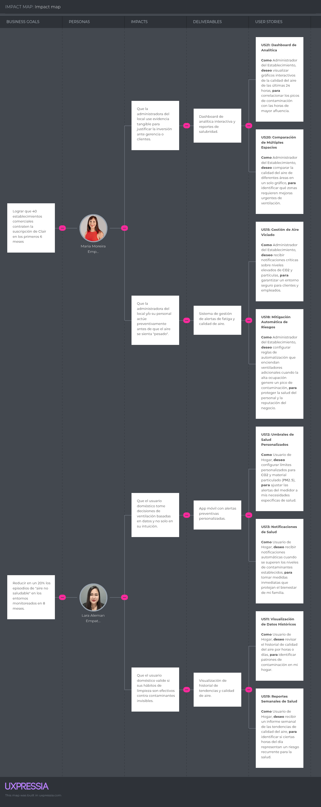

# Capítulo III: Requirements Specification

## 3.1. User Stories.

La presente sección detalla las Historias de Usuario que fundamentan el desarrollo funcional de la solución IoT **Clair**, estructuradas bajo el lenguaje ubicuo de **Home User** y **Facility Admin** para diferenciar las necesidades de salud residencial de las metas de gestión operativa en establecimientos. Estas historias representan los requisitos funcionales derivados directamente del proceso de *Needfinding*, centrándose en la automatización de la calidad del aire, la personalización de umbrales de seguridad y la generación de evidencia analítica para la toma de decisiones. Cada entrada ha sido diseñada para abordar los puntos de dolor identificados en las entrevistas, como la falta de control sobre contaminantes invisibles y la necesidad de una respuesta autónoma mediante actuadores para garantizar un entorno saludable y eficiente.

| Epic / Story ID | Título                                    | Descripción                                                  | Criterios de Aceptación                                      | Relacionado con (Epic ID) |
| --------------- | ----------------------------------------- | ------------------------------------------------------------ | ------------------------------------------------------------ | ------------------------- |
| US01            | Initiate Registration Through Website     | As a Visitor, I want to initiate the registration process through the public website so that I can create my account and start monitoring. | - Scenario: Access and identify registration requirements   - Given the Visitor accesses the registration section on the website,   - When the Visitor evaluates the account creation requirements,   - Then the website specifies the mandatory inputs: Full Name, a valid Email Address, and a Password that meets security complexity (min. 8 characters, numbers, and symbols).   - Scenario: Validate registration data format   - Given the Visitor provides information in the registration section,   - When the system evaluates the inputs,   - Then the website verifies that the email follows a standard format ([user@domain.com](mailto:user@domain.com)) and the password meets the minimum strength entropy before allowing the process to continue.   - Scenario: Review social authentication alternatives   - Given the Visitor is on the registration view of the website,   - When the Visitor checks for alternative identity providers,   - Then the website presents the options to synchronize the account with Google and LinkedIn (OAuth 2.0) as valid registration sources.   - Scenario: Confirm successful registration initiation   - Given the Visitor has provided all valid credentials on the website,   - When the data is submitted for processing,   - Then the website generates a confirmation message and initiates a session to grant immediate access to the role-appropriate dashboard. | EP01                      |
| US02            | Compare Subscription Tiers on Website     | As a Visitor, I want to compare the features of Freemium vs. Paid tiers, so that I can select the plan that fits my budget. | - Scenario: Inspect feature parity and limits   - Given the Visitor is on the plans section of the website,   - When the Visitor compares the available tiers,   - Then the website displays a matrix detailing: Price ($0 vs. Monthly Fee), Device Limit (1 vs. Unlimited), and Data History (30 days vs. 2 years).   - Scenario: Review Freemium alert restrictions   - Given the Visitor is evaluating the free option on the website,   - When the Visitor reviews the alerting capabilities,   - Then the website specifies that the Freemium tier only provides basic real-time notifications without historical alert logs.   - Scenario: Identify Premium analytical benefits   - Given the Visitor is browsing the Paid tier details on the website,   - When the Visitor checks the reporting features,   - Then the website lists the exclusive outputs: Weekly/Monthly Digests via email and access to the 'Best Ventilation Hour' predictive algorithm. | EP02                      |
| US03            | Learn About Free Trial on Website         | As a Visitor, I want to learn about the 30-day free trial, so that I can test the premium features without risk. | - Scenario: Verify trial attributes and requirements   - Given the Visitor is reviewing the trial offer on the website,   - When the Visitor reads the offer details,   - Then the website confirms a 30-day duration and clarifies that no credit card input is required to start the trial period.   - Scenario: Understand post-trial automatic behavior   - Given the Visitor is on the trial information section of the website,   - When the Visitor evaluates the expiration terms,   - Then the website explains the automatic downgrade logic from Premium to Freemium after day 30 if no payment method is registered.   - Scenario: Review trial feature access   - Given the Visitor is interested in the trial on the website,   - When the Visitor checks the included tools,   - Then the website specifies that the trial grants full access to all 'Facility Admin' features, including multi-space management and smart automation. | EP02                      |
| US04            | Upgrade Plan                              | As a Freemium User, I want to upgrade my account to a Premium plan, so that I can access exclusive features and remove service limitations. | Identify upgrade benefits:   - Given the User is authenticated,   - When the system evaluates the account for an upgrade,   - Then it specifies the Premium benefits and pricing.   Validate payment security:   - Given the payment credentials,   - When the system processes the data,   - Then it verifies the payment source validity and encryption standards.   Confirm role transition:   - Given the authorized payment,   - When the account status is updated,   - Then the system grants the "Premium" role and immediate access to restricted features. | EP02                      |
| US05            | Downgrade Plan                            | As a Premium User, I want to cancel my subscription, so that I can avoid future charges if I no longer wish to use the service. | Access cancellation terms:   - Given a cancellation request,   - When the workflow initiates,   - Then the system specifies that access remains until the end of the current billing cycle.   Deactivate automatic renewal:   - Given the confirmation to cancel,   - When the billing module processes the request,   - Then the system disables the automatic charge for the next period.   Verify cancellation record:   - Given the updated subscription status,   - When the process completes,   - Then the system generates a formal notification indicating the exact expiration date. | EP02                      |
| US06            | View Hardware Specifications on Website   | As a Visitor, I want to see the hardware specs of the Air Quality Sensor on the website so that I can verify its accuracy and Reading ranges. | - Scenario: Inspect measurement precision and ranges   - Given the Visitor is on the technical specs section of the website,   - When the Visitor evaluates the sensor capabilities,   - Then the website lists the precision for CO2 (+/- 50ppm), PM2.5 (+/- 10%), Temperature (+/- 0.5°C), and Humidity (+/- 3%).   - Scenario: Review power and network requirements   - Given the Visitor is learning about the device on the website,   - When the Visitor checks the operation requirements,   - Then the website specifies the need for a 2.4GHz Wi-Fi connection and a standard AC power outlet (110v/220v).   - Scenario: Verify physical dimensions and placement recommendations   - Given the Visitor is browsing the hardware details on the website,   - When the Visitor reviews the physical design,   - Then the website provides the device dimensions and the recommended installation height (1.5m from the floor) for optimal air sampling. | EP03                      |
| US07            | Understand Device Installation on Website | As a Non-technical Visitor, I want to understand how easy it is to install the Device through the website so that I don't worry about complex setups. | - Scenario: Review hardware provisioning steps   - Given the Visitor is on the setup guide of the website,   - When the Visitor evaluates the physical installation,   - Then the website describes the two-step process:   Connecting to power and verifying the status LED color for network readiness.   - Scenario: Understand digital pairing process   - Given the Visitor is reading the mobile/web sync guide on the website,   - When the Visitor reviews the pairing logic,   - Then the website explains the use of a unique Device ID (QR or Alpha-numeric) to link the hardware with the user's digital account. | EP03                      |
| US08            | Clair Device Synchronization              | As a Home User, I want to link my Device with the mobile app using a unique code, so that I can monitor Telemetry in real-time from my smartphone. | - Scenario: Validate device pairing code   - Given the Home User provides a unique pairing code,   - When the system validates the input against the registered hardware database,   - Then the system confirms the match and establishes a secure link between the specific sensor and the user's account.   - Scenario: Confirm real-time data transmission   - Given the device is successfully synchronized,   - When the sensor detect changes in the environment,   - Then the system transmits updated air quality metrics to the mobile application with a latency of less than 5 seconds. | EP03                      |
| US09            | Disconnect from Clair devices             | As a Home User, I want to unbind my Device from the mobile application so that I can revoke access to my account and allow the device to be reconfigured by another user. | Remove data persistence and permissions:   - Given the validated unbinding request,   - When the system processes the device removal,   - Then the system revokes all active access tokens and deletes the association between the device ID and the user profile.   Confirm restoration for reconfiguration:   - Given the successful unbinding,   - When the cleanup flow finishes,   - Then the system notifies that the device is ready for a new pairing process and generates a disconnection audit log. | EP03                      |
| US10            | Sensor Calibration & Status               | As a Home User, I want to see the battery level and connectivity status of my Device in the app, so that I can ensure the sensor is always operational. | - Scenario: Monitor battery and connectivity levels   - Given the sensor is active and transmitting,   - When the system receives the periodic heartbeat signal from the device,   - Then the system updates the battery percentage and the Wi-Fi signal strength (RSSI) logs.   - Scenario: Detect device disconnection   - Given the sensor stops sending data,   - When the system detects an absence of signal for more than 10 minutes,   - Then the system changes the device status to 'Offline' and generates a notification regarding the loss of connectivity. | EP03                      |
| US11            | Multi-Sensor Space Management             | As a Facility Admin, I want to add multiple Devices to the same physical space, so that I can obtain an average Air Quality Index for a large area. | Unique Identification.   - Given the user has a configured space,   - When linking new Devices,   - Then the system assigns a unique logical identifier for each sensor within the same space.   Telemetry Aggregation.   - Given multiple active sensors,   - When the space status is queried,   - Then the system averages the Readings to display a unified index. | EP04                      |
| US12            | Smart Window Actuator Pairing             | As a Home User, I want to link my Smart Window Actuator with a specific Device, so that the system can execute physical Corrective Actions. | Logical Pairing.   - Given the sensor and actuator are on the same network,   - When the user initiates pairing,   - Then the system establishes a dependency between the sensor readings and the window motor.   Command Validation.   - Given the linked actuator,   - When the sensor detects a Threshold violation,   - Then the system sends the open instruction to the corresponding actuator. | EP04                      |
| US13            | HVAC System Integration                   | As a Facility Admin, I want to link the HVAC System with the installed Devices, so that I can automate ventilation based on CO2 levels. | Communication Protocol.   - Given a compatible HVAC System,   - When pairing is performed,   - Then the Clair system validates the handshake with the air conditioning controller.   Flow Control.   - Given the integrated system,   - When CO2 levels reach a critical Threshold,   - Then the Clair system automatically triggers the HVAC ventilation mode. | EP04                      |
| US14            | Historical Data Visualization             | As a Home User, I want to review the air quality history by hours or days, so that I can identify pollution patterns in my home. | Data aggregation.   - Given historical records exist,   - When the user requests a time period,   - Then the system retrieves data from the time-series database and groups it by the requested interval.   Peak identification.   - Given a set of historical data,   - When the system processes the information,   - Then it highlights the exact moments where health limits were exceeded. | EP04                      |
| US15            | Health Threshold Customization            | As a Home User, I want to configure personalized limits for CO2 and particulate matter (PM2.5), so that I can adjust the meter alerts to my specific health needs. | - Scenario: Validate threshold inputs   - Given the user provides a new limit value,   - When the system checks the input,   - Then the system ensures the value is within the sensor's operating range (e.g., 400-5000 ppm for CO2) before applying the change. | EP04                      |
| US16            | Offline Data Persistence                  | As a Home User, I want my Device to store Readings locally when internet connection is lost, so that I can avoid information gaps in my air quality history | Local storage activation.   - Given the Air Quality Sensor detects a loss of connectivity,   - When a new Reading is generated,   - Then the system saves the Telemetry into the device's internal memory buffer.   Capacity management.   - Given that local storage is limited,   - When the internal memory reaches 90% capacity,   - Then the system applies a FIFO (First In, First Out) policy to preserve the most recent measurements. | EP04                      |
| US17            | Telemetry Synchronization                 | As a Home User, I want the offline stored data to synchronize automatically when internet returns, so that the Air Quality Index is updated with accurate data. | Link detection and transmission.   - Given the Device recovers connection,   - When the system validates server access,   - Then it initiates a chronological upload of the offline-stored Readings.   Timestamp integrity.   - Given the synchronization process,   - When the data reaches the cloud,   - Then the system ensures the Telemetry is recorded with the original capture time and not the synchronization time. | EP04                      |
| US18            | Preventive Health Notifications:          | As a Home User, I want to receive automatic Critical Alerts when established Thresholds are exceeded, so that I can take immediate measures. | - Scenario: Trigger alert on pollutant spike   - Given the sensor detects a level higher than the established threshold,   - When the system processes the measurement,   - Then the system generates an immediate push notification specifying the pollutant type and the current concentration.   - Scenario: Prevent duplicate alerts   - Given a notification has already been sent for a specific event,   - When the levels remain high,   - Then the system suppresses redundant alerts until the levels return to the safe range and spike again. | EP05                      |
| US19            | Autonomous CO2 Response                   | As a Home User, I want the system to trigger a Corrective Action by activating the air purifier or ventilation upon detecting critical levels. | - Scenario: Command smart ventilation activation   - Given the system identifies a critical CO2 level,   - When the automation logic is triggered,   - Then the system sends an 'On' command to the linked smart purifier or window actuator.   - Scenario: Verify environment stabilization   - Given the automated response is active,   - When the sensor reports levels below the safety threshold for 2 consecutive minutes,   - Then the system sends an 'Off' or 'Close' signal to the actuators to return to a standby state. | EP05                      |
| US20            | Stale Air Management Alerts               | As a Facility Admin, I want to receive critical notifications about elevated CO_2 and particle levels, so that I can ensure a safe environment for customers and employees. | - Scenario: Identify critical levels in establishments   - Given the Facility Admin manages multiple zones,   - When any sensor in a specific zone detects elevated pollutants,   - Then the system generates a high-priority alert identifying the exact location of the stale air event.   - Scenario: Confirm safety environment status   - Given the establishment is within safe parameters,   - When the system evaluates the overall facility state,   - Then the system logs a 'Safe Environment' status for administrative records. | EP05                      |
| US21            | Automated Corrective Actions              | As a Facility Admin, I want to configure suggested Corrective Actions to be triggered when critical Thresholds are reached. | - Scenario: Execute suggested mitigation steps   - Given a pollutant cap is reached in a commercial space,   - When the system evaluates the pre-configured response rules,   - Then the system initiates the specific mechanical actions (e.g., maximum extractor speed) defined for that scenario.   - Scenario: Track automation history   - Given an automated action is performed,   - When the task is completed,   - Then the system records the start time, duration, and the resulting air quality improvement in the management log. | EP05                      |
| US22            | Automated Actuator Control                | As a Facility Admin, I want Clair to autonomously activate industrial exhaust fans and the HVAC System upon detecting stale air. | - Scenario: Synchronize HVAC and Exhaust systems   - Given the CO2 levels exceed 1000 ppm,   - When the system detects the stale air,   - Then the system commands the industrial HVAC system to increase the fresh air intake volume autonomously.   - Scenario: Maintain operational efficiency   - Given the air quality has returned to optimal levels,   - When the system confirms the safe range,   - Then the system reverts the HVAC and exhaust fans to energy-saving mode. | EP05                      |
| US23            | Automatic Risk Mitigation                 | As a Facility Admin, I want to set up automation rules that turn on additional fans when high occupancy generates a pollution spike. | - Scenario: Response to high occupancy spikes   - Given a sudden increase in pollutants due to occupancy,   - When the system identifies the spike,   - Then the system triggers additional auxiliary fans to prevent health risks for staff and customers.   - Scenario: Protect business reputation   - Given the air quality is under control,   - When the system manages the environment without human intervention,   - Then the system ensures that the noise level of the activated equipment remains within the configured comfort limits for the customers. | EP05                      |
| US24            | Smart Fan Activation:                     | As a Home User, I want Clair to automatically turn on the linked fan via a smart relay or actuator when CO2 exceeds the Threshold, to improve circulation. | Reading-based trigger.   - Given the fan is linked,   - When a CO2 Reading exceeds the Threshold,   - Then the system sends an immediate power-on command.   Stabilization shutdown.   - Given the fan is running,   - When Telemetry shows CO2 has dropped 10% below the risk limit,   - Then the system turns off the device to save energy. | EP05                      |
| US25            | Email Report Subscription:                | As a Premium User, I want to enable the receipt of Digests in my email, so that I can stay informed about air quality trends without opening the app. | Subscription activation.   - Given the user has an active subscription,   - When they enable the "Receive Reports" option,   - Then the system schedules the automatic delivery of daily and weekly summaries. | EP05                      |
| US26            | Notification Email Update                 | As a Registered User, I want to configure a secondary email address exclusively for reports, so that I can separate Telemetry alerts from my main inbox. | New address validation.   - Given the user enters a new email address,   - When the system saves the change,   - Then it sends a verification code to the new address to ensure it is valid.   Flow redirection.   - Given the new email is verified,   - When the system dispatches a Digest,   - Then it uses the secondary address while keeping the primary email only for account/security matters. | EP05                      |
| US27            | Report Delivery Cancellation              | As a Registered User, I want to unsubscribe from email reports, so that I can avoid saturating my inbox. | Immediate deactivation.   - Given the user requests to stop receiving reports,   - When the system processes the request,   - Then it halts all scheduled Digest delivery triggers.   Status confirmation.   - Given the unsubscription is processed,   - When the user accesses their settings,   - Then the system clearly shows that the "Email Reports" option is disabled but allows reactivation at any time. | EP05                      |
| US28            | Email Quality Report                      | As a Premium User, I want to receive an email Digest summarizing air quality trends, so that I can conveniently review the weekly environmental performance. | Data compilation.   - Given the weekly cycle is over,   - When the system generates the report,   - Then it includes Reading averages and recorded pollution spikes. | EP05                      |
| US29            | Alert Fatigue Prevention                  | As a Home User, I want to configure an Alert Cooldown, to avoid Alert Fatigue when levels fluctuate near the limit. | Silence timer.   - Given a Critical Alert was sent,   - When the system detects a new Threshold violation within 15 minutes,   - Then it skips the sound notification but logs the event.   Persistence reminder.   - Given the Alert Cooldown has expired,   - When the risk condition persists,   - Then the system sends an Alert Reminder to ensure the user doesn't ignore the danger. | EP05                      |
| US30            | Historical Health Reports                 | As a Home User, I want to receive a weekly report of air quality trends, so that I can identify if certain hours represent a recurring health risk. | - Scenario: Generate recurring health reports   - Given the system has collected data for 7 days,   - When the weekly cycle concludes,   - Then the system compiles a report detailing daily averages, peak hours of risk, and the total time the air was in the 'Safe' zone.   - Scenario: Deliver report to Home User   - Given the report is generated,   - When the delivery schedule is met,   - Then the system sends the summary via email or in-app document to the user. | EP06                      |
| US31            | Multi-Space Comparison                    | As a Facility Admin, I want to compare air quality across different areas in a single graph, so that I can identify zones requiring urgent improvements. | Variable correlation.  -Given multiple sensors in different zones exist,   - When the system generates the analytical view,   - Then it overlays the trend lines for each device on the same timeline.   Zone anomaly identification.   - Given the comparative graph,   - When one zone exceeds limits while others remain stable,   - Then the system highlights the deviation to rule out global calibration errors. | EP06                      |
| US32            | Real-time Analytics Dashboard             | As a Facility Admin, I want to view interactive graphs of the last 24 hours, so that I can correlate pollution spikes with peak occupancy. | - Scenario: Visualize 24-hour trends   - Given the Facility Admin accesses the analytics section,   - When the system retrieves the historical data,   - Then the system renders an interactive graph showing the correlation between time and air pollutant concentrations.   - Scenario: Identify peak pollution hours   - Given the data visualization is active,   - When the system identifies the highest points in the graph,   - Then the system highlights those intervals to help the Admin correlate them with peak business occupancy. | EP06                      |
| US33            | Periodic Performance Digests              | As a Premium User, I want to access daily, weekly, and monthly Digests, so that I can evaluate air quality evolution over long periods. | Granularity selection.   - Given the user accesses the reporting section,   - When a time filter is selected (Day/Week/Month),   - Then the system aggregates Telemetry and recalculates Reading averages for that period.   Comparative summary.   - Given a monthly report,   - When the system generates the Digest,   - Then it includes a percentage comparison of improvement or decline vs. the previous month. | EP06                      |
| US34            | Recover Account Credentials               | As a Registered User, I want to recover my password through a secure process so that I can regain access to my account if I forget my credentials. | Scenario: Request password reset link -Given the User is on the login page and selects "Forgot Password", -When the User enters their registered email address, -Then the system sends a unique, time-sensitive reset token to that email address.   Scenario: Set new password via secure token -Given the User accesses the link provided in the recovery email, -When the User submits a new password that meets the security complexity requirements, -Then the system updates the credentials, invalidates the token, and confirms the successful change. | EP01                      |
| US35            | Email Registration Confirmation           | As a Visitor, I want to confirm my email address after registration, so that I can validate my identity and activate Real Time Consultation features. | Activation token generation.   - Given the Visitor has completed the registration form,   - When the system processes the data,   - Then it sends a unique one-time link to the provided email address.   Account activation.   - Given the user accesses the confirmation link,   - When the system validates the token,   - Then it changes the user status to "Active" and allows the first Air Quality Sensor linking. | EP01                      |
| US36            | Account Profile Management                | As a User, I want to update my personal profile information and security settings so that my account remains accurate and up to date. | Scenario: Update personal information -Given the User is in the "Profile Settings" section, -When the User modifies their Full Name or Profile Picture, -Then the system saves the changes and reflects them across the dashboard immediately.   Scenario: Change password from within the session -Given the User is authenticated and knows their current password, -When the User provides the old password and sets a new one, -Then the system validates the request and updates the security record. | EP01                      |
| US37            | Clair Value Proposition                   | As a Visitor, I want to learn about the benefits of CO2 and PM2.5 monitoring, to understand how Clair improves health in indoor spaces. | Metric Explanation.   - Given the Visitor browses the main section,   - When viewing the value proposition,   - Then the system details how Readings are measured and their impact on the Air Quality Index (AQI).   Profile Differentiation.   - Given different user types,   - When the system presents benefits,   - Then it clearly distinguishes solutions for Home Users and Facility Admins. | EP07                      |
| US38            | Development Team Background               | As a Visitor, I want to know the technical background of the development team, to validate the scientific accuracy and technological reliability of the sensor. | Technical Support.   - Given the Visitor checks the "About Us" section,   - When the system presents the team,   - Then it details expertise in embedded systems, IoT, and environmental data science.   Contact Links.   - Given the team profile,   - When the system shows the background,   - Then it provides access to professional portfolios or contact networks for technical inquiries. | EP07                      |
| US39            | FAQ & Help Center                         | As a Visitor, I want to resolve doubts about Device installation and data privacy, to feel secure implementing the system in my home. | Privacy Doubt Resolution.   - Given the user checks the FAQ,   - When selecting "Privacy,"   - Then the system explains how Telemetry is encrypted and who can access the Device location.   Quick Install Guide.   - Given the user has operational doubts,   - When accessing the FAQ,   - Then the system offers a step-by-step guide on how to link the sensor with the local network. | EP07                      |
| US40            | Multi-language Support                    | As a Visitor, I want the Landing Page to be available in English and Spanish, to understand the technical specifications in my preferred language. | Language Persistence.   - Given the user selects a language in the global selector,   - When navigating sections,   - Then the system maintains consistent translation throughout the content.   Unit Adaptation.   - Given the language changes to English,   - When the system displays Readings,   - Then it ensures measurement units follow international standards (e.g., ppm, µg/m³). | EP07                      |
| US41            | Privacy Policies & Terms                  | As a Visitor, I want to access the terms of service, to know the legal handling of my data and Clair's responsibilities regarding the hardware. | Policy Access.   - Given the user navigates the footer,   - When selecting "Privacy,"   - Then the system displays the updated document detailing data usage for Digests and analytics.   Responsibility Clarity.   - Given the legal document,   - When Corrective Actions are mentioned,   - Then the system specifies that the user is responsible for the final configuration of their actuators and HVAC Systems. | EP07                      |
| US42            | Testimonials & Success Stories            | As a Visitor, I want to read experiences from other Home Users and Facility Admins, to validate Clair's effectiveness in reducing health risks. | Testimonial Segmentation.   - Given the user browses the reviews section,   - When filtering by space type,   - Then the system displays specific testimonials for homes, offices, or schools.   Corrective Action Evidence.   - Given a detailed success case,   - When presented,   - Then it highlights how using Thresholds and automation improved the client's Air Quality Index. | EP07                      |

## 3.2. Impact Mapping.

El **Impact Mapping** constituye una técnica de planeación estratégica que nos ayuda a visualizar la relación entre las metas del negocio y la entrega de valor a los actores clave. A través de este mapa, el equipo de Vanana garantiza que los recursos de desarrollo se enfoquen en entregables que provoquen cambios de comportamiento positivos en nuestros segmentos objetivo, facilitando así el cumplimiento de los hitos de crecimiento planteados para los primeros meses de operación.

A continuación, se detallan los componentes principales del modelo presentado:

- **Business Goals (Metas SMART):** Se han definido objetivos de negocio con criterios de especificidad y tiempo. Entre ellos destaca el objetivo de lograr que 40 establecimientos comerciales contraten la suscripción de Clair en los primeros 6 meses, así como reducir en un 20% los episodios de "aire no saludable" en los entornos monitoreados en un plazo de 8 meses.
- **Actors (Personas):** Se integran los User Personas previamente identificados: **María Moreira** (Socio Administrador) y **Lara Alemán** (Usuario Residencial). Ambos perfiles son los actores principales que, mediante el uso de la solución, ayudarán a materializar las metas de negocio.
- **Impacts:** Representan el cambio de comportamiento deseado en los actores. Para el administrador, se busca que cuente con evidencia tangible para justificar inversiones ante gerencia y que su personal actúe preventivamente antes de que el aire se sienta "pesado". Para el usuario del hogar, el impacto esperado es que tome decisiones de ventilación basadas en datos y valide la efectividad de sus hábitos de limpieza contra contaminantes invisibles.
- **Deliverables:** Son las soluciones de software propuestas para provocar los impactos mencionados. Incluyen un **Dashboard de analítica interactiva y reportes de salubridad**, un **Sistema de gestión de alertas de fatiga**, la **App móvil con alertas preventivas** y la **Visualización de historial de tendencias**.
- **User Stories:** En la última columna se conectan las historias de usuario específicas (formato: Como... deseo... para...) que habilitan los entregables. Por ejemplo, para María se incluye la visualización de gráficos interactivos de las últimas 24 horas, mientras que para Lara se destaca la configuración de límites personalizados para $CO_2$ y material particulado (PM2.5).

Este mapeo asegura que cada historia de usuario tenga un propósito claro y medible, evitando el desarrollo de funciones que no aporten al crecimiento de la startup o al bienestar directo del usuario final.

## 3.3. Product Backlog.

El Product Backlog constituye el inventario centralizado y priorizado de todos los requisitos, funcionalidades y mejoras necesarias para la materialización de la solución Clair. Este artefacto sirve como el único origen de trabajo para el equipo de desarrollo de Vanana, permitiendo una gestión ágil del ciclo de vida del producto. En esta sección, las Historias de Usuario previamente identificadas se desglosan y organizan estratégicamente, relacionándolas con sus respectivas Épicas y estableciendo criterios de aceptación técnicos que garantizan la calidad del software.

URL del backlog en Jira: 

| N    | Epic / Story ID | Título                                    | Descripción                                                  | Story Points |
| ---- | --------------- | ----------------------------------------- | ------------------------------------------------------------ | ------------ |
| 1    | US37            | Clair Value Proposition                   | As a Visitor, I want to learn about the benefits of CO2 and PM2.5 monitoring, to understand how Clair improves health in indoor spaces. | 2            |
| 2    | US38            | Development Team Background               | As a Visitor, I want to know the technical background of the development team, to validate the scientific accuracy and technological reliability of the sensor. | 2            |
| 3    | US39            | FAQ & Help Center                         | As a Visitor, I want to resolve doubts about Device installation and data privacy, to feel secure implementing the system in my home. | 2            |
| 4    | US40            | Multi-language Support                    | As a Visitor, I want the Landing Page to be available in English and Spanish, to understand the technical specifications in my preferred language. | 2            |
| 5    | US41            | Privacy Policies & Terms                  | As a Visitor, I want to access the terms of service, to know the legal handling of my data and Clair's responsibilities regarding the hardware. | 2            |
| 6    | US42            | Testimonials & Success Stories            | As a Visitor, I want to read experiences from other Home Users and Facility Admins, to validate Clair's effectiveness in reducing health risks. | 2            |
| 7    | US01            | Initiate Registration Through Website     | As a Visitor, I want to initiate the registration process through the public website so that I can create my account and start monitoring. | 5            |
| 8    | US06            | View Hardware Specifications on Website   | As a Visitor, I want to see the hardware specs of the Air Quality Sensor on the website so that I can verify its accuracy and Reading ranges. | 3            |
| 9    | US07            | Understand Device Installation on Website | As a Non-technical Visitor, I want to understand how easy it is to install the Device through the website so that I don't worry about complex setups. | 2            |
| 10   | US08            | Clair Device Synchronization              | As a Home User, I want to link my Device with the mobile app using a unique code, so that I can monitor Telemetry in real-time from my smartphone. | 2            |
| 11   | US09            | Disconnect from Clair devices             | As a Home User, I want to unbind my Device from the mobile application so that I can revoke access to my account and allow the device to be reconfigured by another user. | 1            |
| 12   | US10            | Sensor Calibration & Status               | As a Home User, I want to see the battery level and connectivity status of my Device in the app, so that I can ensure the sensor is always operational. | 2            |
| 13   | US11            | Multi-Sensor Space Management             | As a Facility Admin, I want to add multiple Devices to the same physical space, so that I can obtain an average Air Quality Index for a large area. | 5            |
| 14   | US12            | Smart Window Actuator Pairing             | As a Home User, I want to link my Smart Window Actuator with a specific Device, so that the system can execute physical Corrective Actions. | 3            |
| 15   | US13            | HVAC System Integration                   | As a Facility Admin, I want to link the HVAC System with the installed Devices, so that I can automate ventilation based on CO2 levels. | 3            |
| 16   | US14            | Historical Data Visualization             | As a Home User, I want to review the air quality history by hours or days, so that I can identify pollution patterns in my home. | 2            |
| 17   | US15            | Health Threshold Customization            | As a Home User, I want to configure personalized limits for CO2 and particulate matter (PM2.5), so that I can adjust the meter alerts to my specific health needs. | 2            |
| 18   | US16            | Offline Data Persistence                  | As a Home User, I want my Device to store Readings locally when internet connection is lost, so that I can avoid information gaps in my air quality history | 5            |
| 19   | US17            | Telemetry Synchronization                 | As a Home User, I want the offline stored data to synchronize automatically when internet returns, so that the Air Quality Index is updated with accurate data. | 5            |
| 20   | US18            | Preventive Health Notifications:          | As a Home User, I want to receive automatic Critical Alerts when established Thresholds are exceeded, so that I can take immediate measures. | 3            |
| 21   | US19            | Autonomous CO2 Response                   | As a Home User, I want the system to trigger a Corrective Action by activating the air purifier or ventilation upon detecting critical levels. | 3            |
| 22   | US20            | Stale Air Management Alerts               | As a Facility Admin, I want to receive critical notifications about elevated CO_2 and particle levels, so that I can ensure a safe environment for customers and employees. | 2            |
| 23   | US21            | Automated Corrective Actions              | As a Facility Admin, I want to configure suggested Corrective Actions to be triggered when critical Thresholds are reached. | 2            |
| 24   | US22            | Automated Actuator Control                | As a Facility Admin, I want Clair to autonomously activate industrial exhaust fans and the HVAC System upon detecting stale air. | 2            |
| 25   | US23            | Automatic Risk Mitigation                 | As a Facility Admin, I want to set up automation rules that turn on additional fans when high occupancy generates a pollution spike. | 2            |
| 26   | US24            | Smart Fan Activation:                     | As a Home User, I want Clair to automatically turn on the linked fan via a smart relay or actuator when CO2 exceeds the Threshold, to improve circulation. | 5            |
| 27   | US25            | Email Report Subscription:                | As a Premium User, I want to enable the receipt of Digests in my email, so that I can stay informed about air quality trends without opening the app. | 3            |
| 28   | US26            | Notification Email Update                 | As a Registered User, I want to configure a secondary email address exclusively for reports, so that I can separate Telemetry alerts from my main inbox. | 2            |
| 29   | US27            | Report Delivery Cancellation              | As a Registered User, I want to unsubscribe from email reports, so that I can avoid saturating my inbox. | 2            |
| 30   | US28            | Email Quality Report                      | As a Premium User, I want to receive an email Digest summarizing air quality trends, so that I can conveniently review the weekly environmental performance. | 2            |
| 31   | US29            | Alert Fatigue Prevention                  | As a Home User, I want to configure an Alert Cooldown, to avoid Alert Fatigue when levels fluctuate near the limit. | 3            |
| 32   | US30            | Historical Health Reports                 | As a Home User, I want to receive a weekly report of air quality trends, so that I can identify if certain hours represent a recurring health risk. | 2            |
| 33   | US31            | Multi-Space Comparison                    | As a Facility Admin, I want to compare air quality across different areas in a single graph, so that I can identify zones requiring urgent improvements. | 2            |
| 34   | US32            | Real-time Analytics Dashboard             | As a Facility Admin, I want to view interactive graphs of the last 24 hours, so that I can correlate pollution spikes with peak occupancy. | 2            |
| 35   | US33            | Periodic Performance Digests              | As a Premium User, I want to access daily, weekly, and monthly Digests, so that I can evaluate air quality evolution over long periods. | 3            |
| 36   | US34            | Recover Account Credentials               | As a Registered User, I want to recover my password through a secure process so that I can regain access to my account if I forget my credentials. | 2            |
| 37   | US35            | Email Registration Confirmation           | As a Visitor, I want to confirm my email address after registration, so that I can validate my identity and activate Real Time Consultation features. | 3            |
| 38   | US36            | Account Profile Management                | As a User, I want to update my personal profile information and security settings so that my account remains accurate and up to date. | 2            |
| 39   | US02            | Compare Subscription Tiers on Website     | As a Visitor, I want to compare the features of Freemium vs. Paid tiers, so that I can select the plan that fits my budget. | 2            |
| 40   | US03            | Learn About Free Trial on Website         | As a Visitor, I want to learn about the 30-day free trial, so that I can test the premium features without risk. | 2            |
| 41   | US04            | Upgrade Plan                              | As a Freemium User, I want to upgrade my account to a Premium plan, so that I can access exclusive features and remove service limitations. | 2            |
| 42   | US05            | Downgrade Plan                            | As a Premium User, I want to cancel my subscription, so that I can avoid future charges if I no longer wish to use the service. | 2            |