# Capítulo IV: Solution Software Design

## 4.1. Strategic-Level Domain-Driven Design.

### 4.1.1. Design-Level EventStorming.

El Strategic-Level Domain-Driven Design constituye la base fundamental para el desarrollo de la aplicación Clair. Este enfoque nos permite identificar y definir los límites de los contextos de dominio, establecer las relaciónes entre ellos y crear una arquitectura de software sólida que soporte los objetivos del negocio.
En esta fase estratégica, nos enfocamos en:

- Comprensión profunda del dominio: Identificación de los procesos de negocio críticos

- Definición de bounded contexts: Establecimiento de límites claros entre diferentes áreas funciónales

- Modelado de relaciónes: Definición de cómo interactúan los diferentes contextos

- Arquitectura de alto nivel: Diseño de la estructura general del sistema

#### 4.1.1.1 Candidate Context Discovery.

En esta etapa se desarrolló el Design-Level EventStorming, tomando como insumo el *Big Picture*, el *Ubiquitous Language* y los artefactos previamente definidos (*commands*, *policies* y *read models*).

El objetivo fue descender desde una comprensión general del negocio hacia un nivel de diseño técnico, permitiendo modelar el comportamiento del sistema con mayor precisión.

Se modelaron los 12 flujos principales de Clair, estructurados bajo la siguiente secuencia:

$$
\text{Actor} \rightarrow \text{Command} \rightarrow \text{Constraint} \rightarrow \text{Domain Event} \rightarrow \text{Policy} \rightarrow \text{Command} \rightarrow \text{Domain Event} \rightarrow \text{Read Model}
$$

Adicionalmente, se identificaron:
- Sistemas externos relevantes dentro de los flujos 
- *Hotspots* o zonas de alta complejidad y riesgo 

Como resultado, el equipo transitó de una fase de entendimiento del negocio (*“qué ocurre”*) hacia una definición clara del comportamiento del sistema (*“cómo debe implementarse”*), estableciendo límites, responsabilidades y reglas explícitas para su desarrollo.

El **Candidate Context Discovery** corresponde al proceso de identificación de fronteras de dominio candidatas (*Bounded Contexts*) a partir de patrones de lenguaje, reglas de negocio, responsabilidades y niveles de acoplamiento observados en los eventos del sistema.

En esta actividad, el equipo agrupó comportamientos que comparten un propósito común y consistencia interna, evitando la coexistencia de capacidades que evolucionan a ritmos distintos dentro de un mismo contexto. Este enfoque permite preservar la coherencia del modelo y reducir fricciones en la evolución del sistema.

Como resultado, se definieron los siguientes bounded context:

- **IAM (Identity \& Access Management)** 
- **Billing** 
- **Device \& Space Management** 
- **Air Quality Evaluation** 
- **Alerting \& Response** 
- **Analytics \& Reporting** 

Esta partición permite:
- Una asignación más clara de *ownership* por dominio 
- Reducir la ambigüedad en la conversación técnico-funciónal 
- Mejorar la trazabilidad entre decisiones de negocio y diseño de software 

En paralelo, se definieron doce flujos principales *end-to-end*, representando los recorridos críticos del sistema:

**Leyenda de Elementos**

<p align="center">
 
</p>
**1. User Registration and Access Activation**

Este flujo gestiona la creación de nuevas identidades en la plataforma. El sistema captura los datos del aspirante, valida los requisitos de seguridad y activa el acceso tras confirmar la identidad.

<p align="center">
 
</p>
**2. Login and Session Start**

Describe el proceso de validación de credenciales para usuarios existentes. Una vez autenticado, el sistema inicia una sesión segura y otorga los permisos necesarios según el rol asignado (**Home User** o **Facility Admin**).

<p align="center">
 
</p>
**3. Trial and Subscription Lifecycle**

Gestiona el estado de la cuenta del usuario, desde la activación del período de prueba de 30 días hasta la transición a planes suscritos, controlando el acceso a las funciónes premium del ecosistema.

<p align="center">
 
</p>
**4. Checkout and Payment Outcome**

Representa el flujo financiero donde se procesan las transacciones de suscripción. El sistema valida el método de pago y confirma el resultado de la operación para actualizar el nivel de servicio del cliente.

<p align="center">
 
</p>
**5. Facility and Space Setup**

Flujo orientado principalmente al Facility Admin para la estructuración lógica de sus establecimientos. Permite segmentar el local en zonas específicas para una monitorización más precisa y organizada.

<p align="center">
 
</p>
**6. Device Onboarding**

Es el proceso técnico de vinculación de hardware. Incluye la lectura del código único del sensor Clair y su registro en la base de datos de la plataforma para comenzar la transmisión de datos.

<p align="center">
 
</p>
**7. Threshold Management**

Permite a los usuarios definir los parámetros de seguridad para $CO_2$ y partículas. Este flujo establece los límites que el motor de reglas utilizará para evaluar la calidad del aire de forma personalizada.

<p align="center">
 
</p>
**8. Telemetry Ingestion and Validation**

Gestiona la recepción de datos y valida su integridad. Incluye almacenamiento local (Offline) cuando se pierde la conexión, permitiendo la sincronización automática por lotes al restablecerse el internet para evitar brechas en el historial de calidad del aire.

<p align="center">
 
</p>
**9. Air Quality Evaluation**

Es el motor de procesamiento donde la telemetría se compara contra los umbrales configurados. Este flujo determina el estado ambiental en tiempo real (Seguro, Advertencia o Crítico).

<p align="center">
 
</p>
**10. Critical Alert Management**

Flujo de respuesta inmediata ante picos de contaminación. Se encarga de la generación y envío de notificaciones *push* y alertas visuales cuando el aire representa un riesgo para la salud.

<p align="center">
 
</p>
**11. Corrective Action Orchestration**

Gestiona la ejecución de comandos hacia los actuadores. Este flujo coordina la apertura de ventanas o el encendido de extractores de forma autónoma según las reglas de automatización configuradas.

<p align="center">
 
</p>
**12. Reporting and Insights**

 Proceso de síntesis de datos históricos. Transforma la telemetría acumulada en reportes semanales de salud y visualizaciones de tendencias para la toma de decisiones informadas.

<p align="center">
 
</p>

Cada flujo fue modelado de manera independiente y detallada, utilizando *post-its* atómicos (sin combinación de elementos), lo que asegura que cada evento, comando, regla y reacción se mantenga explícito y alineado con el *Ubiquitous Language* del dominio.

El tablero completo del Candidate Context Discovery puede visualizarse en el siguiente enlace: https://bit.ly/3QwYkAS

#### 4.1.1.2 Domain Message Flows Modeling.

El Domain Message Flows Modeling mapea cómo los mensajes (eventos, comandos) fluyen entre los diferentes bounded contexts identificados. Este modelado es crucial para entender las dependencias y patrones de comunicación del sistema.

**User Registration and Access Activation**

<p align="center">

</p>

Esta vista muestra el workflow para el registro y activación de usuarios, destacando cómo el sistema IAM (Identity and Access Management) centraliza la seguridad y la gestión de sesiónes. El proceso asegura el desacoplamiento de responsabilidades: la Website actúa como interfaz de captura, el IAM valida la identidad y el ciclo de vida de la cuenta, mientras que el Email Service gestiona la comunicación externa de forma independiente. Finalmente, el uso de tokens y la persistencia en el Internal Storage garantizan que solo los usuarios verificados obtengan acceso.

**Login and Session Start**

<p align="center">

</p>

Esta vista detalla el proceso de Login e Inicio de Sesión, ilustrando cómo el sistema organiza la autenticación y la autorización mediante un componente central de IAM. El flujo comienza cuando el usuario proporciona sus credenciales a través de la Website, la cual delega la validación y la asignación de permisos por rol al IAM para garantizar un control de acceso seguro y centralizado. Una vez autenticado, el estado de la sesión se persiste en el Internal Storage, permitiendo que el usuario consulte servicios especializados como la Air Quality Evaluation en tiempo real, cuyas interacciones son registradas por el módulo de Analytics & Reporting para auditoría y análisis posterior.

**Trial Subscription Lifecycle**

<p align="center">

</p>

Esta vista describe el ciclo de vida de una Suscripción de Prueba, mostrando cómo se gestiona la elegibilidad y activación mediante un servicio centralizado de Billing. El flujo comienza cuando el Home User solicita iniciar una prueba a través de la Website, la cual se encarga de validar la elegibilidad del usuario antes de procesar la solicitud con el módulo de facturación. Una vez que el servicio de Billing confirma el inicio de la suscripción, se genera un registro con el ID de suscripción y la fecha de expiración, información que se persiste finalmente en el Internal Storage para asegurar que el acceso temporal del usuario quede correctamente documentado y administrado.

**Paid Subscription Lifecycle**

<p align="center">

</p>
Esta vista describe el Ciclo de Vida de la Suscripción de Pago, detallando los procesos de actualización y cancelación de servicios por parte del usuario. El flujo se inicia en la Website, que actúa como intermediaria para enviar solicitudes de cambio de plan o desactivación hacia el módulo de Billing. Para cambios de plan, el sistema coordina el procesamiento del pago a través de un Payment Gateway externo; una vez confirmado, o en caso de una desactivación, se actualiza el registro correspondiente en el Internal Storage para reflejar el nuevo estado de la suscripción y el ciclo de facturación actual del usuario.

**Checkout and Payment Outcome**

<p align="center">

</p>

Esta vista describe el proceso de Checkout y Resultado de Pago, ilustrando cómo la plataforma integra la validación de identidad con la ejecución de servicios en tiempo real. El flujo inicia cuando el usuario se autentica a través de la Website, la cual coordina con el IAM para validar credenciales y obtener permisos específicos de rol que se persisten en el Internal Storage. Una vez establecida la sesión, el sistema permite la consulta de estados mediante la Air Quality Evaluation, cuyos resultados y tipos de consulta son registrados por el módulo de Analytics & Reporting para garantizar la trazabilidad y el análisis de cada transacción completada.

**Facility and Space Setup**

<p align="center">

</p>
Esta vista detalla el proceso de Configuración de Instalaciones y Espacios, ilustrando cómo el sistema gestiona la creación de infraestructura bajo un esquema de control de acceso centralizado. El flujo comienza cuando el Facility Admin solicita la creación de una instalación a través de la Website, la cual coordina con el IAM para validar el rol administrativo y los límites de creación permitidos. Una vez autorizado, el módulo de Facility Management registra la instalación y permite la configuración de espacios específicos (interiores o exteriores), verificando siempre su existencia previa antes de persistir los detalles finales en el Internal Storage para asegurar una administración organizada y auditable.

**Initial Device Setup**

<p align="center">

</p>
Esta vista describe el proceso de Configuración Inicial del Dispositivo, ilustrando cómo se vincula el hardware con la cuenta del usuario de forma segura. El flujo comienza cuando el Home User solicita el emparejamiento a través de la Website, la cual se comunica con el módulo de Device & Space Management para validar la propiedad y disponibilidad del modelo mediante su número de serie. Una vez que el dispositivo es reconocido y vinculado con éxito, el sistema confirma el registro y persiste los datos de la asociación en el Internal Storage, garantizando que el equipo esté listo para su monitoreo y gestión dentro del entorno del usuario.

**Device Location Setup**

<p align="center">

</p>
Esta vista detalla el proceso de Configuración de la Ubicación del Dispositivo, donde se asigna un equipo específico a un entorno previamente definido. El flujo inicia cuando el usuario solicita la asignación a través de la Website, la cual interactúa con el módulo de Facility Management para verificar la disponibilidad y validez del espacio seleccionado. Una vez confirmada la ubicación, el servicio de Device Management procesa los detalles de la instalación y notas adicionales, persistiendo el registro final con su respectiva marca de tiempo en el Internal Storage para asegurar la trazabilidad geográfica del hardware.

**Threshold Management**

<p align="center">

</p>

Esta vista describe el proceso de Gestión de Umbrales, donde se definen los límites de alerta para sensores de CO2, PM y temperatura. El flujo comienza cuando el usuario solicita un cambio de umbral a través de la Website, la cual coordina con el IAM para autorizar la operación según el rol y espacio asignado. Una vez validado, el servicio de Air Quality Evaluation actualiza los límites del espacio y evalúa posibles brechas en tiempo real mediante su lógica interna, persistiendo los nuevos umbrales y marcas de tiempo en el Internal Storage para el monitoreo continuo de la calidad del aire.

**Telemetry Ingestion**

<p align="center">

</p>
Esta vista describe el proceso de Ingesta de Telemetría, describiendo cómo el sistema procesa los datos enviados por los sensores en tiempo real. El flujo comienza cuando el Sensor Device envía un lote de lecturas al módulo de Device & Space Management, el cual actúa como receptor central para organizar y persistir los datos de las métricas. Posteriormente, esta información se distribuye hacia el componente de Analytics & Reporting para su almacenamiento histórico en series de tiempo dentro del Internal Storage, y simultáneamente hacia la Air Quality Evaluation, donde se evalúa la calidad del aire actual para activar respuestas inmediatas basadas en las lecturas recibidas.

**Telemetry Validation**

<p align="center">

</p>
Esta vista describe el proceso de Validación de Telemetría, donde el sistema asegura la integridad de los datos recibidos antes de su procesamiento. El flujo inicia en el módulo de Device & Space Management, que utiliza su lógica interna para validar el estado del dispositivo y la firma del payload. Si la lectura es válida, los datos limpios se envían a la Air Quality Evaluation para su análisis; de lo contrario, la lectura es rechazada y se registra el error en el Internal Storage para auditoría, garantizando que solo información confiable afecte las evaluaciones de calidad del aire.

**Offline Reading Synchronization**

<p align="center">

</p>
Esta vista describe el proceso de Sincronización de Lecturas Offline, ilustrando cómo el sistema recupera la continuidad de los datos tras un periodo de desconexión del hardware. El flujo inicia cuando el Sensor Device recupera la conectividad y envía un lote de lecturas almacenadas localmente al módulo de Device & Space Management, el cual confirma la recepción del paquete de datos. Finalmente, el sistema procesa el lote para integrar la telemetría histórica en el Internal Storage, garantizando que el registro de métricas esté completo y sincronizado con la marca de tiempo correspondiente para evitar vacíos en el análisis de la calidad del aire.

**Alerting & Response to Air Quality Evaluation**

<p align="center">

</p>
Esta vista ilustra el flujo de Alertas y Respuesta ante la Evaluación de Calidad del Aire, describiendo la reacción del sistema ante la detección de niveles críticos de CO2, PM o temperatura. El proceso se activa cuando el módulo de Air Quality Evaluation detecta un incumplimiento de umbrales, notificando al componente de Alerting & Response, el cual consulta al IAM para obtener las preferencias de contacto y canales de notificación del usuario. Finalmente, se despacha una notificación de emergencia de alta prioridad y se registra el evento en el Internal Storage, permitiendo una respuesta inmediata tanto a través de la lógica interna del sistema como mediante alertas directas a los administradores responsables.

**Critical Alert Generation & Notification**

<p align="center">

</p>
Esta vista describe el proceso de Generación y Notificación de Alertas Críticas, ilustrando la respuesta automatizada del sistema ante eventos de alta severidad en la calidad del aire. El flujo se activa cuando el módulo de Air Quality Evaluation detecta una violación de umbral crítica, lo que dispara en el componente de Alerting & Response la creación de una alerta con estado "abierto" y su respectiva persistencia en el Internal Storage. Simultáneamente, se coordina el envío de una notificación por correo electrónico a través de un Email Provider externo, registrando el ID de entrega y la marca de tiempo para asegurar que los usuarios responsables reciban información inmediata sobre el estado del espacio monitoreado.

**Alert Acknowledgement & Tracking**

<p align="center">

</p>
Esta vista ilustra el proceso de Reconocimiento y Seguimiento de Alertas, describiendo cómo el sistema gestiona la respuesta humana ante incidentes detectados. El flujo se activa cuando un usuario reconoce una alerta a través de la interfaz, lo que dispara en el componente de Alerting & Response el cambio de estado de la alerta a "en progreso", persistiendo esta actualización en el Internal Storage para asegurar la trazabilidad de la atención. Finalmente, el sistema interactúa con la lógica interna para actualizar el tablero de alertas activas del usuario, garantizando que el equipo responsable tenga una visibilidad en tiempo real de los eventos pendientes y aquellos que ya están siendo gestionados.

**Corrective Action & Resolution**

<p align="center">

</p>
Esta vista ilustra el proceso de Acción Correctiva y Resolución, describiendo cómo el sistema y el usuario colaboran para cerrar incidentes de calidad del aire. El flujo comienza cuando el sistema envía un recordatorio de acción correctiva basado en el tiempo transcurrido, procesado por el módulo de Alerting & Response. Una vez que el usuario ejecuta y registra la resolución con sus respectivas notas, el sistema actualiza el estado de la alerta a "cerrado" en el Internal Storage y sincroniza el centro de notificaciones a través de la lógica interna, garantizando que el ciclo del incidente finalice de manera documentada y auditable.

**Automatic Corrective Action Execution**

<p align="center">

</p>
Esta vista detalla el proceso de Ejecución Automática de Acciones Correctivas, ilustrando cómo el sistema responde de forma autónoma ante brechas críticas en la calidad del aire. El flujo se activa cuando el sistema detecta un nivel de CO2 persistente, lo que dispara en el componente de Alerting & Response una orden de ventilación de alta prioridad enviada directamente a los Smart Devices para abrir las ventanas inteligentes. Finalmente, una vez ejecutada la acción, el sistema confirma la apertura de los dispositivos y persiste el registro de la ejecución en el Internal Storage, garantizando una mitigación inmediata del riesgo sin necesidad de intervención manual.

**Manual Corrective Action Selection**

<p align="center">

</p>
Esta vista detalla el proceso de Selección Manual de Acción Correctiva, ilustrando cómo el usuario puede intervenir directamente para mitigar problemas de calidad del aire. El flujo inicia cuando el User selecciona un tipo de acción específica a través del componente de Alerting & Response, el cual valida la coherencia de la solicitud con el estado actual del entorno mediante su lógica interna. Una vez confirmada la validez y registrado el comando con un indicador de anulación manual en el Internal Storage, el sistema procede a la ejecución inmediata sobre los Smart Devices, asegurando que la respuesta del sistema se adapte a las necesidades puntuales detectadas por el operador.

**Corrective Action Recording & Timeline**

<p align="center">

</p>
Esta vista ilustra el proceso de Registro y Cronología de Acciones Correctivas, detallando cómo el sistema documenta cada intervención para mantener un historial preciso de mitigación. El flujo comienza en el módulo de Alerting & Response, que inicia el registro de la acción capturando métricas iniciales y marcas de tiempo en el Internal Storage. Una vez finalizada la intervención, se procesan los datos del cierre, lo que permite al sistema actualizar la línea de tiempo de acciones correctivas dentro del almacenamiento interno, garantizando que cada evento sea auditable y contribuya al análisis de efectividad de las respuestas ante incidentes.

**Automated Data Aggregation & Digest Generation**

<p align="center">

</p>
Esta vista describe el proceso de Agregación Automática de Datos y Generación de Resúmenes, ilustrando cómo el sistema transforma la telemetría histórica en información accionable para el usuario. El flujo se activa cuando el sistema solicita la agregación de datos de las últimas 24 horas al módulo de Analytics & Reporting, el cual consulta las reglas de agregación mediante la lógica interna para procesar la información almacenada en el Internal Storage. Finalmente, el sistema genera un resumen diario personalizado por dispositivo y notifica su disponibilidad a través del Notifications Center, asegurando que el usuario tenga acceso a un análisis consolidado de la calidad del aire sin necesidad de revisar lecturas individuales.

**Strategic Insight Identification**

<p align="center">

</p>
Esta vista describe el proceso de Identificación de Insights Estratégicos, ilustrando cómo el sistema utiliza el análisis de datos para optimizar el bienestar en los espacios monitoreados. El flujo comienza cuando el sistema solicita identificar la mejor hora de ventilación al módulo de Analytics & Reporting, el cual procesa métricas de rendimiento almacenadas en el Internal Storage. Una vez identificada la hora óptima con un alto puntaje de confianza, el componente utiliza la lógica interna para generar una recomendación específica de ventilación para el espacio, permitiendo una gestión proactiva y eficiente de la calidad del aire basada en patrones históricos de los últimos 7 días.

**On-Demand Historical Reporting & Access Control**

<p align="center">

</p>
Esta vista describe el proceso de Reportes Históricos bajo Demanda y Control de Acceso, detallando cómo el sistema restringe o permite la visualización de tendencias según el plan del usuario. El flujo inicia cuando el usuario solicita una vista de tendencias mensuales al módulo de Analytics & Reporting, el cual coordina con la Internal Logic para verificar los permisos de visibilidad y límites del plan actual. Si el acceso es autorizado, se genera el reporte y se notifica al usuario a través del Notifications Center; de lo contrario, la previsualización se bloquea indicando que se ha alcanzado el límite del plan gratuito, garantizando así la integridad del modelo de suscripción mientras se recuperan los datos del Internal Storage.

El tablero completo del Domain Message Flows Modeling. puede visualizarse en el siguiente enlace: https://bit.ly/3QwYkAS

#### 4.1.1.3 Bounded Context Canvases.

A continuación se presentan los Context Canvases de los contextos de Clair, donde se describen sus responsabilidades, relaciónes, eventos clave, reglas de negocio, etc.

**IAM (Identity \& Access Management)**

El **Bounded Context Canvas** del módulo **Air Quality Monitoring** define el núcleo operativo de Clair, estableciendo los límites de responsabilidad para el procesamiento de datos ambientales.

- **Propósito:** Monitorear y evaluar la calidad del aire en tiempo real para generar alertas y ejecutar respuestas automáticas.
- **Capacidades:** Incluye la ingesta de telemetría, el monitoreo del estado de los sensores y la evaluación de niveles de contaminantes basados en umbrales de seguridad.
- **Interacciones (Inbound/Outbound):** Recibe datos de los dispositivos y configuraciónes del contexto de *Space Management*, mientras envía eventos críticos al contexto de *Alerting & Response* para la mitigación de riesgos.
- **Eventos de Dominio:** Los eventos clave incluyen `Air Quality Measured`, `Safety Threshold Exceeded` y `Sensor Connection Lost`, los cuales disparan la lógica de automatización del sistema.


**Billing**

Este canvas gestiona el flujo financiero y el modelo de monetización de la plataforma, asegurando la sostenibilidad del servicio.

- **Propósito:** Administrar el ciclo de vida de los pagos, planes de suscripción y la facturación de los servicios premium de Clair.
- **Capacidades:** Procesamiento de pagos (Checkout), gestión de niveles de suscripción (Freemium/Paid) y emisión de comprobantes fiscales electrónicos.
- **Interacciones clave:** Informa al contexto de *Identity & Access Management* sobre el estado de pago del usuario para habilitar o restringir el acceso a funciónalidades avanzadas.
- **Eventos de Dominio:** Los hitos críticos incluyen `Payment Processed`, `Subscription Tier Upgraded` e `Invoice Issued`, los cuales garantizan la transparencia financiera y la continuidad del servicio para los clientes.


**Device \& Space Management**

Este canvas define la estructura organizativa de la solución, encargándose de la gestión del hardware y la jerarquización de los entornos físicos monitoreados.

- **Propósito:** Administrar el inventario de dispositivos y la configuración de los espacios (establecimientos y zonas) para contextualizar los datos ambientales.
- **Capacidades:** Incluye el registro de dispositivos (**Device Onboarding**), la gestión de estados del sensor y la creación de una jerarquía de espacios que permite asignar sensores a áreas específicas (ej. "Área de Cocina" o "Sala de Espera").
- **Interacciones Clave:** Actúa como proveedor de estructura para el contexto de *Air Quality Monitoring* y recibe directrices de permisos desde el contexto de *Identity & Access Management*.
- **Eventos de Dominio:** Los hitos fundamentales son `Device Registered`, `Space Configured` y `Device Status Updated`, los cuales aseguran que cada lectura de aire esté correctamente vinculada a un punto geográfico y a un responsable administrativo.


**Air Quality Evaluation**

Este canvas representa el motor de inteligencia del sistema, encargado de procesar la telemetría bruta para determinar el estado de salubridad del entorno.

- **Propósito:** Analizar y validar los datos provenientes de los sensores para identificar desviaciones en la calidad del aire respecto a los estándares de salud.
- **Capacidades:** Incluye la ingesta de telemetría, la validación de la integridad de los datos y el motor de evaluación que compara las lecturas con los umbrales de $CO_2$ y material particulado (PM2.5).
- **Interacciones Clave:** Recibe el flujo de datos constante de los dispositivos y, al detectar niveles críticos, notifica al contexto de *Alerting & Response* para iniciar acciones de mitigación.
- **Eventos de Dominio:** Los hitos clave son `Telemetry Validated`, `Air Quality Evaluated` y `Health Threshold Breached`, los cuales activan la lógica reactiva y preventiva de la plataforma.


**Alerting \& Response**

Este canvas define la capacidad reactiva y de mitigación del sistema, transformando los eventos de riesgo en acciones correctivas inmediatas.

- **Propósito:** Orquestar la comunicación de alertas críticas y ejecutar de forma autónoma las acciones necesarias para restaurar la calidad del aire.
- **Capacidades:** Gestión de notificaciones automáticas (push/email) y control de actuadores inteligentes, permitiendo la activación de sistemas de ventilación o purificación sin intervención manual.
- **Interacciones Clave:** Depende de los eventos de "umbral excedido" provenientes de *Air Quality Evaluation* y consulta los canales de comunicación preferidos del usuario en el contexto de *Identity & Access Management*.
- **Eventos de Dominio:** Los hitos fundamentales incluyen `Alert Triggered`, `Corrective Action Initiated` y `Notification Delivered`, garantizando una respuesta inmediata ante cualquier anomalía ambiental detectada.


**Analytics \& Reporting**

Este canvas se enfoca en la síntesis y transformación de datos históricos para facilitar la toma de decisiones basada en evidencia.

- **Propósito:** Proporcionar una visión retrospectiva y estratégica de la calidad del aire mediante el análisis de tendencias y la generación de informes detallados.
- **Capacidades:** Incluye la visualización de datos históricos, la generación de reportes semanales de salud y la creación de resúmenes analíticos que permiten identificar patrones de contaminación recurrentes.
- **Interacciones Clave:** Consume la telemetría validada del contexto de *Air Quality Evaluation* y utiliza la estructura de zonas definida en *Device & Space Management* para organizar la información.
- **Eventos de Dominio:** Los hitos principales incluyen `Historical Data Summarized`, `Weekly Insight Generated` y `Report Exported`, permitiendo a los usuarios evaluar la efectividad de sus medidas de ventilación a lo largo del tiempo.


**Notifications**

Este canvas define la capacidad reactiva del sistema, encargándose de transformar los eventos críticos en acciones de mitigación tangibles.

- **Propósito:** Gestionar la comunicación de alertas a los usuarios y coordinar la respuesta automática de los actuadores ante riesgos ambientales.
- **Capacidades:** Orquestación de notificaciones (push/email) y ejecución de comandos hacia hardware inteligente (extractores, purificadores y ventanas).
- **Interacciones clave:** Depende de los eventos de "umbral excedido" provenientes de *Air Quality Monitoring* y consulta las preferencias de contacto del contexto de *Identity & Access Management*.
- **Eventos de Dominio:** Los hitos principales son `Notification Sent`, `Corrective Action Executed` y `Action Outcome Logged`, asegurando la trazabilidad de cada intervención del sistema.


**Embedded App**

Este canvas define la lógica del software que reside directamente en el hardware, actuando como el puente físico entre el entorno y la nube de Clair.

- **Propósito:** Gestionar la operación local del sensor, garantizando la captura precisa de datos y la comunicación estable con el ecosistema digital.
- **Capacidades:** Controla la lectura de los sensores de $CO_2$ y PM2.5, la gestión de la conectividad Wi-Fi, el almacenamiento local (*Offline Logging*) durante fallos de red y la señalización visual mediante indicadores LED.
- **Interacciones Clave:** Envía el flujo de telemetría bruta al contexto de *Air Quality Evaluation* y recibe señales de configuración o comandos de actualización desde la plataforma central.
- **Eventos de Dominio:** Los hitos críticos incluyen `Physical Reading Captured`, `Connectivity Status Changed` y `Local Buffer Synced`, los cuales aseguran que ninguna medición se pierda a pesar de las fluctuaciones en la infraestructura de red.


**Edge Station**

Este canvas describe el componente de infraestructura local que actúa como concentrador y gestor de datos en el sitio donde se encuentran los sensores.

- **Propósito:** Optimizar el flujo de información entre los dispositivos periféricos y la nube, garantizando la resiliencia operativa y el procesamiento ligero en el borde (*Edge Computing*).
- **Capacidades:** Gestión de la red local de sensores, orquestación de la transmisión de datos hacia la plataforma central y mantenimiento de la persistencia temporal de lecturas ante cortes de energía o internet.
- **Interacciones Clave:** Se comunica directamente con la **Embedded App** de los sensores para recolectar telemetría y sirve como enlace para el contexto de **Air Quality Evaluation** en la nube.
- **Eventos de Dominio:** Los hitos principales incluyen `Gateway Connection Established`, `Data Batch Forwarded` y `Node Status Heartbeat`, asegurando que la infraestructura física del establecimiento se mantenga estable y supervisada.


El tablero completo del Bounded Context Canvases. puede visualizarse en el siguiente enlace: https://bit.ly/3QwYkAS

### 4.1.2. Context Mapping.

El **Context Mapping** (Mapa de Contextos) es una herramienta estratégica de Domain-Driven Design (DDD) que define visual y conceptualmente cómo interactúan los diferentes *Bounded Contexts* (Contextos Acotados) de la solución Clair. Nos permite identificar los límites de responsabilidades, el tipo de relación técnica y organizativa entre los equipos, y cómo fluye la información a través del sistema.

Para la elaboración de nuestros mapas de contextos, el equipo realizó sesiones de debate técnico analizando la información de los Bounded Contexts y el EventStorming. Durante este proceso, evaluamos el diseño técnico respondiendo a preguntas estratégicas para analizar alternativas de acoplamiento y cohesión:
*   **¿Qué pasaría si aislamos las capacidades principales (core capabilities) y movemos las otras a un contexto aparte?** Evaluamos separar el motor de evaluación de calidad del aire (`Evaluation`) del procesamiento de alertas físicas (`Alerting`). Decidimos mantenerlos separados para que el motor de evaluación sea puramente analítico y el de alertas sea reactivo/operativo, evitando sobrecargar un solo módulo.
*   **¿Qué pasaría si creamos un servicio compartido (Shared Service) o Shared Kernel para reducir la duplicación?** Consideramos duplicar las entidades de usuario en cada subsistema para darles total independencia. Sin embargo, para no ensuciar la base de datos con información redundante de perfiles y sesiones, decidimos implementar un `Shared Kernel` y un módulo `IAM` como proveedor Upstream general. Esto centraliza la autenticación pero usa Capas Anticorrupción (ACL) en los consumidores para mitigar el acoplamiento.
*   **¿Qué pasaría si movemos la capacidad de notificaciones dentro de Alerting?** Analizamos fusionar `Notifications` con `Alerting`. No obstante, determinamos que `Notifications` debe ser un contexto genérico que pueda servir a otros módulos en el futuro (como facturación o marketing), por lo que lo mantuvimos independiente y consumiendo eventos de alerta a través de un canal intermedio.

**Discusión de alternativas:** Evaluamos una alternativa monolítica donde todos los contextos compartían la misma base de datos sin ACLs (patrón Shared Database), lo cual agilizaba el desarrollo inicial pero creaba un fuerte acoplamiento. Al final, optamos por la aproximación actual basada en Upstream/Downstream con ACLs y Shared Kernels delimitados por plataforma (Web, Mobile, Edge). Esta aproximación garantiza la máxima independencia de despliegue para cada producto de la solución Clair y protege la integridad de los modelos de dominio individuales.

Para entender las relaciones descritas en los diagramas, se utilizan los siguientes patrones estándar:
*   **Upstream (U) / Downstream (D):** Define la dirección de la dependencia. El contexto *Upstream* (U) es el proveedor y el *Downstream* (D) es el cliente. Si el Upstream cambia, el Downstream se ve afectado.
*   **ACL (Anti-Corruption Layer / Capa Anticorrupción):** Una capa de traducción implementada por el Downstream para evitar que el modelo de datos del Upstream contamine o ensucie su propio modelo de dominio.
*   **Shared Kernel (SK) / Núcleo Compartido:** Un conjunto de código, bases de datos o librerías que dos o más contextos comparten de mutuo acuerdo. Cualquier cambio en el Shared Kernel requiere la coordinación de ambos equipos.

A continuación se detallan las relaciones y el flujo de diseño para cada producto de la solución:

#### 4.1.2.1. Context Mapping - Web services (Backend).

El backend es el motor central de la solución Clair, donde se orquestan los procesos de negocio más complejos.

<p align="center">
  
</p>

**Análisis Detallado de Relaciones:**

1.  **El rol de Device como Proveedor Central (Upstream -> Downstream con ACL):**
    *   `Device` provee información a `Alerting`, `Analytics`, `Evaluation` y `Notifications`.
    *   **¿Por qué con ACL?** Cada uno de estos contextos de negocio consume datos del sensor, pero tiene su propio modelo conceptual (por ejemplo, `Evaluation` se enfoca en umbrales de salud, mientras que `Analytics` se enfoca en series de tiempo históricas). Las ACL aseguran que un cambio en la estructura interna de los dispositivos no rompa estos módulos individuales.
2.  **Gestión de Suscripciones y Facturación (Billing):**
    *   `Billing` es *Upstream* de `Device` y `Analytics`. Esto controla qué dispositivos se pueden activar o qué cantidad de reportes históricos se pueden generar según el plan del usuario (gratuito o de pago).
3.  **Seguridad y Acceso (IAM):**
    *   `IAM` provee datos de identidad a `Billing` (para asociar pagos a usuarios) y a `Notifications` (para obtener correos y tokens de notificación).
4.  **Shared Kernel (SK):**
    *   Todos los contextos del backend (`IAM`, `Device`, `Alerting`, `Analytics`, `Billing`, `Evaluation`, `Notifications`) comparten un `Shared Kernel` que contiene las clases base del dominio, eventos de integración comunes y utilidades de infraestructura transversal.

#### 4.1.2.2. Context Mapping - Web application (Frontend).

Representa la aplicación web desarrollada en Angular, encargada de la visualización y administración para los usuarios administradores del sistema (Facility Admins).

<p align="center">
  
</p>

**Análisis Detallado de Relaciones:**

1.  **Módulos de Negocio en la Interfaz (Upstream -> Downstream con ACL):**
    *   `Device` expone sus datos a `Alerting` y `Analytics` a nivel de UI a través de servicios de frontend dedicados con traductores propios (ACL) para estructurar componentes visuales independientes.
    *   `Evaluation` alimenta visualmente a `Analytics` (por ejemplo, mostrando gráficas de alertas cruzadas con el estado del aire).
2.  **IAM como Eje Transversal en el Cliente:**
    *   `IAM` es *Upstream* directo de `Analytics`, `Billing` y el `Shared Kernel` del frontend. La sesión activa del usuario y sus permisos de rol (Guardas de Angular) determinan qué partes de la interfaz y qué componentes compartidos se renderizan.
3.  **Shared Kernel en Frontend:**
    *   `Alerting`, `Analytics`, `Device` e `IAM` interactúan con el `Shared Kernel` (que aloja layouts comunes, componentes visuales reutilizables como botones y selectores, y configuraciones de interceptores HTTP).

#### 4.1.2.3. Context Mapping - Mobile application.

Corresponde a la aplicación móvil desarrollada en Flutter, diseñada para el usuario final (Home User) para consultar la calidad del aire en tiempo real y recibir alertas inmediatas.

<p align="center">
  
</p>

**Análisis Detallado de Relaciones:**

1.  **Dependencias en Dispositivos Móviles (Upstream -> Downstream con ACL):**
    *   `Alerts` y `Analytics` actúan como *Upstream* de `Devices` con ACL. En la aplicación móvil, los listados de dispositivos se enriquecen dinámicamente con alertas y resúmenes analíticos rápidos.
    *   `Devices` provee información directamente al módulo de `Evaluation` para mostrar estados del aire en tiempo real usando ACL para mapear los colores de advertencia específicos del UI.
2.  **Infraestructura Base Compartida (Core Infrastructure y Shared Kernel):**
    *   Existe un contexto de **Core Infrastructure** que funciona como el Shared Kernel a bajo nivel técnico para todos los módulos (IAM, Devices, Alerts, Analytics, Evaluation, Notifications y Shared). Contiene el cliente HTTP de Flutter, base de datos local (SQLite/Hive) y configuraciones del dispositivo móvil.
    *   El **Shared Kernel (Shared)** provee componentes visuales nativos de Flutter (Widgets, loaders, diálogos) comunes para la mayoría de los módulos.

#### 4.1.2.4. Context Mapping - Edge services.

Corresponde a la estación Edge de Clair desarrollada en Flask/Python, encargada del procesamiento intermedio en local, controlando los sensores físicos y actuadores antes de enviar la información a la nube.

<p align="center">
  
</p>

**Análisis Detallado de Relaciones:**

1.  **IAM local como Consumidor de Seguridad (Upstream -> Downstream con ACL):**
    *   En este entorno offline o de borde, los contextos de `Device` (el hardware del hub), `Alerting` (las reglas de activación del relé físico) y `Provisioning` (la vinculación del hardware al Edge) actúan como *Upstream* de `IAM`.
    *   **¿Por qué esta dirección?** El IAM local necesita validar y autenticar las peticiones internas de estos componentes de hardware para garantizar que ningún dispositivo no autorizado tome el control del Edge o de los actuadores (ventanas, extractores). Se utiliza ACL para aislar las librerías criptográficas de seguridad del negocio del hardware.
2.  **Shared Kernel en Edge:**
    *   `IAM`, `Device`, `Alerting` y `Provisioning` comparten un `Shared Kernel` ligero que incluye los modelos de comunicación de sockets, serialización JSON nativa y middlewares de logging del sistema operativo local.

### 4.1.3. Software Architecture.


#### 4.1.3.1. Software Architecture System Landscape Diagram.

El diagrama de **System Landscape** (Panorama del Sistema) proporciona una vista de alto nivel de todo el ecosistema de software de Vanana. A diferencia de un diagrama de contexto tradicional enfocado en un solo sistema, este diagrama representa un mapa global donde todos los sistemas de software (internos y externos) y los usuarios se muestran como pares (*peers*) dentro del entorno organizacional.

<p align="center">
  
</p>

**Descripción Detallada del Ecosistema:**

1.  **Usuarios y Actores del Sistema:**
    *   **Facility Admin (Administrador de Instalaciones):** Es el operador responsable de gestionar múltiples espacios y monitorear los sensores de calidad del aire en establecimientos comerciales. Interactúa directamente con la plataforma Vanana, autenticándose a través de redes sociales (Google) y administrando sus planes de pago en Stripe.
    *   **Home User (Usuario del Hogar):** Es el cliente residencial que monitorea la calidad del aire de su hogar. Al igual que el administrador, hace uso del login social (Google) y gestiona su suscripción premium en Stripe.

2.  **Sistemas Internos de Vanana:**
    *   **Vanana Platform:** Es el núcleo tecnológico centralizado que recibe, procesa y expone la información de telemetría, administrando los flujos de automatización de actuadores en base a los umbrales de contaminación.
    *   **Clair Hardware:** Comprende el conjunto físico de sensores IOT (capturadores de telemetría de $CO_2$, material particulado PM2.5 y temperatura) y actuadores (ventanas inteligentes, extractores) instalados en los espacios de los usuarios.

3.  **Sistemas Externos Integrados (Pares de Servicios):**
    *   **Google OAuth2:** Servicio externo utilizado por la plataforma para proveer autenticación federada, segura y ágil mediante OpenID Connect.
    *   **Stripe:** Pasarela externa encargada del procesamiento financiero de suscripciones y facturas electrónicas de los clientes.
    *   **Resend:** Plataforma externa de entrega de correos electrónicos transaccionales (como reportes semanales e informes de salud).
    *   **OneSignal:** Proveedor externo que gestiona el envío de notificaciones push a los dispositivos móviles de los usuarios en tiempo real ante alertas críticas de calidad del aire.

Este diagrama demuestra que la plataforma de Vanana no opera de forma aislada, sino que colabora dinámicamente con una suite de servicios especializados para ofrecer resiliencia, escalabilidad y una experiencia de usuario integral.

#### 4.1.3.2. Software Architecture Context Level Diagrams.

El diagrama de contexto de sistema (System Context Diagram) representa el nivel de abstracción más alto de la arquitectura C4 para la plataforma **Vanana**. Este modelo delimita las fronteras del sistema de software principal, identificando sus interacciones directas con los actores y con los sistemas externos integrados en el ecosistema.

<p align="center">
  
</p>

Las interacciones clave representadas en el diagrama de contexto son las siguientes:

*   **Actores del Sistema:**
    *   **Home User y Facility Admin:** Interactúan directamente con la plataforma para la monitorización ambiental de sus respectivos entornos (hogares y locales comerciales). Ambos perfiles delegan la autenticación de sus credenciales al sistema externo de **Google** y la gestión de planes y transacciones monetarias al servicio de **Stripe**.
*   **Dispositivos de Hardware (Clair Hardware):**
    *   Los sensores y actuadores físicos establecen una comunicación bidireccional con la plataforma central, transmitiendo datos de telemetría de calidad del aire (CO2, material particulado y temperatura) y ejecutando comandos automáticos de ventilación en respuesta a las evaluaciones ambientales.
*   **Servicios Externos de Soporte:**
    *   **Google OAuth2:** Provee el servicio de autenticación federada y validación de identidad.
    *   **Stripe:** Administra los flujos de cobro, procesamiento de pagos y el ciclo de vida de las suscripciones.
    *   **OneSignal:** Recibe peticiones de la plataforma para despachar notificaciones push a los dispositivos móviles de los usuarios.
    *   **Resend:** Gestiona el envío de correos electrónicos transaccionales con alertas críticas y reportes de analítica periódica.


#### 4.1.3.3. Software Architecture Container Level Diagrams.

El **Container Diagram** (Diagrama de Contenedores) representa el Nivel 2 del modelo C4. Este diagrama detalla la composición interna de **Vanana Platform**, ilustrando cómo se distribuyen las responsabilidades del sistema entre los diferentes componentes ejecutables (aplicaciones web, móviles, bases de datos, brokers de mensajería y firmware embebido), especificando las tecnologías seleccionadas y los protocolos de comunicación utilizados.

<p align="center">
  
</p>

**Descripción de Contenedores y Decisiones Tecnológicas:**

*   **Aplicaciones Cliente (Frontend):**
    *   **Landing Page (HTML / CSS / JavaScript):** Sitio web estático público que presenta la propuesta de valor de la plataforma.
    *   **Single Page Application (SPA - Angular):** Aplicación web autenticada que permite a los administradores de instalaciones (Facility Admins) configurar espacios físicos, definir umbrales de alerta y visualizar paneles analíticos de calidad de aire en tiempo real.
    *   **Mobile App (Flutter):** Aplicación móvil multiplataforma orientada al usuario del hogar (Home User) para el monitoreo ágil y la recepción de notificaciones de alerta inmediata.
*   **Capa de Servicios de Backend:**
    *   **API Gateway (Spring Cloud Gateway / Java):** Punto único de entrada al backend encargado de la seguridad perimetral, balanceo de carga y enrutamiento de peticiones.
    *   **Platform API (Spring Boot / Java 25):** Núcleo de servicios empresariales que implementa las reglas de negocio críticas, incluyendo IAM, gestión de locales, e ingesta y evaluación de telemetría.
*   **Capa de Mensajería y Desacoplamiento:**
    *   **Kafka Message Broker (Apache Kafka):** Broker de mensajería asíncrono que desacopla la ingesta masiva de datos en el Edge del procesamiento interno de la plataforma, garantizando tolerancia a fallos y alta escalabilidad.
*   **Bases de Datos de la Plataforma:**
    *   **Platform PostgreSQL Database:** Almacenamiento relacional principal para entidades transaccionales (instalaciones, dispositivos asociados, históricos y preferencias).
    *   **Platform Redis Database:** Almacenamiento clave-valor en memoria utilizado para la gestión rápida de sesiones activas, tokens de seguridad temporales y control de tasas de peticiones (rate limiting).
*   **Capa IoT (Edge y Dispositivos Embebidos):**
    *   **Clair Embedded Application (Firmware Embebido):** Corre directamente sobre el microcontrolador físico del sensor. Mide los niveles ambientales y transmite los payloads localmente.
    *   **Clair Edge Station Application (Flask / Python):** Estación local que actúa como pasarela (Gateway local) para coordinar múltiples sensores Clair. Almacena temporalmente los datos en una **Edge SQLite Database** para garantizar la continuidad operativa ante pérdidas de conexión a Internet (sincronización offline).

**Protocolos y Mecanismos de Comunicación:**

*   **REST/HTTPS (JSON):** Utilizado para la comunicación síncrona entre las aplicaciones de cliente (Angular, Flutter, Edge Station) y el backend a través del API Gateway.
*   **Kafka Wire Protocol (TCP):** Utilizado para el envío asíncrono de lotes de telemetría desde la estación Edge hacia el broker de mensajería en la nube.
*   **JDBC/SQL:** Conexión nativa de base de datos para la persistencia transaccional entre Spring Boot y PostgreSQL.
*   **Redis Protocol (RESP):** Utilizado para operaciones de caché de baja latencia.

#### 4.1.3.4. Software Architecture Deployment Diagrams.

El **Deployment Diagram** (Diagrama de Despliegue) ilustra la distribución de las instancias de software y bases de datos sobre la infraestructura física y virtual correspondiente al entorno de **Desarrollo (Development)**. Este modelo permite identificar la topología de red, los entornos de ejecución y los límites de la infraestructura del sistema.

<p align="center">
  
</p>

**Descripción de Nodos de Despliegue e Infraestructura:**

*   **Vanana Cloud (Entorno Linux / Docker):**
    Representa la nube privada de desarrollo montada sobre servidores Linux ejecutando contenedores Docker para aislar y escalar los servicios:
    *   **Backend Container:** Aloja la máquina virtual de Java (JVM Eclipse Temurin - JDK 25) ejecutando la instancia de la aplicación `Platform API`. Dentro de este nodo también se despliegan de forma independiente los contenedores del `API Gateway` y del broker de mensajería asíncrona `Kafka Message Broker`.
    *   **Database Server Container:** Contenedor Docker dedicado al motor de base de datos relacional `PostgreSQL 16` que corre la instancia de base de datos `PostgreSQL Database`.
    *   **Redis Container:** Contenedor Docker dedicado al motor en memoria `Redis` para la caché activa.
*   **Vercel (Static Website Hosting):**
    Servicio PaaS externo en la nube que aloja de manera redundante las aplicaciones de cliente frontend:
    *   **Landing Page Container:** Aloja el servidor web estático para la Landing Page pública.
    *   **Web App Container:** Aloja el empaquetado Angular que sirve la `Single Page Application (SPA)`.
*   **Mobile Device (Android / iOS):**
    Representa los dispositivos físicos móviles de los usuarios que ejecutan el contenedor cliente de la `Mobile App` en Flutter.
*   **Edge Station (Physical Hardware):**
    Representa la estación o puerta de enlace local física (por ejemplo, una Raspberry Pi) configurada en los establecimientos para coordinar los sensores y correr localmente la aplicación de Python/Flask.
*   **Embedded Device (Physical Hardware):**
    Representa el hardware del microcontrolador físico Clair que corre el firmware compilado en C++ (`Embedded App`).
*   **External Services (Servicios SaaS de terceros):**
    Nodo lógico externo que agrupa los servicios en la nube de terceros: `Google OAuth2` para identidades, `Stripe` para pagos, `OneSignal` para mensajería push, y `Resend` para entrega de correos electrónicos.

**Flujos y Protocolos de Comunicación en el Despliegue:**

*   **REST/HTTPS (JSON):** Utilizado entre los navegadores de clientes, dispositivos móviles y el API Gateway en la nube.
*   **OneSignal SDK:** Utilizado para coordinar las llamadas de notificaciones móviles directamente desde la plataforma y las aplicaciones móviles.
*   **Kafka Wire Protocol (TCP):** Utilizado para el envío asíncrono y bidireccional de streams de telemetría y comandos entre la estación Edge física y el contenedor de Kafka en la nube.
*   **GPIO/I2C:** Interfaz física de bajo nivel utilizada por el microcontrolador embebido para recopilar lecturas directas del hardware del sensor de aire.

## 4.2. Tactical-Level Domain-Driven Design - Web Services

En esta sección se detalla el diseño táctico basado en Domain-Driven Design (DDD) para el contenedor central de servicios web de la plataforma Vanana (Platform API). El backend se construye sobre una arquitectura modular estructurada por Bounded Contexts independientes, lo que permite que cada área de negocio mantenga su consistencia y evolucione sin afectar directamente a los demás componentes del sistema.

**Arquitectura de Componentes de la API del Backend (Platform API)**

El contenedor **Platform API** (desarrollado en Spring Boot y Java 25) agrupa de forma modular los contextos acotados de IAM, Billing, Device & Space Management, Air Quality Evaluation, Alerting & Response, Analytics y Notifications. El siguiente diagrama de componentes a nivel de contenedor muestra la descomposición general de la API, detallando cómo interactúan estos bloques estructurales principales y cómo se delegan las responsabilidades:

<p align="center">
  
</p>

A nivel de diseño táctico, cada uno de los contextos acotados dentro del backend sigue una arquitectura limpia (Clean Architecture) dividida en cuatro capas bien definidas:
1.  **Interfaces/Presentation Layer:** Compuesto por controladores REST que exponen los endpoints públicos y adaptadores de entrada encargados de recibir peticiones externas y serializarlas.
2.  **Application Layer:** Contiene los servicios de aplicación, casos de uso del sistema, y la lógica de enrutamiento y orquestación de comandos y consultas (*Commands/Queries*).
3.  **Domain Layer:** Representa el núcleo del sistema, libre de dependencias tecnológicas. Contiene las entidades base, agregados (*Aggregates*), objetos de valor (*Value Objects*), servicios de dominio e interfaces de repositorios (puertos).
4.  **Infrastructure Layer:** Implementa los adaptadores de salida necesarios para la persistencia de datos (conectando a PostgreSQL o Redis), la comunicación externa con APIs de terceros (Stripe, Google, Resend) y el encolamiento de eventos de integración en Kafka.

La comunicación interna entre contextos acotados dentro de la misma API se realiza de manera desacoplada a través de fachadas lógicas (*Facades*), o mediante la publicación y consumo asíncrono de eventos de integración a través del bus de datos de Apache Kafka, evitando el acoplamiento directo de base de datos.

### 4.2.1. Bounded Context: Identity & Access (IAM)

El contexto acotado de **Identity & Access Management (IAM)** gestiona el registro de nuevos usuarios, la autenticación segura, el control de acceso basado en roles y el inicio de sesión federado (Google OAuth2). Asegura que los recursos de la plataforma Vanana estén protegidos y que solo los usuarios autorizados puedan interactuar con los sensores y actuadores.

**Diccionario de Clases del Contexto IAM**

A continuación, se detallan las clases principales identificadas para este contexto, clasificadas por capa de arquitectura:

| Nombre de la Clase | Capa | Propósito / Responsabilidad | Atributos Principales | Métodos Clave | Relaciones de Asociación / Dependencia |
| :--- | :--- | :--- | :--- | :--- | :--- |
| **User** | Dominio | Representa la entidad de usuario en la plataforma. Actúa como raíz de agregado (*Aggregate Root*). | `id` (UUID), `email` (EmailAddress), `password` (Password), `status` (UserStatus), `googleUserId` (GoogleUserId) | `confirm()`, `linkGoogleAccount(googleUserId)` | Contiene `EmailAddress` y `Password`. |
| **TokenSession** | Dominio | Representa una sesión activa de JWT emitida para un usuario específico. | `jti` (TokenJti), `userId` (UserId), `refreshToken` (String), `tokenType` (TokenType), `expiresAt` (Instant) | `invalidate()` | Contiene `UserId`. |
| **RegistrationSession** | Dominio | Entidad temporal que mantiene el estado de registro de un usuario pendiente de confirmación. | `id` (RegistrationSessionId), `email` (EmailAddress), `password` (Password), `verificationCode` (VerificationCode), `expiresAt` (Instant) | *N/A* | Contiene `EmailAddress`, `Password` y `VerificationCode`. |
| **EmailAddress** | Dominio | Objeto de Valor (*Value Object*) que encapsula la lógica de validación del correo electrónico. | `value` (String) | *N/A* | Composición en `User` y `RegistrationSession`. |
| **Password** | Dominio | Objeto de Valor que maneja el hash encriptado de la contraseña. | `encryptedValue` (String) | *N/A* | Composición en `User` y `RegistrationSession`. |
| **VerificationCode** | Dominio | Objeto de Valor que representa el código de 6 dígitos enviado por email. | `value` (String) | *N/A* | Composición en `RegistrationSession`. |
| **UserRepository** | Dominio | Interfaz (Puerto) que define los métodos de persistencia del Agregado `User`. | *N/A* | `save()`, `findById()`, `findByEmail()`, `findByGoogleUserId()` | Utilizado por `UserCommandServiceImpl` e `UserQueryServiceImpl`. |
| **TokenSessionRepository** | Dominio | Interfaz (Puerto) para gestionar el ciclo de vida de persistencia rápida de `TokenSession`. | *N/A* | `save()`, `findByJti()`, `deleteByJti()` | Utilizado por `TokenCommandServiceImpl` y `TokenQueryServiceImpl`. |
| **GoogleTokenVerifier** | Dominio | Interfaz (Servicio de Dominio) para verificar tokens de identidad emitidos por Google. | *N/A* | `verify(idToken)` | Utilizado por `GoogleAuthenticationCommandServiceImpl`. |
| **AuthenticationController** | Interfaz | Controlador REST de entrada para flujos de autenticación local. | `userCommandService`, `tokenCommandService` | `signUp()`, `confirmSignUp()`, `signIn()`, `refreshToken()`, `signOut()` | Depende de `UserCommandServiceImpl` y `TokenCommandServiceImpl`. |
| **GoogleOAuthController** | Interfaz | Controlador REST para manejar la redirección y el callback de Google OAuth2. | `googleOAuthStateManager`, `googleOAuthCallbackApplicationService` | `redirectToGoogle()`, `handleCallback()` | Depende de `GoogleOAuthCallbackApplicationService`. |
| **UserCommandServiceImpl** | Aplicación | Servicio de aplicación que orquesta el registro inicial y la confirmación mediante código. | `userRepository`, `registrationSessionRepository`, `asyncNotificationService` | `handle(InitiateRegistrationCommand)`, `handle(ConfirmRegistrationCommand)` | Usa `UserRepository`, `RegistrationSessionRepository` y `AsyncNotificationService`. |
| **TokenCommandServiceImpl** | Aplicación | Servicio de aplicación para la creación, rotación e invalidación de tokens JWT. | `tokenSessionRepository`, `userRepository`, `jwtTokenEncoder` | `handle(CreateTokenSessionCommand)`, `handle(RotateRefreshTokenCommand)`, `handle(InvalidateTokenSessionCommand)` | Usa `TokenSessionRepository`, `UserRepository` y `JwtTokenEncoder`. |
| **JpaUserRepository** | Infraestructura | Adaptador concreto de persistencia relacional que interactúa con PostgreSQL mediante JPA. | *N/A* | `findByEmail()`, `existsByEmail()` | Implementa `UserRepository`. |
| **RedisTokenSessionRepository** | Infraestructura | Adaptador concreto para almacenar y verificar sesiones de tokens de forma rápida en caché Redis. | `redisTemplate`, `objectMapper` | `save()`, `findByJti()`, `deleteByJti()`, `revokeAllTokensForUser()` | Implementa `TokenSessionRepository`. |

#### 4.2.1.1. Domain Layer

La capa de dominio de IAM contiene las reglas fundamentales de negocio independientes de cualquier infraestructura. Define las entidades críticas del ciclo de vida de usuario y las abstracciones de persistencia (puertos).

<p align="center">
  
</p>

*   **Entities y Aggregates:** `User` actúa como la raíz de agregado que mantiene la identidad de la persona y sus vinculaciones externas (como Google). `TokenSession` es la entidad que administra la sesión del usuario a nivel de tokens JWT, permitiendo su revocación inmediata (`invalidate()`). `RegistrationSession` resguarda de manera temporal la contraseña encriptada y el código de verificación del flujo de registro.
*   **Value Objects:** `EmailAddress`, `Password` y `VerificationCode` encapsulan las restricciones estructurales y aseguran la validez y encapsulamiento de los datos del dominio desde el momento de su instanciación.
*   **Ports (Interfaces):** `UserRepository`, `TokenSessionRepository` y `RegistrationSessionRepository` definen las operaciones lógicas de almacenamiento sin depender de tecnologías específicas como JPA o Redis.

#### 4.2.1.2. Interface Layer

La capa de interfaz expone las API REST del contexto acotado, traduciendo las peticiones JSON HTTP externas en comandos de aplicación fuertemente tipados.

<p align="center">
  
</p>

*   **AuthenticationController:** Expone endpoints HTTP estándar para el registro local (`signUp`), confirmación vía código por correo (`confirmSignUp`), inicio de sesión (`signIn`), renovación de tokens (`refreshToken`) y cierre de sesión (`signOut`).
*   **GoogleOAuthController:** Administra el flujo federado de OpenID Connect. Redirecciona al usuario al servidor de autorización de Google y recibe el código de autorización en el endpoint de callback para autenticar la sesión.
*   **UserController:** Controlador simple que recupera los datos del perfil del usuario autenticado en base a la sesión de seguridad actual.

#### 4.2.1.3. Application Layer

Esta capa actúa como el orquestador principal del contexto acotado. Implementa los casos de uso definidos del sistema, interactuando con las interfaces de dominio y coordinando el flujo de las transacciones sin contener lógica de negocio directa.

<p align="center">
  
</p>

*   **Command Handlers:** `UserCommandServiceImpl` implementa la lógica para iniciar el registro enviando un código de confirmación asíncrono (`InitiateRegistrationCommand`) y para validar el código y persistir definitivamente al usuario en el sistema (`ConfirmRegistrationCommand`).
*   **TokenCommandServiceImpl:** Orquesta las transacciones relacionadas con la sesión de tokens, controlando la persistencia de las firmas de tokens de refresco y su rotación segura para mitigar ataques de replay.
*   **GoogleOAuthCallbackApplicationService:** Orquesta el flujo de inicio de sesión social. Convierte el código de Google en un perfil de usuario verificado y delega la creación de tokens en el servicio de tokens de la aplicación.
*   **AsyncNotificationService (Port):** Interfaz que permite al servicio de aplicación delegar el envío de correos electrónicos a un sistema de mensajería asíncrono o un proveedor de correo externo sin acoplarse directamente a este.

#### 4.2.1.4. Infrastructure Layer

La capa de infraestructura implementa las interfaces de dominio (puertos) y provee los adaptadores concretos para interactuar con bases de datos relacionales, almacenamiento en memoria cache Redis, servicios OAuth2 y generadores de tokens criptográficos.

<p align="center">
  
</p>

*   **Adaptadores de Persistencia:** `JpaUserRepository` utiliza Spring Data JPA y Hibernate para persistir usuarios en la base de datos central PostgreSQL. Para las sesiones de tokens y registro temporal de alta volatilidad, `RedisTokenSessionRepository` y `RedisRegistrationSessionRepository` encapsulan el acceso mediante `StringRedisTemplate`, configurando tiempos de expiración automáticos (TTL).
*   **GoogleTokenVerifierImpl:** Adaptador que consume las librerías cliente de Google para validar de forma criptográfica la autenticidad del ID Token recibido durante el flujo de OAuth2.
*   **JwtTokenEncoder:** Clase de infraestructura encargada de firmar algoritmos criptográficos HMAC-SHA256 para generar los Access Tokens (de corta duración) y Refresh Tokens (de larga duración).

#### 4.2.1.5. Bounded Context Software Architecture Component Level Diagrams

Dentro del contenedor **Platform API**, el contexto acotado de **IAM** se organiza internamente siguiendo el patrón de arquitectura hexagonal estructurada en las cuatro capas tácticas (Interfaces, Application, Domain e Infrastructure).

<p align="center">
  
</p>

*   **IAM Interfaces (Component):** Recibe las solicitudes HTTP/HTTPS provenientes del API Gateway y las delega al servicio correspondiente en la capa de aplicación. Utiliza Spring Security para interceptar peticiones y validar los JWT de acceso de forma perimetral.
*   **IAM Application (Component):** Orquesta los casos de uso llamando a los modelos de dominio. Envía eventos e interactúa con el componente de infraestructura.
*   **IAM Domain (Component):** Mantiene los modelos enriquecidos de dominio y define las interfaces que actúan como contratos de persistencia.
*   **IAM Infrastructure (Component):** Implementa las interfaces de repositorio de dominio mediante tecnologías específicas (Spring Data JPA conectando a la base de datos relacional PostgreSQL, e integraciones con Redis y el SDK de Google).

#### 4.2.1.6. Bounded Context Software Architecture Code Level Diagrams

##### 4.2.1.6.1. Bounded Context Domain Layer Class Diagrams

A continuación, se detalla el diagrama de clases unificado de la capa de dominio del contexto acotado IAM, mostrando todas sus entidades, value objects, repositorios y firmas de métodos con visibilidad explícita:

<p align="center">
  
</p>

##### 4.2.1.6.2. Bounded Context Database Design Diagram

FALTA!!! - AYUDA

### 4.2.2. Bounded Context: Billing

El contexto acotado de **Billing** es responsable de administrar el modelo de monetización de la plataforma. Controla las pasarelas de pago, los límites operativos impuestos a los usuarios según su plan (Freemium o Premium) y el procesamiento de suscripciones mensuales, integrándose de forma directa con la API externa de Stripe.

**Diccionario de Clases del Contexto Billing**

A continuación, se detallan las clases principales identificadas para este contexto, clasificadas por capa de arquitectura:

| Nombre de la Clase | Capa | Propósito / Responsabilidad | Atributos Principales | Métodos Clave | Relaciones de Asociación / Dependencia |
| :--- | :--- | :--- | :--- | :--- | :--- |
| **UserPlan** | Dominio | Entidad raíz que define el plan de suscripción asignado a un usuario y sus fechas de vigencia. | `id` (UUID), `userId` (UserId), `planType` (PlanType), `startDate` (LocalDate), `endDate` (LocalDate) | `upgradeToPremium()`, `downgradeToFreemium()`, `isPremiumExpired()` | Contiene `UserId` y `PlanType`. |
| **PaymentRecord** | Dominio | Entidad que registra el historial de cobros y transacciones de los usuarios. | `id` (UUID), `userId` (UserId), `amount` (Money), `status` (PaymentStatus), `stripePaymentIntentId` (String) | `markAsCompleted()` | Contiene `UserId`, `Money` y `PaymentStatus`. |
| **PaymentGateway** | Dominio | Interfaz (Puerto) que define los métodos de interacción con pasarelas de cobro externas. | *N/A* | `createCheckoutSession()`, `createPaymentIntent()` | Implementado por `StripePaymentGatewayAdapter`. |
| **UserPlanRepository** | Dominio | Interfaz de repositorio para persistir y consultar el plan de un usuario. | *N/A* | `save()`, `findByUserId()` | Utilizado por los servicios de comando y consulta de suscripciones. |
| **PaymentRecordRepository** | Dominio | Interfaz de repositorio para persistir transacciones financieras. | *N/A* | `save()`, `findByStripePaymentIntentId()`, `findByUserId()` | Utilizado por los servicios de comando y consulta de suscripciones. |
| **SubscriptionController** | Interfaz | Controlador REST que expone endpoints para iniciar checkouts, degradar cuentas y ver planes activos. | `subscriptionCommandService`, `subscriptionQueryService` | `createCheckoutSession()`, `getSubscriptionsByUserId()`, `downgradeToFreemium()` | Depende de `SubscriptionCommandServiceImpl` y `SubscriptionQueryServiceImpl`. |
| **StripeWebhookController** | Interfaz | Controlador de entrada que procesa eventos asíncronos enviados por webhooks de Stripe. | `subscriptionCommandService`, `stripeWebhookSecret` | `handleWebhook()` | Depende de `SubscriptionCommandServiceImpl`. |
| **BillingContextFacade** | Interfaz | Fachada expuesta para que otros contextos consulten límites de negocio (suscripción activa del usuario). | *N/A* | `getMaxOrganizations()`, `getMaxSpaces()`, `getMaxDevices()` | Implementado por `BillingContextFacadeImpl`. |
| **SubscriptionCommandServiceImpl** | Aplicación | Servicio de aplicación que procesa comandos para actualizar suscripciones y registrar pagos exitosos. | `paymentGateway`, `paymentRecordRepository`, `userPlanRepository` | `handle(CreateCheckoutSessionCommand)`, `handle(FulfillSubscriptionCommand)` | Usa `PaymentGateway`, `PaymentRecordRepository` y `UserPlanRepository`. |
| **SubscriptionQueryServiceImpl** | Aplicación | Servicio de aplicación para consultar registros de pago e historial de planes activos. | `userPlanRepository`, `paymentRecordRepository` | `handle(GetSubscriptionByIdQuery)`, `resolveUserPlan()` | Usa `UserPlanRepository` y `PaymentRecordRepository`. |
| **StripePaymentGatewayAdapter** | Infraestructura | Adaptador que implementa el puerto `PaymentGateway` utilizando el SDK de Stripe. | `stripeApiKey` | `createCheckoutSession()`, `createPaymentIntent()` | Implementa `PaymentGateway`. |
| **JpaUserPlanRepository** | Infraestructura | Adaptador JPA que implementa `UserPlanRepository` para almacenar planes en PostgreSQL. | *N/A* | *N/A* | Implementa `UserPlanRepository`. |

---

#### 4.2.2.1. Domain Layer

La capa de dominio de Billing resguarda la consistencia del modelo de monetización y límites de la plataforma.

<p align="center">
  
</p>

*   **Entities y Aggregates:** `UserPlan` mantiene las reglas de upgrade/downgrade temporal, determinando si el periodo de cobro ha expirado. `PaymentRecord` almacena el estado de cada pago (`PENDING`, `COMPLETED`, `FAILED`).
*   **Value Objects:** `Money` encapsula el monto y divisa de transacciones, mientras que `UserId` e `PlanType` regulan tipados y accesos.
*   **Ports:** `PaymentGateway` abstrae la lógica del cobro para no depender directamente de las librerías de Stripe a nivel de dominio.

#### 4.2.2.2. Interface Layer

Se encarga de recibir peticiones de cobro web y registrar webhooks provenientes de la pasarela de pagos.

<p align="center">
  
</p>

*   **SubscriptionController:** Permite a los clientes iniciar la pasarela de checkout redirigiendo al portal de Stripe.
*   **StripeWebhookController:** Endpoint de escucha perimetral que recibe y valida firmas HMAC de Stripe para autorizar el cobro y aprovisionar el plan del usuario de forma asíncrona.
*   **BillingContextFacade:** Puerto expuesto internamente que permite a contextos externos (como Device Management) consultar los límites del plan (`getMaxDevices()`) para denegar emparejamientos si el plan del usuario es Freemium y ya alcanzó su cupo.

#### 4.2.2.3. Application Layer

Orquesta el aprovisionamiento de suscripciones y la recepción segura de pagos en la plataforma.

<p align="center">
  
</p>

*   **Command Handlers:** `SubscriptionCommandServiceImpl` maneja la creación de intenciones de cobro y finaliza la activación del plan Premium cuando recibe el evento de pago aprobado.
*   **Event Handlers:** `UserRegisteredEventHandler` escucha el evento de integración `UserRegisteredEvent` (del contexto IAM) para asignarle inmediatamente un `UserPlan` en plan `FREEMIUM` al nuevo usuario.
*   **SubscriptionPaidEventHandler:** Transforma el webhook recibido en una confirmación interna de negocio para desbloquear funciones Premium.

#### 4.2.2.4. Infrastructure Layer

Provee la comunicación externa con Stripe y la persistencia de datos financieros.

<p align="center">
  
</p>

*   **StripePaymentGatewayAdapter:** Consume el API externo de Stripe para generar enlaces de pago de manera dinámica.
*   **Adaptadores de base de datos:** `JpaUserPlanRepository` y `JpaPaymentRecordRepository` realizan la persistencia relacional en PostgreSQL para garantizar transacciones ACID.

#### 4.2.2.5. Bounded Context Software Architecture Component Level Diagrams

A nivel de contenedores en la API principal, el contexto de Billing descompone sus responsabilidades a través de componentes en capas:

<p align="center">
  
</p>

*   **Billing Interfaces (Component):** Expone los controladores de checkout y recepción de webhooks de Stripe.
*   **Billing Application (Component):** Orquesta los comandos de creación de cobros y escucha de registros de usuarios.
*   **Billing Domain (Component):** Contiene el modelo lógico de cobro y límites del plan de usuario.
*   **Billing Infrastructure (Component):** Implementa la integración técnica con el SDK de Stripe y la base de datos PostgreSQL.

#### 4.2.2.6. Bounded Context Software Architecture Code Level Diagrams

##### 4.2.2.6.1. Bounded Context Domain Layer Class Diagrams

El siguiente diagrama detalla la capa de dominio de Billing de forma unificada con sus correspondientes firmas, enumeraciones y multiplicidad:

<p align="center">
  
</p>

##### 4.2.2.6.2. Bounded Context Database Design Diagram

FALTA!!! - AYUDA

### 4.2.3. Bounded Context: Device & Space Management

El contexto acotado de **Device & Space Management** gestiona el inventario de hardware y la organización espacial lógica de la plataforma. Permite registrar dispositivos de sensores (`Device`), asignar ubicaciones organizacionales (`Organization` y `Space`), controlar las vinculaciones físicas (`DeviceAssignment`), registrar comandos enviados al hardware (`DeviceCommand`) y definir los umbrales personalizados de alerta por dispositivo.

**Diccionario de Clases del Contexto Device & Space Management**

A continuación, se detallan las clases principales identificadas para este contexto, clasificadas por capa de arquitectura:

| Nombre de la Clase | Capa | Propósito / Responsabilidad | Atributos Principales | Métodos Clave | Relaciones de Asociación / Dependencia |
| :--- | :--- | :--- | :--- | :--- | :--- |
| **Device** | Dominio | Representa el sensor físico registrado en el sistema global. | `id` (UUID), `serialNumber` (String), `name` (String), `hardwareId` (HardwareId), `apiKey` (ApiKey) | `rotateApiKey()`, `updateName()` | Contiene `HardwareId` y `ApiKey`. |
| **DeviceAssignment** | Dominio | Entidad que modela el emparejamiento físico de un sensor a un espacio y usuario específico. | `id` (UUID), `device` (Device), `ownerUserId` (UserId), `spaceId` (UUID), `status` (DeviceStatus), `claimToken` (ClaimToken) | `claimToSpace()`, `markOnline()`, `markOffline()` | Contiene `Device`. |
| **DeviceCommand** | Dominio | Entidad que almacena el historial y estado de comandos enviados a un actuador. | `id` (UUID), `deviceId` (UUID), `commandType` (String), `payload` (String), `status` (String) | `acknowledge()` | Vinculado a `Device` por ID. |
| **Organization** | Dominio | Representa la agrupación lógica superior (empresa o cuenta principal) para locales comerciales. | `id` (UUID), `name` (String), `ownerUserId` (UserId) | `updateName()` | Vinculado a `UserId`. |
| **Space** | Dominio | Representa un espacio o zona física específica asociada a una organización (ej: "Sala A"). | `id` (UUID), `name` (String), `organizationId` (UUID) | `updateName()` | Asociado a `Organization` por ID. |
| **DeviceRepository** | Dominio | Interfaz de persistencia para el inventario de sensores registrados. | *N/A* | `save()`, `findById()`, `findByHardwareId()` | Utilizado por `DeviceCommandServiceImpl`. |
| **DeviceAssignmentRepository** | Dominio | Interfaz de persistencia para los emparejamientos y estados de conexión en tiempo real. | *N/A* | `save()`, `findByDeviceId()`, `findBySpaceId()` | Utilizado por los servicios de comando de dispositivos y espacios. |
| **DeviceController** | Interfaz | Controlador REST para emparejar, reclamar, listar y renombrar dispositivos sensores. | `deviceCommandService`, `deviceQueryService` | `pairDevice()`, `claimDevice()`, `getDevices()` | Depende de los servicios de aplicación de dispositivos. |
| **DeviceCommandController** | Interfaz | Controlador REST que permite emitir acciones o comandos manuales hacia los actuadores. | `deviceControlCommandService` | `createDeviceCommand()`, `getDeviceCommand()` | Depende de `DeviceControlCommandServiceImpl`. |
| **DeviceThresholdController** | Interfaz | Controlador REST para registrar y eliminar los umbrales de advertencia específicos de métricas de aire. | `thresholdCommandService` | `writeThreshold()`, `removeThreshold()` | Depende de `DeviceThresholdCommandServiceImpl`. |
| **OrganizationController** | Interfaz | Controlador REST para crear, renombrar y eliminar organizaciones. | `organizationCommandService` | `createOrganization()`, `updateOrganizationName()` | Depende de `OrganizationCommandServiceImpl`. |
| **SpaceController** | Interfaz | Controlador REST para crear y administrar los espacios de monitoreo. | `spaceCommandService` | `createSpace()`, `updateSpaceName()` | Depende de `SpaceCommandServiceImpl`. |
| **DeviceCommandServiceImpl** | Aplicación | Servicio de aplicación para el aprovisionamiento, vinculación y desvinculación de hardware Clair. | `deviceRepository`, `deviceAssignmentRepository`, `spaceRepository`, `publisher` | `handle(PairDeviceCommand)`, `handle(ClaimDeviceCommand)` | Usa repositorios y publica eventos vía Kafka. |
| **DeviceControlCommandServiceImpl** | Aplicación | Servicio para emitir comandos y despachar colas de acciones pendientes hacia los sensores. | `deviceCommandRepository`, `publisher` | `handle(CreateDeviceCommandCommand)` | Usa `DeviceCommandRepository` y Kafka. |
| **ProvisioningDevicesChangedKafkaPublisher** | Infraestructura | Adaptador para publicar eventos de integración de cambio de dispositivos en Apache Kafka. | `kafkaTemplate` | `publish()` | Implementa el puerto de mensajería para eventos de aprovisionamiento. |
| **JpaDeviceRepository** | Infraestructura | Adaptador JPA que implementa `DeviceRepository` para la base de datos PostgreSQL. | *N/A* | `findByHardwareId()` | Implementa `DeviceRepository`. |

---

#### 4.2.3.1. Domain Layer

La capa de dominio define el inventario físico y la jerarquía organizacional del sistema.

<p align="center">
  
</p>

*   **Entities y Aggregates:** `Device` es el agregado de hardware. `DeviceAssignment` es la raíz de agregado que controla si un dispositivo está online/offline y en qué espacio físico y usuario está asignado. `DeviceCommand` controla el ciclo de vida de confirmación de órdenes. `Organization` y `Space` estructuran la geografía física de los sensores.
*   **Value Objects:** `HardwareId` (ID físico MAC/serie) y `ApiKey` (clave criptográfica de comunicación del sensor).
*   **Ports:** Interfaces de repositorio (`DeviceRepository`, `DeviceAssignmentRepository`, `DeviceCommandRepository`, `OrganizationRepository`, `SpaceRepository`).

#### 4.2.3.2. Interface Layer

Provee la interfaz REST para la gestión física del hardware y la estructuración espacial.

<p align="center">
  
</p>

*   **DeviceController:** Registra y empareja dispositivos en el sistema.
*   **DeviceThresholdController:** Endpoint para configurar los límites seguros de las lecturas.
*   **OrganizationController y SpaceController:** API para configurar la estructura de locales y áreas.

#### 4.2.3.3. Application Layer

Orquesta los flujos de configuración del entorno e ingesta/acciones del hardware.

<p align="center">
  
</p>

*   **DeviceCommandServiceImpl:** Coordina el emparejamiento seguro de dispositivos, validando las existencias de espacio y publicando en Kafka los cambios de asignación.
*   **DeviceControlCommandServiceImpl:** Administra el envío y despacho de comandos asíncronos para activar extractores o ventanas de ventilación inteligentes.
*   **SpaceCommandServiceImpl:** Orquesta el ciclo de vida del local, verificando a través del servicio externo `BillingContextFacade` (comunicación inter-contexto) si el plan del usuario tiene permisos para crear nuevos espacios.

#### 4.2.3.4. Infrastructure Layer

Proporciona persistencia SQL relacional para la configuración e integra mensajería Kafka.

<p align="center">
  
</p>

*   **Adaptadores de Persistencia:** Repositorios Spring Data JPA que implementan los puertos de dominio para PostgreSQL.
*   **Kafka Publishers:** Adaptadores `ProvisioningDevicesChangedKafkaPublisher` y `DeviceCommandsPendingKafkaPublisher` que formatean y transmiten los payloads hacia las colas correspondientes de Apache Kafka.

#### 4.2.3.5. Bounded Context Software Architecture Component Level Diagrams

Organización de capas de componentes en el contenedor principal de la API para Device & Space Management:

<p align="center">
  
</p>

*   **DeviceSpace Interfaces (Component):** Expone las API HTTP REST para la manipulación de la organización y emparejamiento de hardware.
*   **DeviceSpace Application (Component):** Orquesta los casos de uso llamando al dominio y disparando publicadores.
*   **DeviceSpace Domain (Component):** Aloja las reglas de asignación y jerarquías lógicas de espacios.
*   **DeviceSpace Infrastructure (Component):** Implementa el acceso físico a las tablas relacionales y el encolamiento de eventos en Kafka.

#### 4.2.3.6. Bounded Context Software Architecture Code Level Diagrams

##### 4.2.3.6.1. Bounded Context Domain Layer Class Diagrams

El diagrama unificado de dominio para Device & Space Management define la estructura táctica y relaciones:

<p align="center">
  
</p>

##### 4.2.3.6.2. Bounded Context Database Design Diagram

FALTA!!! - AYUDA

### 4.2.4. Bounded Context: Air Quality Evaluation

El contexto acotado de **Air Quality Evaluation** es el encargado de procesar, analizar y almacenar la telemetría en tiempo real recibida desde los sensores físicos. Realiza la validación de integridad técnica de los datos y la posterior evaluación de las métricas ambientales de salubridad ($CO_2$, material particulado, temperatura y humedad) contra los umbrales configurados para cada espacio.

**Diccionario de Clases del Contexto Air Quality Evaluation**

A continuación, se detallan las clases principales identificadas para este contexto, clasificadas por capa de arquitectura:

| Nombre de la Clase | Capa | Propósito / Responsabilidad | Atributos Principales | Métodos Clave | Relaciones de Asociación / Dependencia |
| :--- | :--- | :--- | :--- | :--- | :--- |
| **TelemetryEvaluation** | Dominio | Entidad raíz del agregado que consolida los datos ambientales de un sensor e indica su estado de salud general. | `id` (UUID), `deviceId` (DeviceId), `airQuality` (AirQuality), `particulateMatter` (ParticulateMatter), `connectivity` (Connectivity), `location` (Location) | *N/A* | Contiene `DeviceId`, `AirQuality`, `ParticulateMatter`, `Connectivity` y `Location`. |
| **DeviceId** | Dominio | Objeto de Valor (*Value Object*) que tipa de manera fuerte el identificador único del sensor. | `value` (UUID) | *N/A* | Composición en `TelemetryEvaluation`. |
| **AirQuality** | Dominio | Objeto de Valor que encapsula los niveles medidos de dióxido de carbono, temperatura y humedad. | `co2` (Double), `temperature` (Double), `humidity` (Double) | *N/A* | Composición en `TelemetryEvaluation`. |
| **ParticulateMatter** | Dominio | Objeto de Valor que agrupa la densidad medida de polvo y partículas suspendidas. | `pm1_0` (Double), `pm2_5` (Double), `pm10` (Double) | *N/A* | Composición en `TelemetryEvaluation`. |
| **Connectivity** | Dominio | Objeto de Valor que almacena datos de diagnóstico del hardware (señal, red, estado). | `status` (String), `network` (String), `signalStrength` (Double) | *N/A* | Composición en `TelemetryEvaluation`. |
| **Location** | Dominio | Objeto de Valor que identifica la localización geográfica del dispositivo reportado. | `country` (String) | *N/A* | Composición en `TelemetryEvaluation`. |
| **TelemetryEvaluationRepository** | Dominio | Interfaz (Puerto) que define los métodos de persistencia para el histórico de evaluaciones ambientales. | *N/A* | `save()`, `findByDeviceId()`, `findFirstByDeviceIdValueOrderByRecordedAtDesc()` | Utilizado por los servicios de comando y consulta de telemetría. |
| **TelemetryEvaluationController** | Interfaz | Controlador REST para solicitar evaluaciones manuales y obtener históricos o la última lectura de un dispositivo. | `telemetryEvaluationQueryService`, `telemetryEvaluationCommandService` | `evaluateTelemetry()`, `getLatestEvaluationByDevice()` | Depende de `TelemetryEvaluationCommandServiceImpl` y `TelemetryEvaluationQueryServiceImpl`. |
| **EvaluationContextFacade** | Interfaz | Fachada expuesta para que otros contextos consulten históricos agregados (como el módulo de Analytics). | *N/A* | `getLatestEvaluationRecordedAt()`, `getHourlyTelemetryAggregation()` | Implementado por `EvaluationContextFacadeImpl`. |
| **TelemetryEvaluationCommandServiceImpl** | Aplicación | Servicio de aplicación que procesa el comando de ingesta, evalúa los umbrales y guarda el registro. | `telemetryEvaluationRepository` | `handle(EvaluateTelemetryCommand)` | Usa `TelemetryEvaluationRepository` para persistir la evaluación. |
| **TelemetryEvaluationQueryServiceImpl** | Aplicación | Servicio de aplicación para consultar evaluaciones históricas de forma paginada o el último registro recibido. | `telemetryEvaluationRepository` | `handle(GetEvaluationsByDeviceQuery)`, `handle(GetLatestEvaluationByDeviceQuery)` | Usa `TelemetryEvaluationRepository`. |
| **TelemetryRecordedKafkaConsumer** | Aplicación | Consumidor (Listener) de Kafka que procesa asíncronamente los mensajes de telemetría e inicia la evaluación. | `telemetryEvaluationCommandService`, `externalDeviceService` | `consume()` | Recibe datos crudos, resuelve el ID mediante `ExternalDeviceService` y delega a `TelemetryEvaluationCommandService`. |
| **ExternalDeviceService** | Aplicación | Interfaz (Puerto de comunicación inter-contexto) para validar la existencia y pertenencia de un dispositivo. | *N/A* | `findDeviceIdByHardwareId()`, `isDeviceOwnedByUser()` | Consumido por el controlador y el consumidor Kafka. |
| **JpaTelemetryEvaluationRepository** | Infraestructura | Adaptador JPA que implementa `TelemetryEvaluationRepository` para PostgreSQL. | *N/A* | *N/A* | Implementa `TelemetryEvaluationRepository`. |

---

#### 4.2.4.1. Domain Layer

La capa de dominio modela las especificaciones físicas de calidad del aire y la integridad de las lecturas ambientales.

<p align="center">
  
</p>

*   **Entities y Aggregates:** `TelemetryEvaluation` representa el agregado principal que encapsula el estado físico del aire medido en un punto temporal específico.
*   **Value Objects:** `AirQuality` (parámetros de gases y ambiente), `ParticulateMatter` (concentración de polvo PM1.0, PM2.5, PM10), `Connectivity` (diagnóstico de señal), `Location` (país de reporte) y `DeviceId`.
*   **Ports:** `TelemetryEvaluationRepository` es el puerto de repositorio para guardar y recuperar mediciones.

#### 4.2.4.2. Interface Layer

Provee los endpoints HTTP y fachadas internas para consultar las evaluaciones y estados ambientales.

<p align="center">
  
</p>

*   **TelemetryEvaluationController:** Expone endpoints RESTful para obtener la telemetría en tiempo real de un dispositivo o su histórico paginado de evaluaciones.
*   **EvaluationContextFacade:** Fachada de comunicación interna utilizada por el contexto acotado de Analytics & Reporting para recuperar consolidados de telemetría horaria sin acoplarse a los repositorios de este contexto.

#### 4.2.4.3. Application Layer

Orquesta la ingesta de eventos de telemetría y ejecuta los flujos de consulta ambiental.

<p align="center">
  
</p>

*   **TelemetryRecordedKafkaConsumer (Event Handler):** Suscriptor de Kafka que escucha de forma reactiva y no bloqueante los eventos del bus de mensajería asíncrona cuando un sensor Clair reporta telemetría.
*   **TelemetryEvaluationCommandServiceImpl:** Recibe el comando de validación, realiza los cálculos de salubridad y guarda la evaluación en base a los umbrales configurados.
*   **ExternalDeviceService (Port):** Puerto para interactuar de forma segura con el contexto de `Device Management` y validar la existencia y propietario de los sensores.

#### 4.2.4.4. Infrastructure Layer

Provee el acceso físico al motor de series temporales/PostgreSQL.

<p align="center">
  
</p>

*   **JpaTelemetryEvaluationRepository:** Adaptador que traduce las consultas y escrituras del dominio en sentencias SQL a través de Spring Data JPA sobre PostgreSQL.

#### 4.2.4.5. Bounded Context Software Architecture Component Level Diagrams

Dentro del backend de Platform API, las capas tácticas de Air Quality Evaluation se representan bajo los siguientes componentes organizados:

<p align="center">
  
</p>

*   **AirQuality Interfaces (Component):** Expone las API HTTP y la Fachada interna de consulta del aire.
*   **AirQuality Application (Component):** Procesa de forma reactiva los eventos procedentes de Kafka y ejecuta comandos de persistencia.
*   **AirQuality Domain (Component):** Modela la estructura lógica de los gases y partículas finas.
*   **AirQuality Infrastructure (Component):** Implementa el repositorio conectándose a PostgreSQL para almacenar el histórico ambiental.

#### 4.2.4.6. Bounded Context Software Architecture Code Level Diagrams

##### 4.2.4.6.1. Bounded Context Domain Layer Class Diagrams

El diagrama unificado de clases del dominio para Air Quality Evaluation define los atributos y métodos completos:

<p align="center">
  
</p>

##### 4.2.4.6.2. Bounded Context Database Design Diagram

FALTA!!! - AYUDA

### 4.2.5. Bounded Context: Alerting & Response

El contexto acotado de **Alerting & Response** es responsable del ciclo de vida de los incidentes de calidad del aire. Evalúa de forma continua la telemetría recibida contra los umbrales específicos de seguridad, dispara alertas ante transgresiones de límites de contaminantes, gestiona el acuse de recibo de los operadores y despacha comandos de respuesta hacia los dispositivos inteligentes de forma autónoma.

**Diccionario de Clases del Contexto Alerting & Response**

A continuación, se detallan las clases principales identificadas para este contexto, clasificadas por capa de arquitectura:

| Nombre de la Clase | Capa | Propósito / Responsabilidad | Atributos Principales | Métodos Clave | Relaciones de Asociación / Dependencia |
| :--- | :--- | :--- | :--- | :--- | :--- |
| **Alert** | Dominio | Entidad raíz del agregado que modela el ciclo de vida de un incidente ambiental (abierto, reconocido, cerrado). | `id` (UUID), `deviceId` (UUID), `spaceId` (UUID), `metric` (MetricType), `thresholdValue` (BigDecimal), `actualValue` (BigDecimal), `message` (String), `status` (AlertStatus), `severity` (AlertSeverity), `occurredAt` (Instant), `resolvedAt` (Instant) | `acknowledge()`, `resolve(resolvedAt)` | Contiene `MetricType`, `AlertStatus` y `AlertSeverity`. |
| **MetricType** | Dominio | Enumeración que define las métricas propensas a generar alertas. | *N/A* | *N/A* | Composición en `Alert`. |
| **AlertSeverity** | Dominio | Enumeración que indica la gravedad de la alerta (Low, Warning, Critical). | *N/A* | *N/A* | Composición en `Alert`. |
| **AlertStatus** | Dominio | Enumeración para controlar el estado de atención del incidente (Active, Acknowledged, Resolved). | *N/A* | *N/A* | Composición en `Alert`. |
| **AlertRepository** | Dominio | Interfaz (Puerto) que define los métodos de persistencia para las alertas. | *N/A* | `save()`, `findById()`, `findFirstByDeviceIdAndMetricAndStatusIn()` | Utilizado por los servicios de aplicación de alertas. |
| **AlertController** | Interfaz | Controlador REST para consultar alertas de dispositivos, espacios y obtener resúmenes. | `alertQueryService` | `getAlertsByDevice()`, `getAlertsBySpace()`, `getDailySummary()` | Depende de `AlertQueryServiceImpl`. |
| **AlertingContextFacade** | Interfaz | Fachada interna expuesta para que otros contextos consulten detalles específicos de incidentes. | *N/A* | `findAlertDetailsById()` | Implementado por `AlertingContextFacadeImpl`. |
| **AlertCommandServiceImpl** | Aplicación | Servicio de aplicación para evaluar telemetría, generar incidentes o resolverlos automáticamente. | `alertRepository`, `externalThresholdService`, `externalDeviceService`, `publisher` | `handle(EvaluateTelemetryForAlertsCommand)` | Usa `AlertRepository`, puertos externos de consulta y publica en Kafka. |
| **AlertQueryServiceImpl** | Aplicación | Servicio de consulta para obtener historiales de incidentes filtrados y resúmenes diarios. | `alertRepository`, `externalDeviceService` | `handle(GetAlertsByDeviceQuery)`, `handle(GetAlertsByOwnerQuery)` | Usa `AlertRepository` y `ExternalAlertingDeviceService`. |
| **AlertingTelemetryRecordedKafkaConsumer** | Aplicación | Consumidor asíncrono de Kafka que procesa lecturas reportadas para gatillar la detección de alertas. | `alertCommandService` | `consume()` | Delega a `AlertCommandServiceImpl` la evaluación del payload recibido. |
| **ExternalAlertingDeviceService** | Aplicación | Interfaz (Puerto de comunicación inter-contexto) para obtener nombres y localizaciones del hardware. | *N/A* | `fetchSpaceIdByDeviceId()`, `fetchDeviceNameByDeviceId()` | Utilizado por `AlertCommandServiceImpl`. |
| **ExternalAlertingThresholdService** | Aplicación | Interfaz (Puerto de comunicación inter-contexto) para obtener los umbrales habilitados por sensor. | *N/A* | `fetchEnabledThresholdsByDeviceId()` | Utilizado por `AlertCommandServiceImpl`. |
| **JpaAlertRepository** | Infraestructura | Adaptador JPA que implementa `AlertRepository` para almacenar alertas en PostgreSQL. | *N/A* | *N/A* | Implementa `AlertRepository`. |
| **AlertIncidentsChangedKafkaPublisher** | Infraestructura | Adaptador que publica eventos de integración de cambio de estado de alertas en Apache Kafka. | `kafkaTemplate` | `publish()` | Publica eventos consumidos por otros contextos (como notificaciones). |

#### 4.2.5.1. Domain Layer

La capa de dominio gestiona la lógica del ciclo de vida de los incidentes y las reglas de severidad del aire.

<p align="center">
  
</p>

*   **Entities y Aggregates:** `Alert` actúa como agregado que encapsula los datos puntuales del incidente, implementando los métodos de negocio `acknowledge()` (acuse de recibo humano) y `resolve()` (cierre técnico de la alerta).
*   **Value Objects / Enums:** Enums `MetricType` (CO2, PM2.5, temperatura, humedad), `AlertStatus` y `AlertSeverity`.
*   **Ports:** `AlertRepository` define el contrato para almacenar y consultar alertas activas de sensores.

#### 4.2.5.2. Interface Layer

Expone las APIs para la consulta de incidentes y provee fachadas para la interacción inter-contextos.

<p align="center">
  
</p>

*   **AlertController:** Controlador REST para listar alertas e incidentes históricos o activos por local o dispositivo.
*   **AlertingContextFacade:** Fachada de comunicación directa utilizada para que otros contextos de la aplicación consulten la gravedad de un incidente específico de forma rápida.

#### 4.2.5.3. Application Layer

Orquesta la evaluación reactiva de las lecturas físicas e inicia el despacho de notificaciones de incidentes.

<p align="center">
  
</p>

*   **AlertingTelemetryRecordedKafkaConsumer:** Listener asíncrono que procesa las lecturas de telemetría emitidas en el broker.
*   **AlertCommandServiceImpl:** Resuelve el caso de uso central: analiza la lectura recibida contra los umbrales configurados (obtenidos mediante `ExternalAlertingThresholdService`). Si hay transgresión y no existe una alerta activa para esa métrica, crea un nuevo incidente `Alert` y publica un evento `AlertIncidentChangedIntegrationEvent` en Kafka.
*   **Ports de consulta:** `ExternalAlertingDeviceService` y `ExternalAlertingThresholdService` resuelven datos de otros contextos de forma desacoplada.

#### 4.2.5.4. Infrastructure Layer

Provee almacenamiento relacional SQL y control del encolamiento de eventos de incidentes.

<p align="center">
  
</p>

*   **JpaAlertRepository:** Adaptador concreto que persiste los registros de incidentes en PostgreSQL.
*   **AlertIncidentsChangedKafkaPublisher:** Adaptador que despacha los eventos de integración de alertas abiertas/resueltas a colas de Apache Kafka.

#### 4.2.5.5. Bounded Context Software Architecture Component Level Diagrams

Estructuración de componentes internos para Alerting & Response en el contenedor principal de la API:

<p align="center">
  
</p>

*   **Alerting Interfaces (Component):** Expone las API HTTP REST para la auditoría y gestión de alertas.
*   **Alerting Application (Component):** Consume lecturas e inicia la evaluación y despacho de eventos de incidentes.
*   **Alerting Domain (Component):** Define las reglas lógicas de incidentes y estados de severidad.
*   **Alerting Infrastructure (Component):** Conecta a PostgreSQL para almacenamiento y encola avisos en el broker de Kafka.

#### 4.2.5.6. Bounded Context Software Architecture Code Level Diagrams

##### 4.2.5.6.1. Bounded Context Domain Layer Class Diagrams

El diagrama unificado de dominio para Alerting & Response define las propiedades completas del agregado:

<p align="center">
  
</p>

##### 4.2.5.6.2. Bounded Context Database Design Diagram

FALTA!!! - AYUDA

### 4.2.6. Bounded Context: Analytics & Reporting

El contexto acotado de **Analytics & Reporting** se encarga de estructurar el análisis retrospectivo del aire, consolidar métricas de telemetría en series temporales agregadas (diarias y mensuales), y generar los reportes de salubridad y dashboards interactivos. Utiliza técnicas de Server-Sent Events (SSE) para servir telemetría en tiempo real y programadores de tareas en segundo plano (*schedulers*) para consolidar reportes históricos.

**Diccionario de Clases del Contexto Analytics & Reporting**

A continuación, se detallan las clases principales identificadas para este contexto, clasificadas por capa de arquitectura:

| Nombre de la Clase | Capa | Propósito / Responsabilidad | Atributos Principales | Métodos Clave | Relaciones de Asociación / Dependencia |
| :--- | :--- | :--- | :--- | :--- | :--- |
| **DeviceAnalyticsSnapshot** | Dominio | Entidad que almacena promedios ambientales calculados para un sensor en una ventana temporal (ej: 1 hora). | `id` (UUID), `deviceId` (DeviceId), `timeWindowStart` (Instant), `averageCo2` (Double), `calculatedAqi` (AirQualityIndex) | *N/A* | Contiene `DeviceId` y `AirQualityIndex`. |
| **DeviceDailySummary** | Dominio | Entidad raíz del agregado para reportes históricos consolidados de un día. | `id` (UUID), `deviceId` (DeviceId), `summaryDate` (LocalDate), `co2` (MetricStats), `pm2_5` (MetricStats), `averageAqi` (Integer) | *N/A* | Contiene `DeviceId`, `MetricStats` y `AqiCategoryBreakdown`. |
| **DeviceMonthlySummary** | Dominio | Entidad raíz del agregado para consolidados históricos por mes. | `id` (UUID), `deviceId` (DeviceId), `summaryMonth` (LocalDate), `daysCovered` (int) | *N/A* | Contiene `DeviceId` y `MetricStats`. |
| **MetricStats** | Dominio | Objeto de Valor (*Value Object*) que agrupa estadísticas mínimas, máximas y promedio de una métrica. | `avg` (Double), `min` (Double), `max` (Double) | *N/A* | Composición en los resúmenes diario y mensual. |
| **AqiCategoryBreakdown** | Dominio | Objeto de Valor que segmenta la cantidad de horas en que el aire estuvo en cada estado de riesgo. | `good` (Long), `moderate` (Long), `hazardous` (Long) | `plus()`, `dominant()` | Composición en los resúmenes diario y mensual. |
| **AirQualityIndex** | Dominio | Objeto de Valor que encapsula la escala y categoría oficial de AQI (Índice de Calidad del Aire). | `value` (Double), `category` (AqiCategory) | *N/A* | Composición en `DeviceAnalyticsSnapshot`. |
| **AqiCalculationDomainService** | Dominio | Servicio de Dominio que implementa las fórmulas oficiales EPA para calcular el nivel de AQI. | *N/A* | `calculateAqi(pm2_5, co2)` | Utilizado por los generadores de reportes y schedulers. |
| **DeviceAnalyticsSnapshotRepository** | Dominio | Interfaz de repositorio para almacenar y recuperar snapshots temporales. | *N/A* | `save()`, `findByDeviceIdAndTimeWindowStartBetween()` | Utilizado por servicios de consulta de tendencias. |
| **AnalyticsController** | Interfaz | Controlador REST para servir streams en tiempo real vía SSE e históricos de tendencias. | `kpiDashboardMetricsQueryService`, `analyticsSseService` | `getLiveMetrics()`, `streamLiveMetrics()`, `getTrends()` | Depende de los servicios de aplicación del dashboard. |
| **ReportController** | Interfaz | Controlador REST que exporta los resúmenes en formato de reportes diarios y mensuales. | `dailyReportQueryService`, `externalBillingService` | `getDailyReport()`, `getMonthlyReport()` | Valida permisos llamando a `ExternalBillingService`. |
| **KpiLiveMetricsCommandServiceImpl** | Aplicación | Servicio de aplicación que procesa la telemetría en caliente, refresca la caché y transmite vía SSE. | `kpiLiveMetricsCache`, `analyticsSseService` | `handle(ProcessTelemetryAnalyticCommand)` | Actualiza la caché y activa difusión SSE. |
| **DailyReportAggregationService** | Aplicación | Generador programado por lotes que procesa lecturas diarias anteriores para emitir reportes históricos. | `dailySummaryRepository`, `aqiCalculationDomainService` | `aggregatePreviousDay()` | Ejecuta agregación SQL masiva e inserta reportes en PostgreSQL. |
| **TelemetryAnalyticKafkaConsumer** | Aplicación | Consumidor de Kafka que escucha la telemetría recibida para actualizar de forma asíncrona la caché KPI. | `kpiLiveMetricsCommandService` | `consume()` | Transmite datos al procesador de métricas en vivo. |
| **ExternalBillingService** | Aplicación | Interfaz (Puerto de comunicación inter-contexto) para validar límites del plan antes de servir reportes. | *N/A* | `canAccessMonthlyReports()` | Consumido por el `ReportController`. |
| **DeviceDailySummaryRepository** | Infraestructura | Puerto (Interfaz de persistencia relacional) para guardar y buscar reportes de resumen diario. | *N/A* | `findByDeviceIdAndDate()`, `existsByDeviceIdAndDate()` | Implementado en la capa de infraestructura. |

#### 4.2.6.1. Domain Layer

La capa de dominio de Analytics implementa las estructuras estadísticas y cálculos matemáticos para reportes y AQI.

<p align="center">
  
</p>

*   **Entities y Aggregates:** `DeviceDailySummary` y `DeviceMonthlySummary` son los agregados a largo plazo que consolidan el historial de calidad del aire. `DeviceAnalyticsSnapshot` es la entidad utilizada para agrupar lecturas en micro-ventanas de análisis.
*   **Value Objects:** `MetricStats` (mín/máx/promedio), `AqiCategoryBreakdown` (distribución de riesgo diario), `AirQualityIndex` e `DeviceId`.
*   **Domain Services:** `AqiCalculationDomainService` (calcula el índice oficial de calidad del aire), `MetricsAggregationDomainService` (funciones estadísticas de agregación) y `TrendAnalysisDomainService` (análisis de variación de contaminantes).

#### 4.2.6.2. Interface Layer

Provee interfaces para la visualización en vivo de métricas y la descarga de resúmenes estructurados.

<p align="center">
  
</p>

*   **AnalyticsController:** Provee endpoints tradicionales para consultar métricas, así como conexiones asíncronas persistentes basadas en Server-Sent Events (SSE) a través de `SseEmitter` para empujar lecturas en vivo a las aplicaciones cliente sin sobrecargar el servidor.
*   **AnalyticsOverviewController:** Consolida los indicadores de salud y estados de conexión para la vista del panel principal.
*   **ReportController:** Expone la obtención de reportes diarios y mensuales, validando la autorización mediante llamadas desacopladas.

#### 4.2.6.3. Application Layer

Orquesta los flujos de analítica en tiempo real y el procesamiento diferido de reportes por lotes (*batch*).

<p align="center">
  
</p>

*   **KpiLiveMetricsCommandServiceImpl:** Recibe eventos de Kafka en caliente, actualiza un caché rápido en memoria `KpiLiveMetricsCache` y transmite la información vía SSE.
*   **Daily/Monthly Report Aggregation Service:** Tareas del sistema que leen de forma asíncrona datos del día/mes anterior para consolidar métricas transaccionales masivas.
*   **SnapshotAggregationScheduler:** Componente temporizado que ejecuta periódicamente promedios de telemetría y los guarda en base de datos.

#### 4.2.6.4. Infrastructure Layer

Implementa la persistencia a largo plazo para agregados analíticos.

<p align="center">
  
</p>

*   **Adaptadores de Repositorio:** `JpaDeviceAnalyticsSnapshotRepository`, `DeviceDailySummaryRepository` y `DeviceMonthlySummaryRepository` implementan los puertos de dominio persistiendo en PostgreSQL.

#### 4.2.6.5. Bounded Context Software Architecture Component Level Diagrams

Organización de capas de componentes en el contenedor principal de la API para Analytics & Reporting:

<p align="center">
  
</p>

*   **Analytics Interfaces (Component):** Expone las API HTTP REST y gestiona las conexiones abiertas para streams SSE.
*   **Analytics Application (Component):** Orquesta los schedulers, consume del bus de Kafka y escribe en memoria caché.
*   **Analytics Domain (Component):** Modela las fórmulas oficiales de AQI y agregaciones estadísticas.
*   **Analytics Infrastructure (Component):** Persiste los reportes e históricos de snapshots en las tablas relacionales de PostgreSQL.

#### 4.2.6.6. Bounded Context Software Architecture Code Level Diagrams

##### 4.2.6.6.1. Bounded Context Domain Layer Class Diagrams

El diagrama unificado de dominio para Analytics & Reporting define la estructura táctica y las firmas completas del contexto:

<p align="center">
  
</p>

##### 4.2.6.6.2. Bounded Context Database Design Diagram

FALTA!!! - AYUDA

### 4.2.7. Bounded Context: Notifications

El contexto acotado de **Notifications** unifica el envío de mensajes a los usuarios a través de múltiples canales, incluyendo correos electrónicos transaccionales y notificaciones push en dispositivos móviles. Actúa como un módulo puramente utilitario y reactivo que responde a eventos disparados por otros contextos de la aplicación (como alertas críticas o códigos de registro).

**Diccionario de Clases del Contexto Notifications**

A continuación, se detallan las clases principales identificadas para este contexto, clasificadas por capa de arquitectura:

| Nombre de la Clase | Capa | Propósito / Responsabilidad | Atributos Principales | Métodos Clave | Relaciones de Asociación / Dependencia |
| :--- | :--- | :--- | :--- | :--- | :--- |
| **EmailLog** | Dominio | Entidad que registra el historial, estado y errores de los envíos de correos electrónicos. | `id` (UUID), `recipient` (EmailRecipient), `subject` (EmailSubject), `content` (EmailContent), `status` (String), `sentAt` (Instant) | *N/A* | Contiene `EmailRecipient`, `EmailSubject` y `EmailContent`. |
| **PushNotificationLog** | Dominio | Entidad que registra las notificaciones push despachadas a los dispositivos de los usuarios. | `id` (UUID), `userId` (UUID), `title` (String), `message` (String), `status` (String), `sentAt` (Instant), `externalId` (String) | *N/A* | Vinculado a `UserId` por ID. |
| **EmailDeliveryService** | Dominio | Interfaz (Puerto) que define la firma técnica para despachar correos electrónicos. | *N/A* | `send()` | Implementado por `SmtpEmailService` o adaptadores externos. |
| **PushNotificationDeliveryService** | Dominio | Interfaz (Puerto) que define el envío de alertas push directas al smartphone. | *N/A* | `sendPush()` | Implementado por `OneSignalPushNotificationService`. |
| **EmailRecipient** | Dominio | Objeto de Valor (*Value Object*) para encapsular la dirección de correo destinataria. | `value` (String) | *N/A* | Composición en `EmailLog`. |
| **EmailSubject** | Dominio | Objeto de Valor que encapsula el asunto o título del correo. | `value` (String) | *N/A* | Composición en `EmailLog`. |
| **EmailContent** | Dominio | Objeto de Valor para el cuerpo y formato del correo. | `value` (String) | *N/A* | Composición en `EmailLog`. |
| **EmailLogRepository** | Dominio | Interfaz de persistencia para auditar el historial de emails enviados. | *N/A* | `save()` | Utilizado por `EmailCommandServiceImpl`. |
| **PushNotificationLogRepository** | Dominio | Interfaz de persistencia para auditar las alertas push. | *N/A* | `save()` | Utilizado por `AlertIncidentChangedKafkaConsumer`. |
| **NotificationController** | Interfaz | Controlador REST utilitario para realizar tests rápidos de conectividad y envíos. | *N/A* | `testEmail()` | Depende de `EmailCommandServiceImpl`. |
| **NotificationsContextFacade** | Interfaz | Fachada expuesta internamente para ordenar envíos rápidos de emails de verificación. | *N/A* | `sendVerificationCode()` | Implementado por `NotificationsContextFacadeImpl`. |
| **EmailCommandServiceImpl** | Aplicación | Servicio de aplicación que procesa comandos de envío de correos (código, bienvenida). | `emailDeliveryService`, `emailLogRepository` | `handle(SendVerificationCodeCommand)`, `handle(SendWelcomeEmailCommand)` | Usa `EmailDeliveryService` y `EmailLogRepository`. |
| **AlertIncidentChangedKafkaConsumer** | Aplicación | Consumidor asíncrono de Kafka que escucha cambios en incidentes de alertas para despachar notificaciones push. | `pushNotificationDeliveryService`, `externalDeviceService`, `externalAlertingService` | `consume()` | Resuelve detalles de hardware e incidentes y envía push a través del SDK. |
| **SmtpEmailService** | Infraestructura | Adaptador concreto que despacha correos utilizando SMTP local o servidor de correo de Spring. | `mailSender` | `send()` | Implementa `EmailDeliveryService`. |
| **OneSignalPushNotificationService** | Infraestructura | Adaptador que implementa `PushNotificationDeliveryService` utilizando la API de OneSignal. | `oneSignalApiKey` | `sendPush()` | Implementa `PushNotificationDeliveryService`. |

---

#### 4.2.7.1. Domain Layer

La capa de dominio de Notifications contiene los modelos para auditoría de entrega de mensajes y los puertos de infraestructura.

<p align="center">
  
</p>

*   **Entities y Aggregates:** `EmailLog` (auditoría de correos enviados, registrando errores si fallan) y `PushNotificationLog` (auditoría de notificaciones móviles con su respectivo ID externo del proveedor).
*   **Value Objects:** `EmailRecipient` (correo destinatario), `EmailSubject` y `EmailContent`.
*   **Ports:** Interfaces de servicios técnicos (`EmailDeliveryService`, `PushNotificationDeliveryService`) e interfaces de repositorio (`EmailLogRepository`, `PushNotificationLogRepository`).

---

#### 4.2.7.2. Interface Layer

Expone las fachadas internas del sistema para delegar envíos de forma rápida.

<p align="center">
  
</p>

*   **NotificationController:** Endpoint REST utilitario de prueba.
*   **NotificationsContextFacade:** Fachada de comunicación directa que permite al contexto de IAM gatillar el envío de códigos de confirmación de forma síncrona sin acoplarse a SMTP.

---

#### 4.2.7.3. Application Layer

Orquesta los flujos de mensajería y procesa los eventos procedentes del bus asíncrono.

<p align="center">
  
</p>

*   **AlertIncidentChangedKafkaConsumer:** Listener asíncrono que reacciona de forma inmediata a los eventos de incidentes modificados. Cuando una alerta crítica es detectada, consulta al contexto de dispositivo (`ExternalDeviceService`) para obtener al propietario y despacha la notificación push.
*   **EmailCommandServiceImpl:** Recibe comandos para formatear plantillas de correos electrónicos transaccionales y delega la transmisión física al servicio de entrega.

---

#### 4.2.7.4. Infrastructure Layer

Conecta la aplicación a servidores de correo electrónico y servicios externos de mensajería push.

<p align="center">
  
</p>

*   **SmtpEmailService:** Adaptador SMTP estándar.
*   **OneSignalPushNotificationService:** Adaptador que realiza peticiones HTTP seguras al API de OneSignal para encolar alertas push móviles.
*   **Repositorios JPA:** Adaptadores Spring Data JPA para la persistencia del log histórico en PostgreSQL.

---

#### 4.2.7.5. Bounded Context Software Architecture Component Level Diagrams

Organización de componentes en el Platform API para el contexto acotado de Notifications:

<p align="center">
  
</p>

*   **Notifications Interfaces (Component):** Expone las interfaces REST y fachadas de llamadas internas.
*   **Notifications Application (Component):** Procesa eventos de incidentes de Kafka y formatea los templates de emails.
*   **Notifications Domain (Component):** Modela el estado lógicos de envíos de alertas y correos.
*   **Notifications Infrastructure (Component):** Implementa el cliente SMTP, la integración HTTP de OneSignal y la persistencia JPA a PostgreSQL.

---

#### 4.2.7.6. Bounded Context Software Architecture Code Level Diagrams

##### 4.2.7.6.1. Bounded Context Domain Layer Class Diagrams

El diagrama de clases unificado del dominio de Notifications muestra todas sus entidades, value objects y métodos con visibilidad explícita:

<p align="center">
  
</p>

##### 4.2.7.6.2. Bounded Context Database Design Diagram

FALTA!!! - AYUDA

## 4.3. Tactical-Level Domain-Driven Design - Web application

El frontend de Clair está desarrollado bajo el framework Angular, organizando sus módulos mediante la separación estricta en cuatro capas siguiendo las directrices de Domain-Driven Design (DDD) táctico. Esta arquitectura promueve el desacoplamiento de la interfaz gráfica y los mecanismos de red del negocio principal de la aplicación.

### Arquitectura de Componentes de la Aplicación Web (Angular Frontend)

A continuación se detalla el diagrama C4 de nivel de Componentes para la aplicación web de Clair, ilustrando la organización interna de los Bounded Contexts y cómo interactúan las capas de interfaces, aplicación, dominio e infraestructura:

<p align="center">
  
</p>

*   **Interfaces Layer (Componente de Presentación):** Contiene los componentes visuales de Angular (Pages, Cards, Tables, Modals) que se encargan de renderizar la interfaz y capturar eventos del usuario, además de mappers/transformadores locales e interceptores HTTP que inyectan el token JWT de forma transparente.
*   **Application Layer (Componente de Aplicación):** Orquesta los flujos de control de los casos de uso a través de la implementación de servicios de comandos (`CommandServiceImpl`) y consultas (`QueryServiceImpl`). No contiene lógica de negocio directa, sino que delega la ejecución de reglas al dominio y gestiona transacciones y transformaciones.
*   **Domain Layer (Componente de Dominio):** Representa el núcleo del negocio. Aquí se ubican las interfaces de servicios de comandos/consultas, los contratos de pasarela (`Gateway Interfaces`), entidades de dominio, enums y value objects puros. Esta capa es agnóstica de frameworks o librerías externas.
*   **Infrastructure Layer (Componente de Infraestructura):** Implementa los adaptadores concretos definidos en la capa de dominio. Esto incluye pasarelas HTTP (`HttpGateways`) encargadas de consumir la API REST del backend mediante el `HttpClient` de Angular y el almacenamiento persistente en el cliente mediante el uso de LocalStorage.

### 4.3.1. Bounded Context: Identity & Access Management (IAM)

#### 4.3.1.1. Domain Layer

Define las reglas de negocio principales, entidades, value objects e interfaces de servicio para la autenticación y autorización de usuarios.

*   **AuthCommandService (Interface):** Interfaz que define las operaciones de comando para iniciar sesión, registrarse y confirmar cuentas.
*   **AuthQueryService (Interface):** Interfaz que define la verificación de tokens y consultas del estado de sesión.
*   **AuthGateway (Interface):** Contrato que modela las interacciones de autenticación contra APIs externas.
*   **TokenStorageGateway (Interface):** Contrato encargado de abstraer el guardado, recuperación y eliminación de tokens de sesión (Access y Refresh tokens).
*   **SignInCommand / SignUpCommand (Value Objects):** Objetos de valor inmutables que encapsulan las credenciales del usuario.

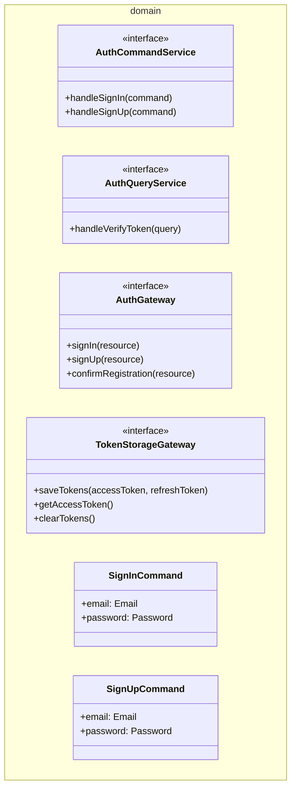

#### 4.3.1.2. Interface Layer

Se encarga de la interacción directa con el usuario, controlando el ciclo de vida de los formularios y las peticiones salientes mediante interceptores.

*   **LoginPageComponent:** Componente Angular que procesa el formulario de login y maneja los eventos `onSignIn()` y `onSignInWithGoogle()`.
*   **RegisterPageComponent:** Componente Angular para el registro de nuevos usuarios en la plataforma.
*   **ConfirmPageComponent:** Componente para validar el código de verificación enviado por correo electrónico.
*   **AuthInterceptor:** Interceptor HTTP de Angular que recupera el token de acceso actual desde `TokenStorageGateway` y lo inyecta automáticamente en la cabecera `Authorization` de todas las peticiones salientes.

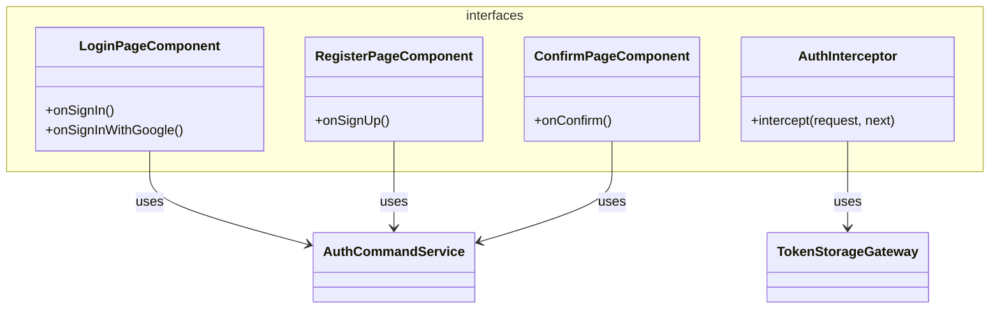

#### 4.3.1.3. Application Layer

Orquesta los casos de uso específicos del contexto de autenticación, interactuando con los contratos definidos en el dominio.

*   **AuthCommandServiceImpl:** Implementación del servicio de comandos de autenticación. Coordina la validación, la llamada a la pasarela de autenticación (`AuthGateway`), y el almacenamiento seguro de los tokens.
*   **AuthQueryServiceImpl:** Implementación del servicio de consultas encargado de verificar los tokens JWT.

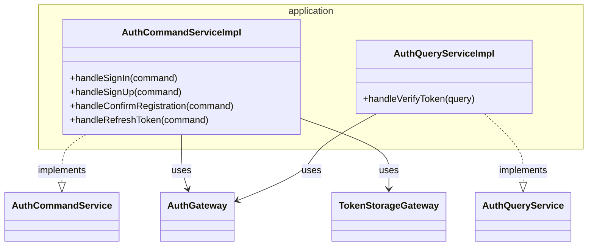

#### 4.3.1.4. Infrastructure Layer

Proporciona la implementación concreta de los contratos del dominio a través del consumo de servicios web e interacción con la memoria persistente del navegador.

*   **AuthHttpGateway:** Adaptador que realiza las llamadas HTTP usando Angular `HttpClient` hacia el servicio IAM de la API de Clair.
*   **LocalTokenStorageGateway:** Implementación concreta encargada de guardar y leer los tokens usando la API de `LocalStorage` del navegador.
*   **AuthResponseResource:** Recurso DTO que modela el cuerpo de respuesta de la API que incluye el accessToken y refreshToken.

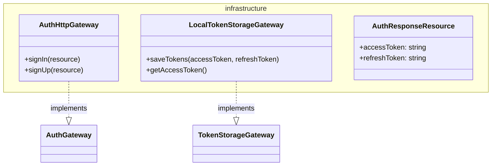

### 4.3.2. Bounded Context: Billing

#### 4.3.2.1. Domain Layer

Define las entidades financieras, planes y contratos de servicios para la suscripción a Clair Premium.

*   **UserPlan (Entity):** Entidad que representa la suscripción activa del usuario con su respectivo `UserId` y `PlanType`.
*   **PaymentIntent (Entity):** Modela la intención de pago generada por Stripe (`clientSecret`).
*   **PlanType (Enum):** Enumerador de planes soportados por la aplicación (`FREE`, `PREMIUM`).
*   **BillingCommandService / BillingQueryService (Interfaces):** Contratos del dominio para ejecutar pagos y consultar claves o planes de usuario.
*   **BillingGateway (Interface):** Contrato para el envío de datos de pago e integración del checkout.

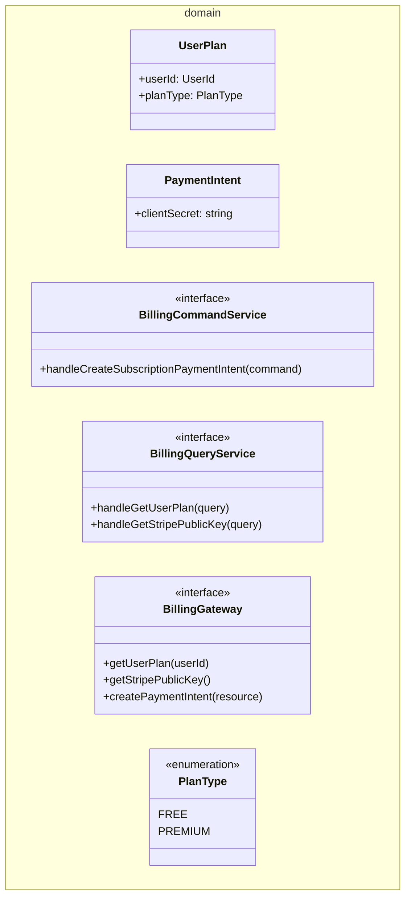

#### 4.3.2.2. Interface Layer

Contiene los componentes visuales interactivos y los servicios de transformación de datos para los flujos de pago.

*   **SelectPlanComponent:** Vista de selección de planes (Free vs Premium).
*   **PremiumCheckoutComponent:** Componente que controla el proceso de pago, interactúa con Stripe Elements y despacha la confirmación de la transacción.
*   **PaymentModalComponent:** Modal interactivo encargado de instanciar de forma segura las pasarelas del lado del cliente.
*   **BillingTransform (Service):** Servicio encargado de mapear los datos JSON de la infraestructura (`PaymentIntentResource`) a los modelos del dominio (`PaymentIntent`).

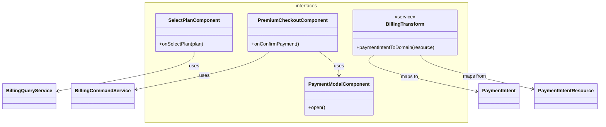

#### 4.3.2.3. Application Layer

Encapsula la lógica de orquestación para la generación de intentos de pago e información del plan asignado.

*   **BillingCommandServiceImpl:** Implementa la orquestación necesaria para el inicio del proceso de facturación creando un `PaymentIntent` a través del gateway.
*   **BillingQueryServiceImpl:** Maneja las consultas de planes activos y obtención segura de credenciales de plataformas terceras (Stripe Public Key).

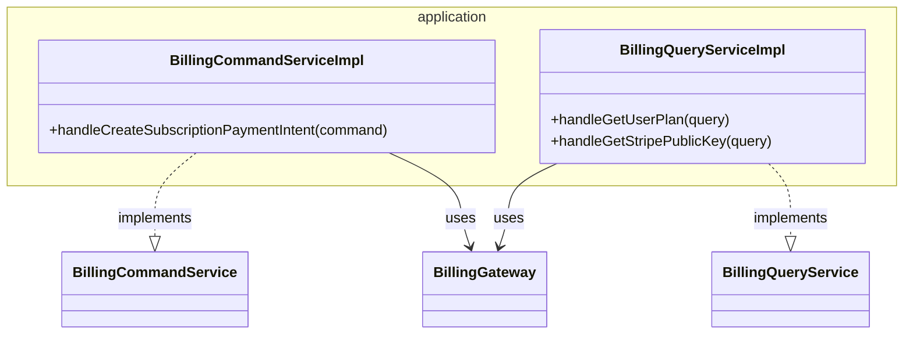

#### 4.3.2.4. Infrastructure Layer

Implementa las pasarelas de red utilizando la infraestructura Angular HTTP para comunicarse con el servidor y Stripe.

*   **BillingHttpGateway:** Implementa `BillingGateway` conectando la aplicación con el backend de Clair y recuperando las claves necesarias de Stripe.
*   **PaymentIntentResource:** DTO que define la estructura JSON de la intención de pago recibida de la API.

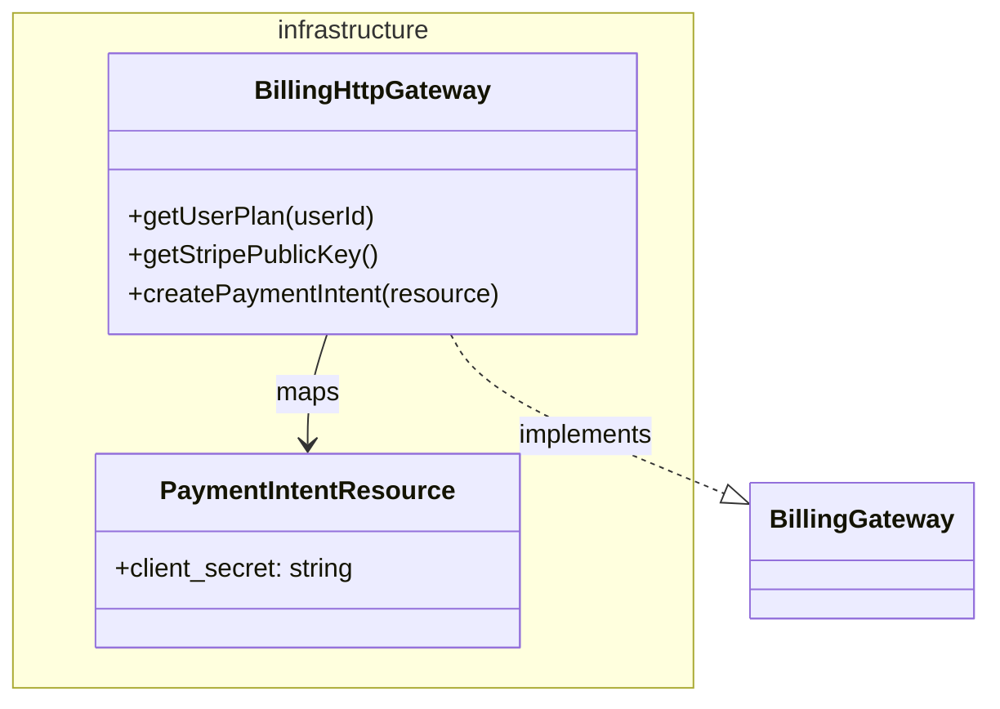

### 4.3.3. Bounded Context: Devices & Space Management

#### 4.3.3.1. Domain Layer

Define la estructura organizativa de la solución y las identidades de negocio de los sensores, actuadores y espacios.

*   **Organization (Entity):** Entidad que representa la organización dueña del espacio.
*   **Space (Entity):** Entidad que modela un entorno físico específico (oficina, sala, etc.).
*   **Device (Entity):** Modela el sensor físico y su estado actual (`serialNumber`, `hardwareId`, `status`).
*   **DeviceCommandService (Interface):** Contrato para manejar los comandos de emparejamiento (`PairDevice`) e inscripción (`ClaimDevice`).
*   **DeviceThresholdCommandService (Interface):** Contrato para actualizar la configuración de umbrales en un sensor específico.
*   **DeviceGateway (Interface):** Contrato para comunicarse con servicios de hardware y backend de control.

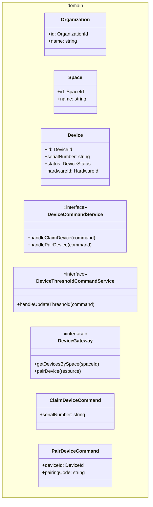

#### 4.3.3.2. Interface Layer

Contiene los componentes y mappers que exponen la configuración y el listado de dispositivos asignados a los espacios.

*   **SpaceDevicesPage:** Página Angular que muestra los dispositivos de un espacio y permite reclamar uno nuevo mediante `onClaimDevice()`.
*   **DeviceTransform:** Servicio encargado de mapear y formatear las respuestas de la API (`DeviceResource`) hacia las entidades de negocio (`Device`).
*   **DeviceContextFacade (Facade):** Fachada expuesta para permitir que otros Bounded Contexts consulten datos rápidos de un dispositivo de manera desacoplada.

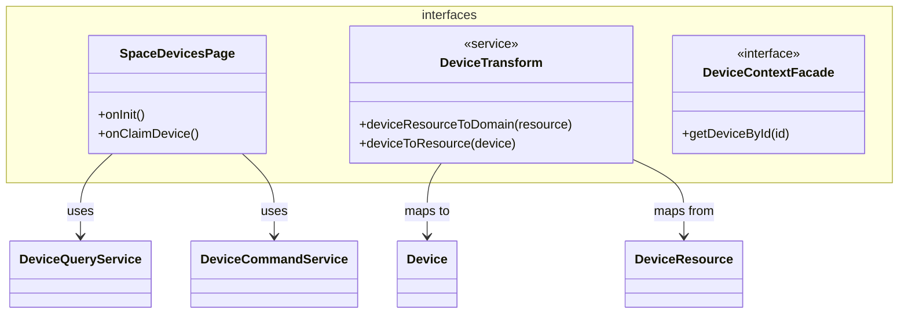

#### 4.3.3.3. Application Layer

Orquesta los casos de uso para aprovisionamiento, emparejamiento de hardware y establecimiento de umbrales físicos del dispositivo.

*   **DeviceCommandServiceImpl:** Implementa y gestiona el registro de organizaciones y el proceso de reclamo de dispositivos (`handleClaimDevice`).
*   **DeviceQueryServiceImpl:** Orquesta las consultas para listar los sensores pertenecientes a una sala específica.
*   **DeviceThresholdCommandServiceImpl:** Gestiona la creación y modificación de umbrales recomendados por sensor.
*   **DeviceThresholdQueryServiceImpl:** Obtiene las configuraciones de alerta recomendadas de calidad de aire para un dispositivo determinado.

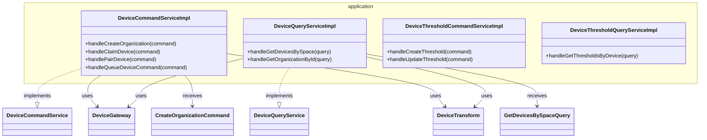

#### 4.3.3.4. Infrastructure Layer

Proporciona la conectividad física de red con el API de Clair e implementa los adaptadores HTTP.

*   **DeviceHttpGateway:** Adaptador que implementa la pasarela de dispositivos (`DeviceGateway`) usando el cliente HTTP de Angular para persistir cambios y emparejar.
*   **DeviceThresholdHttpGateway:** Adaptador específico encargado del canal de comunicación de umbrales de alerta del hardware.
*   **DeviceResource:** DTO que modela el JSON enviado/recibido para dispositivos en la API de Clair.

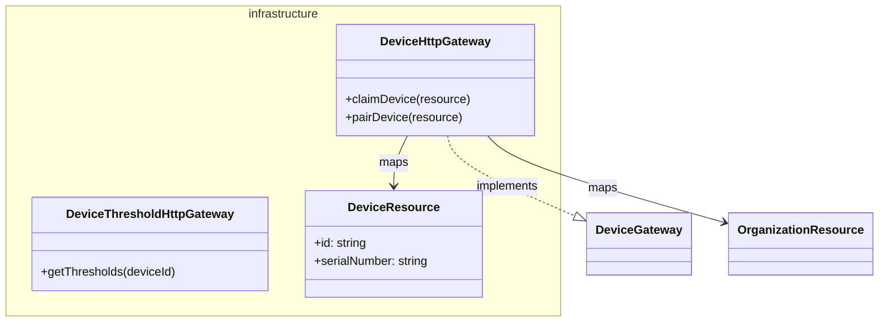

### 4.3.4. Bounded Context: Air Quality Evaluation

#### 4.3.4.1. Domain Layer

Modeliza la lógica y las métricas de evaluación ambiental del aire, procesando el estado de salubridad y la telemetría histórica.

*   **TelemetryEvaluation (Entity):** Representa el resultado detallado del análisis de calidad del aire para un dispositivo, consolidando métricas como material particulado (`ParticulateMatter`), calidad general (`AirQuality`), conectividad (`Connectivity`), y estado general de salud del ambiente (`healthStatus`).
*   **TelemetryEvaluationCommandService / TelemetryEvaluationQueryService (Interfaces):** Contratos del dominio para despachar solicitudes de evaluación y consultar históricos de mediciones.
*   **TelemetryEvaluationGateway (Interface):** Contrato que especifica el envío de telemetría a evaluar y la recuperación de reportes agregados.
*   **EvaluateTelemetryCommand / GetEvaluationsByDeviceQuery (Value Objects):** Comandos y consultas inmutables que encapsulan parámetros de dispositivo y paginación.

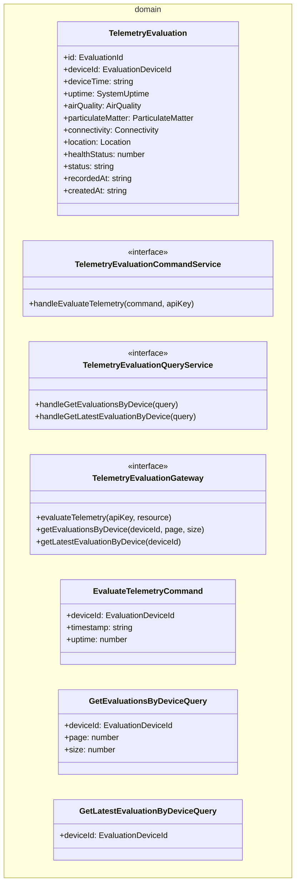

#### 4.3.4.2. Interface Layer

Contiene las interfaces y transformadores que comunican el contexto de evaluación de telemetría con el resto de la aplicación y componentes visuales.

*   **EvaluationContextFacade (Facade):** Fachada de integración que permite a otros módulos del frontend consultar rápidamente la última lectura o estado de telemetría de un dispositivo sin acoplarse a los detalles del módulo de evaluación.
*   **TelemetryEvaluationTransform / EvaluateTelemetryTransform (Services):** Servicios mappers de Angular que traducen recursos JSON crudos de la infraestructura a entidades y comandos limpios de negocio.

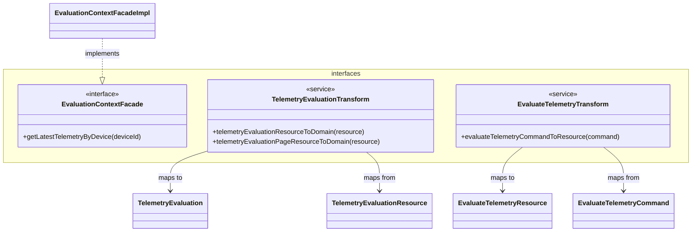

#### 4.3.4.3. Application Layer

Encapsula los servicios encargados de la coordinación de la lógica de evaluación en tiempo real y consultas del histórico de sensores.

*   **TelemetryEvaluationCommandServiceImpl:** Orquesta el flujo de evaluación enviando nuevas cargas de telemetría a procesar junto con la firma del API Key.
*   **TelemetryEvaluationQueryServiceImpl:** Implementa la lógica para retornar listados paginados de telemetrías y la consulta en tiempo real del último estado reportado.
*   **EvaluationContextFacadeImpl:** Implementación de la fachada que delega al servicio de consultas para exponer la información de manera limpia a otros bounded contexts frontend.

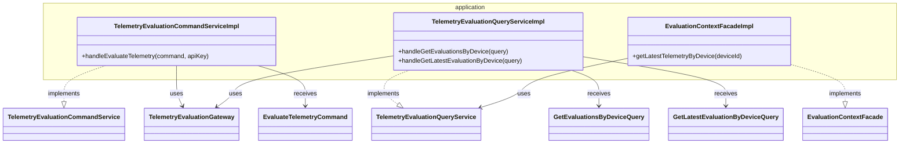

#### 4.3.4.4. Infrastructure Layer

Proporciona los clientes HTTP y adaptadores que se conectan con los endpoints de evaluación ambiental en el Platform API.

*   **TelemetryEvaluationHttpGateway:** Implementación de `TelemetryEvaluationGateway` usando `HttpClient` de Angular para persistir telemetrías y leer evaluaciones estructuradas.
*   **TelemetryEvaluationResource / EvaluateTelemetryResource:** DTOs que modelan la estructura JSON para la entrada de datos brutos del sensor y la salida enriquecida con los umbrales e indicadores calculados.

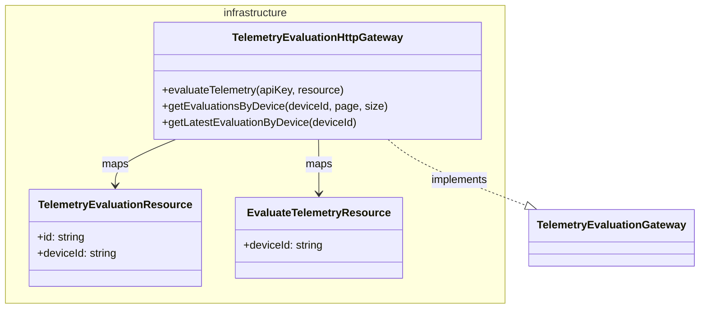

### 4.3.5. Bounded Context: Alerting & Response

#### 4.3.5.1. Domain Layer

Define las entidades y contratos para el procesamiento y catalogación de incidentes críticos y alertas ambientales.

*   **Alert (Entity):** Entidad principal que representa un incidente de seguridad ambiental. Contiene severidad (`AlertSeverity`), estado, mensaje e indicador temporal (`timestamp`).
*   **AlertSeverity (Enum):** Gravedad del incidente (`LOW`, `MEDIUM`, `HIGH`, `CRITICAL`).
*   **AlertQueryService (Interface):** Interfaz para consultar los incidentes y resúmenes diarios de alertas.
*   **AlertGateway (Interface):** Contrato para recuperar alertas desde la persistencia externa.
*   **GetAlertsQuery (Value Object):** Query que encapsula los parámetros de paginación para la lista de alertas.

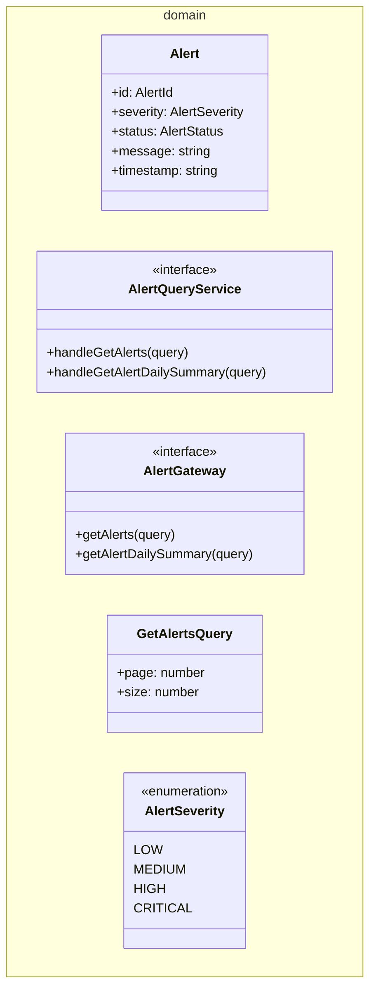

#### 4.3.5.2. Interface Layer

Contiene los componentes y fachadas de integración visual para desplegar las alertas en la interfaz de usuario.

*   **AlertsPageComponent:** Componente Angular contenedor que inicializa la carga de alertas activas del sistema.
*   **AlertCardComponent:** Componente visual reutilizable para mostrar detalles rápidos de una alerta específica.
*   **AlertTableComponent:** Tabla estructurada que renderiza colecciones de alertas con soporte para filtros de severidad y paginación.
*   **AlertTransform (Service):** Servicio encargado de traducir los registros crudos de respuesta JSON (`AlertResponseResource`) a la entidad `Alert`.
*   **AlertingContextFacade (Facade):** Fachada que expone métodos para que otros contextos consulten alertas activas por dispositivo.

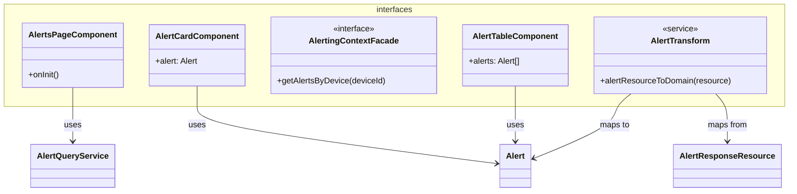

#### 4.3.5.3. Application Layer

Encapsula los servicios encargados de la orquestación para consultar la telemetría fuera de rango e incidentes generados.

*   **AlertQueryServiceImpl:** Servicio de aplicación que implementa la orquestación para recuperar alertas paginadas o generar resúmenes analíticos rápidos del día.
*   **AlertingContextFacadeImpl:** Implementación concreta de la fachada para el consumo de datos de alertas por otros módulos frontend.

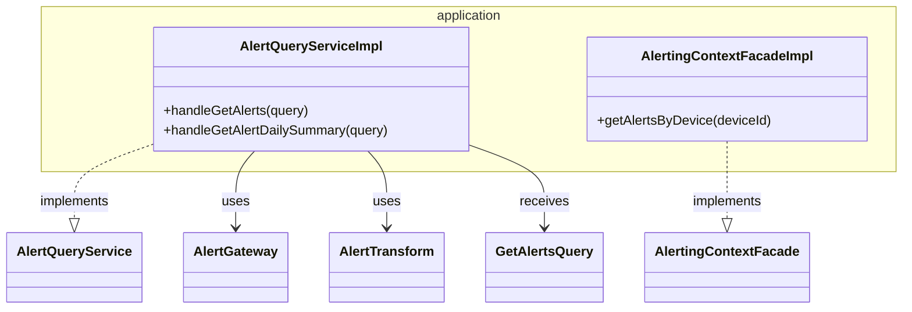

#### 4.3.5.4. Infrastructure Layer

Proporciona los clientes HTTP adaptados a la API REST de alertas del Platform API.

*   **AlertHttpGateway:** Adaptador que implementa `AlertGateway` usando el cliente HTTP de Angular para realizar consultas paginadas e interactuar con la persistencia.
*   **AlertResponseResource:** DTO que modela el recurso JSON de respuesta de una alerta de la API.

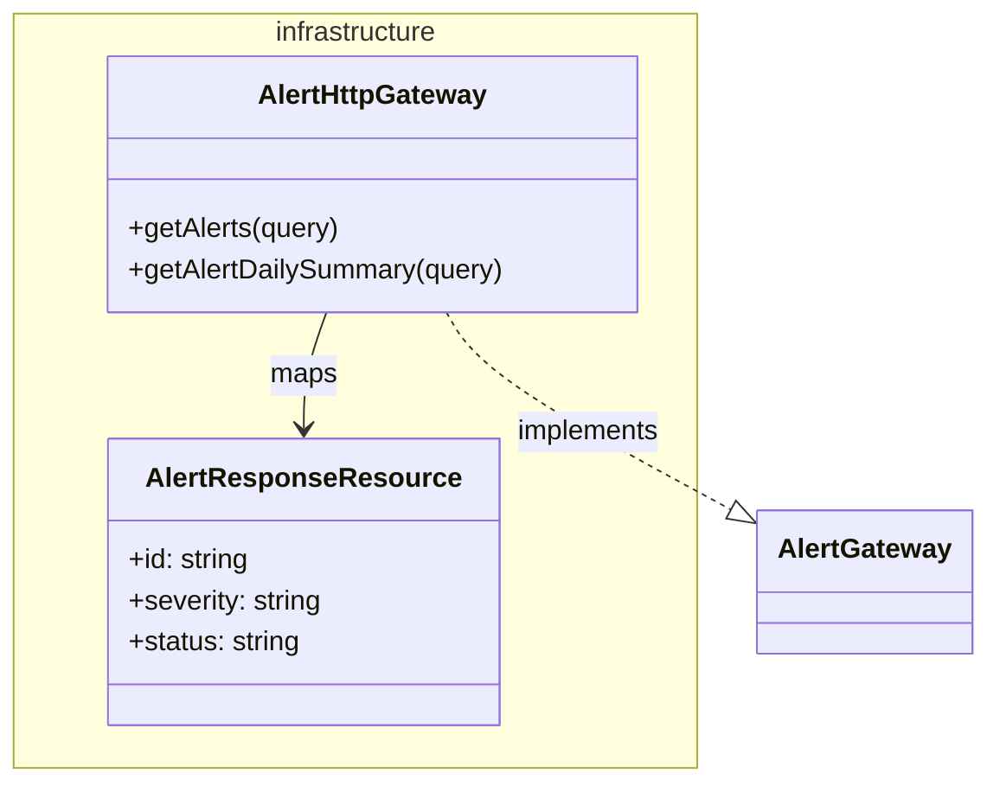

### 4.3.6. Bounded Context: Analytics & Reporting

#### 4.3.6.1. Domain Layer

Define la representación lógica de las tendencias temporales y las métricas resumidas que consumen los dashboards de Clair.

*   **Trend (Entity):** Modela el comportamiento histórico de una métrica física a lo largo del tiempo (marcas temporales, valores leídos y tipo de métrica).
*   **AnalyticsOverview (Entity):** Estructura consolidada que expone el Índice de Calidad del Aire (ICA/AQI) promedio y el contador de incidentes activos para el dashboard general.
*   **AnalyticsQueryService / AnalyticsOverviewQueryService (Interfaces):** Contratos para las búsquedas de series temporales y visualización de paneles agregados.
*   **AnalyticsGateway (Interface):** Contrato que abstrae el origen de datos históricos y analíticos.

```mermaid
classDiagram
namespace domain {
    class Trend {
        +timestamp: string
        +value: number
        +metricType: string
    }
    class AnalyticsOverview {
        +aqi: number
        +activeAlerts: number
    }
    class AnalyticsQueryService {
        <<interface>>
        +handleGetTrends(query)
    }
    class AnalyticsOverviewQueryService {
        <<interface>>
        +handleGetOverview(query)
    }
    class AnalyticsGateway {
        <<interface>>
        +getTrends(query)
        +getOverview(query)
    }
}
```

#### 4.3.6.2. Interface Layer

Contiene los controladores de gráficos e indicadores interactivos para el análisis retrospectivo en la interfaz de usuario.

*   **AnalyticsPageComponent:** Componente Angular para el análisis avanzado y filtrado de series de telemetría.
*   **OverviewPageComponent:** Componente principal que sirve como panel de control resumen del establecimiento monitoreado.
*   **TrendChartCardComponent:** Tarjeta visual que dibuja y renderiza gráficos interactivos de líneas basados en las tendencias de `Trend`.
*   **AqiGaugeCardComponent:** Indicador visual tipo velocímetro para mostrar de manera instantánea el nivel de AQI calculado.
*   **AnalyticsTransform (Service):** Servicio encargado de traducir los datos agregados a los modelos de dominio.
*   **AnalyticsContextFacade (Facade):** Fachada de integración para que otros contextos recuperen las métricas rápidas de los dashboards.

```mermaid
classDiagram
namespace interfaces {
    class AnalyticsPageComponent {
        +onInit()
    }
    class OverviewPageComponent {
        +onInit()
    }
    class AnalyticsTransform {
        <<service>>
        +analyticsResourceToDomain(resource)
    }
    class AnalyticsContextFacade {
        <<interface>>
        +getDashboardMetrics(organizationId)
    }
    class TrendChartCardComponent {
        +trends: Trend[]
    }
    class AqiGaugeCardComponent {
        +aqiValue: number
    }
}

class AnalyticsQueryService
class AnalyticsOverviewQueryService
class Trend
class TrendsResource

AnalyticsPageComponent --> AnalyticsQueryService : uses
OverviewPageComponent --> AnalyticsOverviewQueryService : uses
TrendChartCardComponent --> Trend : uses
AnalyticsTransform --> Trend : maps to
AnalyticsTransform --> TrendsResource : maps from
```

#### 4.3.6.3. Application Layer

Orquesta los flujos de consulta de series históricas y agregaciones requeridos por los componentes visuales.

*   **AnalyticsQueryServiceImpl:** Implementación del servicio de aplicación que gestiona la recuperación de tendencias históricas de los sensores.
*   **AnalyticsOverviewQueryServiceImpl:** Orquesta el cálculo y agregación rápidos de alertas y calidad de aire para construir el resumen global.
*   **AnalyticsContextFacadeImpl:** Implementación concreta de la fachada expuesta hacia el exterior del módulo analítico.

```mermaid
classDiagram
namespace application {
    class AnalyticsQueryServiceImpl {
        +handleGetTrends(query)
    }
    class AnalyticsOverviewQueryServiceImpl {
        +handleGetOverview(query)
    }
    class AnalyticsContextFacadeImpl {
        +getDashboardMetrics(organizationId)
    }
}

class AnalyticsQueryService
class AnalyticsOverviewQueryService
class AnalyticsContextFacade
class AnalyticsGateway
class AnalyticsTransform

AnalyticsQueryServiceImpl ..|> AnalyticsQueryService : implements
AnalyticsOverviewQueryServiceImpl ..|> AnalyticsOverviewQueryService : implements
AnalyticsContextFacadeImpl ..|> AnalyticsContextFacade : implements
AnalyticsQueryServiceImpl --> AnalyticsGateway : uses
AnalyticsOverviewQueryServiceImpl --> AnalyticsGateway : uses
AnalyticsQueryServiceImpl --> AnalyticsTransform : uses
```

#### 4.3.6.4. Infrastructure Layer

Adaptadores que conectan con la base de datos de telemetrías agregadas a través de la API REST de Clair.

*   **AnalyticsHttpGateway:** Adapter concreto que implementa `AnalyticsGateway` consumiendo los recursos analíticos mediante Angular `HttpClient`.
*   **TrendsResource / AnalyticsOverviewResource:** DTOs que mapean los JSON de respuestas estructuradas con tendencias y totales.

```mermaid
classDiagram
namespace infrastructure {
    class AnalyticsHttpGateway {
        +getTrends(query)
        +getOverview(query)
    }
    class TrendsResource {
        +data: any[]
    }
    class AnalyticsOverviewResource {
        +aqi: number
        +alerts: number
    }
}

class AnalyticsGateway

AnalyticsHttpGateway ..|> AnalyticsGateway : implements
AnalyticsHttpGateway --> TrendsResource : maps
AnalyticsHttpGateway --> AnalyticsOverviewResource : maps
```

### 4.3.7. Bounded Context: Notifications

#### 4.3.7.1. Domain Layer

Define la estructura de logs de auditoría de mensajes enviados y los contratos para recuperar el historial de notificaciones.

*   **PushNotificationLog (Entity):** Entidad de dominio que representa una notificación enviada (identificador, título, cuerpo del mensaje, y fecha de despacho `sentAt`).
*   **NotificationQueryService (Interface):** Contrato para el control del caso de uso de lectura del historial de notificaciones.
*   **NotificationGateway (Interface):** Contrato que abstrae las llamadas de infraestructura para recuperar el listado.
*   **GetPushNotificationsQuery (Value Object):** Query inmutable que encapsula las opciones de paginación para la lista de notificaciones.

```mermaid
classDiagram
namespace domain {
    class PushNotificationLog {
        +id: string
        +title: string
        +message: string
        +sentAt: string
    }
    class NotificationQueryService {
        <<interface>>
        +handleGetPushNotifications(query)
    }
    class NotificationGateway {
        <<interface>>
        +getPushNotifications(page, size)
    }
    class GetPushNotificationsQuery {
        +page: number
        +size: number
    }
}
```

#### 4.3.7.2. Interface Layer

Contiene los adaptadores y fachadas que permiten a otras partes de la UI interactuar con la bandeja de entrada de notificaciones push.

*   **NotificationsContextFacade (Facade):** Fachada que expone el método `getPushNotifications(page, size)` permitiendo un desacoplamiento directo con otros módulos de la app web.
*   **PushNotificationTransform (Service):** Servicio encargado de transformar DTOs de infraestructura (`PushNotificationLogResource`) a entidades del negocio (`PushNotificationLog`).

```mermaid
classDiagram
namespace interfaces {
    class NotificationsContextFacade {
        <<interface>>
        +getPushNotifications(page, size)
    }
    class PushNotificationTransform {
        <<service>>
        +resourceToDomain(resource)
    }
}

class NotificationsContextFacadeImpl
class PushNotificationLog
class PushNotificationLogResource

NotificationsContextFacadeImpl ..|> NotificationsContextFacade : implements
PushNotificationTransform --> PushNotificationLog : maps to
PushNotificationTransform --> PushNotificationLogResource : maps from
```

#### 4.3.7.3. Application Layer

Encapsula la orquestación para recuperar los mensajes push del usuario autenticado.

*   **NotificationQueryServiceImpl:** Servicio de aplicación que delega en el gateway para consultar y transformar la colección de alertas enviadas.
*   **NotificationsContextFacadeImpl:** Fachada concreta que orquesta la llamada asíncrona hacia el servicio de consultas de aplicación.

```mermaid
classDiagram
namespace application {
    class NotificationQueryServiceImpl {
        +handleGetPushNotifications(query)
    }
    class NotificationsContextFacadeImpl {
        +getPushNotifications(page, size)
    }
}

class NotificationsContextFacade
class NotificationQueryService
class NotificationGateway
class PushNotificationTransform
class GetPushNotificationsQuery

NotificationsContextFacadeImpl ..|> NotificationsContextFacade : implements
NotificationQueryServiceImpl ..|> NotificationQueryService : implements
NotificationsContextFacadeImpl --> NotificationQueryService : uses
NotificationQueryServiceImpl --> NotificationGateway : uses
NotificationQueryServiceImpl --> PushNotificationTransform : uses
NotificationQueryServiceImpl --> GetPushNotificationsQuery : receives
```

#### 4.3.7.4. Infrastructure Layer

Adaptadores que consultan el historial de notificaciones registrado en el servidor de Clair.

*   **NotificationHttpGateway:** Implementación concreta del gateway utilizando `HttpClient` de Angular para obtener el log.
*   **PushNotificationLogResource:** DTO que mapea el recurso JSON del log de notificaciones desde el API backend.

```mermaid
classDiagram
namespace infrastructure {
    class NotificationHttpGateway {
        +getPushNotifications(page, size)
    }
    class PushNotificationLogResource {
        +id: string
        +title: string
        +message: string
        +sent_at: string
    }
}

class NotificationGateway

NotificationHttpGateway ..|> NotificationGateway : implements
NotificationHttpGateway --> PushNotificationLogResource : maps
```


## 4.4. Tactical-Level Domain-Driven Design -  Mobile application

SE APLICO DDD EN FLUTTER

### 4.4.1. Bounded Context: Identity & Access Management (IAM)

#### 4.4.1.1. Domain Layer

#### 4.4.1.2. Interface Layer

#### 4.4.1.3. Application Layer

#### 4.4.1.4. Infrastructure Layer

### 4.4.2. Bounded Context: Device & Space Management

#### 4.4.2.1. Domain Layer

#### 4.4.2.2. Interface Layer

#### 4.4.2.3. Application Layer

#### 4.4.2.4. Infrastructure Layer

### 4.4.3. Bounded Context: Air Quality Evaluation

#### 4.4.3.1. Domain Layer

#### 4.4.3.2. Interface Layer

#### 4.4.3.3. Application Layer

#### 4.4.3.4. Infrastructure Layer

### 4.4.4. Bounded Context: Alerting & Response

#### 4.4.4.1. Domain Layer

#### 4.4.4.2. Interface Layer

#### 4.4.4.3. Application Layer

#### 4.4.4.4. Infrastructure Layer

### 4.4.5. Bounded Context: Analytics & Reporting

#### 4.4.5.1. Domain Layer

#### 4.4.5.2. Interface Layer

#### 4.4.5.3. Application Layer

#### 4.4.5.4. Infrastructure Layer

### 4.4.6. Bounded Context: Notifications

#### 4.4.6.1. Domain Layer

#### 4.4.6.2. Interface Layer

#### 4.4.6.3. Application Layer

#### 4.4.6.4. Infrastructure Layer

## 4.5. Tactical-Level Domain-Driven Design - Edge station

SE APLICO DDD EN FLASK

### 4.5.1. Bounded Context: Identity & Access Management (IAM)

#### 4.5.1.1. Domain Layer

#### 4.5.1.2. Interface Layer

#### 4.5.1.3. Application Layer

#### 4.5.1.4. Infrastructure Layer

### 4.5.2. Bounded Context: Device & Space Management

#### 4.5.2.1. Domain Layer

#### 4.5.2.2. Interface Layer

#### 4.5.2.3. Application Layer

#### 4.5.2.4. Infrastructure Layer

### 4.5.3. Bounded Context: Alerting & Response

#### 4.5.3.1. Domain Layer

#### 4.5.3.2. Interface Layer

#### 4.5.3.3. Application Layer

#### 4.5.3.4. Infrastructure Layer

### 4.5.4. Bounded Context: Device Provisioning

#### 4.5.4.1. Domain Layer

#### 4.5.4.2. Interface Layer

#### 4.5.4.3. Application Layer

#### 4.5.4.4. Infrastructure Layer

## 4.6. Tactical-Level Domain-Driven Design - Embedded application

No me acuerdo que tipo de arquitectura iot era xd 


