# Capítulo IV: Solution Software Design

## 4.1. Strategic-Level Domain-Driven Design.

### 4.1.1. Design-Level EventStorming.

El Strategic-Level Domain-Driven Design constituye la base fundamental para el desarrollo de la aplicación Clair. Este enfoque nos permite identificar y definir los límites de los contextos de dominio, establecer las relaciones entre ellos y crear una arquitectura de software sólida que soporte los objetivos del negocio.
En esta fase estratégica, nos enfocamos en:

- Comprensión profunda del dominio: Identificación de los procesos de negocio críticos

- Definición de bounded contexts: Establecimiento de límites claros entre diferentes áreas funcionales

- Modelado de relaciones: Definición de cómo interactúan los diferentes contextos

- Arquitectura de alto nivel: Diseño de la estructura general del sistema

#### 4.1.1.1 Candidate Context Discovery.

En esta etapa se desarrolló el Design-Level EventStorming, tomando como insumo el *Big Picture*, el *Ubiquitous Language* y los artefactos previamente definidos (*commands*, *policies* y *read models*).

El objetivo fue descender desde una comprensión general del negocio hacia un nivel de diseño técnico, permitiendo modelar el comportamiento del sistema con mayor precisión.

Se modelaron los 12 flujos principales de Clair, estructurados bajo la siguiente secuencia:

$$
\text{Actor} \rightarrow \text{Command} \rightarrow \text{Constraint} \rightarrow \text{Domain Event} \rightarrow \text{Policy} \rightarrow \text{Command} \rightarrow \text{Domain Event} \rightarrow \text{Read Model}
$$

Adicionalmente, se identificaron:
- Sistemas externos relevantes dentro de los flujos  
- *Hotspots* o zonas de alta complejidad y riesgo  

Como resultado, el equipo transitó de una fase de entendimiento del negocio (*“qué ocurre”*) hacia una definición clara del comportamiento del sistema (*“cómo debe implementarse”*), estableciendo límites, responsabilidades y reglas explícitas para su desarrollo.

El **Candidate Context Discovery** corresponde al proceso de identificación de fronteras de dominio candidatas (*Bounded Contexts*) a partir de patrones de lenguaje, reglas de negocio, responsabilidades y niveles de acoplamiento observados en los eventos del sistema.

En esta actividad, el equipo agrupó comportamientos que comparten un propósito común y consistencia interna, evitando la coexistencia de capacidades que evolucionan a ritmos distintos dentro de un mismo contexto. Este enfoque permite preservar la coherencia del modelo y reducir fricciones en la evolución del sistema.

Como resultado, se definieron los siguientes bounded context:

- **IAM (Identity \& Access Management)**  
- **Billing**  
- **Device \& Space Management**  
- **Air Quality Evaluation**  
- **Alerting \& Response**  
- **Analytics \& Reporting**  

Esta partición permite:
- Una asignación más clara de *ownership* por dominio  
- Reducir la ambigüedad en la conversación técnico-funcional  
- Mejorar la trazabilidad entre decisiones de negocio y diseño de software  

En paralelo, se definieron doce flujos principales *end-to-end*, representando los recorridos críticos del sistema:

**Leyenda de Elementos**

  

**1. User Registration and Access Activation**

Este flujo gestiona la creación de nuevas identidades en la plataforma. El sistema captura los datos del aspirante, valida los requisitos de seguridad y activa el acceso tras confirmar la identidad.

  

**2. Login and Session Start**

Describe el proceso de validación de credenciales para usuarios existentes. Una vez autenticado, el sistema inicia una sesión segura y otorga los permisos necesarios según el rol asignado (**Home User** o **Facility Admin**).

  

**3. Trial and Subscription Lifecycle**

Gestiona el estado de la cuenta del usuario, desde la activación del periodo de prueba de 30 días hasta la transición a planes suscritos, controlando el acceso a las funciones premium del ecosistema.

  

**4. Checkout and Payment Outcome**

Representa el flujo financiero donde se procesan las transacciones de suscripción. El sistema valida el método de pago y confirma el resultado de la operación para actualizar el nivel de servicio del cliente.

  

**5. Facility and Space Setup**

Flujo orientado principalmente al Facility Admin para la estructuración lógica de sus establecimientos. Permite segmentar el local en zonas específicas para una monitorización más precisa y organizada.

  

**6. Device Onboarding**

Es el proceso técnico de vinculación de hardware. Incluye la lectura del código único del sensor Clair y su registro en la base de datos de la plataforma para comenzar la transmisión de datos.

  

**7. Threshold Management**

Permite a los usuarios definir los parámetros de seguridad para $CO_2$ y partículas. Este flujo establece los límites que el motor de reglas utilizará para evaluar la calidad del aire de forma personalizada.

  

**8. Telemetry Ingestion and Validation**

Gestiona la recepción de datos y valida su integridad. Incluye almacenamiento local (Offline) cuando se pierde la conexión, permitiendo la sincronización automática por lotes al restablecerse el internet para evitar brechas en el historial de calidad del aire.

  

**9. Air Quality Evaluation**

Es el motor de procesamiento donde la telemetría se compara contra los umbrales configurados. Este flujo determina el estado ambiental en tiempo real (Seguro, Advertencia o Crítico).

  

**10. Critical Alert Management**

Flujo de respuesta inmediata ante picos de contaminación. Se encarga de la generación y envío de notificaciones *push* y alertas visuales cuando el aire representa un riesgo para la salud.

  

**11. Corrective Action Orchestration**

Gestiona la ejecución de comandos hacia los actuadores. Este flujo coordina la apertura de ventanas o el encendido de extractores de forma autónoma según las reglas de automatización configuradas.

  

**12. Reporting and Insights**

 Proceso de síntesis de datos históricos. Transforma la telemetría acumulada en reportes semanales de salud y visualizaciones de tendencias para la toma de decisiones informadas.

  

Cada flujo fue modelado de manera independiente y detallada, utilizando *post-its* atómicos (sin combinación de elementos), lo que asegura que cada evento, comando, regla y reacción se mantenga explícito y alineado con el *Ubiquitous Language* del dominio.

El tablero completo del  Candidate Context Discovery puede visualizarse en el siguiente enlace: https://bit.ly/3QwYkAS

#### 4.1.1.2 Domain Message Flows Modeling.

El Domain Message Flows Modeling mapea cómo los mensajes (eventos, comandos) fluyen entre los diferentes bounded contexts identificados. Este modelado es crucial para entender las dependencias y patrones de comunicación del sistema.

**User Registration and Access Activation**

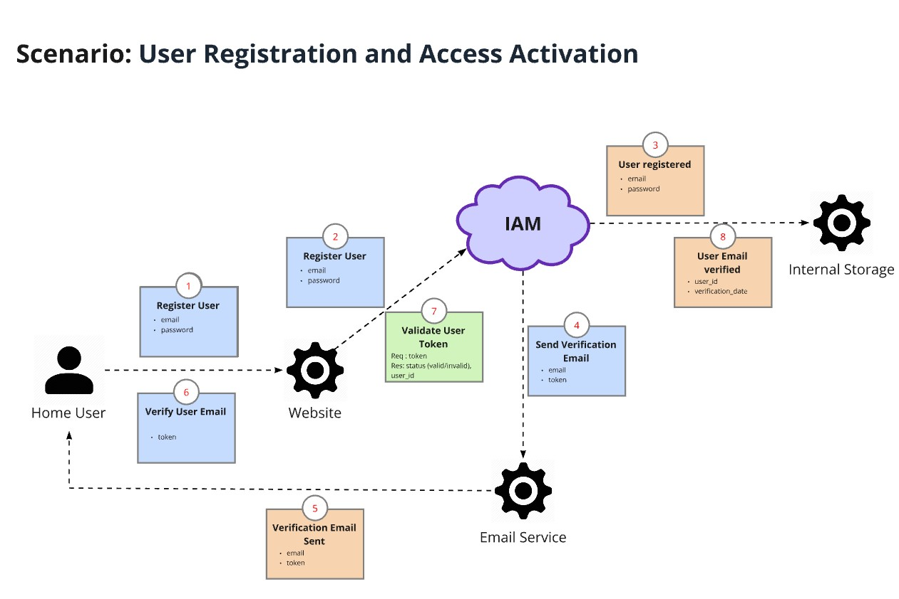

Esta vista muestra el workflow para el registro y activación de usuarios, destacando cómo el sistema IAM (Identity and Access Management) centraliza la seguridad y la gestión de sesiones. El proceso asegura el desacoplamiento de responsabilidades: la Website actúa como interfaz de captura, el IAM valida la identidad y el ciclo de vida de la cuenta, mientras que el Email Service gestiona la comunicación externa de forma independiente. Finalmente, el uso de tokens y la persistencia en el Internal Storage garantizan que solo los usuarios verificados obtengan acceso.

**Login and Session Start**

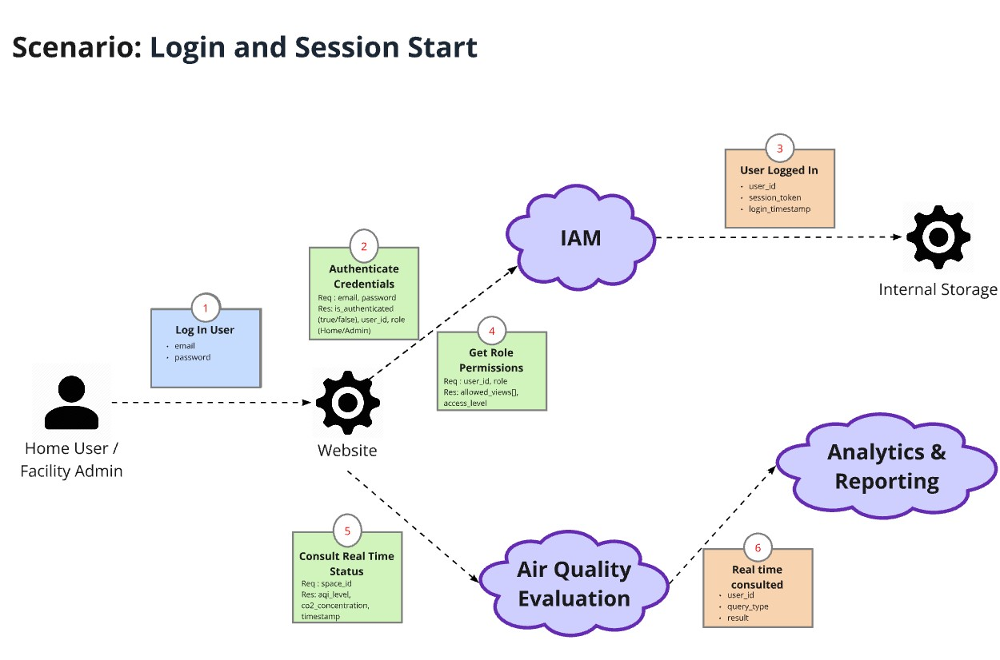

Esta vista detalla el proceso de Login e Inicio de Sesión, ilustrando cómo el sistema organiza la autenticación y la autorización mediante un componente central de IAM. El flujo comienza cuando el usuario proporciona sus credenciales a través de la Website, la cual delega la validación y la asignación de permisos por rol al IAM para garantizar un control de acceso seguro y centralizado. Una vez autenticado, el estado de la sesión se persiste en el Internal Storage, permitiendo que el usuario consulte servicios especializados como la Air Quality Evaluation en tiempo real, cuyas interacciones son registradas por el módulo de Analytics & Reporting para auditoría y análisis posterior.

**Trial Subscription Lifecycle**

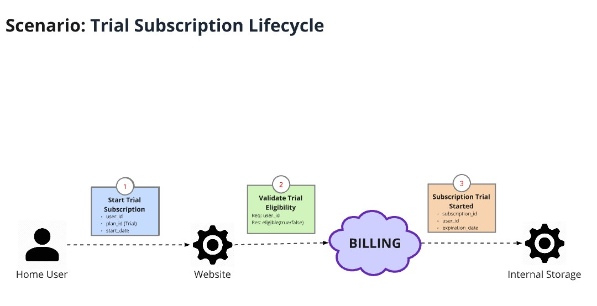

Esta vista describe el ciclo de vida de una Suscripción de Prueba, mostrando cómo se gestiona la elegibilidad y activación mediante un servicio centralizado de Billing. El flujo comienza cuando el Home User solicita iniciar una prueba a través de la Website, la cual se encarga de validar la elegibilidad del usuario antes de procesar la solicitud con el módulo de facturación. Una vez que el servicio de Billing confirma el inicio de la suscripción, se genera un registro con el ID de suscripción y la fecha de expiración, información que se persiste finalmente en el Internal Storage para asegurar que el acceso temporal del usuario quede correctamente documentado y administrado.

**Paid Subscription Lifecycle**

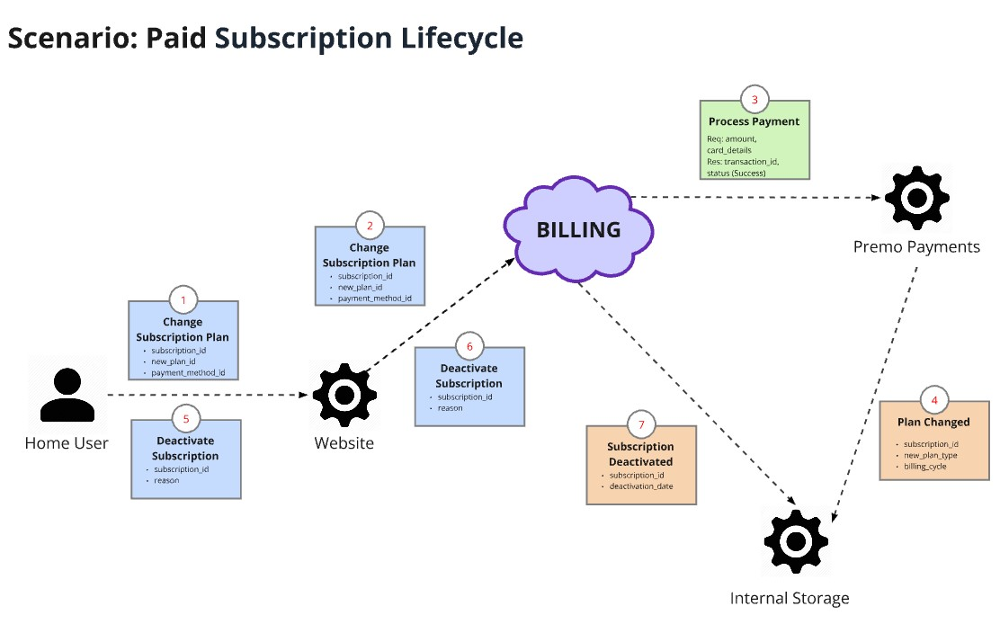

Esta vista describe el Ciclo de Vida de la Suscripción de Pago, detallando los procesos de actualización y cancelación de servicios por parte del usuario. El flujo se inicia en la Website, que actúa como intermediaria para enviar solicitudes de cambio de plan o desactivación hacia el módulo de Billing. Para cambios de plan, el sistema coordina el procesamiento del pago a través de un Payment Gateway externo; una vez confirmado, o en caso de una desactivación, se actualiza el registro correspondiente en el Internal Storage para reflejar el nuevo estado de la suscripción y el ciclo de facturación actual del usuario.

**Checkout and Payment Outcome**

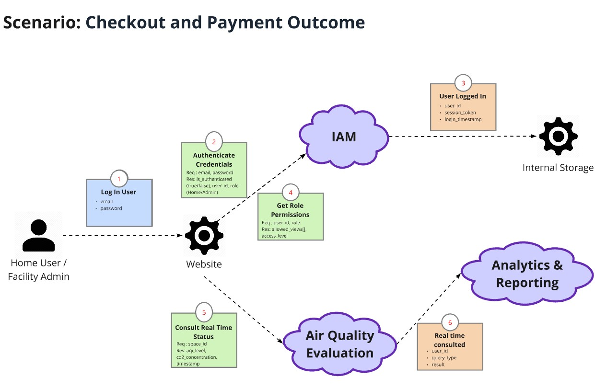

Esta vista describe el proceso de Checkout y Resultado de Pago, ilustrando cómo la plataforma integra la validación de identidad con la ejecución de servicios en tiempo real. El flujo inicia cuando el usuario se autentica a través de la Website, la cual coordina con el IAM para validar credenciales y obtener permisos específicos de rol que se persisten en el Internal Storage. Una vez establecida la sesión, el sistema permite la consulta de estados mediante la Air Quality Evaluation, cuyos resultados y tipos de consulta son registrados por el módulo de Analytics & Reporting para garantizar la trazabilidad y el análisis de cada transacción completada.

**Facility and Space Setup**

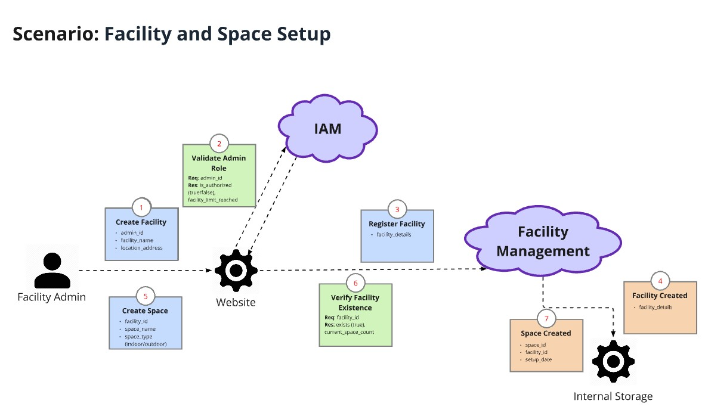

Esta vista detalla el proceso de Configuración de Instalaciones y Espacios, ilustrando cómo el sistema gestiona la creación de infraestructura bajo un esquema de control de acceso centralizado. El flujo comienza cuando el Facility Admin solicita la creación de una instalación a través de la Website, la cual coordina con el IAM para validar el rol administrativo y los límites de creación permitidos. Una vez autorizado, el módulo de Facility Management registra la instalación y permite la configuración de espacios específicos (interiores o exteriores), verificando siempre su existencia previa antes de persistir los detalles finales en el Internal Storage para asegurar una administración organizada y auditable.

**Initial Device Setup**

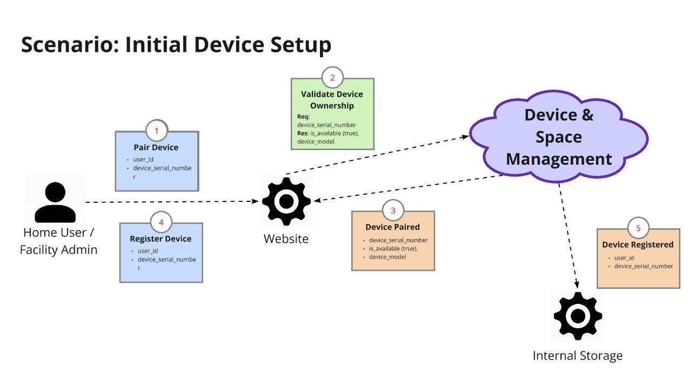

Esta vista describe el proceso de Configuración Inicial del Dispositivo, ilustrando cómo se vincula el hardware con la cuenta del usuario de forma segura. El flujo comienza cuando el Home User solicita el emparejamiento a través de la Website, la cual se comunica con el módulo de Device & Space Management para validar la propiedad y disponibilidad del modelo mediante su número de serie. Una vez que el dispositivo es reconocido y vinculado con éxito, el sistema confirma el registro y persiste los datos de la asociación en el Internal Storage, garantizando que el equipo esté listo para su monitoreo y gestión dentro del entorno del usuario.

**Device Location Setup**

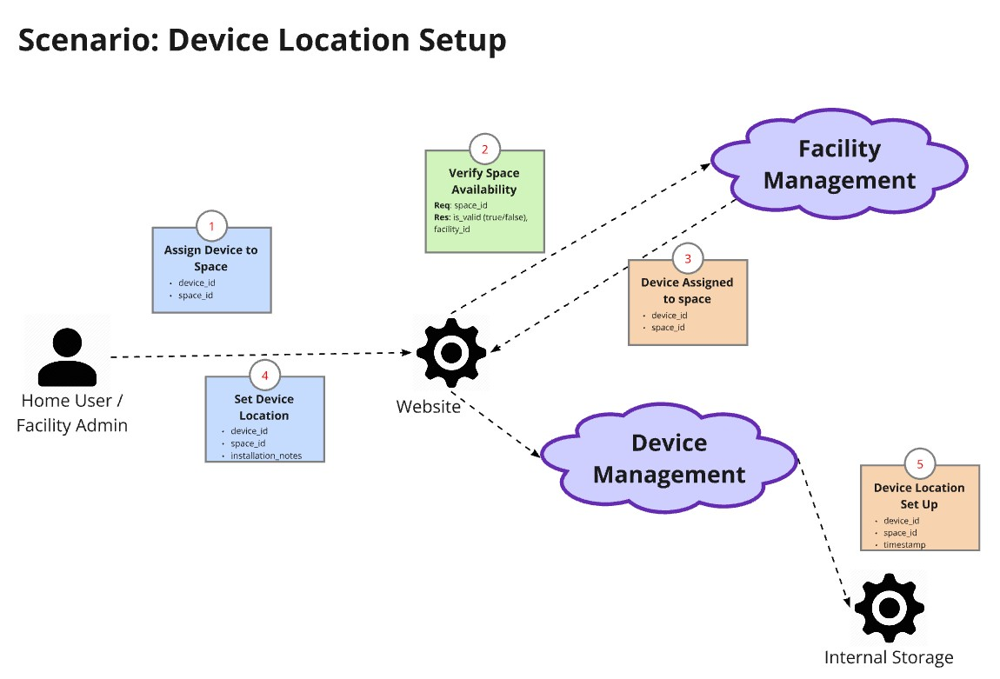

Esta vista detalla el proceso de Configuración de la Ubicación del Dispositivo, donde se asigna un equipo específico a un entorno previamente definido. El flujo inicia cuando el usuario solicita la asignación a través de la Website, la cual interactúa con el módulo de Facility Management para verificar la disponibilidad y validez del espacio seleccionado. Una vez confirmada la ubicación, el servicio de Device Management procesa los detalles de la instalación y notas adicionales, persistiendo el registro final con su respectiva marca de tiempo en el Internal Storage para asegurar la trazabilidad geográfica del hardware.

**Threshold Management**

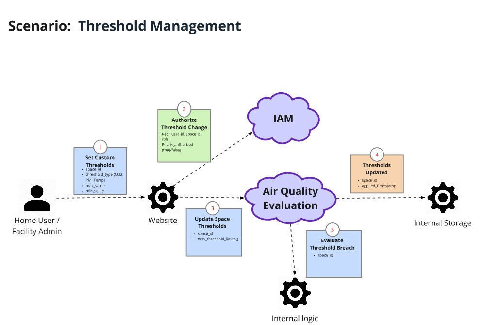

Esta vista describe el proceso de Gestión de Umbrales, donde se definen los límites de alerta para sensores de CO2, PM y temperatura. El flujo comienza cuando el usuario solicita un cambio de umbral a través de la Website, la cual coordina con el IAM para autorizar la operación según el rol y espacio asignado. Una vez validado, el servicio de Air Quality Evaluation actualiza los límites del espacio y evalúa posibles brechas en tiempo real mediante su lógica interna, persistiendo los nuevos umbrales y marcas de tiempo en el Internal Storage para el monitoreo continuo de la calidad del aire.

**Telemetry Ingestion**

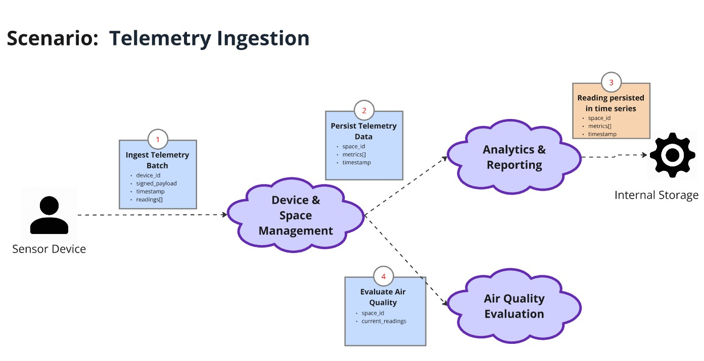

Esta vista describe el proceso de Ingesta de Telemetría, describiendo cómo el sistema procesa los datos enviados por los sensores en tiempo real. El flujo comienza cuando el Sensor Device envía un lote de lecturas al módulo de Device & Space Management, el cual actúa como receptor central para organizar y persistir los datos de las métricas. Posteriormente, esta información se distribuye hacia el componente de Analytics & Reporting para su almacenamiento histórico en series de tiempo dentro del Internal Storage, y simultáneamente hacia la Air Quality Evaluation, donde se evalúa la calidad del aire actual para activar respuestas inmediatas basadas en las lecturas recibidas.

**Telemetry Validation**

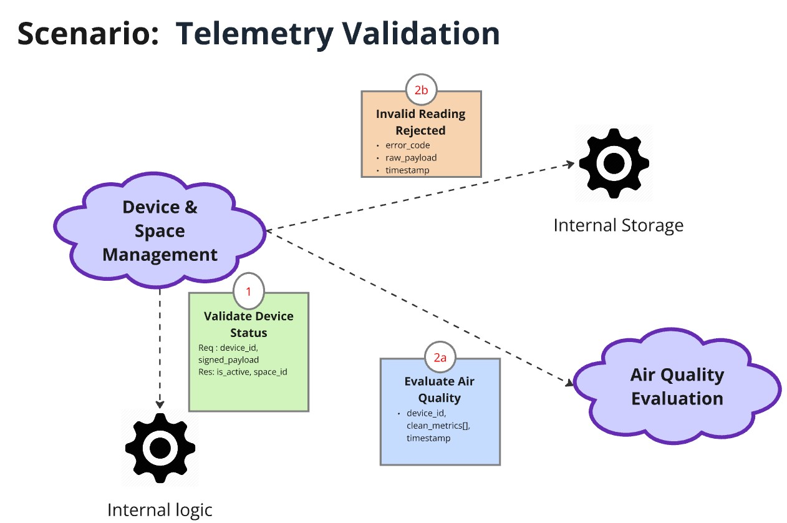

Esta vista describe el proceso de Validación de Telemetría, donde el sistema asegura la integridad de los datos recibidos antes de su procesamiento. El flujo inicia en el módulo de Device & Space Management, que utiliza su lógica interna para validar el estado del dispositivo y la firma del payload. Si la lectura es válida, los datos limpios se envían a la Air Quality Evaluation para su análisis; de lo contrario, la lectura es rechazada y se registra el error en el Internal Storage para auditoría, garantizando que solo información confiable afecte las evaluaciones de calidad del aire.

**Offline Reading Synchronization**

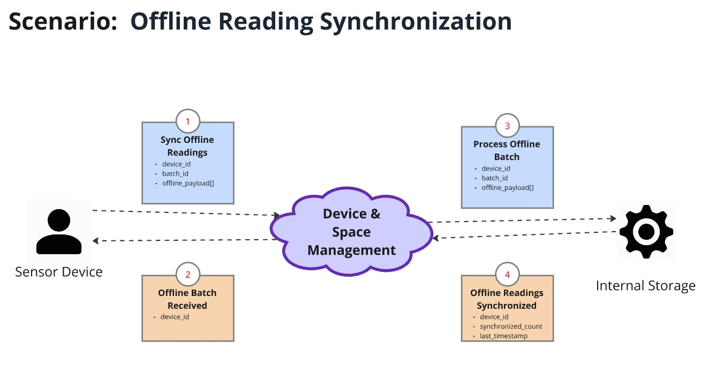

Esta vista describe el proceso de Sincronización de Lecturas Offline, ilustrando cómo el sistema recupera la continuidad de los datos tras un periodo de desconexión del hardware. El flujo inicia cuando el Sensor Device recupera la conectividad y envía un lote de lecturas almacenadas localmente al módulo de Device & Space Management, el cual confirma la recepción del paquete de datos. Finalmente, el sistema procesa el lote para integrar la telemetría histórica en el Internal Storage, garantizando que el registro de métricas esté completo y sincronizado con la marca de tiempo correspondiente para evitar vacíos en el análisis de la calidad del aire.

**Alerting & Response to Air Quality Evaluation**

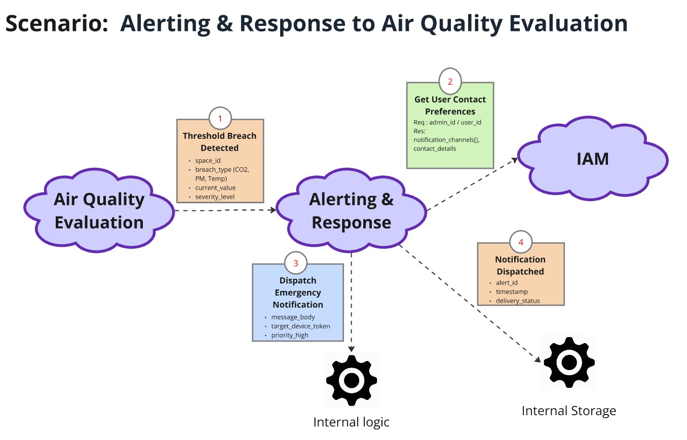

Esta vista ilustra el flujo de Alertas y Respuesta ante la Evaluación de Calidad del Aire, describiendo la reacción del sistema ante la detección de niveles críticos de CO2, PM o temperatura. El proceso se activa cuando el módulo de Air Quality Evaluation detecta un incumplimiento de umbrales, notificando al componente de Alerting & Response, el cual consulta al IAM para obtener las preferencias de contacto y canales de notificación del usuario. Finalmente, se despacha una notificación de emergencia de alta prioridad y se registra el evento en el Internal Storage, permitiendo una respuesta inmediata tanto a través de la lógica interna del sistema como mediante alertas directas a los administradores responsables.

**Critical Alert Generation & Notification**

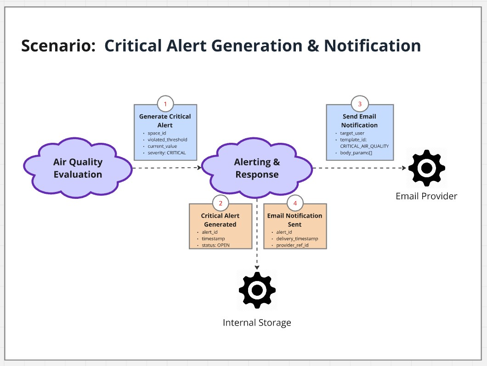

Esta vista describe el proceso de Generación y Notificación de Alertas Críticas, ilustrando la respuesta automatizada del sistema ante eventos de alta severidad en la calidad del aire. El flujo se activa cuando el módulo de Air Quality Evaluation detecta una violación de umbral crítica, lo que dispara en el componente de Alerting & Response la creación de una alerta con estado "abierto" y su respectiva persistencia en el Internal Storage. Simultáneamente, se coordina el envío de una notificación por correo electrónico a través de un Email Provider externo, registrando el ID de entrega y la marca de tiempo para asegurar que los usuarios responsables reciban información inmediata sobre el estado del espacio monitoreado.

**Alert Acknowledgement & Tracking**

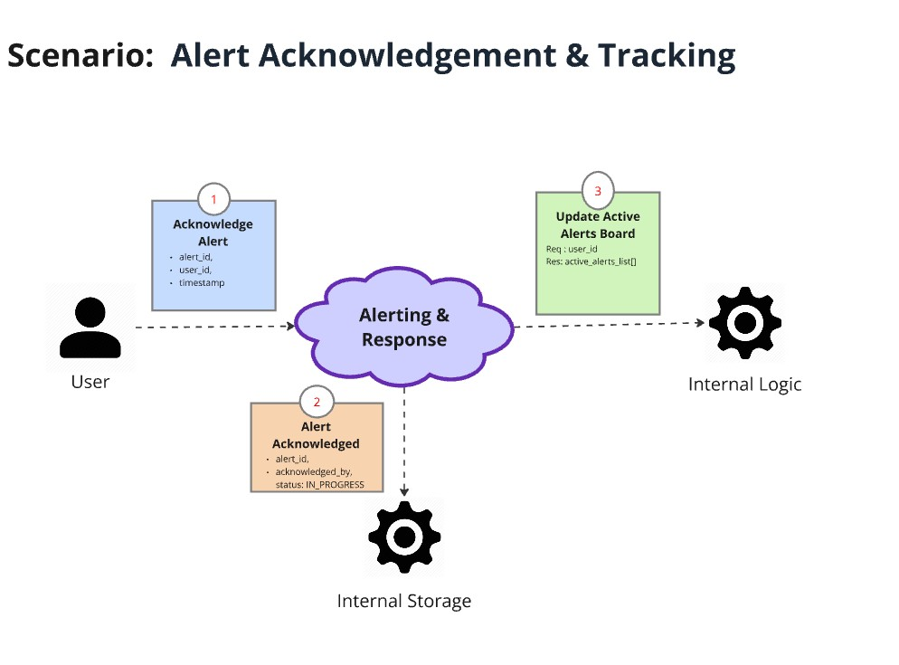

Esta vista ilustra el proceso de Reconocimiento y Seguimiento de Alertas, describiendo cómo el sistema gestiona la respuesta humana ante incidentes detectados. El flujo se activa cuando un usuario reconoce una alerta a través de la interfaz, lo que dispara en el componente de Alerting & Response el cambio de estado de la alerta a "en progreso", persistiendo esta actualización en el Internal Storage para asegurar la trazabilidad de la atención. Finalmente, el sistema interactúa con la lógica interna para actualizar el tablero de alertas activas del usuario, garantizando que el equipo responsable tenga una visibilidad en tiempo real de los eventos pendientes y aquellos que ya están siendo gestionados.

**Corrective Action & Resolution**

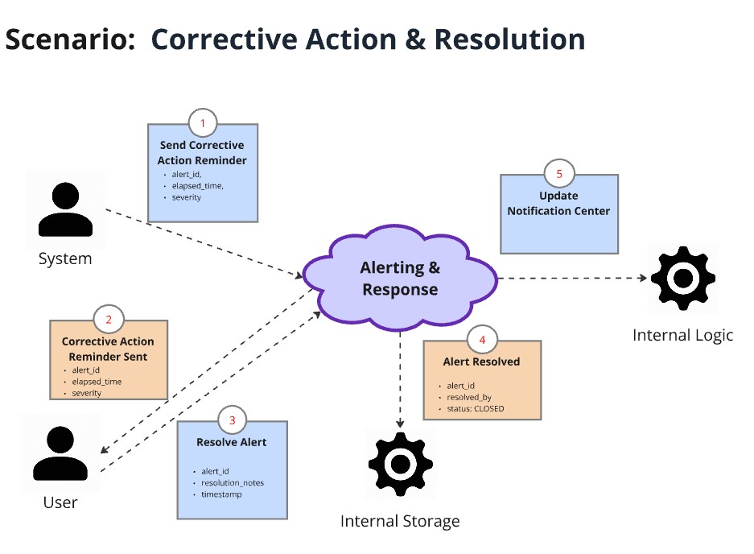

Esta vista ilustra el proceso de Acción Correctiva y Resolución, describiendo cómo el sistema y el usuario colaboran para cerrar incidentes de calidad del aire. El flujo comienza cuando el sistema envía un recordatorio de acción correctiva basado en el tiempo transcurrido, procesado por el módulo de Alerting & Response. Una vez que el usuario ejecuta y registra la resolución con sus respectivas notas, el sistema actualiza el estado de la alerta a "cerrado" en el Internal Storage y sincroniza el centro de notificaciones a través de la lógica interna, garantizando que el ciclo del incidente finalice de manera documentada y auditable.

**Automatic Corrective Action Execution**

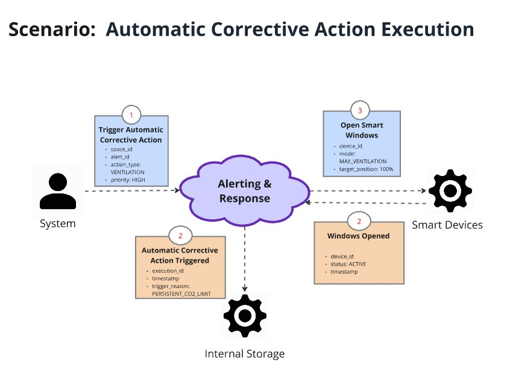

Esta vista detalla el proceso de Ejecución Automática de Acciones Correctivas, ilustrando cómo el sistema responde de forma autónoma ante brechas críticas en la calidad del aire. El flujo se activa cuando el sistema detecta un nivel de CO2 persistente, lo que dispara en el componente de Alerting & Response una orden de ventilación de alta prioridad enviada directamente a los Smart Devices para abrir las ventanas inteligentes. Finalmente, una vez ejecutada la acción, el sistema confirma la apertura de los dispositivos y persiste el registro de la ejecución en el Internal Storage, garantizando una mitigación inmediata del riesgo sin necesidad de intervención manual.

**Manual Corrective Action Selection**

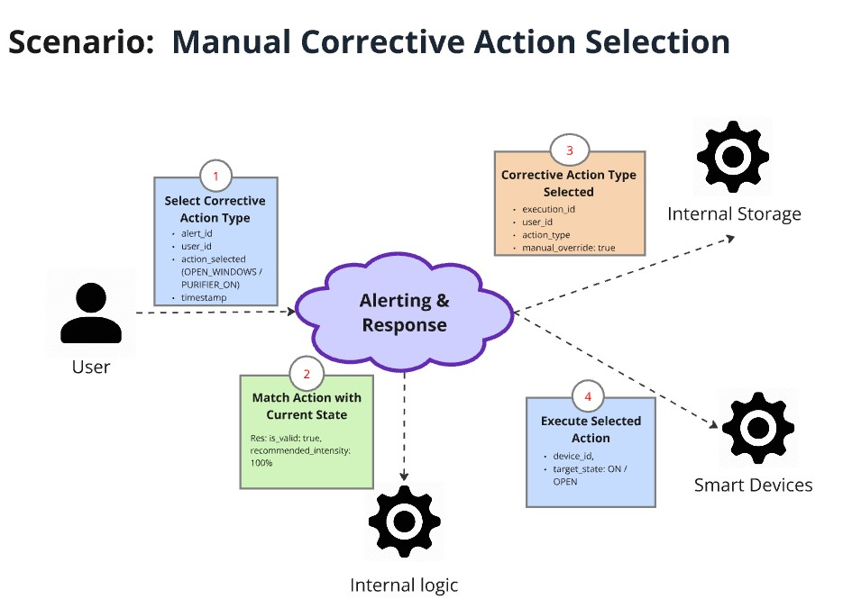

Esta vista detalla el proceso de Selección Manual de Acción Correctiva, ilustrando cómo el usuario puede intervenir directamente para mitigar problemas de calidad del aire. El flujo inicia cuando el User selecciona un tipo de acción específica a través del componente de Alerting & Response, el cual valida la coherencia de la solicitud con el estado actual del entorno mediante su lógica interna. Una vez confirmada la validez y registrado el comando con un indicador de anulación manual en el Internal Storage, el sistema procede a la ejecución inmediata sobre los Smart Devices, asegurando que la respuesta del sistema se adapte a las necesidades puntuales detectadas por el operador.

**Corrective Action Recording & Timeline**

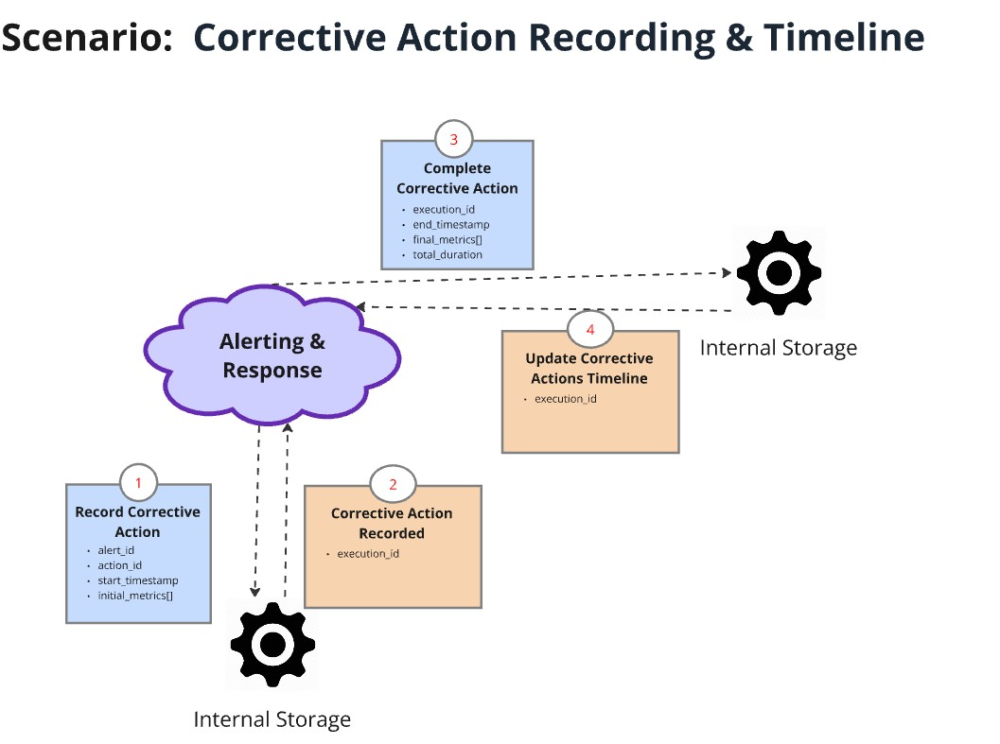

Esta vista ilustra el proceso de Registro y Cronología de Acciones Correctivas, detallando cómo el sistema documenta cada intervención para mantener un historial preciso de mitigación. El flujo comienza en el módulo de Alerting & Response, que inicia el registro de la acción capturando métricas iniciales y marcas de tiempo en el Internal Storage. Una vez finalizada la intervención, se procesan los datos del cierre, lo que permite al sistema actualizar la línea de tiempo de acciones correctivas dentro del almacenamiento interno, garantizando que cada evento sea auditable y contribuya al análisis de efectividad de las respuestas ante incidentes.

**Automated Data Aggregation & Digest Generation**

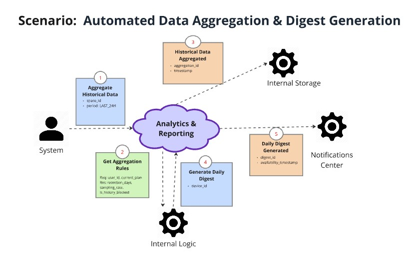

Esta vista describe el proceso de Agregación Automática de Datos y Generación de Resúmenes, ilustrando cómo el sistema transforma la telemetría histórica en información accionable para el usuario. El flujo se activa cuando el sistema solicita la agregación de datos de las últimas 24 horas al módulo de Analytics & Reporting, el cual consulta las reglas de agregación mediante la lógica interna para procesar la información almacenada en el Internal Storage. Finalmente, el sistema genera un resumen diario personalizado por dispositivo y notifica su disponibilidad a través del Notifications Center, asegurando que el usuario tenga acceso a un análisis consolidado de la calidad del aire sin necesidad de revisar lecturas individuales.

**Strategic Insight Identification**

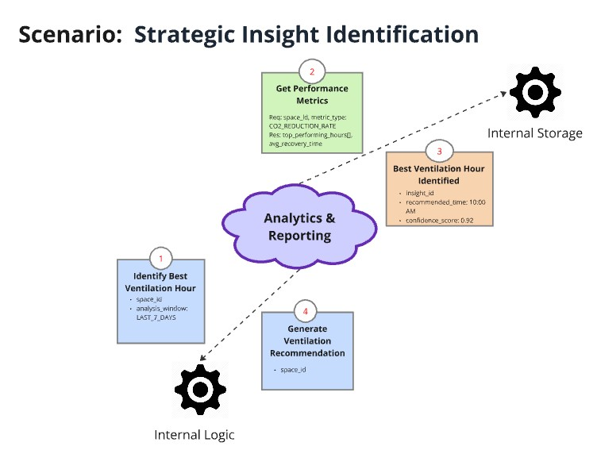

Esta vista describe el proceso de Identificación de Insights Estratégicos, ilustrando cómo el sistema utiliza el análisis de datos para optimizar el bienestar en los espacios monitoreados. El flujo comienza cuando el sistema solicita identificar la mejor hora de ventilación al módulo de Analytics & Reporting, el cual procesa métricas de rendimiento  almacenadas en el Internal Storage. Una vez identificada la hora óptima con un alto puntaje de confianza, el componente utiliza la lógica interna para generar una recomendación específica de ventilación para el espacio, permitiendo una gestión proactiva y eficiente de la calidad del aire basada en patrones históricos de los últimos 7 días.

**On-Demand Historical Reporting & Access Control**

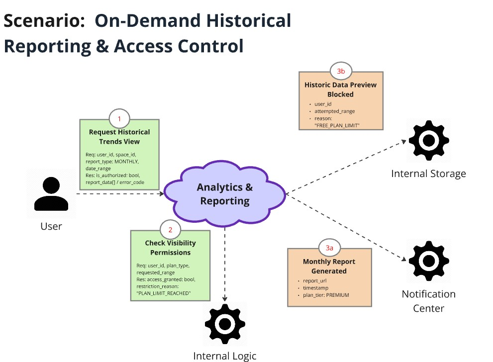

Esta vista describe el proceso de Reportes Históricos bajo Demanda y Control de Acceso, detallando cómo el sistema restringe o permite la visualización de tendencias según el plan del usuario. El flujo inicia cuando el usuario solicita una vista de tendencias mensuales al módulo de Analytics & Reporting, el cual coordina con la Internal Logic para verificar los permisos de visibilidad y límites del plan actual. Si el acceso es autorizado, se genera el reporte y se notifica al usuario a través del Notifications Center; de lo contrario, la previsualización se bloquea indicando que se ha alcanzado el límite del plan gratuito, garantizando así la integridad del modelo de suscripción mientras se recuperan los datos del Internal Storage.

El tablero completo del  Domain Message Flows Modeling. puede visualizarse en el siguiente enlace: https://bit.ly/3QwYkAS

#### 4.1.1.3 Bounded Context Canvases.

A continuación se presentan los Context Canvases de los contextos de Clair, donde se describen sus responsabilidades, relaciones, eventos clave, reglas de negocio, etc.

**IAM (Identity \& Access Management)**

El **Bounded Context Canvas** del módulo **Air Quality Monitoring** define el núcleo operativo de Clair, estableciendo los límites de responsabilidad para el procesamiento de datos ambientales.

- **Propósito:** Monitorear y evaluar la calidad del aire en tiempo real para generar alertas y ejecutar respuestas automáticas.
- **Capacidades:** Incluye la ingesta de telemetría, el monitoreo del estado de los sensores y la evaluación de niveles de contaminantes basados en umbrales de seguridad.
- **Interacciones (Inbound/Outbound):** Recibe datos de los dispositivos y configuraciones del contexto de *Space Management*, mientras envía eventos críticos al contexto de *Alerting & Response* para la mitigación de riesgos.
- **Eventos de Dominio:** Los eventos clave incluyen `Air Quality Measured`, `Safety Threshold Exceeded` y `Sensor Connection Lost`, los cuales disparan la lógica de automatización del sistema.

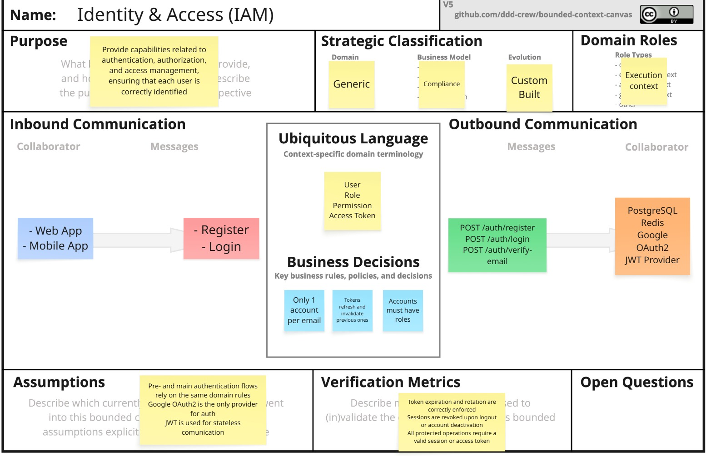

**Billing**

Este canvas gestiona el flujo financiero y el modelo de monetización de la plataforma, asegurando la sostenibilidad del servicio.

- **Propósito:** Administrar el ciclo de vida de los pagos, planes de suscripción y la facturación de los servicios premium de Clair.
- **Capacidades:** Procesamiento de pagos (Checkout), gestión de niveles de suscripción (Freemium/Paid) y emisión de comprobantes fiscales electrónicos.
- **Interacciones clave:** Informa al contexto de *Identity & Access Management* sobre el estado de pago del usuario para habilitar o restringir el acceso a funcionalidades avanzadas.
- **Eventos de Dominio:** Los hitos críticos incluyen `Payment Processed`, `Subscription Tier Upgraded` e `Invoice Issued`, los cuales garantizan la transparencia financiera y la continuidad del servicio para los clientes.

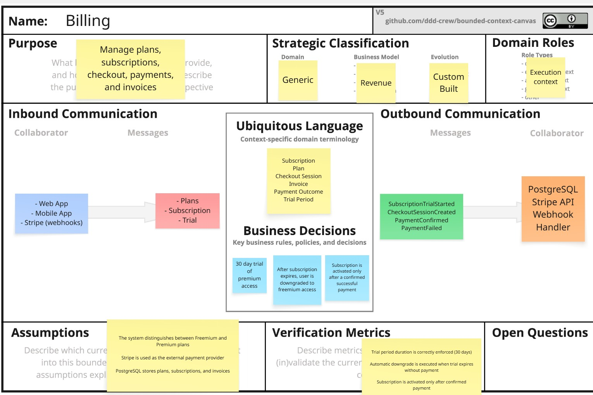

**Device \& Space Management**

Este canvas define la estructura organizativa de la solución, encargándose de la gestión del hardware y la jerarquización de los entornos físicos monitoreados.

- **Propósito:** Administrar el inventario de dispositivos y la configuración de los espacios (establecimientos y zonas) para contextualizar los datos ambientales.
- **Capacidades:** Incluye el registro de dispositivos (**Device Onboarding**), la gestión de estados del sensor y la creación de una jerarquía de espacios que permite asignar sensores a áreas específicas (ej. "Área de Cocina" o "Sala de Espera").
- **Interacciones Clave:** Actúa como proveedor de estructura para el contexto de *Air Quality Monitoring* y recibe directrices de permisos desde el contexto de *Identity & Access Management*.
- **Eventos de Dominio:** Los hitos fundamentales son `Device Registered`, `Space Configured` y `Device Status Updated`, los cuales aseguran que cada lectura de aire esté correctamente vinculada a un punto geográfico y a un responsable administrativo.

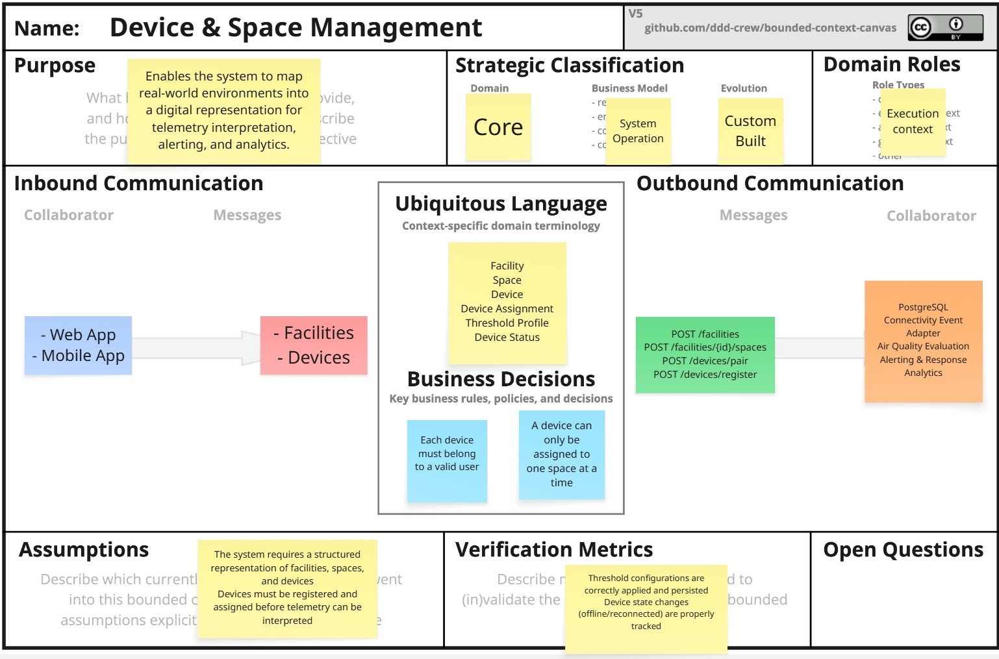

**Air Quality Evaluation**

Este canvas representa el motor de inteligencia del sistema, encargado de procesar la telemetría bruta para determinar el estado de salubridad del entorno.

- **Propósito:** Analizar y validar los datos provenientes de los sensores para identificar desviaciones en la calidad del aire respecto a los estándares de salud.
- **Capacidades:** Incluye la ingesta de telemetría, la validación de la integridad de los datos y el motor de evaluación que compara las lecturas con los umbrales de $CO_2$ y material particulado (PM2.5).
- **Interacciones Clave:** Recibe el flujo de datos constante de los dispositivos y, al detectar niveles críticos, notifica al contexto de *Alerting & Response* para iniciar acciones de mitigación.
- **Eventos de Dominio:** Los hitos clave son `Telemetry Validated`, `Air Quality Evaluated` y `Health Threshold Breached`, los cuales activan la lógica reactiva y preventiva de la plataforma.

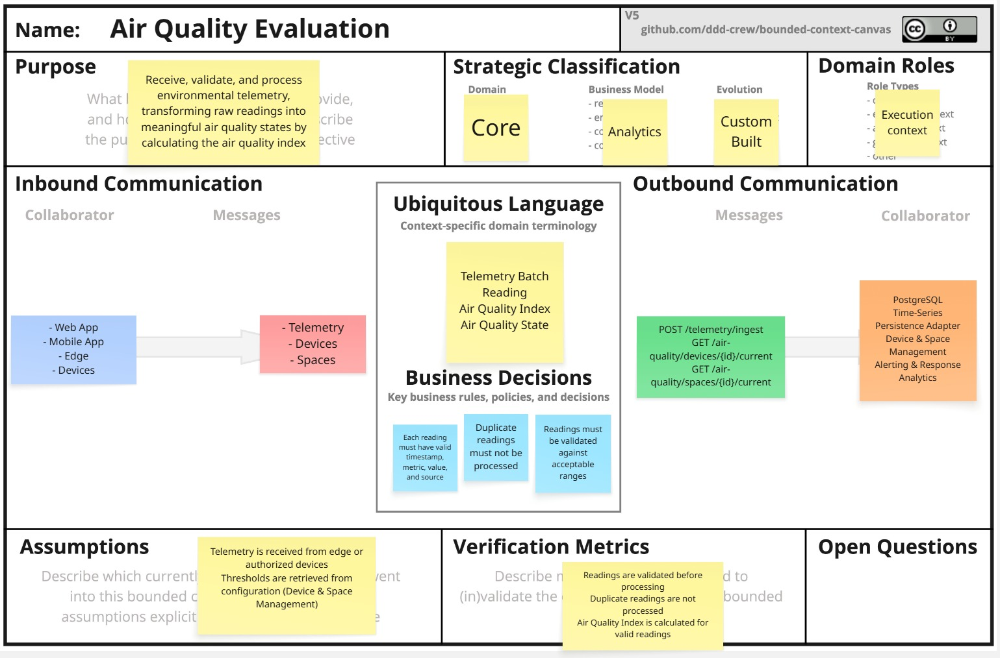

**Alerting \& Response**

Este canvas define la capacidad reactiva y de mitigación del sistema, transformando los eventos de riesgo en acciones correctivas inmediatas.

- **Propósito:** Orquestar la comunicación de alertas críticas y ejecutar de forma autónoma las acciones necesarias para restaurar la calidad del aire.
- **Capacidades:** Gestión de notificaciones automáticas (push/email) y control de actuadores inteligentes, permitiendo la activación de sistemas de ventilación o purificación sin intervención manual.
- **Interacciones Clave:** Depende de los eventos de "umbral excedido" provenientes de *Air Quality Evaluation* y consulta los canales de comunicación preferidos del usuario en el contexto de *Identity & Access Management*.
- **Eventos de Dominio:** Los hitos fundamentales incluyen `Alert Triggered`, `Corrective Action Initiated` y `Notification Delivered`, garantizando una respuesta inmediata ante cualquier anomalía ambiental detectada.

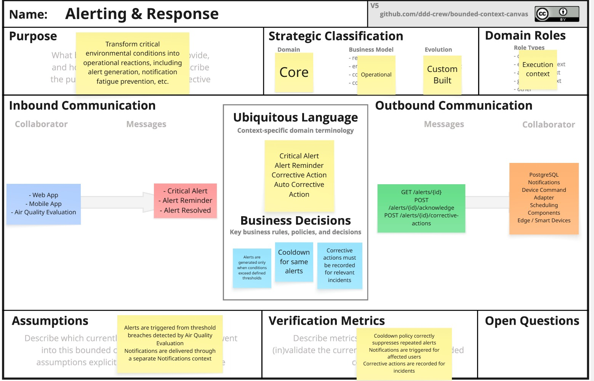

**Analytics \& Reporting**

Este canvas se enfoca en la síntesis y transformación de datos históricos para facilitar la toma de decisiones basada en evidencia.

- **Propósito:** Proporcionar una visión retrospectiva y estratégica de la calidad del aire mediante el análisis de tendencias y la generación de informes detallados.
- **Capacidades:** Incluye la visualización de datos históricos, la generación de reportes semanales de salud y la creación de resúmenes analíticos que permiten identificar patrones de contaminación recurrentes.
- **Interacciones Clave:** Consume la telemetría validada del contexto de *Air Quality Evaluation* y utiliza la estructura de zonas definida en *Device & Space Management* para organizar la información.
- **Eventos de Dominio:** Los hitos principales incluyen `Historical Data Summarized`, `Weekly Insight Generated` y `Report Exported`, permitiendo a los usuarios evaluar la efectividad de sus medidas de ventilación a lo largo del tiempo.

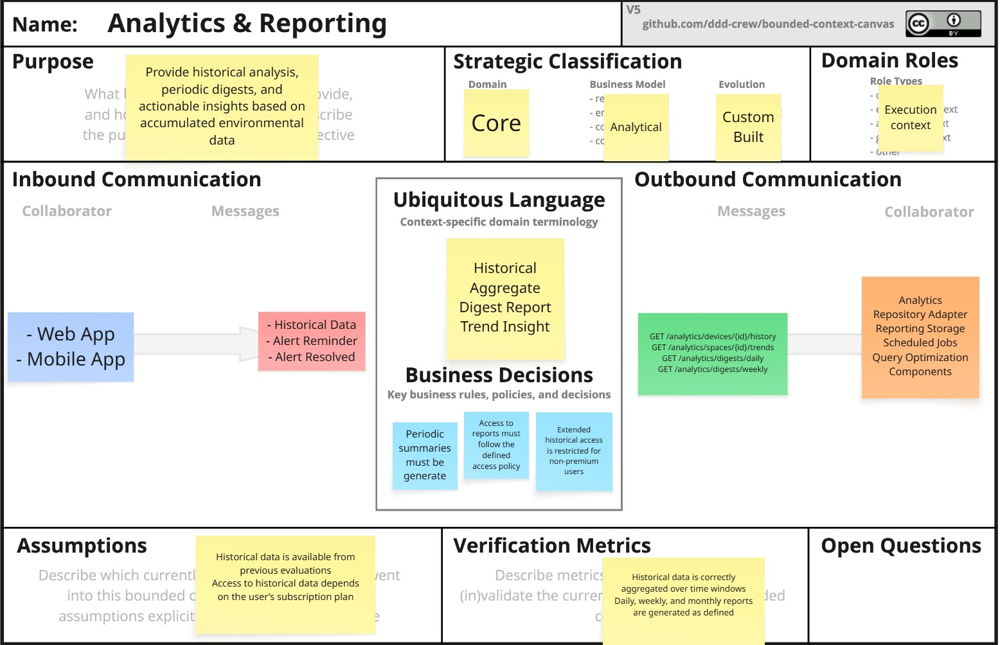

**Notifications**

Este canvas define la capacidad reactiva del sistema, encargándose de transformar los eventos críticos en acciones de mitigación tangibles.

- **Propósito:** Gestionar la comunicación de alertas a los usuarios y coordinar la respuesta automática de los actuadores ante riesgos ambientales.
- **Capacidades:** Orquestación de notificaciones (push/email) y ejecución de comandos hacia hardware inteligente (extractores, purificadores y ventanas).
- **Interacciones clave:** Depende de los eventos de "umbral excedido" provenientes de *Air Quality Monitoring* y consulta las preferencias de contacto del contexto de *Identity & Access Management*.
- **Eventos de Dominio:** Los hitos principales son `Notification Sent`, `Corrective Action Executed` y `Action Outcome Logged`, asegurando la trazabilidad de cada intervención del sistema.

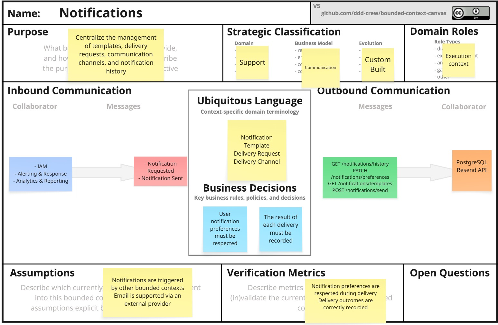

**Embedded App**

Este canvas define la lógica del software que reside directamente en el hardware, actuando como el puente físico entre el entorno y la nube de Clair.

- **Propósito:** Gestionar la operación local del sensor, garantizando la captura precisa de datos y la comunicación estable con el ecosistema digital.
- **Capacidades:** Controla la lectura de los sensores de $CO_2$ y PM2.5, la gestión de la conectividad Wi-Fi, el almacenamiento local (*Offline Logging*) durante fallos de red y la señalización visual mediante indicadores LED.
- **Interacciones Clave:** Envía el flujo de telemetría bruta al contexto de *Air Quality Evaluation* y recibe señales de configuración o comandos de actualización desde la plataforma central.
- **Eventos de Dominio:** Los hitos críticos incluyen `Physical Reading Captured`, `Connectivity Status Changed` y `Local Buffer Synced`, los cuales aseguran que ninguna medición se pierda a pesar de las fluctuaciones en la infraestructura de red.

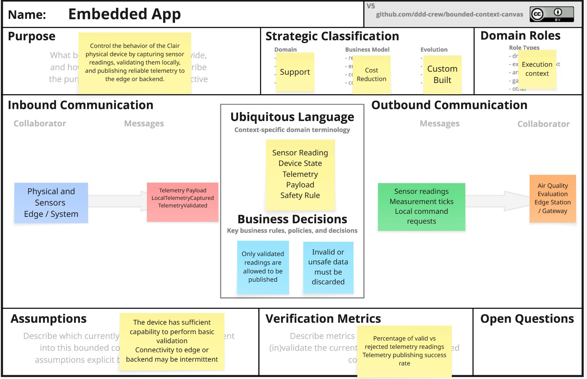

**Edge Station**

Este canvas describe el componente de infraestructura local que actúa como concentrador y gestor de datos en el sitio donde se encuentran los sensores.

- **Propósito:** Optimizar el flujo de información entre los dispositivos periféricos y la nube, garantizando la resiliencia operativa y el procesamiento ligero en el borde (*Edge Computing*).
- **Capacidades:** Gestión de la red local de sensores, orquestación de la transmisión de datos hacia la plataforma central y mantenimiento de la persistencia temporal de lecturas ante cortes de energía o internet.
- **Interacciones Clave:** Se comunica directamente con la **Embedded App** de los sensores para recolectar telemetría y sirve como enlace para el contexto de **Air Quality Evaluation** en la nube.
- **Eventos de Dominio:** Los hitos principales incluyen `Gateway Connection Established`, `Data Batch Forwarded` y `Node Status Heartbeat`, asegurando que la infraestructura física del establecimiento se mantenga estable y supervisada.

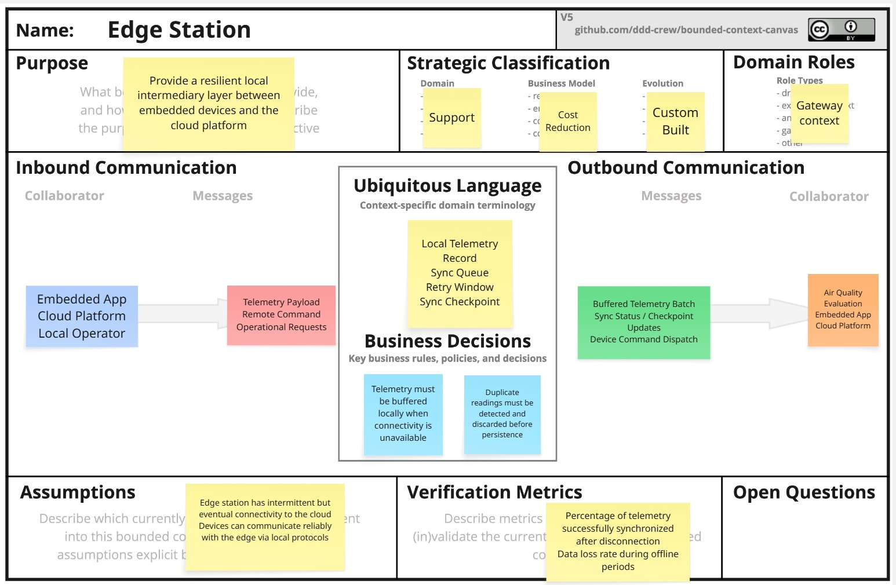

El tablero completo del Bounded Context Canvases. puede visualizarse en el siguiente enlace: https://bit.ly/3QwYkAS

### 4.1.2. Context Mapping.

Con el Context Mapping se presentan las relaciones entre los bounded contexts identificados de manera gráfica y estructurada.

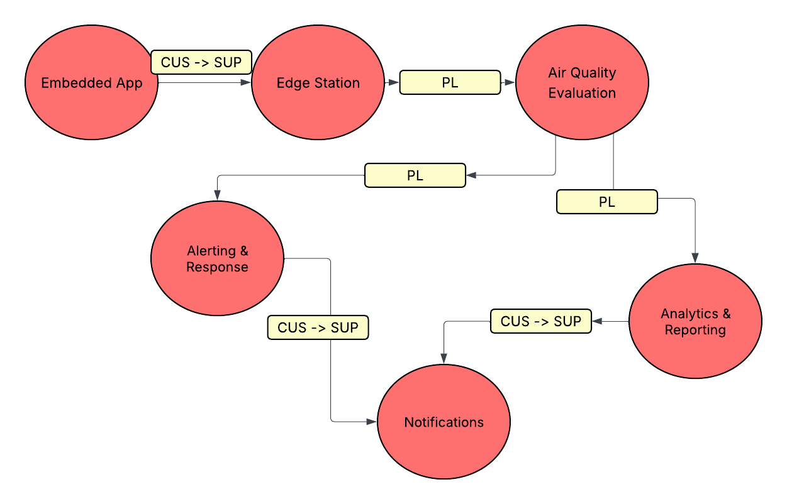

Las relaciones Published Language (PL) se utilizan entre Edge Station y Air Quality Evaluation, y desde este último hacia Alerting & Response y Analytics & Reporting, porque en estos puntos del sistema se intercambia información ya estructurada del dominio, 
como telemetría procesada, estados del aire o eventos de umbrales

Las relaciones Customer–Supplier (CUS → SUP) se presentan entre Embedded App y Edge Station, así como entre Alerting & Response y Notifications y Analytics & Reporting y Notifications, 
porque existe una dependencia directa donde un contexto necesita que otro ejecute una función específica.

### 4.1.3. Software Architecture.

#### 4.1.3.1. Software Architecture System Landscape Diagram.

El System Landscape Diagram presenta la vista más amplia de la solución Vanana, ubicando a Clair dentro de su ecosistema tecnológico y mostrando cómo se relaciona con actores externos, plataformas de soporte y componentes operativos del dominio. Esta perspectiva permite identificar claramente los límites del sistema, las integraciones críticas y el flujo de valor entre usuarios, servicios cloud, capa edge y dispositivos IoT.

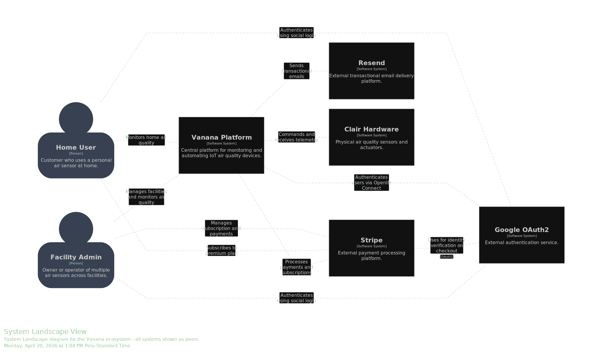

En esta vista se evidencia que Vanana opera como una arquitectura distribuida: la experiencia de usuario se articula en interfaces web y móviles, la lógica de negocio se concentra en servicios backend desacoplados por bounded contexts, y la operación en campo se sostiene mediante Embedded App y Edge Station. Además, el landscape deja explícita la dependencia de servicios externos como autenticación, pagos y notificaciones, lo cual facilita analizar riesgos de integración, puntos de escalabilidad y decisiones de evolución arquitectónica.

#### 4.1.3.2. Software Architecture Context Level Diagrams.

El diagrama de contexto presenta una vista de alto nivel del ecosistema de Clair dentro de la plataforma Vanana, identificando a los actores principales y a los sistemas externos que interactuan con la solucion. En esta representacion se observa como **Home User** y **Facility Admin** se relacionan con la plataforma para monitorear la calidad del aire, administrar dispositivos y consultar informacion operativa, mientras que servicios externos como **Google OAuth2**, **Stripe** y **Resend** complementan funciones de autenticacion, facturacion y comunicacion transaccional. Asimismo, el diagrama evidencia que Vanana actua como el nucleo de coordinacion entre usuarios, hardware fisico y proveedores externos, delimitando claramente la frontera del sistema y sus dependencias estrategicas.

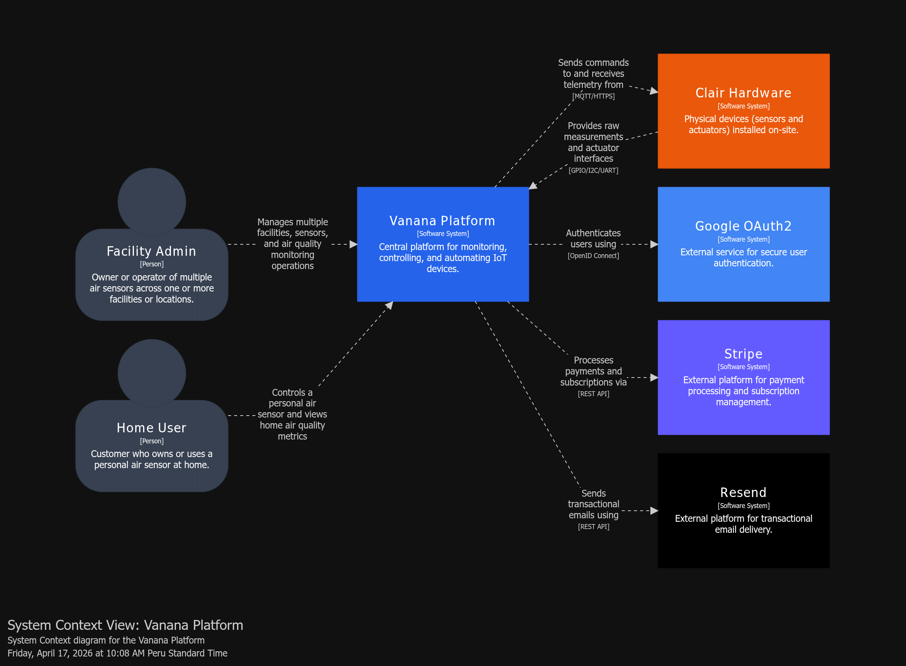

#### 4.1.3.2. Software Architecture Container Level Diagrams.

El diagrama de contenedores descompone la plataforma Vanana en sus principales unidades de ejecucion y responsabilidades tecnicas, permitiendo comprender como se distribuyen las funciones entre interfaces de usuario, servicios backend, almacenamiento de datos y componentes IoT. En esta vista se identifican la **Landing Page**, la **Web App**, la **Mobile App**, el **API Gateway**, la **Platform API**, las bases de datos **PostgreSQL** y **Redis**, asi como los componentes de borde conformados por la **Embedded Application** y la **Edge Station Application**. Esta representacion permite evidenciar la separacion entre experiencia de usuario, logica de negocio, persistencia y procesamiento distribuido, mostrando ademas las principales relaciones de comunicacion entre nube, edge y hardware.

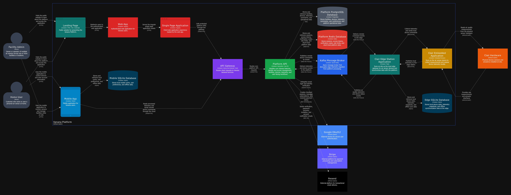

#### 4.1.3.3. Software Architecture Deployment Diagrams.

El diagrama de despliegue muestra la distribucion fisica y tecnologica de los principales contenedores del sistema en su entorno operativo. A traves de esta vista se observa como las aplicaciones frontend se alojan en servicios especializados de publicacion web, como la plataforma backend se apoya en servicios gestionados para API, persistencia y cache, y como la capa IoT se distribuye entre el dispositivo embebido y el edge station local. Esta perspectiva resulta especialmente importante porque evidencia que Clair no funciona como un sistema puramente centralizado, sino como una arquitectura distribuida donde cloud, edge y hardware cooperan para sostener monitoreo en tiempo real, resiliencia operativa y sincronizacion de datos.

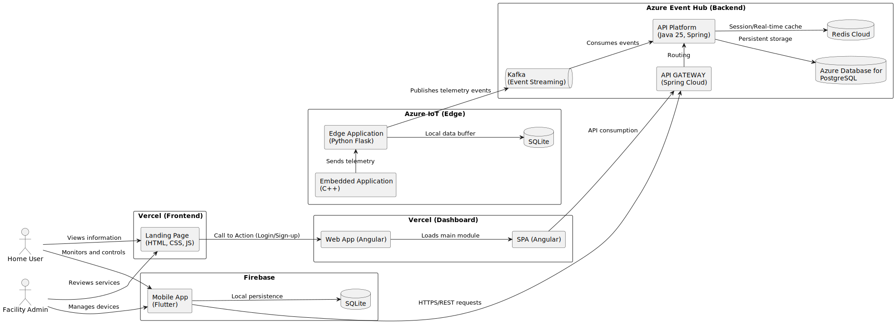

## 4.2. Tactical-Level Domain-Driven Design

### 4.2.3. Bounded Context: Identity & Access

El Bounded Context Identity \& Access concentra las capacidades relacionadas con autenticacion, autorizacion y administracion del acceso a la plataforma. Su objetivo es asegurar que cada usuario sea identificado correctamente, que sus sesiones sean gestionadas de manera segura y que los permisos asignados permitan controlar el acceso a funcionalidades de acuerdo con su rol dentro del sistema.

#### 4.2.3.1. Domain Layer

La capa de dominio del Bounded Context Identity \& Access concentra las reglas de negocio vinculadas a la identidad digital de los usuarios, la autenticacion, la autorizacion y el ciclo de vida de las sesiones. Su proposito es preservar la coherencia del modelo mediante conceptos del dominio que no dependan de decisiones tecnicas de almacenamiento, frameworks o mecanismos de integracion externos.

Dentro de Clair, este contexto resulta esencial porque define quien puede ingresar al sistema, bajo que condiciones puede hacerlo y a que capacidades puede acceder una vez autenticado. A partir de esta capa se distinguen los dos roles principales identificados en el dominio: **Home User** y **Facility Admin**, ambos con alcances funcionales distintos sobre facilities, spaces, devices, alerting y analytics.

| Elemento del dominio | Descripcion |
| --- | --- |
| User | Representa a la persona registrada en la plataforma y concentra su identidad, estado de cuenta, proveedor de autenticacion y roles asignados. |
| Role | Representa la categoria de acceso del usuario dentro del sistema, permitiendo distinguir responsabilidades y privilegios. |
| Permission | Define una capacidad autorizada dentro de la plataforma, utilizada para hacer cumplir reglas de acceso por alcance. |
| Session | Representa una sesion autenticada vigente, asociada a un usuario y a un periodo de validez. |
| Refresh Token | Representa la credencial de renovacion de sesion utilizada para emitir nuevos access tokens bajo una politica de rotacion. |
| Auth Provider | Representa el origen de autenticacion del usuario, ya sea local mediante credenciales o federado mediante Google OAuth2. |

El agregado principal de esta capa es **User**, ya que desde esta raiz se gobiernan decisiones como el estado de la cuenta, la vinculacion con un proveedor de autenticacion, la asignacion de roles y la posibilidad de iniciar o revocar sesiones. De forma complementaria, el modelo contempla objetos de valor como `Email`, `PasswordHash`, `UserId`, `RoleName` y `AccessToken`, los cuales encapsulan formato, validez y consistencia semantica sin exponer logica accidental al resto del sistema.

Las reglas de negocio mas relevantes de este contexto son las siguientes:

| Regla de negocio | Descripcion |
| --- | --- |
| Unicidad de identidad | No puede existir mas de una cuenta activa asociada al mismo correo electronico. |
| Verificacion previa | Las cuentas registradas por email y password deben verificar su correo antes de acceder a funcionalidades protegidas. |
| Roles obligatorios | Todo usuario autenticado debe poseer al menos un rol valido dentro del sistema. |
| Sesion valida | Ninguna operacion protegida puede ejecutarse sin una sesion vigente o un token de acceso valido. |
| Rotacion de credenciales | Cada uso valido del refresh token invalida la credencial anterior y genera una nueva. |
| Revocacion inmediata | La desactivacion de la cuenta o el cierre de sesion deben invalidar las sesiones activas relacionadas. |

Estas reglas permiten sostener la integridad del modelo y alinean el bounded context con los requerimientos funcionales `FR-IAM-01`, `FR-IAM-02`, `FR-IAM-03` y `FR-IAM-04`, asi como con los requerimientos no funcionales de seguridad relacionados con expiracion, revocacion y control de acceso.

En terminos de comportamiento, el dominio produce eventos que reflejan transiciones significativas dentro del ciclo de identidad y acceso. Entre los principales se encuentran `UserRegistered`, `UserEmailVerified`, `UserLoggedIn`, `SessionStarted`, `SessionRefreshed`, `SessionRevoked`, `AccountDeactivated` y `RoleAssigned`. Estos eventos no solo documentan cambios relevantes del estado interno, sino que tambien permiten propagar informacion hacia otros procesos del sistema, como auditoria, notificaciones de seguridad o trazabilidad operativa.

En conjunto, la capa de dominio de Identity \& Access define el lenguaje central con el que Clair modela la confianza digital de sus usuarios. Gracias a ello, la plataforma puede controlar de manera consistente quien ingresa, como se valida su identidad y bajo que permisos interactua con el resto de bounded contexts.

#### 4.2.3.2. Interface Layer

La capa de interfaz del Bounded Context Identity \& Access expone las capacidades del dominio hacia los consumidores externos del sistema, principalmente la Landing Page, la Web App y la Mobile App. Su responsabilidad consiste en recibir solicitudes, validarlas, transformarlas en comandos o consultas y delegar su ejecucion a la capa de aplicacion, manteniendo separada la logica de presentacion de las reglas de negocio.

En esta capa se ubican los controladores HTTP, los objetos de transferencia de datos, los mecanismos de validacion de entrada y los filtros de seguridad necesarios para proteger los recursos del sistema. Desde la perspectiva del usuario, esta es la puerta de entrada a los procesos de registro, autenticacion, verificacion de cuenta, renovacion de sesion y cierre de sesion.

| Endpoint u operacion | Tipo de acceso | Proposito |
| --- | --- | --- |
| `POST /auth/register` | Publico | Registrar un nuevo usuario mediante email y password. |
| `POST /auth/login` | Publico | Autenticar al usuario y emitir credenciales de acceso. |
| `POST /auth/verify-email` | Publico | Confirmar la identidad del usuario mediante un token o codigo de verificacion. |
| `POST /auth/refresh` | Publico controlado | Renovar la sesion usando un refresh token valido y no reutilizado. |
| `POST /auth/logout` | Protegido | Revocar la sesion actual o invalidar el refresh token asociado. |
| `POST /auth/oauth/google` | Publico | Iniciar o resolver el flujo de autenticacion federada con Google. |
| `GET /auth/me` | Protegido | Recuperar la informacion del usuario autenticado actual. |
| `PATCH /users/{id}/deactivate` | Protegido | Desactivar una cuenta y revocar sus sesiones activas, sujeto a permisos. |

Para estandarizar la comunicacion con los clientes, la capa utiliza DTOs como `RegisterRequest`, `LoginRequest`, `VerifyEmailRequest`, `RefreshTokenRequest`, `AuthResponse` y `UserProfileResponse`. Estos contratos reducen el acoplamiento entre clientes y dominio, y permiten mantener respuestas coherentes en todos los canales de acceso.

Las validaciones iniciales realizadas en esta capa se enfocan en asegurar integridad sintactica antes de ejecutar casos de uso. Entre ellas se incluyen la validacion del formato del correo electronico, la presencia de campos obligatorios, la verificacion de una longitud minima de password y la comprobacion de que los tokens enviados por el cliente tengan una estructura aceptable. Cuando una solicitud no cumple estas condiciones, la interfaz responde con codigos como `400 Bad Request`, `401 Unauthorized`, `403 Forbidden` o `409 Conflict`, segun corresponda.

Adicionalmente, esta capa incorpora mecanismos de seguridad transversal para distinguir endpoints publicos de endpoints protegidos. Los recursos sensibles requieren JWT valido en cada solicitud, mientras que los endpoints de autenticacion publica se complementan con controles de rate limiting y manejo uniforme de errores para prevenir abuso, enumeracion de cuentas y fuerza bruta sobre el login.

Por tanto, la Interface Layer del contexto IAM cumple un rol de mediacion: conecta a los distintos clientes del sistema con los procesos internos de identidad y acceso, manteniendo contratos claros, validaciones tempranas y una frontera consistente entre el exterior y la logica del negocio.

#### 4.2.3.3. Application Layer

La capa de aplicacion del Bounded Context Identity \& Access se encarga de orquestar los casos de uso que materializan los procesos de autenticacion y autorizacion definidos por el negocio. A diferencia de la capa de dominio, aqui no se concentran las reglas fundamentales, sino la coordinacion entre entidades, repositorios, politicas, servicios externos y eventos necesarios para ejecutar cada flujo de manera consistente.

Los principales casos de uso identificados para este contexto son los siguientes:

| Caso de uso | Descripcion |
| --- | --- |
| RegisterUser | Registra un usuario nuevo, valida unicidad de correo y activa el flujo de verificacion correspondiente. |
| VerifyEmail | Confirma la cuenta del usuario y habilita su acceso a recursos protegidos. |
| LoginUser | Valida credenciales o identidad federada, crea una sesion y emite tokens. |
| RefreshSession | Renueva la sesion autenticada mediante rotacion de refresh token. |
| LogoutUser | Revoca la sesion actual y evita el reuso de credenciales invalidadas. |
| DeactivateAccount | Cambia el estado de la cuenta y fuerza la revocacion de todas las sesiones activas. |
| AssignRoleToUser | Asigna o modifica el rol del usuario de acuerdo con permisos autorizados. |
| AuthenticateWithGoogle | Interpreta la respuesta del proveedor externo y la traduce al modelo interno del sistema. |

Cada uno de estos casos de uso puede implementarse mediante servicios de aplicacion especializados, tales como `RegistrationAppService`, `AuthenticationAppService`, `SessionAppService`, `AccessControlAppService` y `FederatedIdentityAppService`. Estos servicios reciben comandos provenientes de la capa de interfaz, consultan o persisten estado mediante repositorios abstractos y, finalmente, publican eventos relevantes del dominio.

Por ejemplo, en el flujo de registro el servicio de aplicacion recibe los datos del usuario, consulta si el email ya existe, solicita al dominio la creacion de la nueva identidad, persiste el resultado y genera el evento `UserRegistered`. En el flujo de login, el servicio valida las credenciales, comprueba el estado de la cuenta, crea la sesion, emite access token y refresh token, y registra los eventos `UserLoggedIn` y `SessionStarted`. De forma similar, el proceso `RefreshSession` verifica que el refresh token no haya expirado ni sido reutilizado, invalida el anterior y emite un nuevo conjunto de credenciales.

Esta capa tambien es responsable de aplicar decisiones operativas como manejo transaccional, idempotencia en operaciones sensibles, control de errores de negocio y trazabilidad entre comandos y resultados. Gracias a esta coordinacion, el contexto IAM puede mantener un flujo robusto de autenticacion sin desplazar responsabilidades hacia la interfaz ni contaminar el dominio con detalles de infraestructura.

En terminos arquitectonicos, la Application Layer actua como un puente entre las intenciones del usuario y el nucleo del negocio. Su valor radica en convertir acciones externas, como registrarse o iniciar sesion, en ejecuciones consistentes, auditables y alineadas con las politicas de seguridad de Clair.

#### 4.2.3.4. Infrastructure Layer

La capa de infraestructura del Bounded Context Identity \& Access implementa los mecanismos tecnicos que permiten materializar las necesidades del dominio y de la capa de aplicacion en el entorno real de ejecucion. Aqui se concretan la persistencia de datos, la gestion de sesiones, la emision y validacion de tokens, la integracion con Google OAuth2 y los servicios auxiliares requeridos por el proceso de autenticacion.

De acuerdo con la arquitectura definida para Clair, este contexto se apoya principalmente en **PostgreSQL** para la persistencia estructurada de usuarios, roles y permisos; en **Redis** para la gestion de sesiones, refresh tokens y datos efimeros de seguridad; y en **Google OAuth2** como proveedor externo de identidad federada. Ademas, emplea JWT como mecanismo de autenticacion stateless para solicitudes protegidas.

| Recurso de infraestructura | Responsabilidad |
| --- | --- |
| PostgreSQL | Persistir usuarios, roles, permisos y relaciones de autorizacion. |
| Redis | Almacenar sesiones activas, refresh tokens, codigos temporales y estados de revocacion. |
| Google OAuth2 | Validar identidades externas y permitir el inicio de sesion federado. |
| JWT Provider | Generar, firmar y validar access tokens y refresh tokens. |
| Password Encoder | Hashear y verificar contraseñas de forma segura. |

En esta capa se ubican los adaptadores concretos que implementan los puertos definidos por la aplicacion y el dominio. Entre ellos se encuentran repositorios de usuarios y roles para PostgreSQL, repositorios de sesiones o tokens para Redis, un adaptador de autenticacion federada para Google y un proveedor criptografico para la emision de JWT. Estos componentes permiten desacoplar las reglas del negocio de las decisiones tecnicas de persistencia o integracion.

Desde la perspectiva del almacenamiento, las estructuras minimas consideradas en este contexto incluyen tablas como `users`, `roles`, `permissions`, `user_roles` y `role_permissions`, asi como mecanismos temporales para `verification_tokens` y `refresh_tokens`. Esta organizacion soporta tanto la autenticacion local como la autorizacion basada en roles, manteniendo trazabilidad suficiente para auditoria y control de acceso.

La infraestructura tambien incorpora preocupaciones operativas clave para el cumplimiento de los requerimientos no funcionales del sistema. Entre ellas destacan el cifrado en transito bajo TLS 1.2 o superior, la expiracion acotada de access tokens, la rotacion obligatoria de refresh tokens, la revocacion temprana de sesiones, el rate limiting sobre endpoints de autenticacion y el registro de eventos sensibles como login exitoso, login fallido, logout y desactivacion de cuenta.

Por ello, la Infrastructure Layer no solo sostiene tecnicamente el funcionamiento del contexto IAM, sino que tambien traduce los objetivos de seguridad y confiabilidad de Clair en mecanismos verificables. Gracias a esta capa, los procesos de identidad y acceso pueden operar con persistencia consistente, integracion externa controlada y soporte para auditoria, observabilidad y escalabilidad.

#### 4.2.3.5. Bounded Context Software Architecture Component Level Diagrams

En esta seccion se presenta el Component Diagram del Bounded Context Identity \& Access. Aunque la Platform API se despliega como un unico container backend, internamente este bounded context se organiza en componentes con responsabilidades bien definidas, siguiendo una separacion por capas que facilita mantenibilidad, trazabilidad y claridad del dominio.

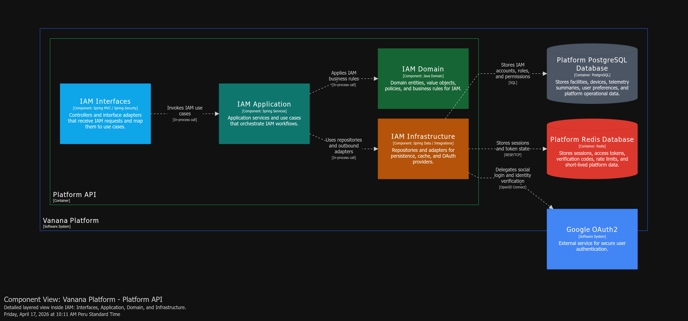

El diagrama muestra la descomposicion interna del bounded context IAM en los componentes **Interfaces**, **Application**, **Domain** e **Infrastructure**, asi como sus relaciones con los recursos externos necesarios para su operacion, como PostgreSQL, Redis y Google OAuth2. Esta vista permite identificar como las solicitudes ingresan por la capa de interfaz, son orquestadas por la capa de aplicacion, resueltas por las reglas del dominio y finalmente soportadas por adaptadores e integraciones de infraestructura.

#### 4.2.3.6. Bounded Context Software Architecture Code Level Diagrams

En esta seccion se presentan los diagramas de mayor detalle del Bounded Context Identity \& Access, enfocados en la representacion del modelo de clases del dominio y del esquema de persistencia asociado. Estas vistas permiten observar con mayor precision como se estructuran los conceptos principales del contexto y como se traducen a una base de datos que soporte autenticacion, autorizacion y gestion de sesiones.

##### 4.2.3.6.1. Bounded Context Domain Layer Class Diagrams

El siguiente diagrama de clases describe los principales objetos del dominio del contexto IAM, incluyendo usuarios, roles, permisos, sesiones y objetos de valor relacionados con identidad y credenciales.

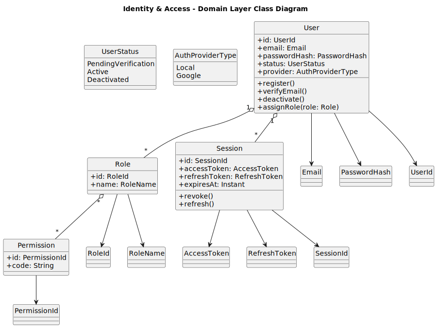

Esta vista permite comprender como el modelo de dominio organiza la identidad del usuario, la asignacion de privilegios y la administracion del ciclo de vida de las sesiones, manteniendo separadas las responsabilidades entre entidades y objetos de valor.

##### 4.2.3.6.2. Bounded Context Database Design Diagram

El siguiente diagrama presenta el diseño de base de datos que soporta el Bounded Context Identity \& Access, incluyendo las estructuras necesarias para usuarios, roles, permisos, sesiones y tokens de verificacion.

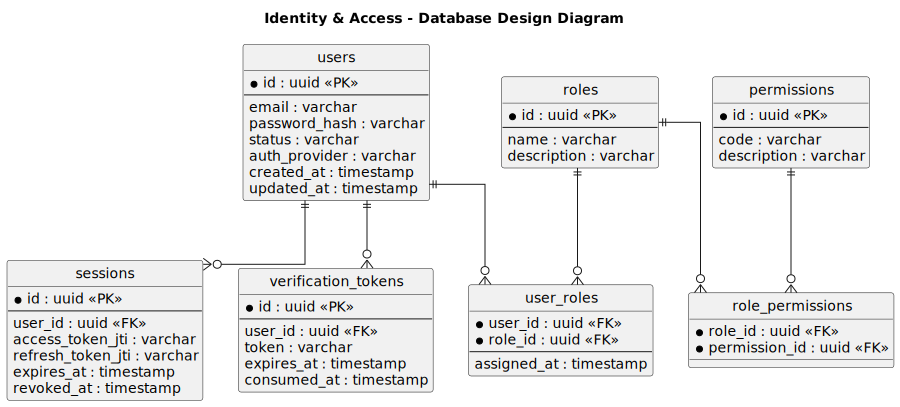

Este esquema refleja como las decisiones del dominio se materializan en una estructura persistente capaz de sostener autenticacion segura, control de acceso por roles y trazabilidad sobre el estado de las sesiones.

### 4.2.4. Bounded Context: Billing

El Bounded Context Billing agrupa la logica de negocio vinculada a planes, suscripciones, checkout, pagos e invoices. Su responsabilidad es gobernar el ciclo comercial de los usuarios dentro de Clair, permitiendo distinguir entre capacidades freemium y premium, asi como mantener trazabilidad sobre la activacion, cambio o desactivacion de beneficios asociados a la suscripcion.

#### 4.2.4.1. Domain Layer

La capa de dominio del Bounded Context Billing concentra las reglas de negocio relacionadas con planes, suscripciones, cobros, facturacion y control de beneficios asociados al modelo comercial de Clair. Su objetivo es representar de manera explicita como se gestiona el acceso a funcionalidades premium, como se inicia o termina una suscripcion y bajo que condiciones un usuario conserva, pierde o modifica sus beneficios dentro de la plataforma.

Este contexto tiene especial relevancia porque conecta la propuesta de valor del producto con su sostenibilidad operativa. A nivel del negocio, Clair distingue entre un **Freemium Plan**, orientado a monitoreo basico y acceso limitado al historial, y un **Premium Plan**, que habilita capacidades avanzadas como multiples dispositivos, reportes historicos completos y digests periodicos. En consecuencia, Billing no solo administra estados de pago, sino que tambien define las reglas que condicionan el acceso a funcionalidades segun la suscripcion vigente.

| Elemento del dominio | Descripcion |
| --- | --- |
| Subscription | Representa la relacion activa o inactiva entre un usuario y un plan comercial. |
| Plan | Define las caracteristicas, limites y beneficios asociados a una modalidad de servicio. |
| Checkout Session | Representa el proceso temporal de cobro iniciado antes de confirmar un pago. |
| Invoice | Representa la evidencia de una transaccion economica o ciclo de facturacion. |
| Payment Outcome | Representa el resultado del intento de cobro, ya sea exitoso o fallido. |
| Trial Period | Representa el periodo inicial de uso gratuito con acceso ampliado por tiempo limitado. |

El agregado central de este bounded context es **Subscription**, ya que desde esta raiz se gobiernan decisiones como el plan contratado, su estado actual, la fecha de inicio, la expiracion del trial, la renovacion, la cancelacion y el impacto funcional de estos cambios sobre el resto del sistema. Como apoyo semantico, el modelo puede incorporar objetos de valor como `PlanId`, `SubscriptionStatus`, `BillingPeriod`, `Money`, `InvoiceId` y `CheckoutSessionId`, todos enfocados en expresar conceptos del negocio con consistencia.

Las reglas de negocio principales de la capa de dominio son las siguientes:

| Regla de negocio | Descripcion |
| --- | --- |
| Trial inicial | Todo usuario nuevo elegible puede iniciar un periodo de prueba de 30 dias con acceso temporal a capacidades premium. |
| Downgrade automatico | Cuando el trial expira sin activacion de pago, la cuenta debe regresar automaticamente al plan Freemium. |
| Activacion por pago valido | Una suscripcion premium solo puede activarse cuando el resultado del cobro ha sido confirmado por el proveedor de pagos. |
| Persistencia del estado de facturacion | Todo cambio en la suscripcion debe quedar reflejado en un estado consistente y auditable. |
| Restriccion de beneficios | Las funcionalidades premium solo pueden ser consumidas mientras la suscripcion se encuentre activa. |
| Cancelacion controlada | La desactivacion de una suscripcion debe reflejarse en la perdida de beneficios avanzados sin comprometer el acceso basico del usuario. |

Estas reglas vinculan directamente este bounded context con los requerimientos funcionales `FR-BILL-01`, `FR-BILL-02`, `FR-BILL-03` y `FR-BILL-04`, ya que el dominio de Billing es el encargado de formalizar como se otorgan o restringen las capacidades comerciales del sistema.

En terminos de comportamiento, la capa de dominio produce eventos significativos tales como `SubscriptionTrialStarted`, `CheckoutSessionCreated`, `PaymentConfirmed`, `PaymentFailed`, `SubscriptionActivated`, `PlanChanged`, `SubscriptionDeactivated` e `InvoiceIssued`. Cada uno de estos eventos documenta una transicion relevante del estado comercial del usuario y permite mantener trazabilidad sobre decisiones economicas que afectan su experiencia dentro de Clair.

En conjunto, la Domain Layer de Billing define la logica central del modelo de monetizacion de Clair. Gracias a esta capa, la plataforma puede gobernar de forma consistente la relacion entre usuario, plan y beneficios, asegurando que la experiencia comercial responda a reglas claras, auditables y alineadas con la propuesta de negocio.

#### 4.2.4.2. Interface Layer

La capa de interfaz del Bounded Context Billing expone al exterior los procesos vinculados a suscripciones, checkout, consulta de planes, estado de facturacion y administracion del ciclo comercial del usuario. Su responsabilidad es recibir solicitudes provenientes de la Landing Page, la Web App y la Mobile App, validarlas y delegarlas a la capa de aplicacion mediante contratos claros y consistentes.

Desde la experiencia de usuario, esta capa representa el punto de contacto con las operaciones comerciales del sistema. A traves de ella, el usuario puede consultar diferencias entre planes, iniciar un trial, crear una sesion de pago, verificar el estado de su suscripcion y conocer si conserva acceso a funcionalidades premium.

| Endpoint u operacion | Tipo de acceso | Proposito |
| --- | --- | --- |
| `GET /billing/plans` | Publico | Consultar el catalogo de planes disponibles y sus beneficios. |
| `GET /billing/subscription` | Protegido | Recuperar el estado actual de la suscripcion del usuario autenticado. |
| `POST /billing/trial/start` | Protegido | Iniciar el periodo de prueba para un usuario elegible. |
| `POST /billing/checkout-session` | Protegido | Crear una sesion de cobro para contratar o cambiar un plan. |
| `POST /billing/webhooks/stripe` | Externo controlado | Recibir eventos de Stripe relacionados con pago, renovacion o cancelacion. |
| `PATCH /billing/subscription/cancel` | Protegido | Solicitar la cancelacion de la suscripcion activa. |
| `GET /billing/invoices` | Protegido | Consultar el historial de comprobantes o transacciones del usuario. |

La capa utiliza DTOs como `PlanResponse`, `SubscriptionStatusResponse`, `StartTrialRequest`, `CheckoutSessionRequest`, `CheckoutSessionResponse` y `InvoiceSummaryResponse`, con el fin de desacoplar la representacion externa del estado interno del dominio. Este enfoque permite exponer informacion comercial de forma comprensible y uniforme tanto para clientes web como mobile.

Las validaciones de entrada en esta capa verifican condiciones como autenticacion vigente, elegibilidad del usuario para iniciar trial, consistencia del plan solicitado, presencia de identificadores requeridos y autenticidad de los eventos webhook enviados por Stripe. De igual manera, la interfaz debe responder con codigos HTTP apropiados cuando una operacion no es valida, por ejemplo `400 Bad Request` para solicitudes mal formadas, `401 Unauthorized` para intentos sin autenticacion, `403 Forbidden` para acciones no permitidas y `409 Conflict` cuando una transicion comercial entra en conflicto con el estado actual de la suscripcion.

Ademas, esta capa diferencia claramente entre endpoints de consulta, operaciones comerciales iniciadas por el usuario y callbacks provenientes del proveedor externo. Los webhooks de Stripe constituyen una frontera especial, ya que deben ser autenticados y procesados de forma segura para impedir actualizaciones fraudulentas sobre el estado de facturacion.

En consecuencia, la Interface Layer del contexto Billing actua como un canal controlado entre los clientes del sistema y la logica comercial interna, asegurando contratos estables, validaciones tempranas y trazabilidad sobre las operaciones que modifican la suscripcion del usuario.

#### 4.2.4.3. Application Layer

La capa de aplicacion del Bounded Context Billing orquesta los casos de uso relacionados con el ciclo comercial del usuario, desde el inicio del trial hasta la activacion, renovacion, cambio o cancelacion de la suscripcion. Su proposito es coordinar entidades del dominio, repositorios, integraciones externas y publicacion de eventos, garantizando que cada transaccion comercial se ejecute de forma consistente.

Los casos de uso principales identificados para este contexto son los siguientes:

| Caso de uso | Descripcion |
| --- | --- |
| StartTrialSubscription | Inicia el periodo de prueba para usuarios elegibles y registra su vigencia. |
| CreateCheckoutSession | Crea una sesion de cobro con el proveedor externo para contratar o cambiar un plan. |
| ConfirmPaymentOutcome | Procesa el resultado del pago y actualiza el estado de la suscripcion. |
| ActivateSubscription | Marca la suscripcion como activa una vez confirmado el cobro. |
| ChangePlan | Gestiona la transicion entre planes respetando reglas comerciales vigentes. |
| CancelSubscription | Cancela la suscripcion y ajusta el acceso a beneficios premium. |
| ExpireTrialAndDowngrade | Detecta el fin del trial y ejecuta la degradacion automatica al plan Freemium. |
| GetSubscriptionStatus | Recupera el estado comercial actual del usuario para consumo por otros contextos o interfaces. |

Estos procesos pueden implementarse mediante servicios de aplicacion como `SubscriptionAppService`, `CheckoutAppService`, `PaymentWebhookAppService`, `InvoiceAppService` y `PlanManagementAppService`. Cada servicio recibe comandos o eventos externos, coordina validaciones de estado y persiste el resultado utilizando los puertos apropiados del contexto.

Por ejemplo, en el caso de uso `CreateCheckoutSession`, la aplicacion recibe el plan objetivo, verifica que el usuario tenga permiso para contratarlo, solicita a la infraestructura la creacion de la sesion en Stripe, registra la referencia correspondiente y devuelve al cliente la informacion necesaria para continuar con el pago. En `ConfirmPaymentOutcome`, la aplicacion interpreta el webhook recibido, valida su autenticidad, localiza la suscripcion asociada, actualiza su estado y emite eventos como `PaymentConfirmed` o `PaymentFailed`. Del mismo modo, `ExpireTrialAndDowngrade` puede ejecutarse como un proceso programado que revise trials vencidos y restablezca automaticamente los limites del plan Freemium.

La capa de aplicacion tambien cumple una funcion clave de coordinacion con otros bounded contexts. En particular, el resultado de Billing impacta sobre Analytics, Device \& Space Management y otras capacidades premium, ya que determina si el usuario puede acceder a historicos extendidos, multiples dispositivos o reportes avanzados. Por ello, esta capa debe exponer un estado comercial confiable y actualizado que pueda ser consultado por otros procesos del sistema.

En sintesis, la Application Layer de Billing transforma intenciones comerciales en ejecuciones concretas, controladas y trazables. Su papel es asegurar que cada decision vinculada a suscripciones y pagos quede respaldada por una secuencia consistente de validacion, persistencia, integracion externa y actualizacion del estado funcional del usuario.

#### 4.2.4.4. Infrastructure Layer

La capa de infraestructura del Bounded Context Billing implementa los componentes tecnicos necesarios para soportar la persistencia de planes y suscripciones, la integracion con Stripe, el registro de invoices y el procesamiento seguro de eventos externos asociados al cobro. Esta capa traduce las necesidades del dominio comercial en mecanismos concretos de almacenamiento, comunicacion e interoperabilidad.

Conforme al modelo arquitectonico definido para Clair, Billing se apoya principalmente en **PostgreSQL** para la persistencia de planes, suscripciones, invoices y estados de facturacion, asi como en **Stripe** como plataforma externa de procesamiento de pagos, checkout y notificacion de resultados. La infraestructura de este contexto tambien puede apoyarse en componentes compartidos del sistema para logging, auditoria, configuracion segura y manejo de credenciales.

| Recurso de infraestructura | Responsabilidad |
| --- | --- |
| PostgreSQL | Persistir planes, suscripciones, historiales de facturacion y relaciones con el usuario. |
| Stripe API | Crear checkout sessions, gestionar renovaciones y comunicar resultados de pago. |
| Webhook Handler | Recibir y validar eventos externos enviados por Stripe. |
| Billing Repository Adapter | Implementar el acceso persistente a suscripciones, planes e invoices. |
| Audit and Logging Components | Registrar cambios de estado comercial, errores de cobro y eventos relevantes para trazabilidad. |

Entre los adaptadores tecnicos de esta capa se encuentran repositorios para `Subscription`, `Plan` e `Invoice`, asi como un `StripePaymentAdapter` responsable de encapsular la creacion de checkout sessions, la verificacion de resultados de pago y el tratamiento de respuestas del proveedor externo. Este desacoplamiento permite que la logica del negocio se mantenga independiente del SDK o protocolo concreto utilizado por Stripe.

Desde la perspectiva del almacenamiento, las estructuras minimas de este contexto incluyen tablas como `plans`, `subscriptions`, `checkout_sessions`, `invoices` y posiblemente `billing_events`, con el objetivo de conservar trazabilidad suficiente sobre intentos de cobro, activaciones, cambios de plan, cancelaciones y degradaciones automaticas. Esta persistencia resulta especialmente importante para auditoria, soporte al usuario y consistencia frente a reintentos o eventos externos asincronos.

La capa de infraestructura tambien debe contemplar medidas operativas para garantizar la integridad del proceso de facturacion. Entre ellas destacan la validacion criptografica de webhooks, el manejo idempotente de eventos de pago, la proteccion segura de claves y secretos de Stripe, la observabilidad sobre fallos de integracion y la capacidad de reintentar operaciones no concluidas sin duplicar efectos comerciales sobre la suscripcion.

Por ello, la Infrastructure Layer de Billing constituye el soporte tecnico que vuelve operativo el modelo de monetizacion de Clair. Gracias a esta capa, la plataforma puede conectar su logica comercial con un proveedor de pagos real, persistir el estado economico del usuario y asegurar que cada cambio en la suscripcion sea confiable, verificable y coherente con la experiencia ofrecida por el producto.

#### 4.2.4.5. Bounded Context Software Architecture Component Level Diagrams

En esta seccion se presenta el Component Diagram del Bounded Context Billing. El objetivo de esta vista es evidenciar como las responsabilidades comerciales del sistema se distribuyen en componentes internos, manteniendo separadas las decisiones del dominio de las preocupaciones de integracion con el proveedor de pagos y la persistencia del estado de facturacion.

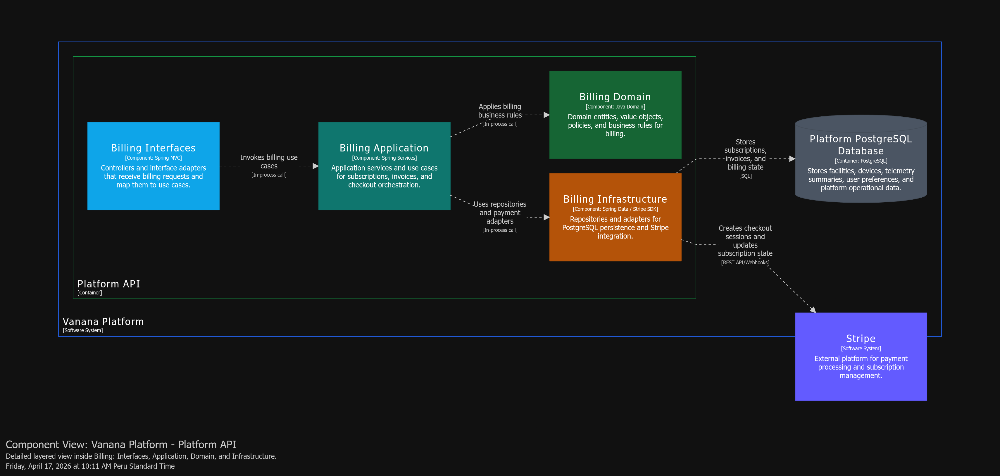

El diagrama representa la organizacion del bounded context Billing en componentes **Interfaces**, **Application**, **Domain** e **Infrastructure**, junto con sus dependencias hacia PostgreSQL y Stripe. A traves de esta descomposicion se observa como la capa de interfaz recibe solicitudes de planes y checkout, la capa de aplicacion coordina casos de uso comerciales, el dominio define las reglas de suscripcion y facturacion, y la infraestructura implementa la persistencia e integracion con el proveedor de pagos.

#### 4.2.4.6. Bounded Context Software Architecture Code Level Diagrams

En esta seccion se presentan los diagramas de nivel codigo del Bounded Context Billing. Estas vistas complementan el componente arquitectonico mostrando, por un lado, las clases principales del dominio comercial y, por otro, el diseño de persistencia requerido para planes, suscripciones, checkout sessions e invoices.

##### 4.2.4.6.1. Bounded Context Domain Layer Class Diagrams

El siguiente diagrama de clases representa los conceptos centrales del dominio de Billing, tales como plan, suscripcion, sesion de checkout e invoice.

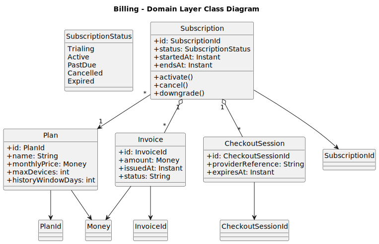

Esta representacion permite observar como se estructura el modelo comercial del sistema y como se relacionan los objetos que gobiernan el ciclo de vida de la suscripcion del usuario.

##### 4.2.4.6.2. Bounded Context Database Design Diagram

El siguiente diagrama presenta el diseño de base de datos del Bounded Context Billing, incluyendo las tablas necesarias para planes, suscripciones, eventos de facturacion, sesiones de checkout e invoices.

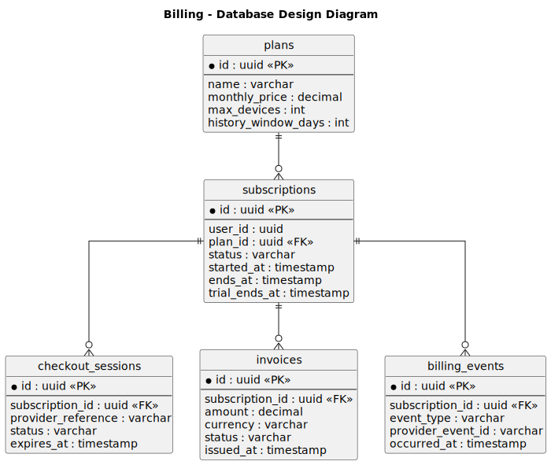

Gracias a esta vista se aprecia como la logica comercial del dominio se traduce a una estructura persistente trazable, capaz de registrar activaciones, cambios de plan, pagos y cancelaciones.

### 4.2.5. Bounded Context: Device & Space Management

El Bounded Context Device \& Space Management modela la estructura fisica sobre la cual opera Clair, representando facilities, spaces, dispositivos y configuraciones de thresholds. Este contexto permite traducir el entorno real del usuario al sistema digital, estableciendo la base organizacional necesaria para interpretar telemetria, generar alertas y construir analitica contextualizada.

#### 4.2.5.1. Domain Layer

La capa de dominio del Bounded Context Device \& Space Management modela la estructura fisica y operativa sobre la cual funciona Clair. Su responsabilidad es representar facilities, spaces, devices y las relaciones de pertenencia, ubicacion, asignacion y configuracion inicial que permiten traducir el entorno real del usuario al modelo digital de la plataforma.

Este contexto es fundamental porque proporciona el marco organizacional donde luego actuan Air Quality Evaluation, Alerting \& Response y Analytics. Sin una estructura consistente de establecimientos, espacios y dispositivos, el sistema no podria determinar donde se origina una lectura, a que usuario pertenece un sensor ni bajo que umbrales debe evaluarse su comportamiento.

| Elemento del dominio | Descripcion |
| --- | --- |
| Facility | Representa el establecimiento principal administrado por un usuario, ya sea un hogar, oficina o local comercial. |
| Space | Representa un ambiente o zona especifica dentro de una facility. |
| Device | Representa el sensor Clair registrado formalmente en la plataforma. |
| Device Assignment | Representa la vinculacion operativa entre un dispositivo y un espacio concreto. |
| Threshold Profile | Representa el conjunto de umbrales aplicables a un dispositivo o a una facility. |
| Device Status | Representa el estado operacional del sensor, por ejemplo online, offline o anomalous. |

El agregado principal de este bounded context puede centrarse en **Facility**, dado que desde esta raiz se organizan spaces, ownership y politicas generales de configuracion, mientras que **Device** constituye un agregado complementario orientado al control de identidad, registro y asignacion del sensor. Como objetos de valor, el modelo puede incluir `FacilityId`, `SpaceId`, `DeviceId`, `Location`, `Floor`, `AreaType` y `ThresholdValue`, con el fin de encapsular significado de negocio y evitar inconsistencias en la representacion.

Las reglas de negocio esenciales de esta capa incluyen la obligatoriedad de que cada device pertenezca a un usuario valido, que un dispositivo solo pueda estar asignado a un space a la vez, que la metadata de ubicacion sea consistente con la facility seleccionada y que los thresholds por defecto o personalizados puedan aplicarse sin romper la trazabilidad de configuracion. Asimismo, el dominio debe reconocer eventos como `FacilityCreated`, `SpaceCreated`, `DevicePaired`, `DeviceRegistered`, `DeviceAssignedToSpace`, `DeviceOffline`, `DeviceReconnected`, `DefaultThresholdsApplied` y `CustomThresholdsUpdated`.

En consecuencia, la Domain Layer de Device \& Space Management establece la representacion estructural del mundo fisico dentro de Clair. Gracias a esta capa, la plataforma puede saber que dispositivos existen, donde estan ubicados y bajo que configuracion deben operar antes de que la telemetria sea evaluada por los contextos analiticos y de respuesta.

#### 4.2.5.2. Interface Layer

La capa de interfaz del Bounded Context Device \& Space Management expone los procesos mediante los cuales los usuarios crean facilities, definen spaces, registran dispositivos, configuran metadata de ubicacion y ajustan thresholds. Su objetivo es recibir solicitudes desde la Web App y la Mobile App, validarlas y transferirlas a la capa de aplicacion mediante contratos estables y entendibles.

Desde la perspectiva del usuario, esta capa es la encargada de materializar la construccion del entorno monitoreado. Aqui se inicia el onboarding de dispositivos y se definen las condiciones iniciales que determinan como se interpretaran las lecturas de cada sensor.

| Endpoint u operacion | Tipo de acceso | Proposito |
| --- | --- | --- |
| `POST /facilities` | Protegido | Crear una nueva facility asociada al usuario autenticado. |
| `POST /facilities/{id}/spaces` | Protegido | Crear un nuevo space dentro de una facility existente. |
| `POST /devices/pair` | Protegido | Registrar el emparejamiento inicial del dispositivo con la cuenta del usuario. |
| `POST /devices/register` | Protegido | Dar de alta formalmente un sensor dentro del sistema. |
| `PATCH /devices/{id}/location` | Protegido | Configurar o actualizar la metadata de ubicacion del dispositivo. |
| `PATCH /devices/{id}/thresholds` | Protegido | Configurar umbrales personalizados para un dispositivo. |
| `PATCH /facilities/{id}/thresholds/default` | Protegido | Configurar umbrales por defecto para nuevos dispositivos de la facility. |
| `GET /devices/{id}` | Protegido | Consultar el estado, espacio asignado y configuracion del dispositivo. |

La interfaz utiliza DTOs como `CreateFacilityRequest`, `CreateSpaceRequest`, `RegisterDeviceRequest`, `AssignDeviceRequest`, `ThresholdSetupRequest` y `DeviceDetailsResponse`, los cuales desacoplan la comunicacion externa de la representacion interna del dominio. Esta separacion facilita ademas la evolucion de clientes web y mobile sin comprometer la consistencia del modelo.

Las validaciones principales de esta capa incluyen comprobar que el usuario autenticado sea propietario o administrador de la facility objetivo, que el dispositivo no este ya registrado por otro usuario, que los identificadores recibidos sean validos y que los thresholds configurados se encuentren dentro de rangos aceptables para el dominio. Gracias a estas verificaciones tempranas, se evita que solicitudes invalidas o inconsistentes alcancen la logica de negocio profunda.

En sintesis, la Interface Layer de Device \& Space Management actua como la frontera que transforma acciones de administracion fisica en operaciones digitales controladas. Su aporte principal es permitir que los usuarios definan la estructura del espacio monitoreado de manera segura, consistente y alineada con el modelo de dominio.

#### 4.2.5.3. Application Layer

La capa de aplicacion del Bounded Context Device \& Space Management coordina los casos de uso asociados al alta, configuracion y organizacion de facilities, spaces y devices. Su funcion es orquestar la ejecucion de comandos, consultar repositorios, aplicar politicas del dominio y garantizar que los cambios estructurales se reflejen de manera consistente en toda la plataforma.

| Caso de uso | Descripcion |
| --- | --- |
| CreateFacility | Registra una nueva facility y la vincula con su propietario o administrador. |
| CreateSpace | Crea un nuevo ambiente dentro de una facility existente. |
| PairDevice | Registra el primer acercamiento operativo entre el dispositivo fisico y la cuenta del usuario. |
| RegisterDevice | Formaliza el alta del sensor en el sistema con un identificador persistente. |
| AssignDeviceToSpace | Vincula un dispositivo registrado a un espacio especifico. |
| SetupDeviceLocation | Define metadata de ubicacion como piso, tipo de ambiente o nombre del room. |
| ApplyDefaultThresholds | Aplica configuracion base de thresholds a nuevos dispositivos. |
| UpdateCustomThresholds | Ajusta umbrales personalizados segun necesidades concretas del usuario. |

Estos casos de uso pueden implementarse a traves de servicios como `FacilityAppService`, `SpaceAppService`, `DeviceRegistrationAppService` y `ThresholdManagementAppService`. Cada uno coordina validaciones de ownership, consistencia de ubicacion, estado del dispositivo y compatibilidad de configuracion antes de persistir el resultado.

Por ejemplo, `RegisterDevice` debe verificar que el sensor no se encuentre previamente asociado a otra cuenta, generar el identificador persistente y dejar trazabilidad del evento de primera conexion. `AssignDeviceToSpace` necesita comprobar que el space pertenece a una facility administrada por el usuario y que el dispositivo se encuentra en estado apto para ser asignado. De manera similar, `UpdateCustomThresholds` debe validar que los nuevos limites no contradigan restricciones del dominio y que queden correctamente asociados al dispositivo o facility correspondiente.

La capa de aplicacion tambien es responsable de emitir eventos de dominio que luego seran consumidos por otros bounded contexts. En particular, los resultados de este contexto son necesarios para Air Quality Evaluation, ya que toda lectura debe asociarse a un device y a un espacio concreto antes de poder interpretarse. De este modo, Device \& Space Management no solo administra estructura, sino que habilita semanticamente al resto del sistema.

En conjunto, la Application Layer de este contexto convierte operaciones de administracion de activos y espacios en transacciones coherentes, persistentes y trazables. Su valor reside en garantizar que el mapa digital del entorno monitorizado permanezca alineado con la realidad operativa del usuario.

#### 4.2.5.4. Infrastructure Layer

La capa de infraestructura del Bounded Context Device \& Space Management implementa la persistencia y los adaptadores tecnicos requeridos para registrar facilities, spaces, devices y configuraciones de thresholds. En esta capa se concretan repositorios, mecanismos de almacenamiento y servicios auxiliares necesarios para sostener la estructura fisica modelada por el dominio.

Conforme al modelo arquitectonico de Clair, este contexto se apoya principalmente en **PostgreSQL** como base de datos operativa para facilities, spaces, dispositivos y estados de ownership. Asimismo, puede integrar adaptadores para eventos de conectividad provenientes del dispositivo o del edge, de forma que el estado operacional del sensor quede sincronizado con su representacion persistida en la plataforma.

| Recurso de infraestructura | Responsabilidad |
| --- | --- |
| PostgreSQL | Persistir facilities, spaces, devices, relaciones de asignacion y thresholds. |
| Device Repository Adapter | Implementar acceso a datos para registro y consulta de sensores. |
| Facility Repository Adapter | Implementar acceso a datos para facilities y ownership. |
| Threshold Persistence Adapter | Persistir configuraciones por defecto y personalizadas. |
| Connectivity Event Adapter | Procesar eventos como offline, reconnection o cambios de estado del dispositivo. |

Las estructuras minimas de almacenamiento pueden incluir tablas como `facilities`, `spaces`, `devices`, `device_assignments`, `device_status_history` y `threshold_profiles`. Esta organizacion permite conservar trazabilidad sobre altas, reasignaciones, configuraciones y cambios operativos del sensor a lo largo del tiempo.

La infraestructura de este contexto tambien debe contemplar mecanismos de auditoria, validacion de integridad referencial y observabilidad sobre fallos de registro o sincronizacion. Todo ello resulta especialmente importante porque un error en esta capa puede impactar directamente en la interpretacion posterior de la telemetria, afectando alertas, dashboards y reportes historicos.

Por ello, la Infrastructure Layer de Device \& Space Management convierte el modelo estructural del dominio en un soporte tecnico estable y trazable. Gracias a esta capa, Clair puede conservar de forma consistente la representacion digital de su red de sensores y espacios monitorizados.

#### 4.2.5.5. Bounded Context Software Architecture Component Level Diagrams

En esta seccion se presenta el Component Diagram del Bounded Context Device \& Space Management. Esta vista permite comprender como el sistema organiza internamente la gestion de facilities, spaces, dispositivos y thresholds, separando responsabilidades funcionales y tecnicas dentro del mismo container backend.

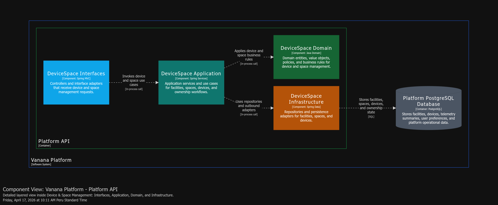

El diagrama muestra la descomposicion del bounded context en los componentes **Interfaces**, **Application**, **Domain** e **Infrastructure**, asi como su relacion con la base de datos principal de la plataforma. A partir de esta estructura se aprecia como las operaciones de registro de dispositivos, asignacion a espacios y configuracion de umbrales recorren una secuencia ordenada desde la recepcion de solicitudes hasta la persistencia de su estado operativo.

#### 4.2.5.6. Bounded Context Software Architecture Code Level Diagrams

En esta seccion se presentan los diagramas de detalle del Bounded Context Device \& Space Management, mostrando tanto la estructura de clases del dominio como el diseño de base de datos que soporta facilities, spaces, devices y thresholds.

##### 4.2.5.6.1. Bounded Context Domain Layer Class Diagrams

El siguiente diagrama de clases representa los objetos principales del dominio vinculados a establecimientos, espacios, dispositivos y perfiles de umbrales.

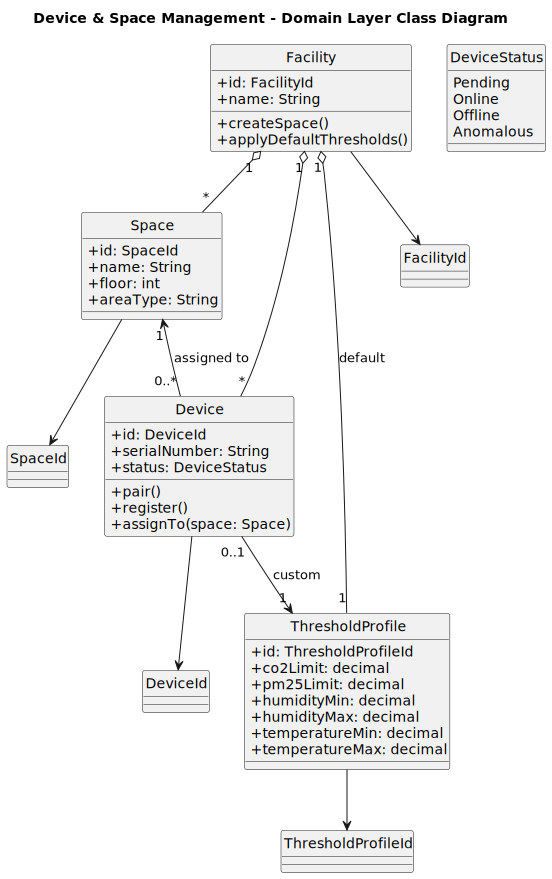

Esta vista permite identificar las relaciones estructurales entre facility, space y device, asi como la forma en que se modelan la asignacion operativa y la configuracion inicial del monitoreo.

##### 4.2.5.6.2. Bounded Context Database Design Diagram

El siguiente diagrama muestra el diseño de base de datos asociado al Bounded Context Device \& Space Management.

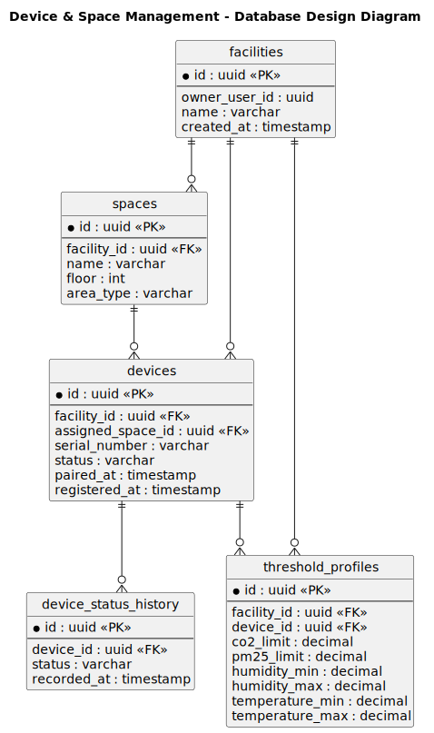

El esquema refleja como la estructura fisica del entorno monitoreado se representa en persistencia, manteniendo trazabilidad sobre establecimientos, espacios, dispositivos, thresholds y cambios de estado.

### 4.2.6. Bounded Context: Air Quality Evaluation

El Bounded Context Air Quality Evaluation concentra la logica encargada de recibir, validar y procesar la telemetria ambiental proveniente de los dispositivos Clair. Su finalidad es convertir lecturas crudas en estados significativos del aire interior, calculando el indice de calidad del aire, detectando superaciones de thresholds e identificando condiciones anomalias que requieran atencion o exclusion del proceso normal de evaluacion.

#### 4.2.6.1. Domain Layer

La capa de dominio del Bounded Context Air Quality Evaluation concentra las reglas de negocio relacionadas con la ingesta, validacion e interpretacion de la telemetria ambiental. Su objetivo es transformar lecturas crudas de CO2, PM2.5, humedad y temperatura en estados comprensibles del ambiente, tales como indice de calidad del aire, superacion de thresholds o deteccion de anomalias del sensor.

Este contexto constituye el nucleo analitico de Clair, ya que es el responsable de convertir datos en conocimiento accionable. A partir de sus decisiones se alimentan los dashboards de tiempo real, se disparan alertas criticas y se construyen insumos para analitica historica y recomendaciones correctivas.

| Elemento del dominio | Descripcion |
| --- | --- |
| Telemetry Batch | Representa un conjunto de lecturas recibidas desde el dispositivo o el edge. |
| Reading | Representa una medicion individual de una variable ambiental en un instante de tiempo. |
| Air Quality Index | Representa el valor compuesto que sintetiza el estado del aire interior. |
| Air Quality State | Representa la clasificacion semantica del ambiente segun el indice y thresholds vigentes. |
| Threshold Evaluation | Representa el resultado de contrastar una lectura con sus limites permitidos. |
| Sensor Anomaly | Representa una condicion atipica o inconsistente que invalida la confianza en una lectura. |

El dominio de este contexto debe asegurar que cada reading tenga identidad temporal, metrica, valor y procedencia validos antes de ser utilizada. Asimismo, debe mantener invariantes como la no duplicacion de lecturas, la exclusividad de una evaluacion por reading idempotente y la separacion entre datos validos y datos marcados como anomalos. Entre los eventos de dominio principales se encuentran `TelemetryBatchReceived`, `InvalidReadingRejected`, `ReadingPersistedInTimeSeries`, `AirQualityIndexCalculated`, `AirQualityStateChanged`, `CO2ThresholdSurpassed`, `PMThresholdSurpassed`, `HumidityDiscomfortDetected`, `ThermalDiscomfortDetected` y `SensorAnomalyDetected`.

Las reglas de negocio esenciales incluyen la validacion de rangos admisibles, el calculo del AQI con base en las metricas disponibles, la comparacion independiente de cada metrica contra sus thresholds y la deteccion de condiciones que deban ser excluidas del proceso normal de evaluacion. Este comportamiento se encuentra alineado con `FR-AQE-01`, `FR-AQE-02`, `FR-AQE-03` y `FR-AQE-04`, ya que define como Clair interpreta y expone la calidad del aire en tiempo real.

En consecuencia, la Domain Layer de Air Quality Evaluation convierte telemetria bruta en estado ambiental significativo. Gracias a esta capa, el sistema puede razonar sobre riesgo, confort y calidad del aire de manera consistente y accionable.

#### 4.2.6.2. Interface Layer

La capa de interfaz del Bounded Context Air Quality Evaluation expone los procesos mediante los cuales la plataforma recibe telemetria, consulta estados del aire y entrega resultados de evaluacion a consumidores internos o externos. Su responsabilidad es aceptar entradas de datos desde el edge o el gateway, validarlas en un nivel preliminar y permitir la consulta de resultados hacia la Web App, la Mobile App y otros bounded contexts.

| Endpoint u operacion | Tipo de acceso | Proposito |
| --- | --- | --- |
| `POST /telemetry/ingest` | Sistema a sistema | Recibir lecturas o lotes de telemetria desde edge o dispositivos autorizados. |
| `GET /air-quality/devices/{id}/current` | Protegido | Consultar el estado actual del aire asociado a un dispositivo. |
| `GET /air-quality/spaces/{id}/current` | Protegido | Consultar el estado ambiental actual de un espacio. |
| `GET /air-quality/devices/{id}/history-preview` | Protegido | Recuperar una vista acotada del historial reciente para dashboard. |
| `POST /air-quality/evaluate` | Interno controlado | Forzar o disparar un proceso de evaluacion sobre lecturas pendientes. |

La interfaz emplea DTOs como `TelemetryIngestionRequest`, `ReadingDto`, `AirQualityStateResponse` y `MetricSnapshotResponse`, de modo que las lecturas y resultados puedan intercambiarse sin acoplar a los clientes o productores con la estructura interna del dominio. Las validaciones iniciales comprueban formato, identidad del dispositivo, timestamp, integridad del lote y consistencia minima de las metricas antes de que la capa de aplicacion procese la informacion.

Adicionalmente, esta capa diferencia entre operaciones de ingestion y operaciones de consulta. Las primeras requieren autenticacion tecnica y mecanismos de control sobre origen y frecuencia de envio; las segundas requieren permisos funcionales, ya que la informacion ambiental puede estar restringida al propietario del dispositivo o al administrador de la facility correspondiente.

Por ello, la Interface Layer de Air Quality Evaluation constituye la puerta de entrada y salida del conocimiento ambiental del sistema. Su rol es garantizar que la telemetria ingrese con forma valida y que los resultados de la evaluacion se expongan de manera clara, consistente y segura.

#### 4.2.6.3. Application Layer

La capa de aplicacion del Bounded Context Air Quality Evaluation orquesta la secuencia completa de recepcion, validacion, persistencia y evaluacion de la telemetria. Su tarea principal es coordinar los componentes que convierten lecturas entrantes en estados ambientales persistidos y eventos de negocio reutilizables por otros contextos.

| Caso de uso | Descripcion |
| --- | --- |
| IngestTelemetryBatch | Recibe un lote de lecturas y coordina su validacion inicial. |
| ValidateReading | Determina si una lectura puede aceptarse o debe ser rechazada o marcada como anomala. |
| PersistReading | Almacena la lectura valida en el repositorio de series temporales. |
| CalculateAirQualityIndex | Calcula el indice compuesto de calidad del aire a partir de las metricas disponibles. |
| EvaluateThresholds | Contrasta cada metrica con los thresholds configurados. |
| UpdateAirQualityState | Actualiza el estado semantico del ambiente cuando corresponde. |
| DetectSensorAnomaly | Identifica patrones anormales y marca datos para exclusion. |

Estos casos de uso pueden implementarse mediante servicios como `TelemetryIngestionAppService`, `AirQualityComputationAppService`, `ThresholdEvaluationAppService` y `SensorHealthAppService`. Cada servicio coordina repositorios, reglas de dominio y publicacion de eventos, manteniendo idempotencia y trazabilidad sobre cada reading procesado.

Un flujo representativo de esta capa comienza con `IngestTelemetryBatch`, que recibe un conjunto de lecturas provenientes del edge. Luego, `ValidateReading` revisa formato, rangos y duplicidad, mientras `PersistReading` almacena los datos aceptados. Posteriormente, `CalculateAirQualityIndex` obtiene el AQI correspondiente y `EvaluateThresholds` determina si alguna metrica supera su limite permitido. Finalmente, `UpdateAirQualityState` refleja el nuevo estado del aire y, si corresponde, se publican eventos consumidos por Alerting \& Response y Analytics.

La capa de aplicacion tambien es responsable de controlar retencion, downsampling y coherencia temporal entre lecturas, en linea con los requerimientos de persistencia historica del proyecto. Por esta razon, su aporte no se limita a evaluar el presente, sino que tambien prepara informacion confiable para explotacion futura.

En conjunto, la Application Layer de Air Quality Evaluation convierte el flujo continuo de telemetria en decisiones operativas concretas. Gracias a esta coordinacion, Clair puede reaccionar en tiempo real y mantener una base historica confiable para sus analisis posteriores.

#### 4.2.6.4. Infrastructure Layer

La capa de infraestructura del Bounded Context Air Quality Evaluation implementa los componentes tecnicos necesarios para recibir, almacenar y procesar telemetria ambiental. En ella se concretan los adaptadores de ingreso de datos, los mecanismos de persistencia para series temporales y los servicios auxiliares necesarios para sostener calculos y consultas de estado.

Conforme al modelo definido en Clair, esta capa se apoya en **PostgreSQL** para persistencia de evaluaciones y resumentes operativos, aunque el requerimiento de series temporales tambien sugiere una estructura especializada o un esquema optimizado para almacenamiento historico de lecturas. Asimismo, interactua con productores externos como el edge station a traves de API o mecanismos de sincronizacion definidos por la arquitectura.

| Recurso de infraestructura | Responsabilidad |
| --- | --- |
| Telemetry Ingestion Adapter | Recibir lotes de lecturas desde edge o gateway. |
| Time-Series Persistence Adapter | Almacenar readings y snapshots historicos. |
| Air Quality Repository Adapter | Persistir AQI calculado y estados ambientales. |
| Threshold Config Reader | Recuperar thresholds vigentes desde Device \& Space Management o almacenamiento compartido. |
| Monitoring and Logging Components | Registrar volumen de ingestion, rechazos, anomalias y fallos de procesamiento. |

Las estructuras persistentes de este contexto pueden incluir tablas o colecciones como `telemetry_readings`, `air_quality_states`, `aqi_snapshots`, `threshold_breaches` y `sensor_anomalies`. Esta organizacion permite conservar tanto la materia prima analitica como los resultados calculados que luego seran consumidos por interfaces y otros bounded contexts.

La infraestructura debe contemplar ademas preocupaciones no funcionales importantes, como baja latencia de ingestion, manejo idempotente de lecturas repetidas, retencion diferenciada entre datos crudos y promedios horarios, asi como trazabilidad suficiente para auditoria y depuracion del pipeline de telemetria. Todo ello es crucial para cumplir las metas de rendimiento y confiabilidad establecidas por el proyecto.

Por ello, la Infrastructure Layer de Air Quality Evaluation constituye la base tecnica que vuelve sostenible el procesamiento ambiental en tiempo real. Gracias a esta capa, Clair puede operar con un flujo continuo de datos, preservando consistencia, velocidad y disponibilidad sobre la informacion del aire interior.

#### 4.2.6.5. Bounded Context Software Architecture Component Level Diagrams

En esta seccion se presenta el Component Diagram del Bounded Context Air Quality Evaluation. El proposito del diagrama es mostrar como se organiza internamente la logica responsable de recibir telemetria, calcular el indice de calidad del aire, evaluar thresholds y generar estados ambientales significativos para el resto de la plataforma.

El diagrama evidencia la separacion del bounded context en los componentes **Interfaces**, **Application**, **Domain** e **Infrastructure**, asi como su vinculacion con la persistencia de datos operativos. Esta representacion permite entender como las lecturas ingresan al sistema, son procesadas por la capa de aplicacion, evaluadas mediante reglas del dominio y almacenadas para su posterior explotacion por alertas, dashboards y reportes historicos.

#### 4.2.6.6. Bounded Context Software Architecture Code Level Diagrams

En esta seccion se presentan los diagramas de nivel codigo del Bounded Context Air Quality Evaluation. Estas vistas profundizan en el modelo encargado de procesar telemetria ambiental y en la estructura persistente que respalda lecturas, estados de calidad del aire y deteccion de anomalias.

##### 4.2.6.6.1. Bounded Context Domain Layer Class Diagrams

El siguiente diagrama de clases representa los principales conceptos del dominio relacionados con lecturas, lotes de telemetria, indice de calidad del aire, evaluacion de thresholds y anomalias del sensor.

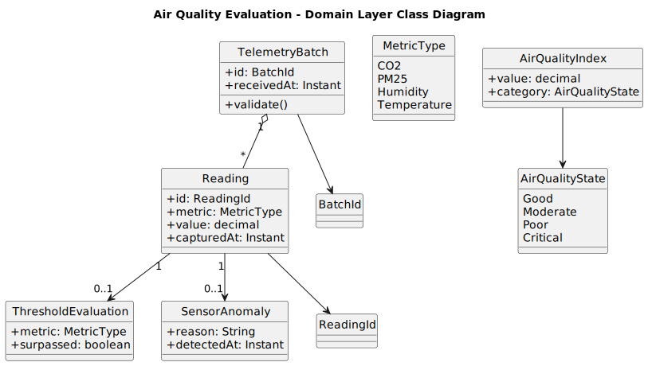

Esta vista permite entender como el bounded context organiza la informacion ambiental y como articula el paso desde lecturas crudas hasta estados significativos del aire interior.

##### 4.2.6.6.2. Bounded Context Database Design Diagram

El siguiente diagrama presenta el diseño de base de datos del Bounded Context Air Quality Evaluation.

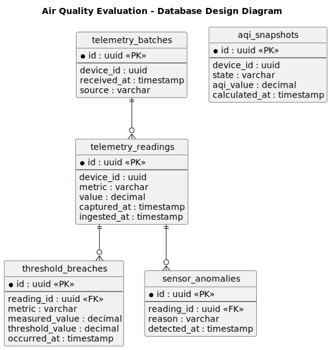

El esquema muestra las estructuras requeridas para almacenar telemetria, snapshots de AQI, superaciones de thresholds y anomalias, preservando trazabilidad sobre el procesamiento ambiental del sistema.

### 4.2.7. Bounded Context: Alerting & Response

El Bounded Context Alerting \& Response se encarga de transformar condiciones ambientales criticas en mecanismos de reaccion operativa dentro del sistema. Su alcance comprende la generacion de alertas, la prevencion de fatiga de notificaciones, el seguimiento de acciones correctivas y la eventual activacion automatica de respuestas sobre dispositivos o sistemas auxiliares cuando la configuracion lo permite.

#### 4.2.7.1. Domain Layer

La capa de dominio del Bounded Context Alerting \& Response modela las reglas de negocio que gobiernan la generacion de alertas, la prevencion de fatiga de notificaciones, el seguimiento de acciones correctivas y la ejecucion manual o automatica de respuestas ante condiciones de riesgo ambiental. Su objetivo es transformar eventos criticos del contexto de evaluacion en acciones significativas para el usuario y el entorno monitoreado.

Este contexto tiene un rol clave dentro de Clair porque conecta el conocimiento ambiental con la reaccion operativa. No basta con detectar que el aire se encuentra en malas condiciones; el sistema debe decidir cuando alertar, a quien notificar, con que frecuencia insistir y que accion recomendar o ejecutar para corregir la situacion.

| Elemento del dominio | Descripcion |
| --- | --- |
| Critical Alert | Representa una alerta generada por una condicion de riesgo o discomfort relevante. |
| Alert Reminder | Representa un recordatorio emitido cuando la condicion persiste sin resolucion. |
| Corrective Action | Representa la accion recomendada o registrada para mejorar el ambiente. |
| Auto Corrective Action | Representa una actuacion automatica ejecutada por el sistema ante reglas predefinidas. |
| Alert Cooldown | Representa la ventana de supresion utilizada para evitar alert fatigue. |
| Escalation Policy | Representa la regla que determina a quien se notifica cuando un evento persiste o se repite. |

Las reglas de negocio principales de esta capa incluyen la emision de alertas solo cuando una condicion supera los thresholds definidos, la supresion temporal de alertas repetidas para la misma metrica y dispositivo, el registro obligatorio de acciones correctivas asociadas a incidentes relevantes y la posibilidad de activar respuestas automaticas solo cuando exista configuracion valida para ello. Adicionalmente, el dominio debe contemplar eventos como `CriticalAlertGenerated`, `PushNotificationSent`, `EmailNotificationSent`, `AlertAcknowledged`, `AlertReminderIssued`, `CorrectiveActionRecommended`, `AutomaticCorrectiveActionTriggered`, `CorrectiveActionRecorded`, `CorrectiveActionCompleted` y `AlertResolved`.

En este bounded context, el agregado principal puede concentrarse en **Critical Alert**, ya que desde esta raiz se coordinan el estado de la alerta, la secuencia de recordatorios, la asociacion con acciones correctivas y el cierre del incidente. Como soporte conceptual, el dominio puede emplear objetos de valor como `AlertSeverity`, `CooldownWindow`, `ActionType`, `ReminderCount` y `EscalationTarget`.

En sintesis, la Domain Layer de Alerting \& Response define como Clair reacciona frente a un ambiente riesgoso. Gracias a esta capa, el sistema puede convertir la deteccion tecnica del problema en una estrategia de intervencion ordenada, oportuna y alineada con la experiencia del usuario.

#### 4.2.7.2. Interface Layer

La capa de interfaz del Bounded Context Alerting \& Response expone las operaciones relacionadas con consulta de alertas, confirmacion de recepcion, registro de acciones correctivas, configuracion de modos automáticos y seguimiento del estado del incidente. Su responsabilidad es mediar entre los usuarios, otros bounded contexts y la logica de respuesta contenida en el dominio.

| Endpoint u operacion | Tipo de acceso | Proposito |
| --- | --- | --- |
| `GET /alerts` | Protegido | Consultar alertas activas o historicas del usuario o facility. |
| `GET /alerts/{id}` | Protegido | Recuperar el detalle de una alerta critica especifica. |
| `POST /alerts/{id}/acknowledge` | Protegido | Confirmar recepcion o atencion inicial de la alerta. |
| `POST /alerts/{id}/corrective-actions` | Protegido | Registrar una accion correctiva manual asociada al incidente. |
| `PATCH /alerts/{id}/resolve` | Protegido | Marcar la alerta como resuelta cuando el ambiente vuelve a estado seguro. |
| `PATCH /devices/{id}/smart-alarm` | Protegido | Activar o desactivar el modo de respuesta automatica para un dispositivo. |

La interfaz utiliza contratos como `AlertSummaryResponse`, `AlertDetailResponse`, `AcknowledgeAlertRequest`, `CorrectiveActionRequest` y `SmartAlarmSettingsRequest`. Estos DTOs permiten comunicar incidentes y decisiones operativas de manera comprensible para clientes web y mobile, sin exponer la complejidad interna del dominio.

Entre sus validaciones principales se encuentran la comprobacion de ownership o autoridad del actor, la existencia de la alerta objetivo, la validez del tipo de accion correctiva seleccionado y la verificacion de que una alerta solo pueda marcarse como resuelta cuando exista evidencia de normalizacion o cierre administrativo valido.

Por tanto, la Interface Layer de Alerting \& Response actua como la puerta de acceso al ciclo de respuesta frente a incidentes ambientales. Su mision es permitir que usuarios y sistemas interactuen con las alertas de forma controlada, trazable y coherente con las reglas del negocio.

#### 4.2.7.3. Application Layer

La capa de aplicacion del Bounded Context Alerting \& Response coordina la generacion de alertas, la emision de recordatorios, la recomendacion de acciones correctivas y la ejecucion de respuestas automaticas cuando las condiciones del dominio lo permiten. Su responsabilidad es orquestar el paso desde eventos ambientales criticos hacia acciones concretas notificadas o ejecutadas.

| Caso de uso | Descripcion |
| --- | --- |
| GenerateCriticalAlert | Crea una alerta a partir de un threshold breach recibido desde Air Quality Evaluation. |
| NotifyAffectedUsers | Solicita el envio de notificaciones a los usuarios suscritos al espacio afectado. |
| ApplyCooldownPolicy | Evalua si corresponde emitir o suprimir alertas repetidas. |
| AcknowledgeAlert | Registra la recepcion de la alerta por parte del usuario. |
| RecommendCorrectiveAction | Selecciona una accion sugerida acorde al tipo de incidente. |
| TriggerAutomaticCorrectiveAction | Ejecuta una respuesta automatica cuando existe configuracion valida. |
| RecordCorrectiveAction | Registra la intervencion manual o automatica realizada sobre el incidente. |
| ResolveAlert | Cierra la alerta una vez corregida o estabilizada la condicion. |

Estos flujos pueden implementarse mediante servicios como `AlertGenerationAppService`, `AlertEscalationAppService`, `CorrectiveActionAppService` y `AutoResponseAppService`. Su labor consiste en evaluar el contexto del incidente, coordinar persistencia, activar notificaciones, consultar configuraciones de dispositivos inteligentes y mantener la trazabilidad completa del ciclo de vida de la alerta.

Por ejemplo, `GenerateCriticalAlert` recibe un evento de superacion de threshold, verifica si existe una alerta previa dentro de la ventana de cooldown, y de ser necesario crea un nuevo incidente. Luego, `NotifyAffectedUsers` delega la entrega al bounded context Notifications. Si la configuracion del dispositivo habilita una respuesta automatica, `TriggerAutomaticCorrectiveAction` coordina con la infraestructura o con el Edge Station para activar un HVAC Controller o un Smart Window Actuator. Finalmente, `RecordCorrectiveAction` y `ResolveAlert` consolidan el cierre operativo del evento.

La Application Layer de este contexto tambien debe contemplar reglas de escalamiento y fatiga de alertas, de modo que la insistencia en las notificaciones no degrade la experiencia del usuario ni reduzca la efectividad del sistema.

En conjunto, esta capa transforma riesgos ambientales en reacciones concretas y gobernables. Gracias a ella, Clair no se limita a detectar problemas, sino que acompaña su resolucion mediante una secuencia organizada de alerta, accion y cierre.

#### 4.2.7.4. Infrastructure Layer

La capa de infraestructura del Bounded Context Alerting \& Response implementa la persistencia de alertas, la integracion con sistemas de entrega de notificaciones y los adaptadores necesarios para ejecutar o coordinar respuestas correctivas. Su funcion es materializar la logica de respuesta definida por el dominio y la aplicacion en componentes tecnicos verificables.

| Recurso de infraestructura | Responsabilidad |
| --- | --- |
| PostgreSQL | Persistir alertas, recordatorios, estados del incidente y acciones correctivas. |
| Alert Repository Adapter | Implementar acceso persistente a incidentes y su historial. |
| Notification Request Adapter | Traducir alertas a solicitudes de entrega hacia el bounded context Notifications. |
| Device Command Adapter | Encapsular el envio de comandos hacia edge o dispositivos inteligentes. |
| Scheduling Components | Gestionar ventanas de cooldown, recordatorios y verificaciones periodicas. |

Las estructuras persistentes de este contexto pueden incluir tablas como `critical_alerts`, `alert_reminders`, `corrective_actions`, `auto_response_settings` y `alert_escalations`. Esta base permite conservar un historial completo del incidente y de las decisiones operativas tomadas por el sistema o por los usuarios.

Adicionalmente, la infraestructura debe contemplar mecanismos de temporizacion, idempotencia frente a eventos repetidos, registros auditables y observabilidad sobre entregas fallidas o respuestas automaticas no ejecutadas. Estas capacidades son indispensables para sostener la confiabilidad del sistema en escenarios donde una reaccion tardia o incorrecta puede impactar negativamente en la experiencia del usuario.

Por ello, la Infrastructure Layer de Alerting \& Response constituye el soporte tecnico de la capacidad reactiva de Clair. Gracias a ella, las alertas y acciones correctivas pueden pasar del modelo conceptual a una operacion concreta, trazable y coordinada con el resto de la plataforma.

#### 4.2.7.5. Bounded Context Software Architecture Component Level Diagrams

En esta seccion se presenta el Component Diagram del Bounded Context Alerting \& Response. Esta vista describe la descomposicion interna de la logica de alertas y respuestas correctivas, mostrando como se articulan los componentes encargados de generar incidentes, coordinar acciones y sostener la reaccion operativa del sistema frente a condiciones de riesgo.

El diagrama organiza el bounded context en componentes **Interfaces**, **Application**, **Domain** e **Infrastructure**, vinculados a la persistencia de alertas y a la coordinacion de acciones y entregas asociadas. Gracias a esta vista es posible identificar como un evento critico proveniente de la evaluacion ambiental se transforma en una alerta formal, una recomendacion correctiva o una respuesta automatica segun las reglas y configuraciones vigentes.

#### 4.2.7.6. Bounded Context Software Architecture Code Level Diagrams

En esta seccion se presentan los diagramas de nivel codigo del Bounded Context Alerting \& Response. El objetivo es mostrar con mayor detalle los objetos que intervienen en el ciclo de vida de una alerta y el diseño de persistencia que soporta recordatorios, acciones correctivas y configuraciones de respuesta automatica.

##### 4.2.7.6.1. Bounded Context Domain Layer Class Diagrams

El siguiente diagrama de clases representa los principales elementos del dominio de alertas, tales como critical alert, reminder, corrective action y cooldown policy.

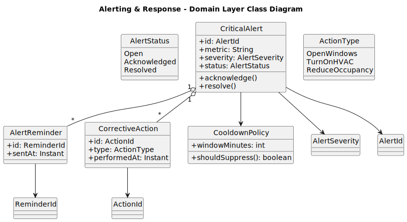

Esta representacion permite observar como se modelan las relaciones entre la alerta principal, sus recordatorios, las acciones correctivas asociadas y las politicas que regulan la frecuencia de reaccion del sistema.

##### 4.2.7.6.2. Bounded Context Database Design Diagram

El siguiente diagrama muestra el diseño de base de datos del Bounded Context Alerting \& Response.

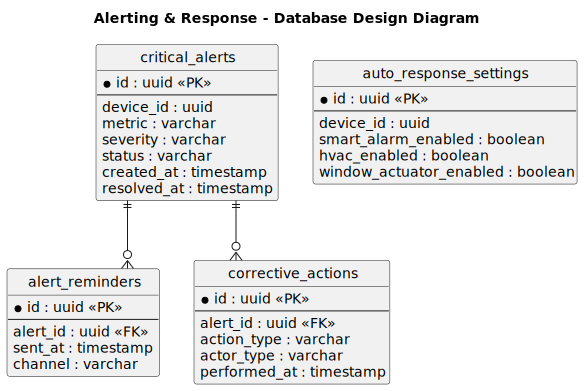

El esquema refleja las estructuras necesarias para almacenar incidentes, recordatorios, acciones correctivas y configuraciones de respuesta, asegurando trazabilidad completa sobre el proceso de reaccion ante eventos criticos.

### 4.2.8. Bounded Context: Analytics & Reporting

El Bounded Context Analytics \& Reporting agrupa las capacidades orientadas al analisis historico del comportamiento ambiental, la generacion de digests periodicos y la construccion de insights accionables para usuarios y administradores. Este contexto extiende el valor del sistema mas alla del monitoreo en tiempo real, permitiendo comprender tendencias, comparar periodos y respaldar decisiones operativas con evidencia acumulada.

#### 4.2.8.1. Domain Layer

La capa de dominio del Bounded Context Analytics \& Reporting concentra las reglas de negocio relacionadas con agregacion historica, generacion de digests, construccion de reportes y formulacion de insights accionables a partir del comportamiento ambiental acumulado. Su objetivo es transformar datos ya evaluados en conocimiento longitudinal que ayude a entender tendencias, comparar periodos y mejorar la toma de decisiones.

Este contexto se diferencia de Air Quality Evaluation porque no se centra en el estado instantaneo del aire, sino en su interpretacion historica. Aqui se modelan conceptos como tendencia, resumen semanal, recomendacion de ventilacion y restricciones de acceso segun plan comercial.

| Elemento del dominio | Descripcion |
| --- | --- |
| Historical Aggregate | Representa una consolidacion de lecturas o estados sobre una ventana temporal. |
| Digest Report | Representa un resumen periodico generado para un usuario o facility. |
| Trend Insight | Representa una observacion derivada del comportamiento historico de una o varias metricas. |
| Ventilation Recommendation | Representa la mejor franja horaria sugerida para ventilar segun patrones pasados. |
| Report Access Policy | Representa la regla que determina si un usuario puede ver historial completo o solo preview. |

Las reglas de dominio principales incluyen la generacion periodica de resumentes diarios, semanales o mensuales, la identificacion del mejor horario de ventilacion, la consolidacion de acciones correctivas y frecuencia de alertas por zona, asi como la restriccion del historial extendido para usuarios sin suscripcion premium. Los eventos relevantes en este contexto incluyen `HistoricalDataAggregated`, `DailyDigestGenerated`, `WeeklyDigestGenerated`, `MonthlyReportGenerated`, `BestVentilationHourIdentified` y `HistoricDataPreviewBlocked`.

En consecuencia, la Domain Layer de Analytics \& Reporting define como Clair convierte el registro historico de la calidad del aire en informacion de valor estrategico. Gracias a esta capa, el sistema puede ofrecer una lectura mas profunda del comportamiento ambiental y no solo una reaccion al instante.

#### 4.2.8.2. Interface Layer

La capa de interfaz del Bounded Context Analytics \& Reporting expone consultas historicas, reportes agregados, tendencias y recomendaciones para usuarios y administradores. Su responsabilidad es poner a disposicion estos resultados mediante endpoints comprensibles y consistentes con las restricciones comerciales y de acceso del sistema.

| Endpoint u operacion | Tipo de acceso | Proposito |
| --- | --- | --- |
| `GET /analytics/devices/{id}/history` | Protegido | Consultar historial ambiental de un dispositivo dentro del rango permitido. |
| `GET /analytics/spaces/{id}/trends` | Protegido | Recuperar tendencias historicas de un espacio especifico. |
| `GET /analytics/digests/daily` | Protegido | Consultar o disparar la obtencion del digest diario del usuario. |
| `GET /analytics/digests/weekly` | Protegido | Consultar resumen semanal del usuario o facility. |
| `GET /analytics/reports/monthly` | Protegido | Recuperar reporte mensual para usuarios premium. |
| `GET /analytics/recommendations/ventilation-best-hour` | Protegido | Consultar la mejor hora de ventilacion estimada. |

La interfaz debe validar permisos de acceso sobre los dispositivos y spaces consultados, comprobar las restricciones del plan comercial del usuario y devolver respuestas adecuadas cuando el historial completo no este disponible. Para ello puede apoyarse en DTOs como `HistoricalSeriesResponse`, `TrendInsightResponse`, `DigestReportResponse` y `VentilationRecommendationResponse`.

En sintesis, la Interface Layer de Analytics \& Reporting permite que el conocimiento historico del sistema llegue de forma clara a los distintos clientes, respetando ownership, niveles de acceso y capacidades del plan contratado.

#### 4.2.8.3. Application Layer

La capa de aplicacion del Bounded Context Analytics \& Reporting coordina la agregacion de datos, la generacion de digests y la construccion de reportes historicos. Su funcion es articular repositorios analiticos, politicas de acceso y calculos de tendencia para ofrecer resultados consistentes y reutilizables por la interfaz o por otros procesos de negocio.

| Caso de uso | Descripcion |
| --- | --- |
| AggregateHistoricalData | Consolida lecturas y estados en ventanas temporales aptas para analisis. |
| GenerateDailyDigest | Construye el resumen diario para Home Users. |
| GenerateWeeklyDigest | Construye el resumen semanal para Facility Admins o facilities completas. |
| GenerateMonthlyReport | Produce el reporte mensual para usuarios con plan premium. |
| IdentifyBestVentilationHour | Determina la franja horaria mas favorable para ventilar un espacio. |
| EnforceHistoricAccessPolicy | Verifica si el usuario puede consultar historial completo o solo una vista limitada. |

Estos casos de uso pueden materializarse mediante servicios como `AnalyticsAggregationAppService`, `DigestGenerationAppService`, `TrendAnalysisAppService` y `HistoricalAccessAppService`. Cada servicio coordina consultas a datos historicos, aplica reglas comerciales provenientes de Billing y estructura salidas listas para consumo por la interfaz o por el bounded context Notifications.

Por ejemplo, `GenerateWeeklyDigest` puede combinar datos de estados ambientales, numero de alertas, acciones correctivas registradas y distribucion por zonas para construir una vision ejecutiva del comportamiento de una facility. Del mismo modo, `EnforceHistoricAccessPolicy` determina si un usuario freemium recibe un preview con paywall o una consulta completa sobre largos periodos de tiempo.

La Application Layer de Analytics \& Reporting, por tanto, convierte acumulaciones de datos en reportes con valor de negocio. Su papel es sostener una analitica interpretable, util y coherente con la oferta funcional de Clair.

#### 4.2.8.4. Infrastructure Layer

La capa de infraestructura del Bounded Context Analytics \& Reporting implementa los componentes tecnicos necesarios para almacenar agregados, consultar historicos, generar reportes y sostener procesos periodicos de consolidacion. Su funcion es traducir la necesidad de analitica prolongada en un soporte eficiente y confiable.

| Recurso de infraestructura | Responsabilidad |
| --- | --- |
| Analytics Repository Adapter | Persistir agregados historicos, snapshots y datasets de reporte. |
| Reporting Storage | Conservar resultados de digests y reportes generados. |
| Scheduled Jobs | Ejecutar consolidaciones, downsampling y generacion periodica de resumentes. |
| Query Optimization Components | Facilitar consultas historicas sobre rangos amplios de tiempo. |
| Audit and Logging Components | Registrar generacion de reportes, bloqueos por plan y fallos de agregacion. |

Las estructuras persistentes pueden incluir `historical_aggregates`, `daily_digests`, `weekly_digests`, `monthly_reports`, `trend_snapshots` y `ventilation_recommendations`. Estas estructuras permiten desacoplar consultas analiticas pesadas de la operacion transaccional en tiempo real.

La infraestructura de este contexto debe prestar especial atencion a retencion, optimizacion de consultas y procesamiento batch, pues la analitica historica involucra rangos amplios de datos y requiere tiempos de respuesta razonables para no degradar la experiencia del usuario.

Por ello, la Infrastructure Layer de Analytics \& Reporting constituye la base tecnica que hace viable el analisis de largo plazo dentro de Clair. Gracias a esta capa, los historicos pueden convertirse en insights y reportes sostenibles a escala.

#### 4.2.8.5. Bounded Context Software Architecture Component Level Diagrams

En esta seccion se presenta el Component Diagram del Bounded Context Analytics \& Reporting. El objetivo es exponer la estructura interna que soporta la agregacion historica, la generacion de digests periodicos y la construccion de insights para usuarios y administradores.

El diagrama muestra la descomposicion del bounded context en los componentes **Interfaces**, **Application**, **Domain** e **Infrastructure**, articulados con los mecanismos de almacenamiento de agregados y reportes. Esta vista permite comprender como el sistema transforma informacion historica en resumentes, tendencias y recomendaciones accionables alineadas con el plan comercial y las necesidades del usuario.

#### 4.2.8.6. Bounded Context Software Architecture Code Level Diagrams

En esta seccion se presentan los diagramas de detalle del Bounded Context Analytics \& Reporting. Estas vistas muestran como se modelan los agregados historicos, digests e insights, y como estos conceptos se proyectan sobre una estructura persistente orientada al analisis longitudinal del comportamiento ambiental.

##### 4.2.8.6.1. Bounded Context Domain Layer Class Diagrams

El siguiente diagrama de clases representa los conceptos centrales del dominio analitico, incluyendo agregados historicos, digests, insights y recomendaciones de ventilacion.

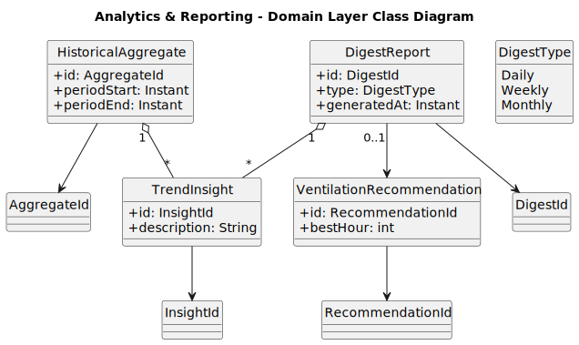

Esta vista permite comprender como el sistema organiza el conocimiento historico para convertir datos acumulados en resumentes periodicos y recomendaciones accionables.

##### 4.2.8.6.2. Bounded Context Database Design Diagram

El siguiente diagrama muestra el diseño de base de datos del Bounded Context Analytics \& Reporting.

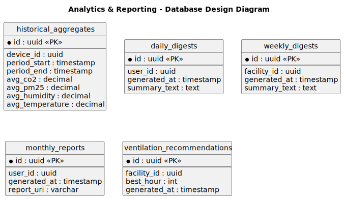

La estructura presentada respalda la generacion de agregados, digests y reportes, facilitando consultas historicas eficientes y una explotacion analitica consistente.

### 4.2.9. Bounded Context: Notifications

El Bounded Context Notifications centraliza la gestion de templates, solicitudes de entrega, preferencias de canal e historial de mensajes emitidos por la plataforma. Su finalidad es proporcionar una capacidad transversal de comunicacion que permita a otros bounded contexts informar eventos relevantes, como verificaciones de cuenta, alertas criticas o reportes periodicos, manteniendo consistencia y trazabilidad sobre cada envio.

#### 4.2.9.1. Domain Layer

La capa de dominio del Bounded Context Notifications modela la gestion de plantillas, solicitudes de entrega, canales de comunicacion y trazabilidad de notificaciones emitidas por la plataforma. Su responsabilidad es asegurar que los mensajes generados por otros bounded contexts puedan entregarse de forma consistente, rastreable y alineada con las preferencias del usuario.

Este contexto no decide cuando existe una alerta o cuando se genera un digest; su labor es encargarse del ciclo de vida de la comunicacion resultante. Por ello, constituye una capacidad de apoyo transversal para IAM, Alerting \& Response y Analytics \& Reporting.

| Elemento del dominio | Descripcion |
| --- | --- |
| Notification Template | Representa la estructura reusable de un mensaje. |
| Delivery Request | Representa una solicitud concreta de envio a uno o varios destinatarios. |
| Delivery Channel | Representa el medio utilizado para comunicar, por ejemplo email o push. |
| Notification History | Representa el registro trazable de notificaciones enviadas, fallidas o pendientes. |
| User Preference | Representa la configuracion del usuario respecto a canal o frecuencia deseada. |

Las reglas de dominio incluyen respetar preferencias configuradas, registrar el resultado de cada entrega, soportar mensajes transaccionales y de alerta, y mantener historial suficiente para auditoria y seguimiento. Entre los eventos significativos se encuentran `NotificationRequested`, `NotificationDispatched`, `EmailNotificationSent`, `PushNotificationSent`, `NotificationDeliveryFailed` y `NotificationRetried`.

En conjunto, la Domain Layer de Notifications define como Clair entiende y gobierna su comunicacion saliente. Gracias a esta capa, el sistema puede tratar los mensajes no como simples efectos secundarios, sino como objetos de negocio con trazabilidad y reglas propias.

#### 4.2.9.2. Interface Layer

La capa de interfaz del Bounded Context Notifications expone operaciones relacionadas con consulta de historial, gestion de templates y configuracion de preferencias. Asimismo, actua como punto de recepcion para solicitudes internas de envio provenientes de otros bounded contexts.

| Endpoint u operacion | Tipo de acceso | Proposito |
| --- | --- | --- |
| `GET /notifications/history` | Protegido | Consultar historial de mensajes enviados al usuario. |
| `PATCH /notifications/preferences` | Protegido | Configurar canales y frecuencia de notificacion. |
| `GET /notifications/templates` | Protegido administrativo | Consultar templates disponibles para administracion. |
| `POST /notifications/send` | Interno controlado | Registrar una solicitud de envio desde otro bounded context. |

La interfaz se apoya en contratos como `NotificationHistoryResponse`, `NotificationPreferenceRequest`, `NotificationTemplateResponse` y `DeliveryRequestDto`. Sus validaciones se enfocan en verificar identidad del solicitante, validez del canal, existencia de destinatarios y consistencia de los datos necesarios para componer el mensaje.

De este modo, la Interface Layer de Notifications habilita una comunicacion ordenada entre la logica del negocio que desea comunicar algo y la capacidad especializada que se encarga de entregarlo.

#### 4.2.9.3. Application Layer

La capa de aplicacion del Bounded Context Notifications coordina la seleccion de template, la resolucion de destinatarios, la evaluacion de preferencias y el despacho de mensajes a traves de los canales disponibles. Su objetivo es convertir una solicitud de notificacion en una entrega concreta y trazable.

| Caso de uso | Descripcion |
| --- | --- |
| RequestNotificationDelivery | Registrar una solicitud de envio proveniente de otro contexto. |
| ResolveRecipients | Determinar destinatarios efectivos y preferencias aplicables. |
| RenderTemplate | Construir el contenido final del mensaje a partir de una plantilla y datos de contexto. |
| DispatchNotification | Enviar el mensaje por el canal correspondiente. |
| RecordDeliveryOutcome | Persistir si la entrega fue exitosa, fallida o reintentada. |

Estos casos de uso pueden implementarse mediante servicios como `NotificationAppService`, `TemplateRenderingAppService`, `DeliveryRoutingAppService` y `NotificationHistoryAppService`. La coordinacion entre ellos permite desacoplar la intencion de comunicar de la tecnologia concreta de entrega.

Por ello, la Application Layer de Notifications convierte solicitudes abstractas de comunicacion en mensajes emitidos con contenido, canal y trazabilidad adecuados para cada usuario y contexto de negocio.

#### 4.2.9.4. Infrastructure Layer

La capa de infraestructura del Bounded Context Notifications implementa la persistencia de templates e historial, asi como la integracion con proveedores externos de entrega. De acuerdo con la arquitectura de Clair, este contexto se apoya en **PostgreSQL** para trazabilidad y en **Resend** como plataforma externa para email transaccional.

| Recurso de infraestructura | Responsabilidad |
| --- | --- |
| PostgreSQL | Persistir templates, solicitudes de envio e historial de entregas. |
| Resend API | Ejecutar el envio de correos transaccionales y de alerta. |
| Delivery Repository Adapter | Registrar resultados de envio y estados de notificacion. |
| Template Storage Adapter | Recuperar plantillas y variables necesarias para renderizado. |

Las estructuras principales pueden incluir `notification_templates`, `delivery_requests`, `notification_history` y `user_notification_preferences`. La infraestructura tambien debe soportar reintentos controlados, logging de fallos y observabilidad sobre el porcentaje de entrega, especialmente en notificaciones criticas.

En consecuencia, la Infrastructure Layer de Notifications hace operativa la capacidad comunicacional de Clair, conectando las decisiones del negocio con un proveedor real de entrega y preservando evidencia completa del resultado de cada envio.

#### 4.2.9.5. Bounded Context Software Architecture Component Level Diagrams

En esta seccion se presenta el Component Diagram del Bounded Context Notifications. Esta representacion permite identificar como la capacidad transversal de comunicacion del sistema se estructura internamente para gestionar templates, solicitudes de entrega, preferencias de canal e historial de mensajes enviados.

El diagrama organiza el bounded context en componentes **Interfaces**, **Application**, **Domain** e **Infrastructure**, junto con sus dependencias de persistencia y entrega externa. A traves de esta vista se observa como una solicitud de notificacion originada por otro contexto es recibida, procesada, renderizada y despachada mediante los canales configurados, conservando ademas la trazabilidad del resultado de cada envio.

#### 4.2.9.6. Bounded Context Software Architecture Code Level Diagrams

En esta seccion se presentan los diagramas de mayor detalle del Bounded Context Notifications. Estas vistas permiten comprender la estructura de clases encargada de templates, delivery requests, historial y preferencias, asi como su correspondiente diseño de persistencia.

##### 4.2.9.6.1. Bounded Context Domain Layer Class Diagrams

El siguiente diagrama de clases representa los principales objetos del dominio de notificaciones, como templates, solicitudes de envio, historial de entregas y preferencias del usuario.

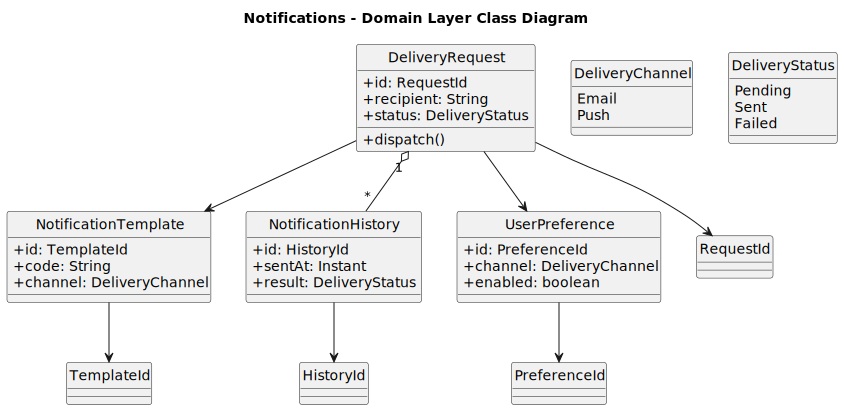

Esta vista describe como el sistema organiza la capacidad comunicacional de forma reutilizable, trazable y alineada con distintos canales de entrega.

##### 4.2.9.6.2. Bounded Context Database Design Diagram

El siguiente diagrama presenta el diseño de base de datos del Bounded Context Notifications.

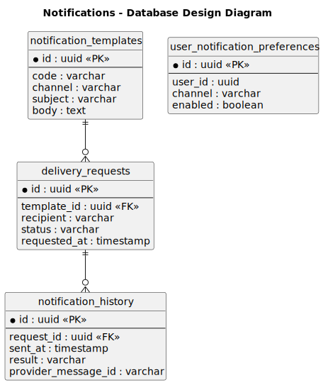

El esquema soporta templates, solicitudes de entrega, historial de mensajes y preferencias de canal, permitiendo trazabilidad completa sobre la comunicacion emitida por la plataforma.

### 4.2.10. Bounded Context: Embedded App

El Bounded Context Embedded App representa la logica de software que se ejecuta directamente sobre el dispositivo Clair. Su responsabilidad es controlar la captura local de lecturas, aplicar validaciones basicas de seguridad y consistencia, y publicar telemetria hacia la capa edge o local, garantizando que el sensor opere de manera estable y confiable desde el origen.

#### 4.2.10.1. Domain Layer

La capa de dominio del Bounded Context Embedded App modela las reglas internas que gobiernan el comportamiento del dispositivo fisico Clair. Su responsabilidad es representar la captura local de lecturas, las validaciones de seguridad del sensor y la ejecucion controlada de acciones directas sobre el hardware.

Dentro de este contexto, el dispositivo no es solo un emisor pasivo de datos; es un actor que debe decidir si una lectura es aceptable, cuando publicar telemetria y como reaccionar localmente ante comandos o condiciones de riesgo.

| Elemento del dominio | Descripcion |
| --- | --- |
| Sensor Reading | Representa la medicion obtenida directamente desde el hardware. |
| Device State | Representa el estado operativo interno del dispositivo. |
| Telemetry Payload | Representa la estructura de datos lista para ser publicada al edge station. |
| Safety Rule | Representa una regla local de validacion o proteccion del dispositivo. |
| Local Command | Representa una instruccion recibida para actuar sobre el hardware o su configuracion. |

Las reglas de dominio incluyen validar rangos seguros, prevenir transiciones inconsistentes del estado interno, asegurar que la telemetria publicada tenga estructura valida y permitir acciones locales solo bajo condiciones aceptables. Eventos como `LocalTelemetryCaptured`, `TelemetryValidated`, `TelemetryPublished`, `LocalCommandReceived` y `SafeDeviceActionApplied` reflejan el comportamiento de esta capa.

En conjunto, la Domain Layer de Embedded App define la logica operativa minima del sensor en campo, permitiendo que la captura de datos y la reaccion local se mantengan controladas incluso antes de llegar a la nube.

#### 4.2.10.2. Interface Layer

La capa de interfaz del Bounded Context Embedded App expone los puntos de entrada internos del firmware, principalmente para recibir ticks de medicion, comandos locales o solicitudes de configuracion. Su responsabilidad es traducir señales fisicas o mensajes de control en invocaciones comprensibles para la capa de aplicacion.

Esta interfaz no se manifiesta como una API publica tradicional, sino como controladores internos vinculados al ciclo de lectura del hardware, al bus local o a la comunicacion con el edge.

En consecuencia, la Interface Layer del Embedded App actua como la frontera entre el mundo fisico del sensor y la logica del dispositivo, asegurando que eventos de hardware y comandos entren al sistema embebido con una estructura interpretable.

#### 4.2.10.3. Application Layer

La capa de aplicacion del Bounded Context Embedded App coordina la captura de lecturas, su validacion, el ensamblado del payload de telemetria y la ejecucion de comandos locales. Su objetivo es transformar interacciones del hardware en operaciones internas coherentes y listas para ser publicadas hacia el edge station.

| Caso de uso | Descripcion |
| --- | --- |
| CaptureTelemetry | Obtener mediciones desde los sensores fisicos. |
| ValidateTelemetry | Verificar que las lecturas cumplan reglas de seguridad y rango. |
| PublishTelemetry | Enviar la telemetria validada hacia el edge station. |
| ApplyLocalCommand | Ejecutar comandos de configuracion o respuesta sobre el dispositivo. |

Esta capa puede implementarse con servicios como `EmbeddedTelemetryService` y coordinadores ligeros del firmware que orquestan el acceso a IO, el dominio y la publicacion de datos. Gracias a ello, el dispositivo mantiene un flujo ordenado entre medicion, validacion y comunicacion.

Por ello, la Application Layer del Embedded App convierte señales fisicas del entorno en informacion digital util y segura para el resto del ecosistema Clair.

#### 4.2.10.4. Infrastructure Layer

La capa de infraestructura del Bounded Context Embedded App implementa el acceso directo al hardware y a los mecanismos de comunicacion del sensor. De acuerdo con el modelo C4, esta capa contempla adaptadores de IO para **GPIO/I2C/UART** y capacidades locales de publicacion por **BLE/Wi-Fi**.

| Recurso de infraestructura | Responsabilidad |
| --- | --- |
| GPIO/I2C/UART Adapter | Leer datos de sensores y ejecutar acciones sobre actuadores o periféricos. |
| BLE/Wi-Fi Publisher | Publicar telemetria y recibir comandos de comunicacion local. |
| Local State Cache | Conservar estado operativo minimo del dispositivo. |

La infraestructura de este contexto debe priorizar robustez, bajo consumo de recursos y tolerancia a condiciones transitorias del entorno fisico. Gracias a esta capa, el firmware puede interactuar con el hardware real y sostener el flujo de datos hacia el edge.

#### 4.2.10.5. Bounded Context Software Architecture Component Level Diagrams

En esta seccion se presenta el Component Diagram del Bounded Context Embedded App. A diferencia de los bounded contexts cloud, esta vista describe la descomposicion interna del software embebido que corre directamente sobre el dispositivo Clair, enfatizando el flujo local entre captura de lecturas, validacion y publicacion de telemetria.

El diagrama muestra componentes como **Embedded Controller**, **Embedded Telemetry Service**, **Embedded Domain Model** y **Embedded IO Adapter**, permitiendo distinguir claramente el ingreso de comandos, la orquestacion de lecturas, la aplicacion de reglas locales y la interaccion directa con el hardware y los mecanismos de comunicacion. Esta vista justifica la separacion interna del firmware a pesar de ejecutarse sobre una plataforma de recursos limitados.

#### 4.2.10.6. Bounded Context Software Architecture Code Level Diagrams

En esta seccion se presentan los diagramas de nivel codigo del Bounded Context Embedded App. Estas vistas detallan la estructura del modelo local del dispositivo y la forma en que este puede apoyarse en persistencia ligera para sostener estado runtime, buffer de lecturas y registro de comandos.

##### 4.2.10.6.1. Bounded Context Domain Layer Class Diagrams

El siguiente diagrama de clases representa los principales conceptos del dominio embebido, como sensor reading, device state, telemetry payload, safety rule y local command.

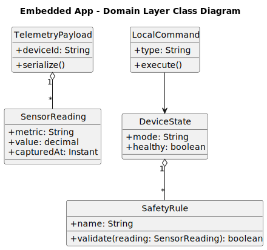

Esta vista permite comprender como el firmware estructura internamente la captura de lecturas, la aplicacion de reglas de seguridad y la preparacion de la telemetria antes de su publicacion hacia el edge.

##### 4.2.10.6.2. Bounded Context Database Design Diagram

El siguiente diagrama muestra una propuesta de persistencia ligera para el Bounded Context Embedded App.

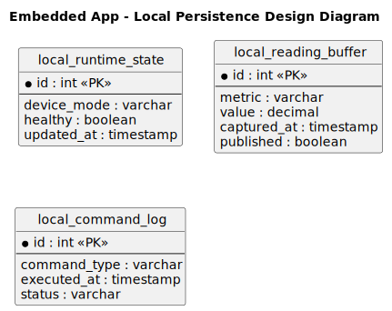

Aunque el componente embebido opera con recursos limitados, esta estructura permite conservar estado local, buffer temporal de lecturas y trazabilidad minima sobre comandos ejecutados en el dispositivo.

### 4.2.11. Bounded Context: Edge Station

El Bounded Context Edge Station modela la aplicacion intermedia que opera localmente entre los dispositivos embebidos y la plataforma cloud. Su proposito es recibir telemetria, almacenarla temporalmente, sincronizarla con la nube y despachar comandos remotos hacia los sensores, aportando resiliencia operativa y soporte para escenarios offline-first dentro de la arquitectura distribuida de Clair.

#### 4.2.11.1. Domain Layer

La capa de dominio del Bounded Context Edge Station modela las reglas de negocio locales que permiten recibir telemetria desde uno o varios dispositivos, deduplicarla, almacenarla temporalmente y sincronizarla con la nube. Su objetivo es sostener un comportamiento offline-first que preserve continuidad operativa incluso cuando la conectividad externa es limitada o intermitente.

| Elemento del dominio | Descripcion |
| --- | --- |
| Local Telemetry Record | Representa una lectura recibida y almacenada temporalmente en el edge. |
| Sync Queue | Representa la cola local de elementos pendientes de sincronizacion. |
| Retry Window | Representa la politica local de reintento ante fallos de conectividad. |
| Command Dispatch | Representa el enrutamiento de comandos hacia dispositivos embebidos. |
| Sync Checkpoint | Representa la marca de avance de la sincronizacion con la nube. |

Las reglas principales de este dominio incluyen evitar duplicidad de registros, conservar lecturas durante periodos de desconexion, sincronizar por lotes cuando la conectividad se recupera y despachar comandos solo a los dispositivos correctos dentro de la red local. Eventos como `TelemetryBuffered`, `OfflineReadingsSynchronized`, `SyncRetried`, `RemoteCommandReceived` y `CommandDispatchedToDevice` expresan el comportamiento de esta capa.

En consecuencia, la Domain Layer de Edge Station define la inteligencia local que conecta el mundo embebido con la plataforma cloud sin depender de conectividad perfecta en todo momento.

#### 4.2.11.2. Interface Layer

La capa de interfaz del Bounded Context Edge Station expone endpoints o controladores locales para ingestion de telemetria, consulta operativa y recepcion de comandos remotos. Su responsabilidad es mediar entre dispositivos embebidos, operadores on-site y la sincronizacion con la plataforma.

En este contexto, la interfaz puede materializarse mediante controladores Flask y adaptadores MQTT o HTTP que reciben mensajes del sensor y solicitudes desde el API Gateway. Estos puntos de entrada permiten que el edge funcione como nodo intermedio de coordinacion local.

Por ello, la Interface Layer del Edge Station constituye la frontera de comunicacion entre la red local de dispositivos y los servicios cloud de Clair.

#### 4.2.11.3. Application Layer

La capa de aplicacion del Bounded Context Edge Station coordina la ingestion local, la deduplicacion, el almacenamiento temporal, la sincronizacion con la nube y el despacho de comandos hacia dispositivos embebidos. Su funcion es orquestar el intercambio de informacion entre el mundo local y el entorno cloud sin perder consistencia.

| Caso de uso | Descripcion |
| --- | --- |
| IngestLocalTelemetry | Recibir telemetria desde embedded devices y prepararla para persistencia. |
| DeduplicateTelemetry | Detectar y descartar registros repetidos. |
| BufferOfflineReadings | Conservar lecturas localmente mientras no exista conectividad externa. |
| SynchronizeWithCloud | Enviar lotes pendientes hacia la plataforma cuando la conexion lo permita. |
| ReceiveRemoteCommand | Aceptar comandos enviados desde la nube al edge station. |
| DispatchCommandToDevice | Enrutar comandos hacia el embedded app correspondiente. |

Estos flujos pueden implementarse mediante servicios como `EdgeProcessingService` y `EdgeSyncService`, definidos ya en el modelo arquitectonico. Su coordinacion es clave para sostener la promesa de resiliencia operativa del sistema.

En sintesis, la Application Layer del Edge Station asegura que Clair siga capturando, almacenando y enviando datos de forma confiable aun en escenarios de conectividad imperfecta.

#### 4.2.11.4. Infrastructure Layer

La capa de infraestructura del Bounded Context Edge Station implementa los mecanismos tecnicos que permiten operar como gateway local. Conforme al modelo del sistema, esta capa utiliza **Flask** como superficie de control local, **SQLite** para persistencia temporal y **MQTT + HTTPS** para comunicacion con dispositivos embebidos y con la nube.

| Recurso de infraestructura | Responsabilidad |
| --- | --- |
| Flask Controller Adapter | Exponer endpoints locales para operacion y sincronizacion. |
| MQTT Adapter | Recibir telemetria desde embedded devices y despachar comandos locales. |
| HTTPS Sync Adapter | Enviar informacion consolidada al API Gateway y recibir comandos remotos. |
| SQLite | Almacenar snapshots, colas locales y checkpoints de sincronizacion. |

Las estructuras persistentes de este contexto pueden incluir `local_telemetry`, `sync_queue`, `command_queue` y `sync_checkpoints`. La infraestructura debe priorizar tolerancia a fallos, reintentos, persistencia ligera y capacidad de recuperacion tras reinicios o interrupciones de conectividad.

Por ello, la Infrastructure Layer del Edge Station constituye el soporte tecnico que hace viable la operacion distribuida y offline-first de Clair, actuando como el puente estable entre sensores de campo y la plataforma cloud.

#### 4.2.11.5. Bounded Context Software Architecture Component Level Diagrams

En esta seccion se presenta el Component Diagram del Bounded Context Edge Station. Su finalidad es mostrar la descomposicion interna de la aplicacion edge que opera como intermediaria entre los dispositivos embebidos y la plataforma cloud, soportando ingestion local, sincronizacion offline-first y despacho de comandos.

El diagrama describe componentes como **Edge Controller**, **Edge Processing Service**, **Edge Sync Service**, **Edge Domain Model** y **Edge IO Adapter**, junto con su relacion con SQLite, MQTT y HTTPS. Esta vista permite entender como el edge recibe telemetria local, la valida, la almacena temporalmente y posteriormente la sincroniza con la nube, manteniendo resiliencia ante fallos de conectividad.

#### 4.2.11.6. Bounded Context Software Architecture Code Level Diagrams

En esta seccion se presentan los diagramas de nivel codigo del Bounded Context Edge Station. Estas vistas profundizan en la estructura del modelo local de sincronizacion y en el diseño de persistencia que soporta colas, checkpoints y despacho de comandos en escenarios offline-first.

##### 4.2.11.6.1. Bounded Context Domain Layer Class Diagrams

El siguiente diagrama de clases representa los principales conceptos del dominio edge, como local telemetry record, sync queue, retry window, sync checkpoint y command dispatch.

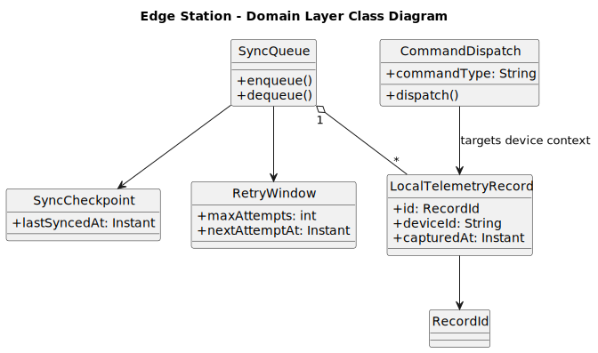

Esta vista permite entender como el nodo edge organiza la recepcion de telemetria, la deduplicacion local, la sincronizacion diferida con la nube y el enrutamiento de comandos hacia los dispositivos embebidos.

##### 4.2.11.6.2. Bounded Context Database Design Diagram

El siguiente diagrama presenta el diseño de base de datos local del Bounded Context Edge Station.

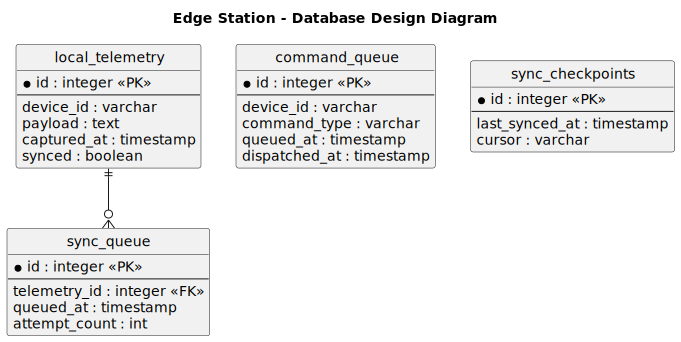

El esquema refleja una persistencia orientada a telemetria temporal, colas de sincronizacion, despacho de comandos y checkpoints de avance, reforzando la resiliencia operativa del sistema ante conectividad intermitente.
