# Capítulo V: Solution UI/UX Design

## 5.1. Style Guidelines.

### 5.1.1. General Style Guidelines.

La identidad visual y la experiencia de usuario de Clair han sido diseñadas bajo un enfoque de minimalismo funcional, priorizando la claridad de la información ambiental y la eficiencia en la respuesta automática. Esta estrategia visual busca reducir la carga cognitiva del usuario, permitiéndole interpretar estados de calidad del aire complejos de manera instantánea. Para garantizar la consistencia en todas las interfaces, se ha tomado como referencia un sistema de diseño basado en principios de Material Design 3, adaptando sus componentes para reflejar una estética tecnológica, limpia y confiable.


<p align="center">
 
</p>


**Branding y Concepto Visual**

El branding de la solución se fundamenta en la idea de "transparencia y pureza". Los elementos visuales utilizan bordes redondeados y superficies con elevaciones sutiles (*soft shadows*) para evocar una sensación de modernidad y cercanía. El logotipo y la iconografía siguen líneas geométricas simples, asegurando legibilidad incluso en dispositivos de dimensiones reducidas, como las pantallas integradas en el hardware o aplicaciones móviles en condiciones de baja luminosidad.

**Tipografía y Legibilidad**

Para el sistema tipográfico, se ha seleccionado una familia de fuentes de inter y Space Grotesk. La decisión se sustenta en la necesidad de presentar datos numéricos precisos (como niveles de $CO_2$ y PM2.5) que deben ser legibles de un solo vistazo. Se aplica una jerarquía visual estricta mediante variaciones de peso y escala: los valores críticos utilizan cuerpos tipográficos prominentes para atraer la atención inmediata, mientras que la información contextual y de soporte emplea pesos más ligeros para evitar el ruido visual.

**Paleta de Colores y Significado Semántico**

La paleta de colores de Clair no es solo estética, sino funcional y semántica. Se utiliza una base de tonos neutros (blancos técnicos y grises pizarra) para el fondo y la estructura, permitiendo que los colores de estado destaquen. El sistema emplea una escala cromática de seguridad: **verde** para niveles óptimos, **ámbar** para advertencias preventivas y **rojo** para niveles críticos. Estas decisiones de color se basan en convenciones universales de seguridad y salud, garantizando que tanto el **Home User** como el **Facility Admin** comprendan la urgencia de la situación sin necesidad de leer texto adicional.

**Espaciado y Retícula**

Se ha implementado un sistema de espaciado basado en una rejilla de **8px**, lo que garantiza una alineación matemática perfecta entre componentes y una distribución equilibrada del espacio negativo. El uso generoso de márgenes (*white space*) es una decisión deliberada para separar las diferentes métricas de los sensores, evitando la saturación visual en los dashboards de analítica. Este enfoque permite que el usuario se enfoque en los datos más relevantes, facilitando la navegación tanto en interfaces táctiles como de escritorio.

**Tono de Comunicación y Lenguaje**

El tono de comunicación adoptado para Clair se define como **Sereno, Formal y Respetuoso**. Dado que la solución gestiona información crítica relacionada con la salud y la seguridad de las personas, el lenguaje debe transmitir autoridad y precisión técnica sin generar pánico innecesario.

- **Formalidad:** Se utiliza un lenguaje directo y profesional en las notificaciones y reportes.
- **Serenidad:** Ante situaciones críticas, las instrucciones de mitigación se presentan de forma clara y accionable (ej. "Nivel de $CO_2$ elevado. Se recomienda ventilar el área"), manteniendo una comunicación que brinde seguridad al usuario sobre el control que el sistema ejerce sobre el ambiente.

### 5.1.2. Web, Mobile and IoT Style Guidelines.

**Web Style Guidelines**

**Comportamiento Responsivo y Sistema de Layout**

**Breakpoints oficiales:**

| Categoría | Breakpoint | Ancho mínimo | Comportamiento principal |
|-----------|------------|--------------|--------------------------|
| Móvil | `sm` | < 600px | Layout de 1 columna, menú hamburguesa, navegación vertical |
| Tablet | `md` | 600px – 1024px | Layout de 2 columnas, sidebar colapsable |
| Escritorio | `lg` | 1024px – 1440px | Layout de 3 columnas, sidebar fija |
| Escritorio amplio | `xl` | > 1440px | Layout de 3-4 columnas, espaciado generoso |

**Referencia visual:**  
Los mockups presentados en la sección 5.4.3 corresponden a resolución `xl` (1920px de ancho). En este punto de quiebre, la interfaz utiliza:
- Sidebar izquierdo expandido con navegación jerárquica (Organizations → Building A → Floor 1/2 → Devices)
- Área principal con grid fluido de tarjetas
- Márgenes laterales de `24px` (3 unidades de 8px)


**Componentes UI Especificados**

**A. Panel de Navegación Jerárquica (Espacios y Dispositivos)**

| Propiedad | Especificación |
|-----------|----------------|
| **Estructura** | Árbol colapsable: Organization → Building → Floor → Device |
| **Indicador de cantidad** | Badge con número de dispositivos (ej. "3 DEVICES") en color neutro |
| **Actualización** | Texto secundario: "Updates every minute" / "Updated 12 seconds ago" |
| **Vistas alternas** | Toggle Grid / List (íconos alineados a la derecha) |
| **Footer de acciones** | Botón "Add Organization" (estilo outline) |

**Especificaciones técnicas:**

```css
.nav-tree {
  padding: 16px 0;
  border-right: 1px solid rgba(10,10,10,0.08);
}

.nav-item {
  padding: 8px 16px;
  border-radius: 8px;
  font-family: 'Inter', sans-serif;
  font-size: 14px;
  transition: background 0.2s ease;
}

.nav-item.active {
  background: rgba(77,132,255,0.08);
  color: #4D84FF;
  font-weight: 500;
}

.device-count-badge {
  background: #F0F0F0;
  border-radius: 16px;
  padding: 2px 8px;
  font-size: 12px;
  font-family: 'Space Grotesk', monospace;
}
```

**B. Tarjeta de Sensor / Dispositivo**

| Elemento | Especificación |
|----------|----------------|
| **Contenedor** | Fondo #FFFFFF, border-radius 16px, sombra sutil `0 2px 8px rgba(0,0,0,0.04)` |
| **Padding interno** | 20px (2.5 unidades de 8px) |
| **Nombre del espacio** | Space Grotesk, 16px, peso semibold (ej. "A101") |
| **Nombre del dispositivo** | Inter, 14px, color secundario (ej. "Clair-01") |
| **Timestamp** | Inter, 12px, color #666, con ícono de reloj |
| **Borde semántico** | Borde izquierdo de 4px según estado: normal (transparente), advertencia (#FFB74D), crítico (#FF4444) |

**Estados de la tarjeta:**

| Estado | Borde izquierdo | Sombra | Comportamiento adicional |
|--------|----------------|--------|--------------------------|
| Normal | `transparent` | `0 2px 8px rgba(0,0,0,0.04)` | - |
| Hover (desktop) | `#4D84FF` | `0 8px 24px rgba(0,0,0,0.08)` | Cursor pointer, transición 0.2s |
| Focus (teclado) | `#4D84FF` | `0 0 0 2px #4D84FF` | Outline offset 2px |
| Crítico | `#FF4444` | `0 2px 12px rgba(255,68,68,0.15)` | - |


**C. Panel de Calidad del Aire (AQI)**

| Componente | Especificación |
|------------|----------------|
| **AQI principal** | Número central: Space Grotesk, 72px, peso bold. Etiqueta debajo (ej. "MODERADO") con color semántico |
| **Métricas individuales** | Grid 2 columnas (en desktop 3 columnas). Cada métrica incluye: nombre, valor, umbral (ej. "Above threshold") |
| **Descripción contextual** | Inter, 14px, color secundario. Texto accionable que indica causa y recomendación |
| **Peer Space Comparison** | Tabla compacta con: nombre del espacio, AQI actual, tendencia (flecha), status badge |
| **Botón de acción principal** | "VIEW ROOT CAUSE ANALYSIS" – estilo link con ícono de flecha |

**Especificaciones de colores semánticos para AQI:**

| Calificación | Rango AQI (ejemplo) | Color | Badge |
|--------------|---------------------|-------|-------|
| Óptimo / Good | 0–50 | #5CFFB1 | Fondo verde claro, texto verde oscuro |
| Aceptable / Moderate | 51–100 | #FFB74D | Fondo ámbar claro, texto ámbar oscuro |
| Riesgo / Unhealthy | 101–150 | #FF8A65 | Fondo naranja claro |
| Crítico / Hazardous | >150 | #FF4444 | Fondo rojo claro, texto blanco (invertido) |


**D. Tabla de Alertas**

| Propiedad | Especificación |
|-----------|----------------|
| **Estructura** | Cabecera fija, filas alternas con separador sutil |
| **Columnas** | ID, Severidad, Espacio, Contaminante, Valor/Límite, Disparo, Estado |
| **Badge de severidad** | "CRITICO" fondo #FF4444 10% + texto #FF4444; "ADVERTENCIA" fondo #FFB74D 10% + texto #B45F1B |
| **Badge de estado** | "ACTIVA" con punto verde pulsante; "PENDIENTE" con punto gris |
| **Acción en fila** | Click en cualquier lugar → abre panel lateral con detalle (ver columna derecha del mockup) |
| **Responsive (móvil)** | La tabla se convierte en lista de tarjetas verticales (cada alerta es una tarjeta colapsable) |


**E. Formularios (Login / Registro)**

| Campo | Especificación |
|-------|----------------|
| **Inputs** | Altura 48px, border-radius 8px, border 1px solid rgba(10,10,10,0.12), padding 0 16px |
| **Label** | Inter, 14px, peso medium, margin-bottom 8px |
| **Placeholder** | Inter, 14px, color #999 |
| **Focus** | Border #4D84FF + outline 2px rgba(77,132,255,0.2) |
| **Error** | Border #FF4444 + mensaje debajo (Inter, 12px, #FF4444) |
| **Checkbox (Términos)** | Custom checkbox 20px, border-radius 4px, checked background #4D84FF |
| **Botón Register/Login** | Fondo #4D84FF, texto blanco, padding 12px 24px, border-radius 8px, ancho 100% |


**F. Reportes y Exportaciones**

| Componente | Especificación |
|------------|----------------|
| **Tarjetas de resumen** | Diario/Semanal/Mensual – fondo #F8F9FA, border-radius 16px, padding 20px |
| **Métrica con tendencia** | Valor grande + ícono de flecha (↑ color #FF4444 si empeora, ↓ color #5CFFB1 si mejora) |
| **Tabla de exportaciones** | Misma especificación que tabla de alertas, con columna "Próximo Envío" |
| **Plan Premium** | Card destacada con borde gradiente (#4D84FF → #5CFFB1), botón CTA primario |
| **Botón de exportación** | Dos variantes: PDF (ícono documento) y CSV/XLSX (ícono hoja de cálculo) |


**Estados de Interacción y Micro-interacciones**

| Interacción | Comportamiento | Animación |
|-------------|----------------|-----------|
| **Hover en tarjeta de dispositivo** | Sombra elevada, borde izquierdo azul | `0.2s ease` |
| **Hover en botón primario** | Fondo #3A6BCC | `0.15s ease` |
| **Click en fila de tabla** | Fondo de fila #F5F7FA | Instantáneo + 0.1s de feedback |
| **Apertura de panel lateral (detalle alerta)** | Slide-in desde derecha, overlay semitransparente | `0.3s cubic-bezier(0.2, 0.9, 0.4, 1.1)` |
| **Toggle Grid/List** | Ícono activo con fondo #4D84FF 10% | Transición de ícono |
| **Actualización de datos** | Skeleton loader en tarjetas (solo primera carga) | Pulso de opacidad `1.5s infinite` |
| **Notificación push (alerta crítica)** | Toast en esquina inferior derecha, auto-cierre a los 8s | Slide-up + fade |


**Accesibilidad (WCAG 2.1 Nivel AA)**

| Requisito | Implementación en Clair Web App |
|-----------|--------------------------------|
| **Contraste de color** | Texto sobre #4D84FF (blanco): ratio 4.8:1. Texto sobre #FFFFFF (gris oscuro): ratio 14:1 |
| **Navegación por teclado** | `:focus-visible` visible en todos los botones, inputs, y tarjetas (outline #4D84FF, offset 2px) |
| **Skip to main content** | Enlace oculto que aparece al hacer Tab: "Saltar al contenido principal" |
| **ARIA labels** | En íconos sin texto: `aria-label="Vista de grilla"`. En gráficas AQI: `aria-describedby="aqi-description"` |
| **Texto alternativo** | En gráficas históricas: descripción textual de la tendencia (ej. "PM2.5 aumentó 15% en los últimos 30 minutos") |
| **Manejo de zoom (200%)** | No pérdida de funcionalidad en 200% zoom. Menús colapsan a hamburguesa antes de romperse |


**Integración con IoT (desde navegador web)**

| Funcionalidad | Estándar técnico | Representación en UI |
|---------------|------------------|----------------------|
| **Datos en tiempo real** | WebSocket (conexión persistente) o HTTP POST cada 5 segundos (Embedded → Edge) | Indicador "Updates every minute" + timestamp "Updated X seconds ago" |
| **Estado de conexión** | Heartbeat cada 30s | Círculo verde (#5CFFB1) en esquina superior derecha. Rojo si desconectado |
| **Comandos a dispositivos** | REST API (POST a endpoint) | Botón "Activar sistema HEPA" en detalle de alerta (sección Alerts & Actions). Feedback de éxito/error con toast |
| **Histórico offline** | IndexedDB para caché local | Mensaje: "Usando datos cacheados. Reconectando..." |
| **Permisos** | Notificaciones push (navegador) | Solicitud al primer inicio. Usuario puede modificar en Preferencias (sección Alerts & Actions) |


**Adaptación Responsiva por Pantalla**

| Pantalla | Desktop (1920px) | Tablet (768px) | Móvil (375px) |
|----------|------------------|----------------|----------------|
| **Space & Devices** | Sidebar + grid de 3 columnas | Sidebar colapsado + grid 2 columnas | Menú hamburguesa + grid 1 columna |
| **Air Quality (AQI)** | AQI central + 2 columnas de métricas | AQI reducido (48px) + 1 columna | AQI (40px) + stack vertical |
| **Alertas** | Tabla completa | Tabla con scroll horizontal | Lista de tarjetas |
| **Reports** | 3 tarjetas horizontales | stack vertical | stack vertical |
| **Login/Register** | Card centrado (400px ancho) | Card centrado (400px) | Card 90% ancho (márgenes 5%) |


**Consideraciones de Rendimiento (Web App)**

| Aspecto | Estándar |
|---------|----------|
| **Imágenes** | WebP con fallback PNG. `srcset` para DPR 2x y 3x |
| **Fuentes** | `font-display: swap` para evitar bloqueo de renderizado |
| **Carga de gráficas** | Lazy loading para gráficas históricas (solo al hacer scroll a la vista) |
| **WebSocket** | Reconexión automática con backoff exponencial (1s, 2s, 4s, max 30s) |
| **Bundle size** | Code splitting por ruta (dashboard, alerts, reports, login) |


**Resumen de Especificaciones para Desarrolladores**

```scss
// Variables globales (CSS custom properties)
:root {
  --primary: #4D84FF;
  --secondary: #5CFFB1;
  --neutral-bg: #FFFFFF;
  --neutral-dark: #0A0A0A;
  --critical: #FF4444;
  --warning: #FFB74D;
  --spacing-unit: 8px;
  --radius-md: 8px;
  --radius-lg: 16px;
  --font-heading: 'Space Grotesk', monospace;
  --font-body: 'Inter', sans-serif;
}

// Breakpoints (SCSS mixins)
@mixin mobile { @media (max-width: 599px) { @content; } }
@mixin tablet { @media (min-width: 600px) and (max-width: 1024px) { @content; } }
@mixin desktop { @media (min-width: 1025px) { @content; } }
```


**Mobile Style Guidelines**

**Comportamiento Responsivo y Sistema de Layout**

**Orientación soportada:**

| Orientación | Soporte | Comportamiento |
|-------------|---------|----------------|
| Portrait (vertical) | **Principal** | Todas las pantallas optimizadas para 375px - 428px de ancho |
| Landscape (horizontal) | Opcional | Rotación bloqueada o redimensionamiento básico (no crítico) |

**Unidad de espaciado base: 4px (4dp en Flutter)**

Siguiendo la grilla de Material Design 3, todos los márgenes, paddings y separaciones son múltiplos de 4px:

| Tamaño | Valor | Uso típico |
|--------|-------|-------------|
| `xs` | 4px | Espaciado mínimo entre elementos inline (ícono y texto) |
| `sm` | 8px | Entre elementos relacionados dentro de una tarjeta |
| `md` | 12px | Entre secciones pequeñas del mismo componente |
| `lg` | 16px | Padding estándar de tarjetas y contenedores |
| `xl` | 24px | Márgenes laterales de pantalla, entre secciones grandes |

**Safe Area (Status Bar integrada):**

Todas las pantallas utilizan el widget `SafeArea` de Flutter para evitar que el contenido se superponga con la status bar (iOS notch, Android barra de estado). El fondo oscuro se extiende detrás de la status bar para mantener la integración visual, mientras que el contenido (logo, títulos, botones) respeta el área segura.

**Alturas táctiles mínimas (Material Design):**

| Elemento | Altura mínima |
|----------|---------------|
| Botones principales (Login, Register, Confirm Selection) | 48px |
| Bottom Navigation Bar (cada ítem) | 56px |
| Items de lista (Select Floor, Settings) | 48px |
| Toggle switch, Slider (área de toque) | 40px |

**Scroll:**

Las pantallas principales (Dashboard, Sensors, Settings) **no implementan scroll vertical** en condiciones normales, ya que todo el contenido cabe dentro del área visible de la pantalla en orientación portrait. En dispositivos de pantalla pequeña (menos de 380px de altura), se permite el scroll únicamente como mecanismo de contingencia.


**Componentes UI Especificados**

**A. Bottom Navigation Bar (Navegación principal)**

| Propiedad | Especificación |
|-----------|----------------|
| Estructura | 3 ítems fijos: Dashboard, Sensors, Settings |
| Íconos | Material Icons (dashboard, sensors, settings) |
| Comportamiento | type: BottomNavigationBarType.fixed |
| Color seleccionado | #4D84FF (azul Clair primario) |
| Color no seleccionado | #9E9E9E (gris medio) |
| Fondo | #1E1E1E (oscuro, ligeramente más claro que el fondo general) |
| Altura total | 56px |
| Elevación | 8px (sombra superior) |

**Nota:** No se implementa comportamiento adaptativo para tablets (migración a sidebar) por tratarse de una app exclusivamente móvil.

**B. Tarjeta de Umbrales (Dashboard)**

| Elemento | Especificación |
|----------|----------------|
| Contenedor | Fondo #2C2C2C, border-radius 16px, padding interno 16px |
| Grid interno | 2 columnas (PM2.5 y CO₂ en fila 1; TEMP y HUMIDITY en fila 2) |
| Nombre del parámetro | Inter, 14px, color #B0B0B0 |
| Valor | Space Grotesk (o Roboto Mono en Flutter), 24px, peso bold, color #FFFFFF |
| Unidad | Inter, 12px, color #808080 (junto al valor o debajo) |

**Estado de advertencia contextual:**

Bajo el grid de umbrales, se muestra un texto de advertencia: "May affect device health" en Inter, 12px, color #FFB74D (ámbar), solo si algún umbral supera el rango óptimo.

**C. Gráfico de Network Stability (Dashboard)**

| Componente | Especificación |
|------------|----------------|
| Título | "NETWORK STABILITY" – Inter, 12px, tracking (letter-spacing) 1px, color #B0B0B0 |
| Gráfico | Línea o área simple (sin interacción táctil), altura 80px |
| Eje X temporal | "00:00" a "24:00" – Inter, 10px, color #808080 |
| Estado general | Badge "EXCELLENT" – fondo #4D84FF 20% de opacidad, texto #4D84FF, Inter 14px, border-radius 16px, padding horizontal 12px, vertical 4px |

**D. Bottom Sheet de Selección de Piso (reemplaza pantalla completa)**

| Propiedad | Especificación |
|-----------|----------------|
| Disparador | Tap en "Sensors" en bottom navigation |
| Forma | Esquinas superiores redondeadas (16px), fondo #1E1E1E |
| Altura | wrap_content (se adapta al contenido, típicamente 40-60% de la pantalla) |
| Título | "Select Floor" – Inter, 16px, peso semibold, padding vertical 16px |
| Lista de opciones | Items de 48px de altura, padding horizontal 16px, separador sutil de 0.5px entre items |
| Opción seleccionable | Texto "Floor A101", "Floor A102", "Floor B101", "Floor B202" – Inter, 16px, color #FFFFFF |
| Botón de confirmación | "CONFIRM SELECTION" – fondo #4D84FF, texto blanco, border-radius 8px, altura 48px, margen 16px |
| Cierre | Tap fuera del bottom sheet o arrastre hacia abajo |

**E. Pantalla de Detalle de Sensor (Sensor Detail)**

| Elemento | Especificación |
|----------|----------------|
| Header de ubicación | "BUILDING: A101", "FLOOR: A101" – Inter, 12px, color #B0B0B0, mayúsculas sostenidas |
| Nombre del dispositivo | "Clair-01" – Space Grotesk, 24px, peso bold |
| Indicador de estado | Ícono 🔋 estático (no representa nivel de batería, solo indica que el dispositivo está encendido). Color #4CAF50 si activo, #FF4444 si inactivo. |
| Tarjetas de métricas | Grid 2x2. Cada tarjeta: fondo #2C2C2C, border-radius 12px, padding 12px |
| Métrica - CONNECTIVITY | Valor "60 DBM" – Space Grotesk, 20px, color #FFFFFF. Subtítulo "CONNECTIVITY" – Inter, 10px, color #B0B0B0 |
| Métrica - UPTIME | Valor "~101 HOURS" – mismo estilo. Subtítulo "UPTIME" |
| Métrica - DEVICE HEALTH | Valor "92 %" – mismo estilo. Subtítulo "DEVICE HEALTH" |
| Métrica - LAST UPDATE | Valor "$ 2 M" – mismo estilo (interpretable como "2 minutes"). Subtítulo "LAST UPDATE" |

**Conectividad IoT:** El estado de conexión en tiempo real se refleja únicamente en la métrica "CONNECTIVITY". No hay indicadores persistentes adicionales en la barra superior.

**Mensaje de reconexión:** Si el dispositivo pierde conectividad, se muestra un SnackBar en la parte inferior con el texto "Dispositivo desconectado. Reconectando..." de duración indefinida hasta recuperar conexión, acompañado de un botón "Reintentar" como acción opcional.

**F. Pantalla de Configuración (Settings)**

| Categoría | Componente | Especificación |
|-----------|------------|----------------|
| ACCOUNT | Texto simple | "Neil Curipaco" – Inter, 16px, color #FFFFFF. Padding vertical 16px. No es interactivo. |
| PREFERENCES | Notificaciones (toggle) | Switch nativo de Flutter. Valor por defecto: true. Color activo: #4D84FF. |
| PREFERENCES | Idioma (dropdown) | DropdownButton nativo. Opciones: "ESPAÑOL", "ENGLISH". Valor por defecto: "ESPAÑOL". |
| DEVICE SETTINGS | Unit System (dropdown) | DropdownButton nativo. Opciones: "METRIC", "IMPERIAL". Valor por defecto: "METRIC". |
| DEVICE SETTINGS | Data Refresh Rate (slider) | Slider nativo con divisiones discretas. Valores: 1, 5, 15, 30, 60 minutos. Valor por defecto: 15. Etiqueta de valor actual visible. |
| SUPPORT & LEGAL | Help Center | Item de lista con texto "Help Center" y flecha. Tap → abre URL o navega a webview. |
| Acción final | LOGOUT | Botón o item de lista con texto "LOGOUT" en color #FF4444. Tap → muestra AlertDialog de confirmación. |

**AlertDialog de Logout:**

| Propiedad | Especificación |
|-----------|----------------|
| Título | "Cerrar sesión" – Inter, 18px, peso medium |
| Mensaje | "¿Estás seguro de que quieres cerrar sesión?" – Inter, 14px |
| Fondo | #2C2C2C |
| Botón Cancelar | Texto "Cancelar", color #B0B0B0, sin acción adicional |
| Botón Confirmar | Texto "Cerrar sesión", color #FF4444. Tap → limpia estado de autenticación y navega a Login |

**G. Pantallas de Autenticación (Login / Register)**

| Campo | Especificación |
|-------|----------------|
| Contenedor principal | Centrado vertical y horizontal. Ancho: 90% de la pantalla (márgenes laterales 5%). |
| Logo | "CLAIR" – Space Grotesk, 32px, peso bold, color #FFFFFF, margin-bottom 24px |
| Subtítulo | "Login to Clair" / "Create an account" – Inter, 14px, color #B0B0B0, margin-bottom 32px |
| Campo Email | TextFormField con keyboardType: email. Label "Email" o placeholder. Altura 48px. |
| Campo Password | TextFormField con texto enmascarado (obscureText) + ícono de visibilidad (ojo) para toggle. |
| Términos y condiciones (Register) | Checkbox nativo + texto enlazado "Acepto los Términos y Condiciones y la Política de Privacidad de Clair". Checkbox color #4D84FF. |
| Botón principal | "Login" / "Register" – fondo #4D84FF, texto blanco, altura 48px, border-radius 8px, ancho 100%. |
| Separador "OR REGISTER WITH" | Texto Inter, 12px, color #808080. Líneas horizontales a los lados. |
| Botón Google | Ícono Google + texto "Google". Fondo #FFFFFF (o #2C2C2C), texto negro (o blanco), border-radius 8px, altura 48px. |
| Enlace de navegación | "Do not have an account? Register" / "Already have an account? Login" – Inter, 14px, color #4D84FF. |


**Estados de Interacción y Micro-interacciones Táctiles**

| Interacción | Comportamiento | Retroalimentación |
|-------------|----------------|--------------------|
| Tap en botón primario | Ejecuta acción inmediata | Ripple effect (Material Design). Cambio de opacidad al 0.8 durante 50ms. |
| Tap en item de lista (Settings, Floor Selection) | Navega o selecciona | Ripple effect, sin cambio de color permanente. |
| Toggle switch | Cambia estado ON/OFF | Animación nativa de Flutter (deslizamiento). Sin haptic feedback. |
| Dropdown | Despliega opciones | Menú nativo desde abajo (Android) o rueda (iOS). |
| Slider (discreto) | Ajusta valor | Thumb se mueve a los puntos de división definidos. Valor actual mostrado en etiqueta. |
| Pull-to-Refresh (Dashboard) | Recarga datos | Indicador circular con animación de carga. |
| Tap fuera de Bottom Sheet | Cierra el modal | Animación de contracción hacia abajo (0.2s). |
| AlertDialog | Confirmación destructiva (Logout) | Diálogo modal. Tap fuera → cierra sin acción. |
| SnackBar (reconexión IoT) | Informa pérdida de conectividad | Aparece desde borde inferior. Permanece visible hasta reconexión. |

**Nota:** No se implementan long press, swipe lateral, ni haptic feedback en la versión actual.

**Accesibilidad (WCAG 2.1 Nivel AA y Material Design)**

| Requisito | Implementación en Clair Mobile |
|-----------|-------------------------------|
| Contraste de color | Texto blanco (#FFFFFF) sobre fondo oscuro (#1E1E1E) → ratio 14:1. Texto gris (#B0B0B0) sobre fondo oscuro → ratio 7:1. |
| Tamaño táctil mínimo | Todos los elementos interactivos (botones, items de lista, toggles) ≥ 48px de altura. |
| TalkBack / VoiceOver | Semantics en Flutter. Etiquetas descriptivas: "Botón de inicio de sesión", "Seleccionar piso A101". |
| Navegación por teclado externo | No aplica (app puramente táctil). |
| Manejo de zoom (200%) | Layout fluido con Flexible y Expanded. En 200% zoom, bottom sheet y diálogos escalan correctamente. |
| Texto alternativo en íconos | Semantics con label descriptivo en bottom navigation items sin texto visible (aunque tienen label textual). |


**Permisos de Notificaciones Push**

| Flujo | Comportamiento |
|-------|----------------|
| Primer inicio | Al instalar y abrir la app por primera vez (post-login), se solicita permiso de notificaciones mediante diálogo nativo del sistema operativo. |
| Rechazo inicial | Si el usuario rechaza, puede habilitarlas más tarde desde Settings del dispositivo (fuera de la app). |
| Settings dentro de la app | El toggle "Notifications" refleja el estado del permiso. Si el usuario intenta activarlo sin permiso, se muestra un diálogo informativo: "Habilita las notificaciones desde Configuración de tu dispositivo". |
| Comportamiento de las notificaciones | Todas las notificaciones (críticas y normales) tienen el mismo comportamiento: suena alerta, aparece en centro de notificaciones, badge en ícono de la app. Sin diferenciación especial. |


**Conectividad IoT y Datos en Tiempo Real**

| Funcionalidad | Estándar técnico | Representación en UI |
|---------------|------------------|----------------------|
| Datos en tiempo real | WebSocket o HTTP polling según refresh rate configurado | Dashboard actualiza valores sin recarga visual. Indicador visual de "última actualización" opcional. |
| Estado de conexión del dispositivo | Heartbeat periódico | Visible solo en Sensor Detail, métrica "CONNECTIVITY" (60 DBM = buena). Si es "0 DBM" o "OFFLINE", se considera desconectado. |
| Pérdida de conectividad | Timeout tras heartbeats consecutivos sin respuesta | SnackBar inferior: "Dispositivo desconectado. Reconectando..." + botón "Reintentar". |
| Recuperación de conexión | Reconexión automática con backoff exponencial (1s, 2s, 4s, max 30s) | SnackBar desaparece automáticamente. Los datos se refrescan en el siguiente ciclo. |
| Refresh manual | Pull-to-Refresh en Dashboard | Fuerza una consulta inmediata a la API/WebSocket. |
| Cache offline | No implementado (diseño simple) | Sin mensajes de datos cacheados. Si no hay conexión, se muestran valores estáticos o "--". |


**Consideraciones de Rendimiento para Flutter**

| Aspecto | Estándar / Recomendación |
|---------|--------------------------|
| Imágenes | Assets locales (formato PNG o WebP). Sin imágenes externas pesadas. |
| Tipografía | Fuentes empaquetadas en assets (Inter.ttf, SpaceGrotesk.ttf). font-weight correctamente mapeado. |
| Animaciones | Evitar repaints innecesarios. Usar AnimatedContainer y AnimatedCrossFade sobre setState extensivo. |
| Bottom Navigation | IndexedStack para mantener estado de cada pestaña (no reconstruir al cambiar de tab). |
| Slider | divisions definido para evitar valores no deseados. onChangeEnd para persistencia, no onChanged en tiempo real. |
| Build context | Evitar contextos largos. Usar BuildContext en widgets estatales (StatefulWidget o Riverpod/Bloc según arquitectura). |
| Tamaño de bundle | Flutter build con optimizaciones para producción. Remove debug painting. |


**Resumen de Especificaciones para Desarrolladores Flutter**

**Tema global (Material 3 oscuro):**

| Propiedad | Valor |
|-----------|-------|
| scaffoldBackgroundColor | #121212 (fondo general) |
| cardColor | #1E1E1E (tarjetas, bottom sheet) |
| primaryColor | #4D84FF (botones, switches, links) |
| colorScheme.secondary | #5CFFB1 (opcional, para estados positivos) |
| colorScheme.error | #FF4444 (logout, desconexión crítica) |
| textTheme.bodyLarge | Inter, 16px, #FFFFFF |
| textTheme.bodyMedium | Inter, 14px, #B0B0B0 |

**Dependencias clave (pubspec.yaml):**

- flutter (SDK)
- material_design_icons_flutter (íconos adicionales)
- shared_preferences (persistir settings: refresh rate, unidades)
- http (API calls)
- web_socket_channel (conexión en tiempo real con IoT)
- flutter_local_notifications (notificaciones push)

**IoT Style Guidelines**

Para establecer las guidelines de diseño IoT de Clair, es fundamental comprender la metodología de los 12 pasos de diseño de sistemas IoT, un marco de trabajo estructurado propuesto por investigadores de la Universidad de Sannio, Italia (Balestrieri et al., 2018). Esta metodología, presentada en el paper "Research challenges in Measurement for Internet of Things systems" publicado en Acta IMEKO, proporciona un enfoque sistemático y disciplinado para el desarrollo de soluciones IoT, abarcando desde la definición de requisitos del sistema hasta la implementación de interfaces de usuario. Basada en principios de arquitectura en capas (physical, exchange, information y application service layers), esta metodología garantiza la coherencia entre componentes físicos, de comunicación y aplicativos. El equipo de Vanana adopta estos 12 pasos como fundamento metodológico para asegurar que el diseño del hardware de Clair, incluyendo la selección de sensores PM2.5 y CO2, microcontroladores y radio transceivers, así como la experiencia de usuario de la plataforma, respondan a estándares internacionales de calidad, facilitando la escalabilidad, interoperabilidad y mantenibilidad del sistema de monitoreo de calidad del aire. 

<p align="center">
 
</p>


A continuación, se presenta la aplicación detallada de los 12 pasos de diseño IoT para el prototipo de Clair, estructurada de forma clara y organizada:

**1. Definition of the System Requirements**

| Categoría | Especificación |
|-----------|----------------|
| **Objetivo Principal** | Monitorear calidad del aire interior en espacios comerciales de Lima Metropolitana |
| **Parámetros a Medir** | CO2, NH3, NOx, benzeno, compuestos orgánicos volátiles |
| **Requisitos Funcionales** | • Medición en tiempo real<br>• Visualización local (OLED)<br>• Transmisión WiFi a la nube<br>• Alimentación estable 5V<br>• Capacidad de expansión |
| **Requisitos No Funcionales** | • Tiempo de respuesta < 10 segundos<br>• Consumo optimizado<br>• Rango temperatura: 15-35°C |

**2. Selection of the IoT System Typology**

| Aspecto | Descripción |
|---------|-------------|
| **Tipo de Sistema** | WSN (Wireless Sensor Network) con arquitectura Edge-Cloud híbrida |
| **Topología** | Estrella extendida - múltiples nodos conectados a un punto de acceso WiFi |
| **Procesamiento** | Edge computing básico en ESP32 + Cloud para análisis avanzado |
| **Modo Offline** | Buffer local limitado con sincronización posterior |

**3. Definition of Physical Layer Requirements**

| Componente | Especificaciones Técnicas |
|------------|---------------------------|
| **Sensor MQ-135** | • Detección: CO2, NH3, NOx, alcohol, benzeno, humo<br>• Rango: 10-1000 ppm (CO2)<br>• Voltaje: 5V DC<br>• Calentamiento: 20-30s para estabilización |
| **Display OLED 0.96"** | • Resolución: 128×64 píxeles<br>• Interfaz: I2C (SDA/SCL)<br>• Voltaje: 3.3V-5V<br>• Ángulo visión: 160° |
| **Prototipado** | • 2× Protoboard MB-102 (830 puntos)<br>• 2× Protoboard 400 puntos<br>• Cables macho-macho/hembra-hembra |
| **Condiciones Ambientales** | • Temperatura: 0-50°C<br>• Humedad: <85% sin condensación |

**4. Definition of Exchange Layer Requirements**

| Capa | Protocolo | Descripción |
|-----------|-----------|-------------|
| **Embedded → Edge** | HTTP/REST sobre red local | Comunicación directa entre ESP32 y Edge Station vía WiFi local |
| **Edge → Cloud** | HTTPS/REST (JSON) | Edge Station sincroniza con API Gateway vía Internet |
| **Conectividad** | WiFi 802.11 b/g/n | Integrado en ESP32, conexión al Edge Station local |
| **Formato Datos** | JSON | `device_id`, `timestamp`, `co2_ppm`, `aqi_index`, `status` |
| **Seguridad** | TLS 1.2 | Encriptación en tránsito Edge-Cloud |
| **Frecuencia Transmisión** | • Local HTTP: cada 5 segundos<br>• Edge-Cloud: cada 60 segundos<br>• Modo alerta: inmediato |

**5. Definition of Information Layer Requirements**

| Proceso | Detalle |
|---------|---------|
| **Adquisición Datos** | ADC 12 bits ESP32 (resolución 0.8mV) |
| **Filtrado** | Promedio móvil de 5 muestras |
| **Conversión** | Ecuación de calibración: `ppm = 116.6020682 × (Rs/Ro)^(-2.769034857)` |
| **Detección Umbrales** | CO2 > 1000 ppm = alerta crítica |
| **Estructura JSON** | `device_id`, `timestamp`, `co2_ppm`, `aqi_index`, `status` |
| **Buffer Local** | 100 lecturas en caso de desconexión WiFi |
| **Sincronización** | NTP (Network Time Protocol) |

**6. Definition of Application Service Layer Requirements**

| Interfaz | Funcionalidades |
|----------|----------------|
| **Display OLED Local** | • Valores CO2 ppm en tiempo real<br>• Air Quality Index (AQI) con Air Quality State (OPTIMAL/MODERATE/CRITICAL)<br>• Indicador estado WiFi |
| **Aplicación Web** | • Dashboard con gráficos históricos<br>• Gestión umbrales de alerta<br>• Exportación reportes PDF/Excel |
| **API REST** | • Recepción telemetría<br>• Consulta datos históricos<br>• Configuración remota dispositivo |
| **Roles Usuario** | Administrador de local / Usuario residencial |

**7. Selection of the Architectures of Data Exchange and Information Integration Layers**

| Componente | Tecnología | Función |
|------------|------------|---------|
| **API Gateway** | Spring Cloud Gateway | Enrutamiento, autenticación JWT, rate limiting, entry point único |
| **Platform API** | Spring Boot | Microservicios: IAM, Billing, Device & Space, Air Quality, Alerting, Analytics, Notifications |
| **Edge Station** | Flask (Python) | Gateway local: recepción HTTP de dispositivos, deduplicación, sincronización offline-first HTTPS |
| **Edge Database** | SQLite | Almacenamiento local telemetría, estados, cola de sincronización |
| **Cloud Database** | PostgreSQL | Datos persistentes: usuarios, dispositivos, telemetría, configuraciones |
| **Cache** | Redis | Sesiones, tokens, rate limits, datos temporales |
| **External Services** | Stripe, Resend, Google OAuth | Pagos, notificaciones email, autenticación social |

**8. Selection of the Sensors and the Actuators**

| Componente | Modelo | Especificaciones |
|------------|--------|------------------|
| **Sensor de Aire** | MQ-135 | • Detección: CO2, NH3, NOx, alcohol, benzeno, humo<br>• Voltaje: 5V<br>• Salida: Analógica (0-5V) + Digital (TTL)<br>• Tiempo respuesta: < 10 segundos<br>• Rango: 10-1000 ppm (CO2)<br>• Calentamiento: 20-30s para estabilización |
| **Display Local** | OLED 0.96" I2C SSD1306 | • Resolución: 128×64 píxeles<br>• Dirección I2C: 0x3C o 0x3D<br>• Pines: SDA, SCL<br>• Voltaje: 3.3V-5V tolerante |
| **Prototipado** | Protoboards + Cables | • 2× Protoboard MB-102 (830 puntos)<br>• 2× Protoboard 400 puntos<br>• Cables macho-macho, hembra-hembra, macho-hembra |
| **Actuadores Futuros** | Relés / HVAC Controller | Control ventiladores, actuadores de ventanas (no incluidos en prototipo inicial) |

**9. Selection of the Microcontroller and Radio Transceivers**

| Componente | Especificaciones Técnicas |
|------------|---------------------------|
| **Microcontrolador** | ESP32-WROOM-32 |
| **Procesador** | Dual-core Xtensa LX6 @ 240MHz |
| **Memoria** | 520KB SRAM / 4MB Flash |
| **Conectividad** | WiFi 802.11 b/g/n + Bluetooth 4.2/BLE |
| **GPIOs** | 34 programables |
| **ADC** | 12 bits, 18 canales |
| **Interfaces** | I2C, SPI, UART |
| **Alimentación** | USB Tipo C (5V) o VIN (7-12V) |
| **Radio Transceiver** | WiFi integrado (antena PCB 2dBi, rango 50m interiores) |

**10. Definition of the Data Processing for Each Node and in Cloud**

**Procesamiento en Embedded (C++ / ESP32):**

| Paso | Componente | Acción | Frecuencia |
|------|------------|--------|------------|
| 1 | embeddedIoAdapter | Lectura ADC del MQ-135 vía GPIO/I2C | 1 Hz |
| 2 | embeddedTelemetryService | Filtro promedio móvil (5 muestras) + validación rangos | Continuo |
| 3 | embeddedDomainModel | Conversión a ppm (ecuación calibración) | Cada lectura |
| 4 | embeddedDomainModel | Air Quality State Classification (OPTIMAL/MODERATE/CRITICAL) | Cada lectura |
| 5 | embeddedController | Actualización display OLED vía I2C | Cada 2 segundos |
| 6 | embeddedIoAdapter | Envío HTTP POST a Edge Station vía WiFi local | Cada 5 segundos / Inmediato en alerta |

**Procesamiento en Edge (Python / Flask):**

| Componente | Función | Almacenamiento |
|------------|---------|----------------|
| edgeIoAdapter | Recepción HTTP POST de Embedded, ingesta telemetría | - |
| edgeProcessingService | Ingesta, deduplicación, normalización de lecturas | SQLite (telemetría snapshots) |
| edgeDomainModel | Reglas de ingesta, validación, batching | SQLite (checkpoints) |
| edgeSyncService | Sincronización offline-first con Cloud vía HTTPS | SQLite (cola sincronización) |
| edgeController | Exposición HTTP endpoints para configuración local | - |

**Procesamiento en Cloud (Spring Boot):**

| Bounded Context | Función Principal | Persistencia |
|-----------------|-------------------|--------------|
| **IAM** | Autenticación, autorización, sesiones, OAuth2 | PostgreSQL + Redis |
| **Device & Space Management** | Gestión facilities, espacios, devices, ownership | PostgreSQL |
| **Air Quality Evaluation** | Evaluación telemetría, thresholds, métricas | PostgreSQL |
| **Alerting & Response** | Generación alertas, escalations, acciones correctivas | PostgreSQL |
| **Analytics** | Agregaciones, tendencias, reportes históricos | PostgreSQL |
| **Notifications** | Plantillas, enrutamiento, delivery email vía Resend | PostgreSQL |
| **Billing** | Suscripciones, pagos Stripe, facturas | PostgreSQL + Stripe API |

**Air Quality State Classification (Usado en todos los niveles):**

| CO2 Range (ppm) | Air Quality State | Threshold Level |
|-----------------|-------------------|-----------------|
| < 400 | Optimal | Normal |
| 400 - 1000 | Moderate | Warning |
| > 1000 | Critical | Critical Threshold Exceeded |

**Analysis of the Processing Time**

| Operación | Capa | Tiempo Estimado |
|-----------|------|----------------|
| Boot del ESP32 | Embedded | < 500 ms |
| Conexión WiFi (Embedded → Edge) | Embedded | 2-3 segundos |
| Lectura ADC MQ-135 | Embedded | < 10 ms |
| Conversión y validación | Embedded | < 5 ms |
| Actualización display OLED (I2C @400kHz) | Embedded | < 50 ms |
| Envío HTTP POST local (payload ~200 bytes) | Embedded → Edge | < 100 ms |
| Ingesta y procesamiento Edge | Edge | < 200 ms |
| Persistencia SQLite Edge | Edge | < 50 ms |
| Sincronización HTTPS Edge → Cloud | Edge → API Gateway | 1-3 segundos (depende red) |
| Procesamiento API Gateway + Bounded Context | Cloud | < 500 ms |
| Persistencia PostgreSQL | Cloud | < 100 ms |
| **Latencia total Embedded → Cloud** | End-to-end | 3-8 segundos |
| **Latencia Embedded → Edge (local)** | Local network | < 200 ms |
| **Respuesta ante alertas críticas** | End-to-end | < 10 segundos |
| Estabilización sensor MQ-135 | Hardware | 20-30 segundos |
| Frecuencia muestreo efectiva | Embedded | 1 lectura/segundo |
| Frecuencia sincronización Edge-Cloud | Edge | Cada 60 segundos / Inmediato alertas |

**12. Definition of the Graphical User Interface**

**Interfaz Embedded Local (Display OLED 0.96"):**

| Sección | Contenido |
|---------|-----------|
| **Área Superior** | Icono WiFi (estado conexión al Edge Station) |
| **Área Central** | Valor CO2 ppm grande (fuente 16px) + Air Quality State |
| **Área Inferior** | "Status: OPTIMAL/MODERATE/CRITICAL" + Timestamp |

**Navegación Display (futuro):**
- Current Reading (valores tiempo real)
- Time Series History (promedio última hora)
- Device Configuration

**Interfaz Edge Station (Configuración Local HTTP):**

| Endpoint | Funcionalidad |
|----------|--------------|
| `GET /health` | Estado del Edge Station y dispositivos conectados |
| `GET /telemetry/latest` | Últimas lecturas de todos los sensores |
| `POST /device/configure` | Configuración WiFi, umbrales, frecuencia muestreo |
| `GET /sync/status` | Estado de sincronización con Cloud |

**Interfaz Web Application (Angular):**

| Módulo | Funcionalidad |
|--------|--------------|
| **Dashboard** | Time Series History (gráficos líneas), métricas actuales, Facilities overview |
| **Heat Map** | Visualización espacial calidad del aire por Space |
| **Alerting & Response** | Historial Critical Alert, Alert Reminder, Corrective Action |
| **Configuration** | Custom Threshold, Default Threshold, Notification Preferences |
| **Device & Space Management** | Facility setup, Space creation, Device Registration, Device Pairing |
| **Analytics & Reporting** | Time Series History export, tendencias, reportes PDF |
| **Billing** | Trial Subscription, Premium Plan, Freemium Plan |

**Interfaz Mobile Application (Flutter):**

| Módulo | Funcionalidad |
|--------|--------------|
| **Home** | Current Reading, Air Quality State, alertas recientes |
| **History** | Time Series History simplificado (24h, 7 días) |
| **Devices** | Lista dispositivos, Device Pairing, Device Registration |
| **Settings** | Custom Threshold, Notification Preferences, perfil usuario |
| **Offline Support** | Lecturas cacheadas en SQLite local |


## 5.2. Information Architecture.

### 5.2.1. Organization Systems.

El equipo ha definido sistemas de organización diferenciados para cada componente de la plataforma, asegurando que la disposición del contenido responda a la naturaleza de la interacción del usuario. El objetivo es que la arquitectura sea capaz de manejar desde la simplicidad de una lectura doméstica hasta la complejidad de una red de sensores industriales, manteniendo siempre la coherencia y el orden lógico.

Para la organización visual y la categorización del contenido, se han tomado las siguientes decisiones:

- **Organización Jerárquica (Visual Hierarchy):** Se aplica de manera prioritaria en los dashboards de monitoreo en tiempo real. Se utiliza una jerarquía de "arriba hacia abajo", donde el estado general de la calidad del aire del establecimiento ocupa el nivel superior, seguido por el detalle individual de cada zona y, finalmente, las métricas específicas de cada sensor. Esto permite una rápida identificación de anomalías sin necesidad de navegar por menús profundos.
- **Organización Secuencial (Step-by-Step):** Este sistema se utiliza exclusivamente en los flujos operativos de configuración, tales como el **Onboarding de Dispositivos** y la **Configuración Inicial de Espacios**. Al guiar al usuario mediante una secuencia lógica de pasos, se minimizan los errores de emparejamiento entre el hardware y la aplicación, asegurando que el sistema quede operativo de forma correcta y sencilla.
- **Esquemas de Categorización Cronológica:** Es el método principal aplicado en el módulo de **Analytics & Reporting**. Los eventos de telemetría, el historial de alertas y los reportes semanales se organizan de forma temporal, permitiendo al usuario realizar un seguimiento histórico de la evolución de la calidad del aire e identificar patrones cíclicos de contaminación.
- **Esquemas por Tópicos:** Se implementa en la sección de configuraciones y soporte. La información se agrupa en temas específicos como "Gestión de Dispositivos", "Preferencias de Alertas" y "Seguridad de la Cuenta", facilitando la localización de funciones administrativas que no dependen de una secuencia temporal.
- **Esquemas según Audiencia (Grupos de Usuarios):** La plataforma adapta su contenido según el rol del usuario autenticado. Mientras que el **Home User** visualiza una interfaz simplificada centrada en el bienestar familiar, el **Facility Admin** accede a una organización de datos matricial que permite supervisar múltiples locales y dispositivos de manera simultánea, optimizando la gestión de grandes superficies.

### 5.2.2. Labeling Systems.

El sistema de etiquetado de Clair ha sido diseñado bajo el principio de máxima claridad con el mínimo de palabras, buscando eliminar cualquier ambigüedad técnica que pueda confundir al usuario en momentos de urgencia. Dado que el sistema maneja variables de salud ambiental, las etiquetas funcionan como indicadores semánticos inmediatos que permiten asociar los datos con acciones concretas. Se ha priorizado el uso de verbos de acción y sustantivos descriptivos estándar, asegurando que la terminología sea consistente tanto en el hardware físico como en las interfaces digitales.

Para garantizar una representación de datos simplificada y efectiva, se han definido las siguientes convenciones:

- **Etiquetado de Métricas Ambientales:** En lugar de utilizar nombres químicos complejos, se emplean acrónimos estándar y descripciones breves. Las etiquetas principales son **"CO2"** (Dióxido de Carbono) y **"PM2.5"** (Material Particulado), acompañadas de unidades de medida simplificadas (ppm y µg/m³). Esta asociación directa permite que el usuario relacione el número con el contaminante específico de forma instantánea.
- **Etiquetas de Estado y Salud:** Para representar la calidad del aire de manera cualitativa, se utiliza un sistema de etiquetas unívocas asociadas a rangos de seguridad: **"Óptimo"**, **"Aceptable"**, **"Riesgo"** y **"Crítico"**. Estas etiquetas actúan como el primer nivel de interpretación, permitiendo que el usuario comprenda la situación ambiental sin necesidad de analizar los valores numéricos brutos.
- **Nomenclatura de Navegación y Control:** Se utilizan etiquetas de un solo término para las secciones principales del sistema, tales como **"Inicio"**, **"Sensores"**, **"Zonas"**, **"Alertas"** y **"Planes"**. En los botones de acción, se emplean imperativos claros como **"Vincular"**, **"Editar"**, **"Exportar"** y **"Resolver"**, lo que reduce el tiempo de procesamiento mental durante la navegación.
- **Asociaciones de Identidad y Espacio:** Para la gestión de establecimientos, se establecen etiquetas de asociación lógica que vinculan el hardware con el entorno. Se utilizan términos como **"Local"** para la entidad principal y **"Espacio"** para las subdivisiones internas, permitiendo que el usuario organice su infraestructura bajo una jerarquía familiar y fácil de rastrear.

Este sistema de etiquetado asegura que la plataforma **Clair** hable el mismo lenguaje que sus usuarios, transformando datos sensores complejos en información accionable y comprensible.

### 5.2.3. SEO Tags and Meta Tags

La estrategia de visibilidad de **Clair** se centra en el posicionamiento de la marca como líder en soluciones IoT para la salud ambiental. Para el sitio web y la aplicación web, se han definido etiquetas SEO y Meta Tags que priorizan la relevancia semántica y la autoridad técnica. En el caso de las aplicaciones móviles, se aplican técnicas de ASO (App Store Optimization) diseñadas para mejorar la tasa de conversión y el descubrimiento orgánico en plataformas como Google Play Store y Apple App Store.

**SEO & Meta Tags (Landing Page y Web Application)**

Para las plataformas web, se han asignado valores específicos que buscan capturar el tráfico interesado en monitoreo de aire y automatización inteligente:

- **Title Tag:** `Clair | Smart Air Quality and CO2 Monitoring`
- **Meta Description:** `Protect your home and business health with Clair. A comprehensive CO2 and PM2.5 monitoring system with real-time alerts and smart automated responses.`
- **Meta Keywords:** `Air quality, CO2 sensor, PM2.5 monitoring, environmental health, IoT Peru, ventilation automation, smart air purification.`
- **Author:** `& Team Clair`
- **Robots Tag:** `index, follow`

**ASO Elements (Mobile Applications)**

Para garantizar que la aplicación móvil sea fácilmente localizable por los segmentos objetivo —administradores de establecimientos y personas preocupadas por la salud en el hogar— se han definido los siguientes elementos:

- **App Title:** `Clair: Air & CO2 Monitor`
- **App Subtitle:** `Air quality and IoT alerts.`
- **App Description:** `Clair is the ultimate solution for managing air quality in your spaces. Connect your smart sensors to visualize CO2 and PM2.5 particle levels in real time. Receive critical notifications, generate sanitary compliance reports, and configure automated responses to activate ventilation systems. Ideal for offices, schools, and homes that prioritize well-being and environmental safety.`
- **App Keywords:** `Air quality, CO2 meter, pollution sensor, home health, well-being, remote monitoring, sanitary safety, air purifier.`

Esta configuración asegura que la propuesta de valor de **Clair** sea comunicada con precisión desde el primer contacto del usuario en los resultados de búsqueda o en la tienda de aplicaciones, facilitando el crecimiento de la base de usuarios de manera orgánica.

### 5.2.4. Searching Systems.

El sistema de navegación de **Clair** ha sido diseñado para ser intuitivo y persistente, garantizando que el usuario siempre mantenga la noción de su ubicación dentro de la plataforma y pueda desplazarse hacia sus metas con el mínimo número de clics. La estrategia se basa en una estructura de navegación multidireccional que combina menús globales para la movilidad entre módulos y elementos de navegación contextual para la profundización en los datos ambientales. Se busca que la transición entre el Landing Page informativo y la aplicación operativa sea fluida, reforzando la confianza del usuario en el producto.

Para guiar el recorrido de los usuarios, se han implementado las siguientes técnicas y estructuras:

- **Global Navigation (Barra Principal):** Presente de forma constante en la parte superior o lateral de la interfaz. Permite el salto inmediato entre las funciones núcleo como el Dashboard de monitoreo, la gestión de dispositivos y el módulo de analítica. Esta barra actúa como el ancla del usuario, ofreciendo un camino de retorno siempre visible hacia la pantalla de inicio.
- **Contextual Navigation (Enlaces Internos):** Se utiliza dentro de las tarjetas de información y paneles de control. Por ejemplo, al visualizar el estado de una zona específica, el sistema ofrece enlaces directos para "Ver historial de alertas" o "Ajustar umbrales", permitiendo que el usuario navegue hacia funcionalidades relacionadas sin pasar por el menú principal.
- **Breadcrumbs (Migas de Pan):** Aplicado especialmente en la versión web y en la gestión de infraestructuras complejas por parte del **Facility Admin**. Este sistema permite visualizar la ruta jerárquica recorrida (ej. Local Principal > Piso 2 > Oficina Norte), facilitando el retroceso a niveles superiores de organización de manera lógica.
- **Scrolling Narrativo y CTAs (Landing Page):** En el sitio público, se emplea una navegación vertical guiada. A través de botones de "Llamada a la Acción" (Call to Action) estratégicamente ubicados, se conduce al visitante desde la comprensión del problema (Problem Statement) hacia la adquisición de la solución, eliminando puntos de fricción en el proceso de conversión.
- **Navegación Táctil y Gestos (Mobile Application):** En la aplicación móvil, se prioriza el uso de un menú de pestañas inferior (*Bottom Navigation Bar*) para facilitar el acceso con el pulgar. Además, se integran gestos intuitivos como el *swipe* para cambiar entre diferentes zonas de monitoreo, optimizando la experiencia en dispositivos móviles.

Este enfoque asegura que el recorrido por el contenido de **Clair** no solo sea funcional, sino que también actúe como un facilitador de la eficiencia operativa, permitiendo que la interacción con el sistema sea natural y satisfactoria.

### 5.2.5. Navigation Systems.

Dada la arquitectura de información simplificada y el enfoque en la visualización directa de datos de Clair, el equipo ha optado por un sistema de búsqueda basado en la navegación asistida y el filtrado por categorías en lugar de un motor de búsqueda global por texto. Esta decisión estratégica busca evitar que el usuario se sienta abrumado por un volumen excesivo de herramientas de búsqueda innecesarias, considerando que la interfaz ha sido diseñada para que cada dato sea localizable mediante la exploración lógica de los espacios configurados.

Para garantizar que el usuario nunca se sienta perdido, se han implementado las siguientes soluciones de localización de datos:

- **Segmentación Temporal en Reportes:** Para la consulta de datos históricos en el módulo de analítica, se ofrecen selectores de fecha predefinidos (Día, Semana, Mes). Esta forma de "búsqueda por tiempo" permite que los datos se presenten de forma agregada, facilitando la identificación de tendencias sin requerir consultas técnicas complejas.
- **Visualización de Resultados Pos-Búsqueda:** Una vez seleccionado un filtro o una zona específica, los datos se presentan en tarjetas informativas con una jerarquía visual clara. Los valores de telemetría más recientes (CO2 y PM2.5) se muestran de forma destacada, seguidos por el estado de conectividad del dispositivo, asegurando que la respuesta del sistema sea siempre visual y fácil de interpretar.
- **Landing Page Informativa:** En el sitio web estático, la información se distribuye de manera lineal y secuencial, eliminando la necesidad de un sistema de búsqueda interno. El visitante encuentra los contenidos mediante un flujo narrativo diseñado para cubrir todas sus dudas frecuentes de forma orgánica.

Este enfoque de búsqueda simplificada refuerza el compromiso de **Clair** con una experiencia de usuario directa y eficiente, donde la información no necesita ser buscada activamente porque ya se encuentra organizada de manera intuitiva dentro del flujo de trabajo diario.

## 5.3. Landing Page UI Design.

A continuación, se presentan los wireframes y mock-ups para la Landing Page de Clair, enfocada en comunicar de manera efectiva la propuesta de valor del producto y guiar al visitante hacia la conversión.

### 5.3.1. Landing Page Wireframe.

**Home**

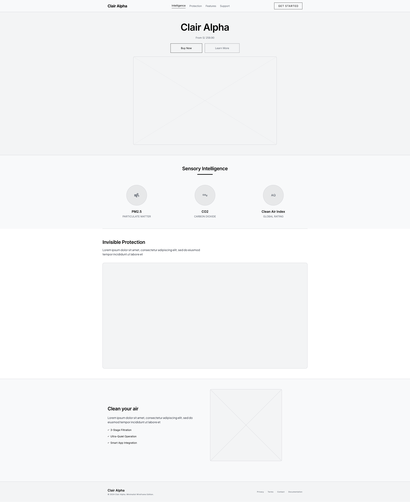

Presentación principal de Clair Alpha. Este esquema define la jerarquía principal del sitio. En la parte superior, se establece un Hero Section con mensajes claros y botones de conversión inmediata. 
La sección central de Sensory Intelligence utiliza una estructura de tres columnas para presentar las métricas clave (PM2.5, CO2 e Índice de Aire), permitiendo que el usuario entienda el valor del monitoreo de un vistazo. Finaliza con bloques de imagen y texto alternados para explicar la integración del dispositivo en espacios físicos.

**Product**

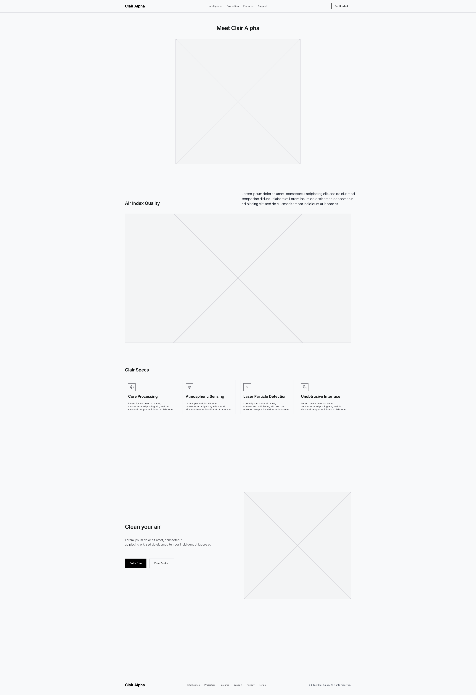

Detalle técnico y funcional del dispositivo. Se enfoca en la arquitectura técnica del dispositivo. Utiliza un layout de rejilla (grid) para organizar las "Clair Specs", donde cada tarjeta contiene un icono, un título y una descripción breve. Este diseño está pensado para descomponer conceptos complejos 
(como sensores láser o procesamiento de datos) en fragmentos de información digeribles. Incluye un pie de página con un CTA de refuerzo para incentivar la compra tras leer las especificaciones.

**Pricing**

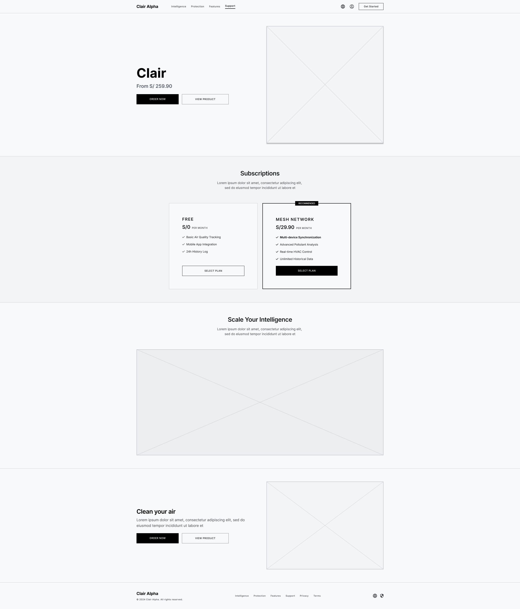

Estructura de costos de los servicios de Clair Alpha. La estructura está diseñada para facilitar la comparativa de servicios. Presenta dos contenedores principales que separan el plan gratuito del plan avanzado ("Mesh Network"). 
Cada contenedor detalla mediante una lista de viñetas las funcionalidades incluidas, permitiendo al usuario diferenciar rápidamente entre el monitoreo local y la gestión centralizada multidispositivo. Además, el diseño ofrece una visualización limpia de los costos.

**About**

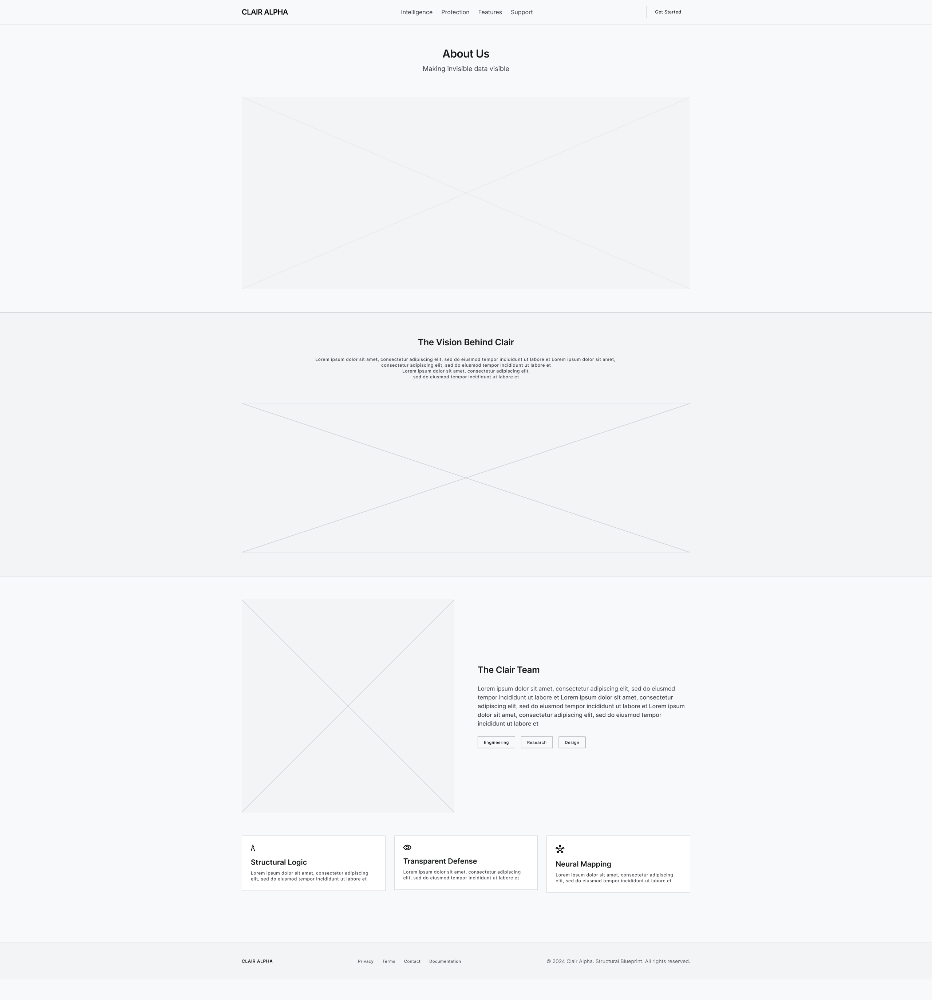

Sección dedicada a la visión de la empresa y el equipo. En la parte inferior, se reserva un espacio para el "Clair Team", organizando al equipo por etiquetas funcionales (Ingeniería, Diseño, Investigación) para proyectar confianza y multidisciplinariedad


### 5.3.2. Landing Page Mock-up.

**Home**


Implementación visual final con un estilo minimalista y tecnológico. Se sustituyen los contenedores vacíos por imágenes fotorrealistas que muestran el dispositivo integrado en oficinas.
Los indicadores de calidad del aire ahora incluyen micro-interacciones visuales, como anillos de progreso y estados de color (verde para "Pristine Air"), que permiten una lectura intuitiva y rápida del estado ambiental.

**Product**

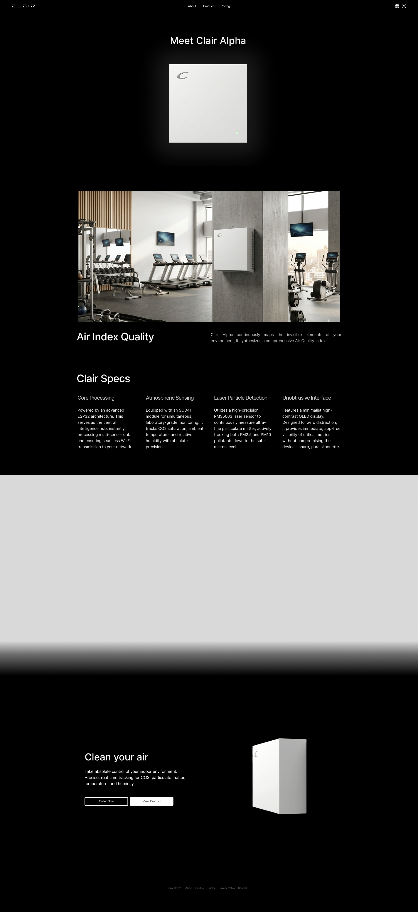

Diseño detallado que muestra los componentes internos del ecosistema. Se detallan los componentes internos mediante una tipografía space grotesk y un espaciado amplio que evita la saturación visual. 
Se han integrado los nombres específicos de los sensores (SCD41 y PMS5003) para dar credibilidad técnica al producto.

**Pricing**

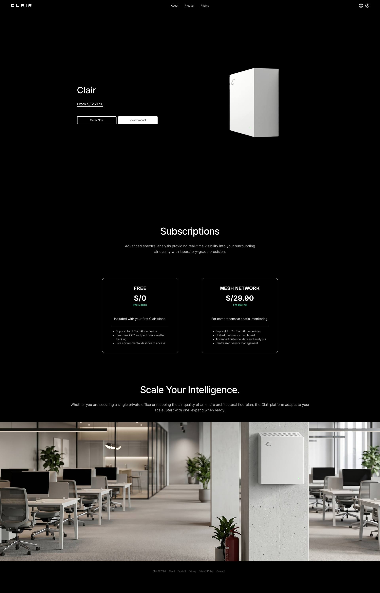

Interfaz de suscripción con un enfoque limpio y directo. Se utilizan tarjetas con bordes definidos y botones de acción claros. Los iconos de moneda y los botones de compra (CTA) 
siguen una estética de alto contraste (blanco sobre negro), asegurando que el proceso de selección de plan sea visualmente directo y libre de distracciones.

**About**

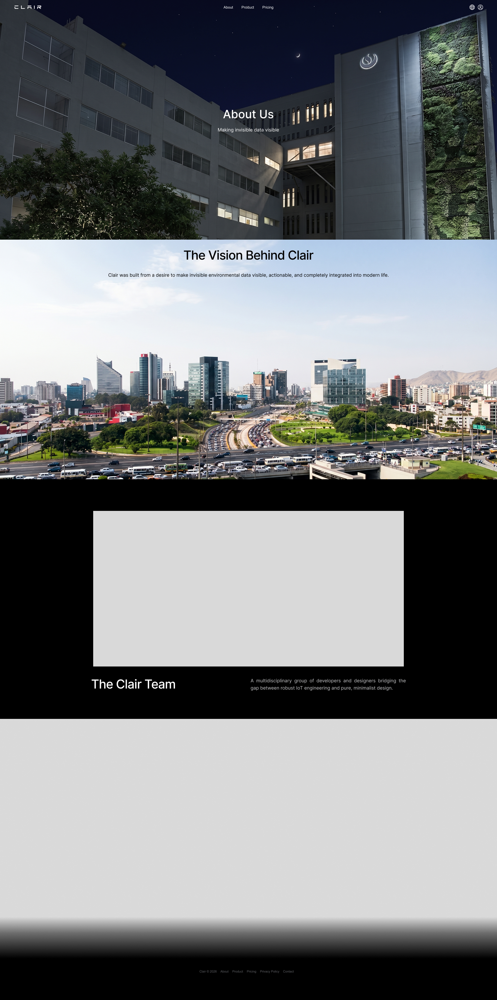

Este mockup utiliza la fotografía de alto impacto como eje central para conectar emocionalmente con el usuario. La sección presenta al equipo multidisciplinario con un diseño elegante que equilibra el espacio en blanco y el contenido textual.


## 5.4. Applications UX/UI Design.
Esta sección está dedicada al diseño de la experiencia de usuario (UX) y la interfaz de usuario (UI) de las aplicaciones que conforman la solución. El objetivo es crear interfaces funcionales, accesibles y visualmente coherentes que respondan a las necesidades y expectativas de los usuarios finales.

### 5.4.1. Applications Wireframes.

En esta sección se presentan los wireframes de las aplicaciones, que muestran el diseño estructural y la disposición de los elementos clave para la experiencia de usuario. 

**Web Application**

**Login**

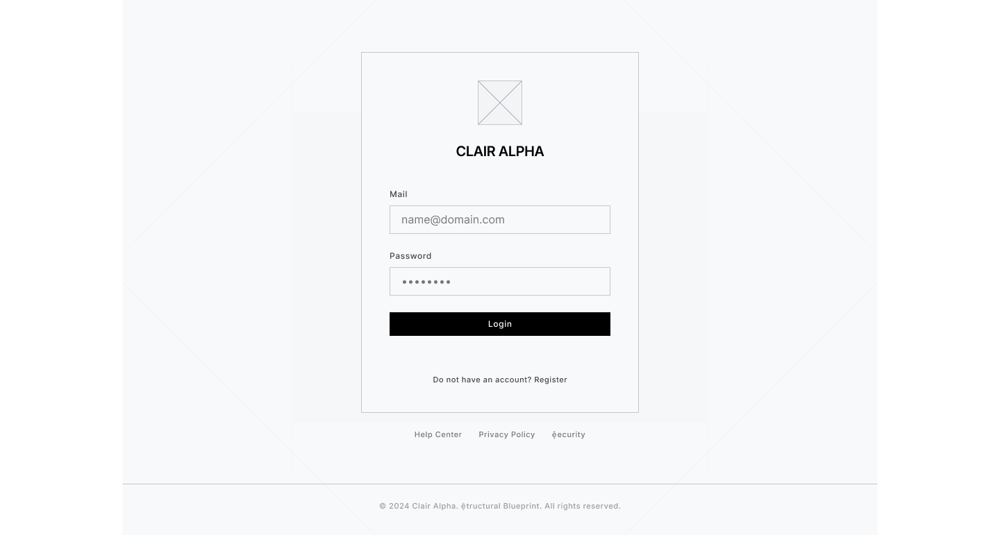

La interfaz de autenticación presenta un diseño centralizado y minimalista que prioriza la claridad funcional. El wireframe utiliza un contenedor de bordes definidos sobre un fondo neutro, integrando campos de entrada directos para credenciales y un botón de acción de alto contraste, lo que refuerza una estética tecnológica y ordenada coherente con el ecosistema de Clair.

**Register**

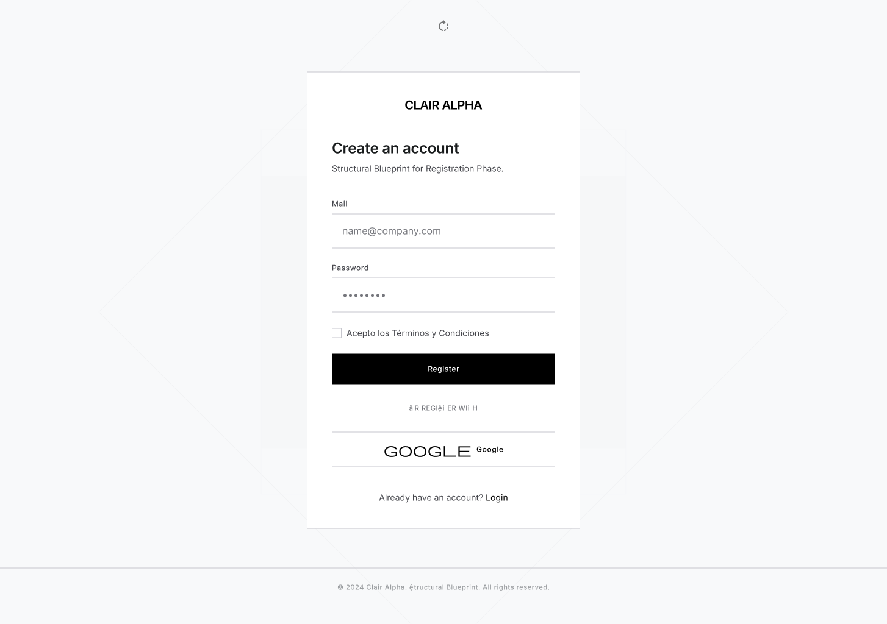

El diseño de registro mantiene la coherencia visual mediante una estructura vertical limpia que facilita el flujo de usuario. Este wireframe integra campos de entrada estándar, un selector para términos legales y una opción de autenticación social con Google, logrando un equilibrio entre simplicidad y funcionalidad bajo una estética técnica y minimalista.

**Overview**

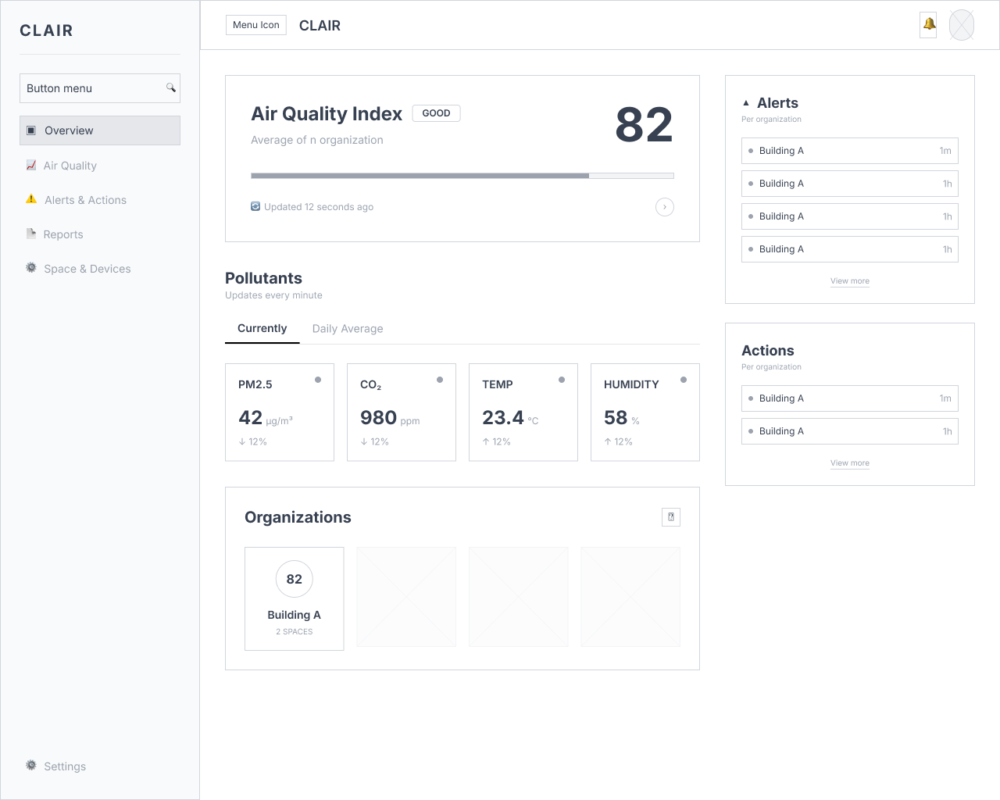

La interfaz principal despliega un tablero de control avanzado con un estilo "dark mode" que resalta métricas críticas de calidad de aire mediante una jerarquía visual clara. El diseño utiliza tarjetas modulares para organizar contaminantes como PM2.5 y CO₂, integrando gráficos de barras de estado y paneles laterales de alertas en tiempo real, lo que ofrece una experiencia analítica, técnica y altamente funcional para la gestión de múltiples organizaciones.

**Space & Devices**

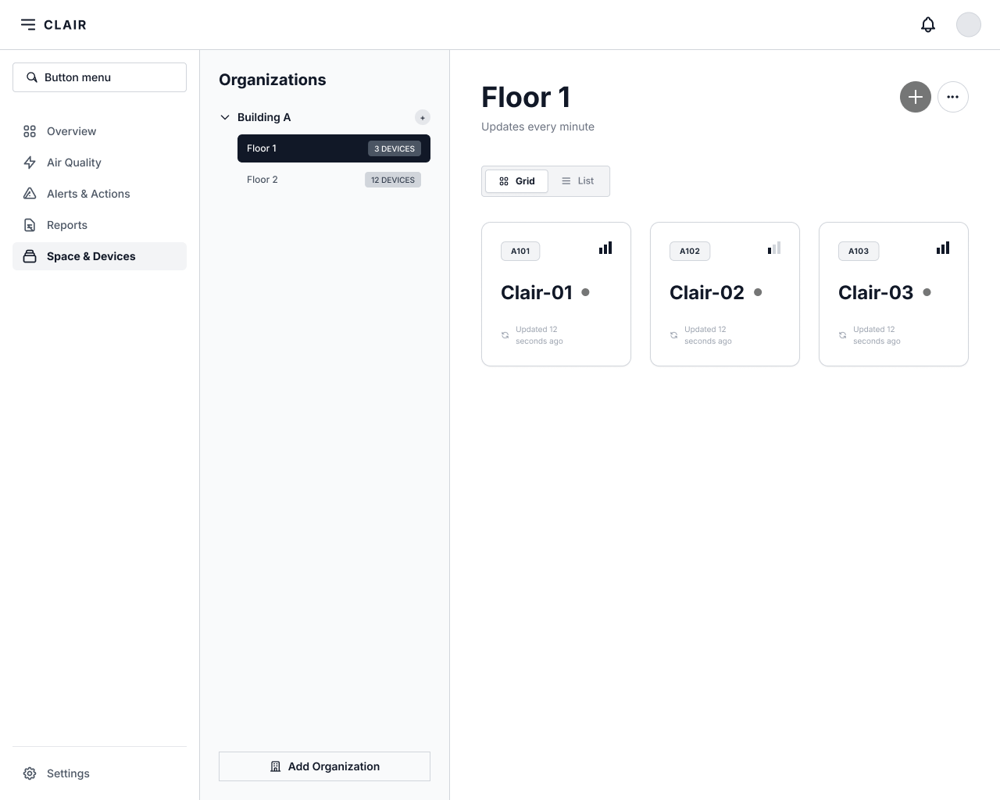

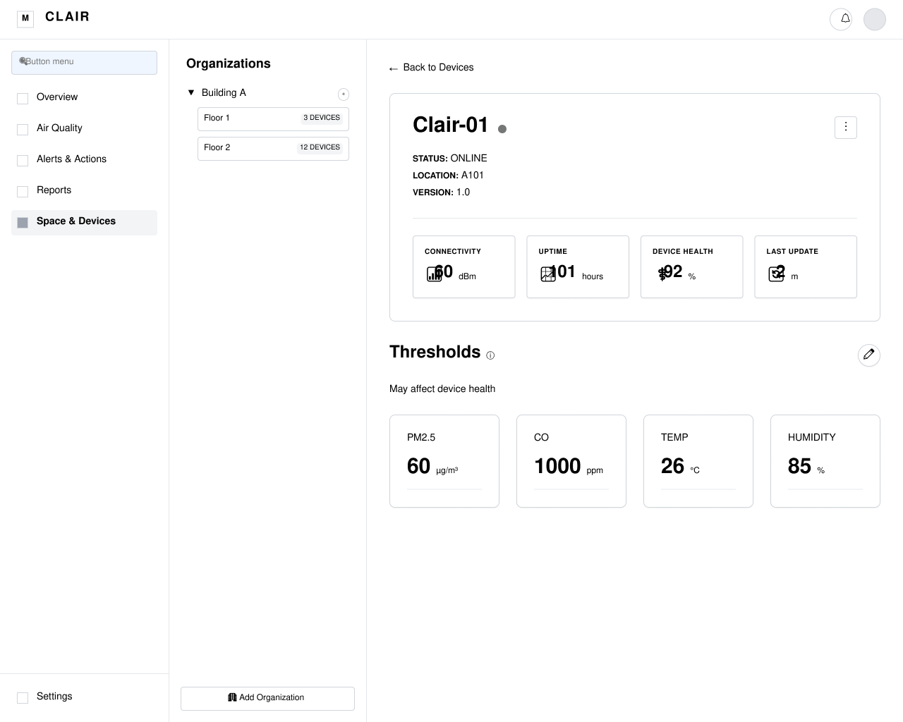

La interfaz de gestión de dispositivos presenta una estructura organizada mediante un panel de navegación jerárquico que facilita la administración de organizaciones y espacios. El diseño utiliza tarjetas de inventario detalladas y una vista individual para monitorear el estado técnico de cada sensor, integrando indicadores de conectividad, salud del dispositivo y umbrales personalizados bajo una estética limpia y profesional.

**Air Quality**

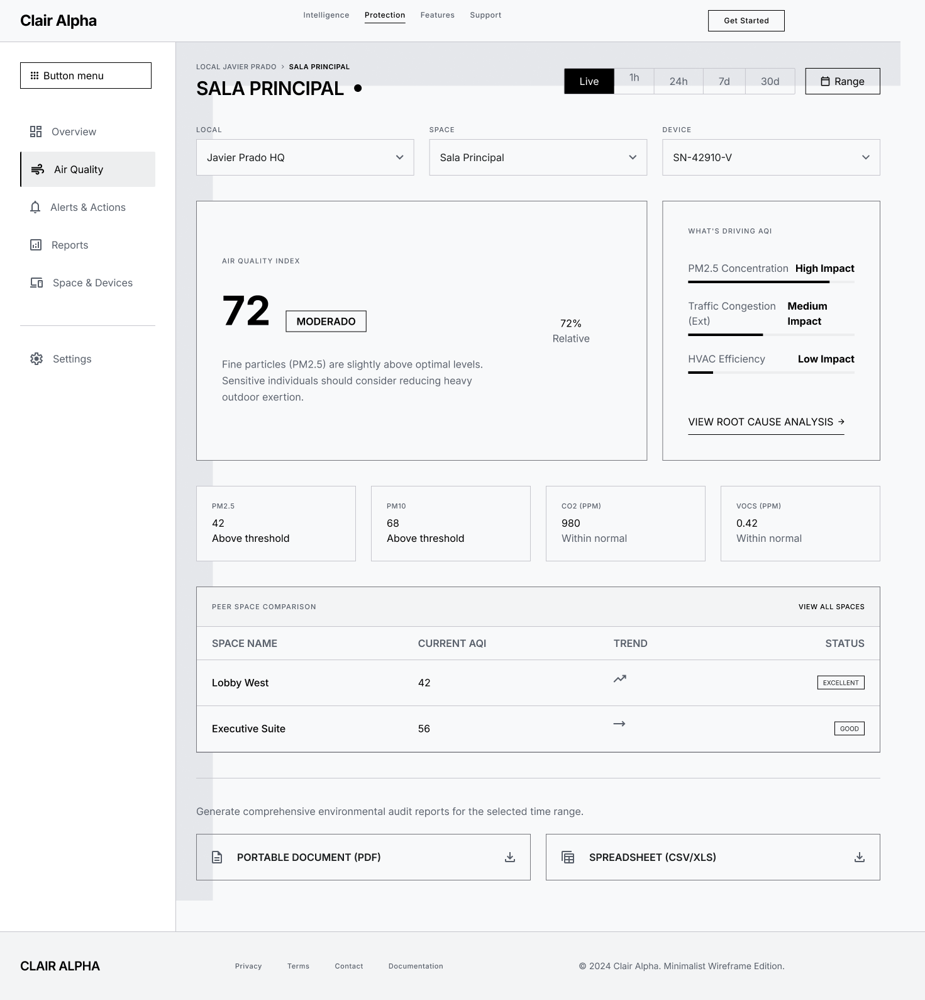

La interfaz de análisis ambiental presenta un tablero detallado que permite la visualización de métricas en tiempo real y periodos históricos mediante selectores de tiempo y ubicación. El diseño integra tarjetas de diagnóstico para múltiples contaminantes, un panel de análisis de causa raíz y una comparativa entre espacios, culminando en una sección de generación de reportes técnicos en formatos PDF y CSV que refuerza el enfoque profesional y orientado a datos del ecosistema Clair.

**Alerts & Actions**

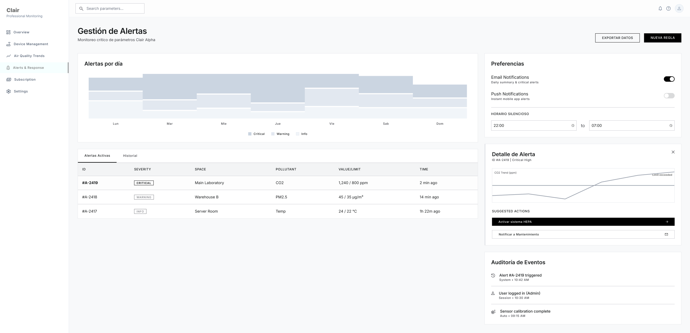

La interfaz de gestión de alertas ofrece un centro de control operativo que combina el monitoreo crítico con la capacidad de respuesta inmediata. El diseño destaca un gráfico de distribución semanal de incidencias y una tabla detallada de alertas activas, integrando paneles laterales para la configuración de notificaciones, visualización de tendencias específicas por evento y un registro de auditoría, lo que permite una administración proactiva y técnica de las contingencias ambientales en el ecosistema Clair.

**Reports**

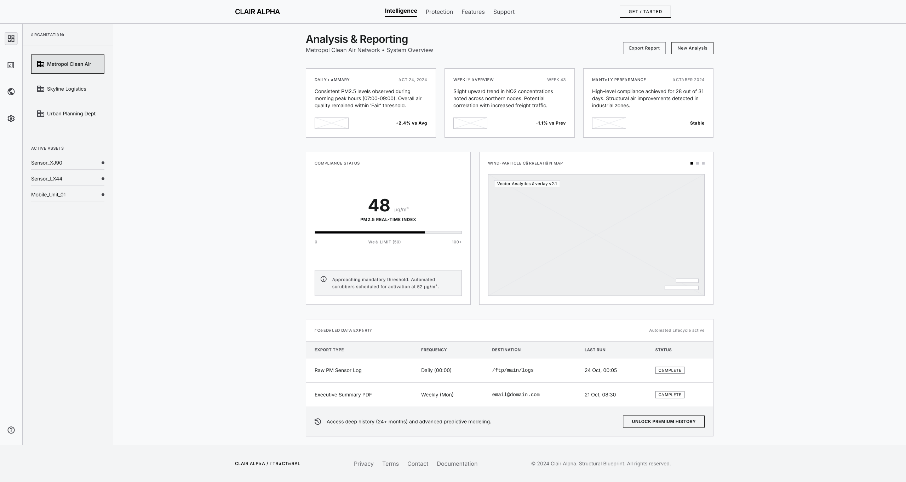

La interfaz de reportes presenta un panel analítico robusto diseñado para la interpretación de datos estratégicos y el cumplimiento normativo. El wireframe organiza la información mediante tarjetas de resumen diario, semanal y mensual, integrando visualizaciones de correlación de partículas y un gestor de exportaciones automatizado que detalla la frecuencia y el estado de los registros. Este diseño facilita una supervisión integral del ecosistema Clair, permitiendo desde el análisis técnico profundo hasta la generación de resúmenes ejecutivos con una estética limpia y profesional.

**Mobile Application**

**Login**

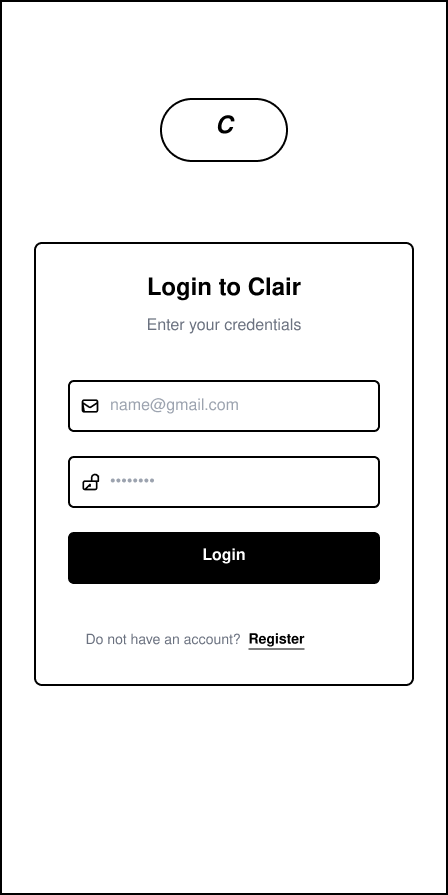

La interfaz de autenticación móvil adopta un diseño vertical y centrado, adaptado a la ergonomía del pulgar. El wireframe simplifica los elementos a un campo de correo electrónico, un botón de acción primario ("Login") de alto contraste y un enlace textual para el registro de nuevos usuarios. Este enfoque minimalista reduce la carga cognitiva y acelera el acceso a la plataforma, manteniendo la estética limpia y tecnológica característica de Clair en un entorno mobile-first.

**Register**

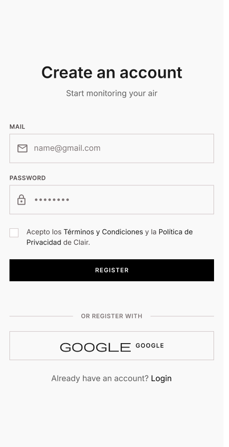

El flujo de registro en dispositivos móviles prioriza la eficiencia y la seguridad mediante una estructura de pasos clara. El wireframe incorpora campos de entrada para correo electrónico y contraseña, acompañados de un componente de verificación (checkbox) para la aceptación de términos legales. Adicionalmente, se integran botones de autenticación (Google) para facilitar el proceso, culminando con un enlace de navegación para usuarios ya registrados, todo ello dentro de un contenedor de bordes redondeados que sugiere una interfaz amigable y moderna.

**Dashboard**

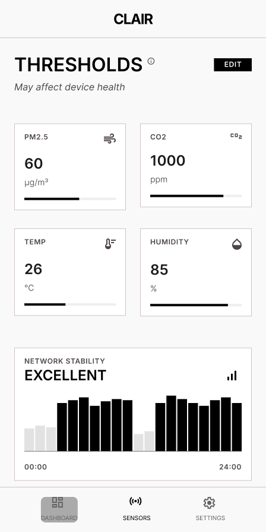

La pantalla principal de la aplicación presenta un panel de control resumido pero altamente informativo, ideal para la supervisión rápida. 

**Sensor Selection**

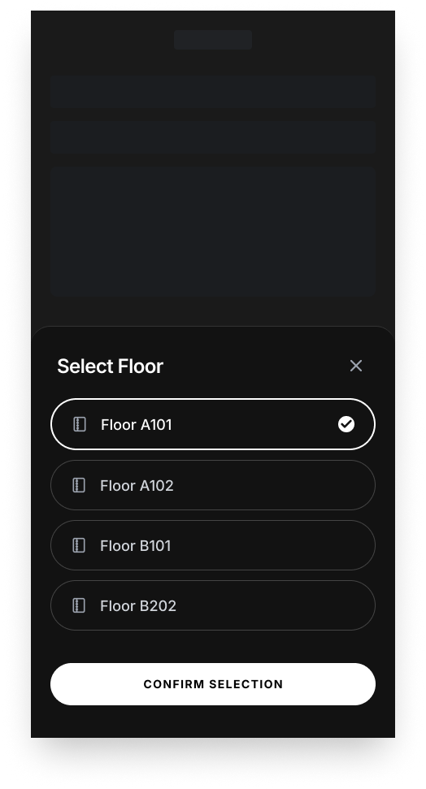

La interfaz de selección de ubicación o dispositivo utiliza un patrón de navegación jerárquica común en móviles: una lista de selección que ocupa la mayor parte de la pantalla. Este patrón modal o de pantalla dedicada guía al usuario a través de la estructura física de la organización (Edificio → Piso) antes de visualizar datos específicos, reduciendo la complejidad y enfocando la atención en la decisión actual.

**Sensor Detail**

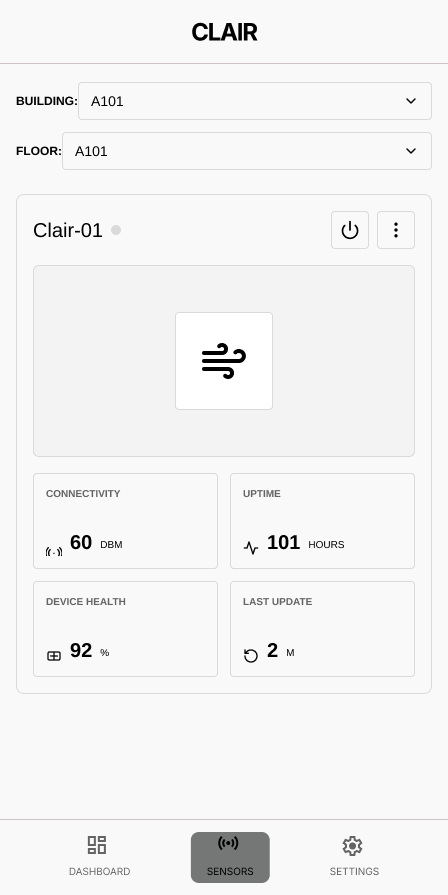

La vista de detalle de un sensor específico concentra la información técnica más relevante en una sola pantalla optimizada para consultas rápidas. Este diseño de alta densidad de información pero visualmente ordenado permite a los técnicos y administradores evaluar el estado operativo de un sensor de forma inmediata desde su dispositivo móvil. 

**Settings**

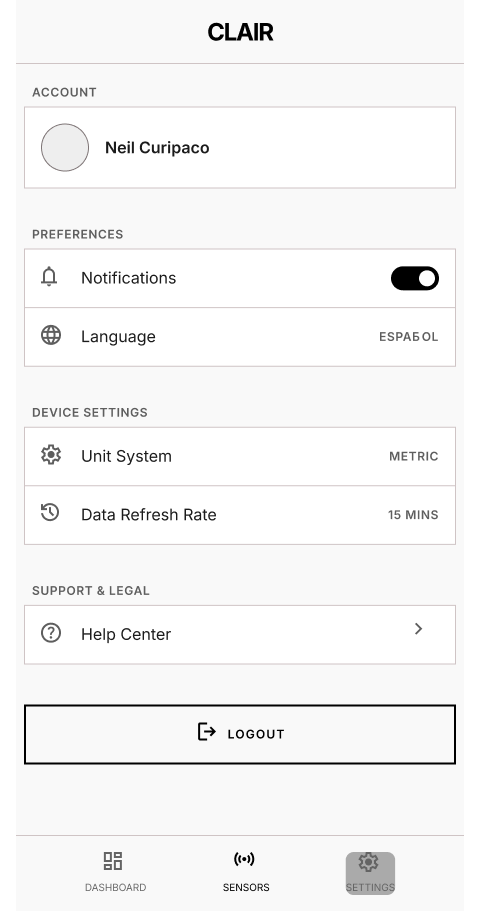

La pantalla de configuración sigue el estándar de plataformas móviles (iOS/Android) mediante una vista de lista desplazable (table view) agrupada por categorías funcionales. La presencia de un botón de "LOGOUT" claramente diferenciado al final de la lista refuerza las normas de usabilidad y seguridad en aplicaciones móviles, ofreciendo un control total sobre la sesión del usuario.

**Alerts**

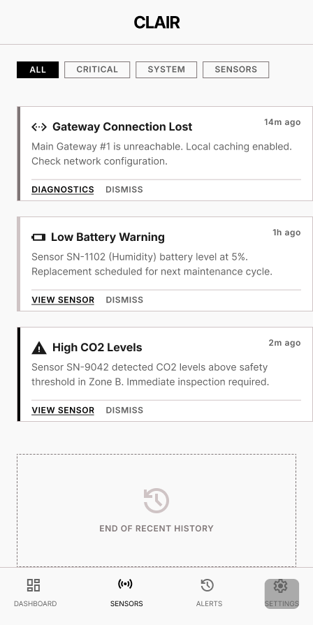

La pantalla de alertas consolida las notificaciones generadas por el sistema Clair, organizadas por niveles de prioridad para facilitar la atención diferenciada por parte del usuario. Cada alerta presenta un encabezado descriptivo, un mensaje contextual y un par de acciones rápidas que permiten responder de manera inmediata o ignorar la notificación. Refleja una arquitectura de notificaciones que equilibra la urgencia operativa con el mantenimiento programado, siguiendo las mejores prácticas de diseño de centros de control y monitoreo en aplicaciones móviles industriales o de seguridad.

### 5.4.2. Applications Wireflow Diagrams.
Esta sección presenta los diagramas de flujo (wireflows) de las aplicaciones, que ilustran la navegación y las interacciones del usuario entre las diferentes pantallas, facilitando la comprensión del recorrido dentro del sistema.

**User Goals**

| ID | User Goal | Descripción operativa |
|:---:|:---|:---|
| **UG01** | Garantizar la salud ambiental | Mantener un aire fresco y libre de viciamento para que los clientes permanezcan más tiempo en el local. |
| **UG02** | Demostrar salubridad | Contar con evidencia tangible (reportes) de que el local cumple con estándares de aire seguro para clientes y fiscalizaciones. |
| **UG03** | Optimizar la productividad | Evitar que los empleados sufran de fatiga o pérdida de concentración por mala ventilación. |
| **UG04** | Controlar síntomas crónicos | Reducir la frecuencia de episodios de rinitis alérgica, asma o dolores de cabeza asociados al ambiente cargado. |
| **UG05** | Validar acciones preventivas | Saber con certeza si sus hábitos de limpieza y ventilación están funcionando realmente para mejorar la calidad del aire. |
| **UG06** | Crear un refugio seguro | Garantizar que, a pesar de la contaminación exterior de la ciudad, el interior de su hogar sea un espacio de respiración pura. |

**Web Application**

**Wireflow: Generación y gestión de reportes**

User Goals cubiertos:

| ID | User Goal |
|:---|:---|
| UG02 | Demostrar salubridad: Contar con evidencia tangible (reportes) de que el local cumple con estándares de aire seguro para clientes y fiscalizaciones |
| UG05 | Validar acciones preventivas: Saber con certeza si sus hábitos de limpieza y ventilación están funcionando realmente para mejorar la calidad del aire |

El usuario accede al Overview y navega a la sección Reports mediante un clic en el menú lateral. Una vez en la pantalla Reports, selecciona el tipo de reporte deseado entre las opciones disponibles (Diario AQI, Semanal Alertas, Mensual Cumplimiento). El sistema presenta una pantalla de configuración donde el usuario puede ajustar el rango de fechas y seleccionar las zonas a incluir. Al hacer clic en "Generar reporte", el sistema recopila los datos del período seleccionado, muestra una barra de progreso y genera el reporte con gráficos, métricas clave y comparativas con estándares. Finalmente, el usuario puede exportar el reporte en formato PDF o compartirlo a través de las opciones del sistema, recibiendo una confirmación de que la acción fue exitosa y quedando registrada en el historial.

UG02 y UG05 comparten el mismo wireflow para Web Application, ya que ambos se resuelven a través de la funcionalidad de Reports. La diferencia radica en el propósito: UG02 busca evidencia para terceros (fiscalizaciones, clientes), mientras que UG05 busca validación personal (verificar si sus hábitos de limpieza y ventilación están funcionando). En ambos casos, el flujo de generación de reportes es idéntico.


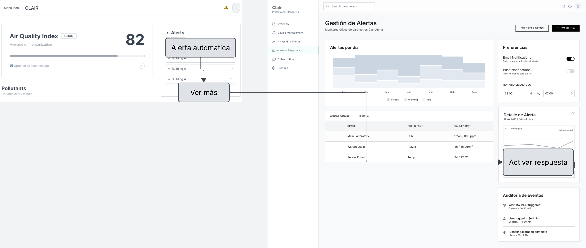

**Wireflow: Generación y gestión de reportes**

**User Goals cubiertos:**

| ID | User Goal |
|:---|:---|
| UG02 | Demostrar salubridad: Contar con evidencia tangible (reportes) de que el local cumple con estándares de aire seguro para clientes y fiscalizaciones |
| UG05 | Validar acciones preventivas: Saber con certeza si sus hábitos de limpieza y ventilación están funcionando realmente para mejorar la calidad del aire |

El usuario accede al Overview y visualiza el Dashboard principal con los indicadores de calidad del aire en tiempo real. Desde allí, navega a la sección Reports mediante un clic en el menú lateral, lo que lo lleva a la pantalla Reports donde se muestra la lista de reportes disponibles. El usuario selecciona el tipo de reporte deseado (Diario AQI, Semanal Alertas o Mensual Cumplimiento), y el sistema presenta una pantalla de configuración con opciones para ajustar el rango de fechas y seleccionar las zonas a incluir. Una vez configurados los parámetros, el usuario hace clic en "Generar reporte", y el sistema recopila los datos del período seleccionado, muestra una barra de progreso y genera el reporte. Finalmente, el sistema muestra un mensaje de confirmación y registra la acción en el historial del usuario.

UG02 y UG05 comparten el mismo wireflow para Web Application, ya que ambos se resuelven a través de la funcionalidad de Reports. La diferencia radica en el propósito: UG02 busca evidencia para terceros (fiscalizaciones, clientes), mientras que UG05 busca validación personal (verificar si sus hábitos de limpieza y ventilación están funcionando). En ambos casos, el flujo de generación de reportes es idéntico.

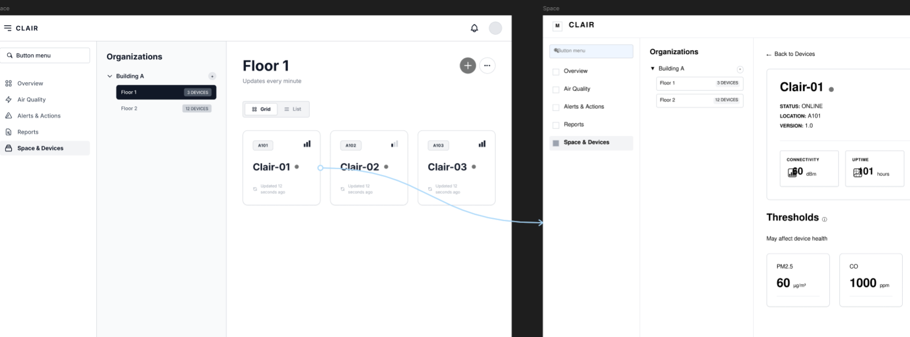

**Wireflow: Configuración de umbrales personalizados (Rules Builder)**

**User Goals cubiertos:**

| ID | User Goal |
|:---|:---|
| UG04 | Controlar síntomas crónicos: Reducir la frecuencia de episodios de rinitis alérgica, asma o dolores de cabeza asociados al ambiente cargado |

El usuario accede al Overview y visualiza el Dashboard principal con los indicadores de calidad del aire en tiempo real. Desde allí, navega a la sección Alerts & Actions mediante un clic en el menú lateral. Dentro de Alerts & Actions, el usuario accede a la pestaña o sección "Rules Builder" / "Configurar reglas", donde el sistema presenta una interfaz para crear reglas personalizadas que incluye selección de métrica (CO2, VOC, PM2.5, etc.), operador (mayor que, menor que), umbral numérico y acción asociada (enviar notificación, activar ventilación, etc.). El usuario configura una regla personalizada basada en sus alergias o síntomas, seleccionando por ejemplo la métrica "VOC" o "PM2.5", definiendo un umbral específico (ej: "> 250 µg/m³") y asignando una acción (ej: "Enviar notificación" o "Activar ventilación"). El sistema valida la regla y la guarda en la lista de reglas activas del usuario. A partir de entonces, el sistema monitorea en tiempo real los sensores y, cuando la métrica supera el umbral definido, dispara automáticamente la acción configurada. El usuario recibe entonces una alerta preventiva en el Dashboard y en la lista de Alerts & Actions, indicando que se ha superado el umbral configurado específicamente para su alergia.

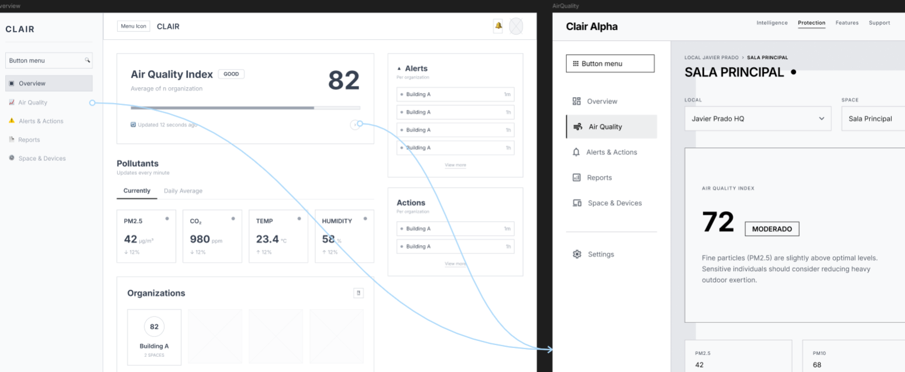

**Wireflow: Verificación de calidad del aire y cumplimiento de estándares**

**User Goals cubiertos:**

| ID | User Goal |
|:---|:---|
| UG06 | Crear un refugio seguro: Garantizar que, a pesar de la contaminación exterior de la ciudad, el interior de su hogar sea un espacio de respiración pura |

El usuario accede al Overview y visualiza el Dashboard principal con los indicadores de calidad del aire en tiempo real y el estado general por zonas. Desde allí, navega a la sección Air Quality mediante un clic en el menú lateral,  donde se muestran los registros de los sensores Clair (CO2, VOC, temperatura, humedad) y el indicador AQI (Bueno/Moderado/Malo). El usuario visualiza el indicador AQI, y el sistema muestra el estado actual del aire (ej: "Bueno - El aire es saludable") junto con las tendencias recientes. Opcionalmente, el usuario puede navegar a la sección Reports mediante un clic en el menú lateral, donde localiza el widget o área que indica el cumplimiento de estándares OMS. El sistema presenta entonces una comparativa indicando si se cumple o no con los estándares de la Organización Mundial de la Salud, mostrando información de métricas clave (CO2, VOC, etc.) frente a los límites recomendados por la OMS. De esta manera, el usuario puede verificar que el aire interior es saludable y que su hogar constituye un "refugio seguro".

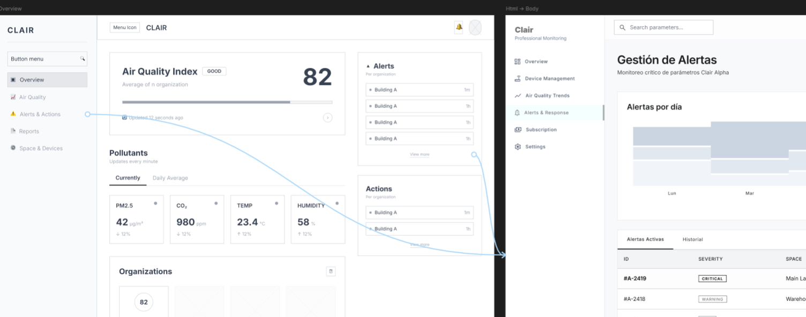


**Mobile Application**

**Wireflow: Gestión de alertas y activación de respuestas**

**User Goals cubiertos:**

| ID | User Goal |
|:---|:---|
| UG01 | Garantizar la salud ambiental: Mantener un aire fresco y libre de viciamento para que los clientes permanezcan más tiempo en el local |
| UG04 | Controlar síntomas crónicos: Reducir la frecuencia de episodios de rinitis alérgica, asma o dolores de cabeza asociados al ambiente cargado |

El usuario ingresa a la aplicación y visualiza el Dashboard principal, donde se muestran los indicadores de calidad del aire en tiempo real y el estado general por zonas. El sistema monitorea continuamente los sensores y, cuando detecta una condición crítica (UG01: CO2/VOC elevado) o la superación de un umbral personalizado configurado desde la Web App (UG04), genera una notificación emergente en la parte superior de la pantalla. El usuario ingresa a la lista de alerts mediante un tap en el ícono de campana o directamente en la notificación, accediendo a la pantalla Alerts donde la alerta aparece destacada con información contextual. El sistema muestra cada alerta con título, mensaje y botones de acción ("Activar respuesta" si está configurada, "Descartar", "Ver más"). Si el usuario realiza tap en el botón "Activar respuesta" correspondiente a la alerta (siempre que la acción haya sido preconfigurada desde la Web App), el sistema ejecuta la acción correctiva de inmediato (ej: activar ventilación, enviar notificación al administrador), muestra un toast o snackbar de confirmación y marca la alerta como "En proceso" o "Resuelta". Opcionalmente, el usuario puede tap en "Descartar" o "Recordar más tarde", en cuyo caso la alerta se archiva o se programa para reapparecer después de un tiempo definido.

UG01 y UG04 comparten el mismo wireflow para Mobile Application, ya que ambos flujos se detonan por una alerta (automática por niveles críticos o preventiva por umbral personalizado) y conducen a la misma pantalla Alerts para la gestión de la respuesta. La diferencia radica en el origen de la regla (UG01: reglas por defecto del sistema / UG04: reglas personalizadas configuradas desde Web App), pero la experiencia de usuario en mobile es idéntica.

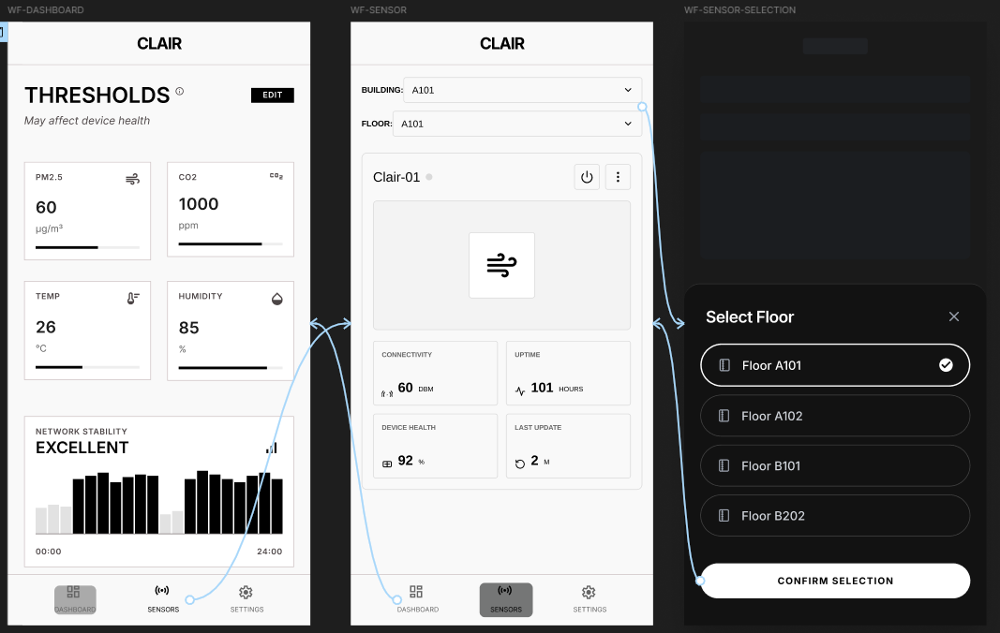

**Wireflow: Verificación de calidad del aire (Refugio seguro)**

**User Goals cubiertos:**

| ID | User Goal |
|:---|:---|
| UG06 | Crear un refugio seguro: Garantizar que, a pesar de la contaminación exterior de la ciudad, el interior de su hogar sea un espacio de respiración pura |

El usuario ingresa a la aplicación y visualiza el Dashboard principal. En esta pantalla, el sistema muestra los indicadores de calidad del aire (CO2, VOC, temperatura, humedad), el estado general por zonas y el indicador AQI (Bueno/Moderado/Malo). El usuario visualiza el AQI y los valores de los sensores directamente en el Dashboard. El sistema presenta el estado actual del aire, indicando si es saludable o no. Al observar que los indicadores están dentro de rangos saludables y que el AQI es "Bueno" o "Moderado", el usuario confirma que su hogar es un "refugio seguro", es decir, un espacio de respiración pura a pesar de la contaminación exterior del entorno urbano.

UG06 en Mobile se resuelve íntegramente en el Dashboard, ya que esta pantalla muestra el AQI y los valores de calidad del aire en tiempo real. No existe funcionalidad equivalente al widget de cumplimiento OMS en la versión mobile de Reports. El usuario valida que su hogar es un refugio seguro al observar indicadores saludables en el Dashboard.

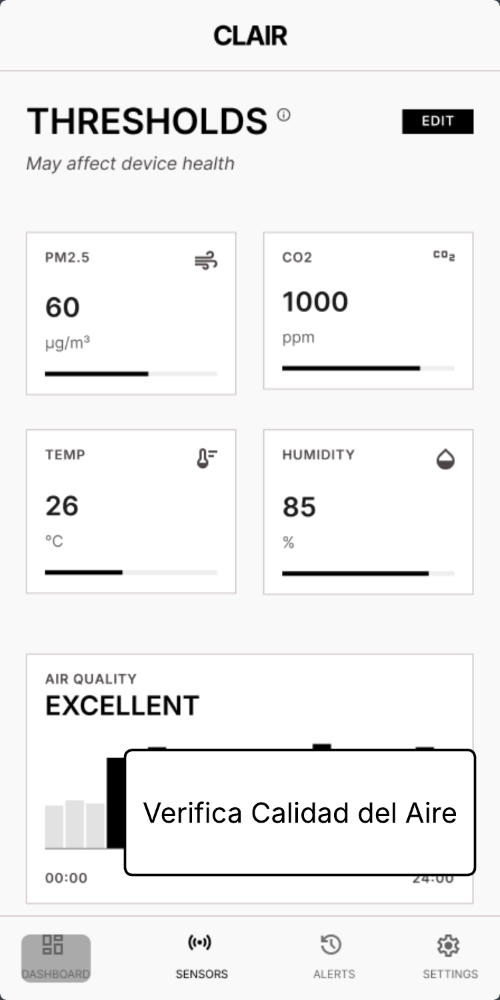


### 5.4.3. Applications Mock-ups.

**Web Application**

**Login**

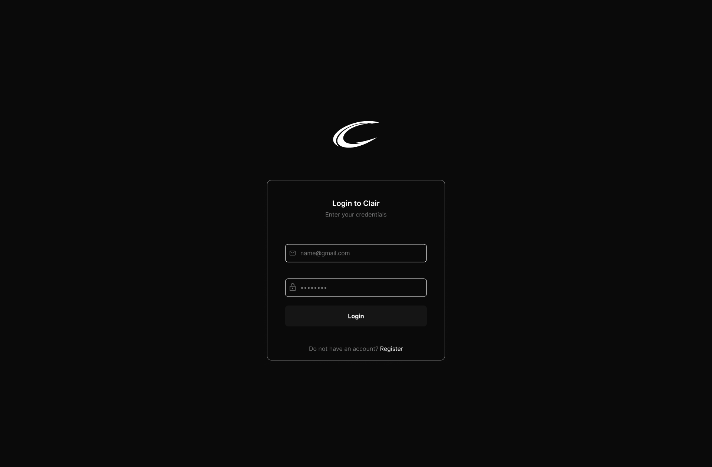

La interfaz de inicio de sesión presenta una implementación visual final con un estilo sofisticado, minimalista y tecnológico. El mockup utiliza un fondo oscuro profundo que resalta un contenedor de bordes sutiles y el logotipo central de Clair, integrando campos de entrada oscuros con íconos descriptivos y un botón de acción principal de contraste moderado, logrando una estética sobria y profesional coherente con la identidad de la marca.

**Register**

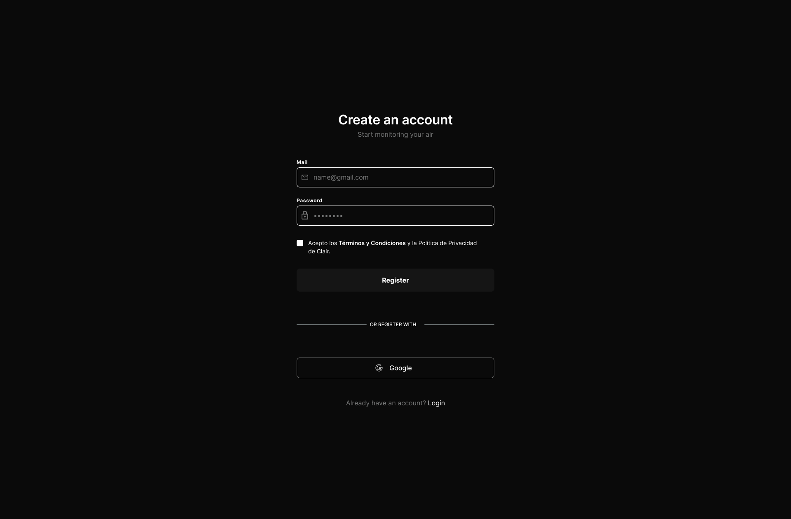

La interfaz de creación de cuenta presenta una implementación visual final sofisticada, minimalista y tecnológica, en coherencia con el diseño de login. El mockup utiliza un fondo oscuro profundo que resalta un contenedor de bordes sutiles y el logotipo de Clair, integrando campos de entrada oscuros con íconos descriptivos y un botón de acción principal de contraste moderado. El diseño incorpora además selectores de términos legales y una opción de autenticación social con Google, logrando una estética sobria y profesional.

**Overview**

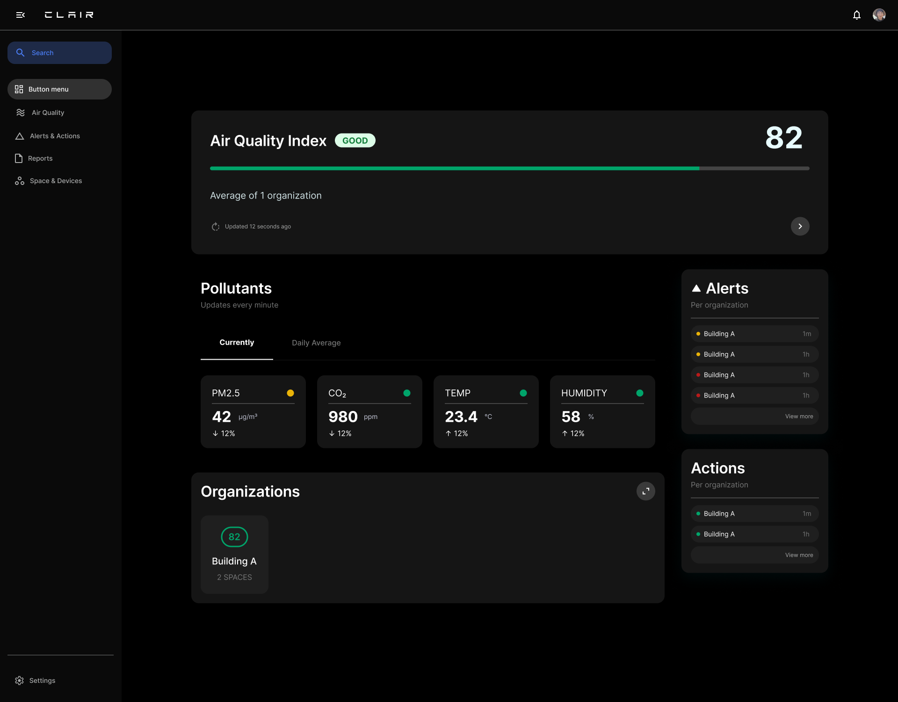

El tablero principal presenta una implementación visual final con un estilo minimalista y tecnológico, utilizando un fondo oscuro para resaltar los indicadores de calidad de aire. El diseño organiza métricas críticas como el índice de calidad de aire (AQI) y contaminantes específicos ($CO_2$, $PM2.5$) mediante tarjetas modulares de alto contraste, integrando paneles de alertas y acciones en tiempo real que refuerzan una estética técnica y funcional para el ecosistema Clair.

**Space & Devices**

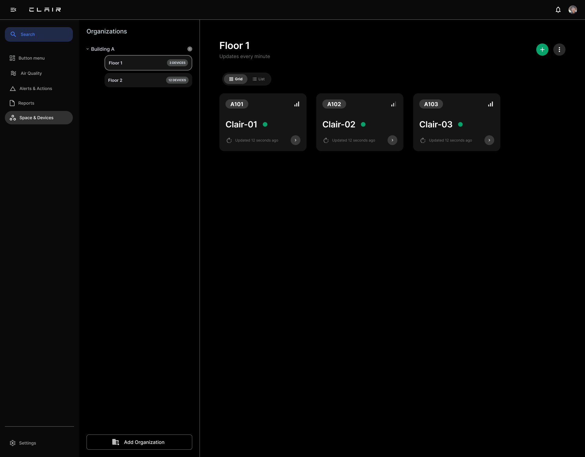

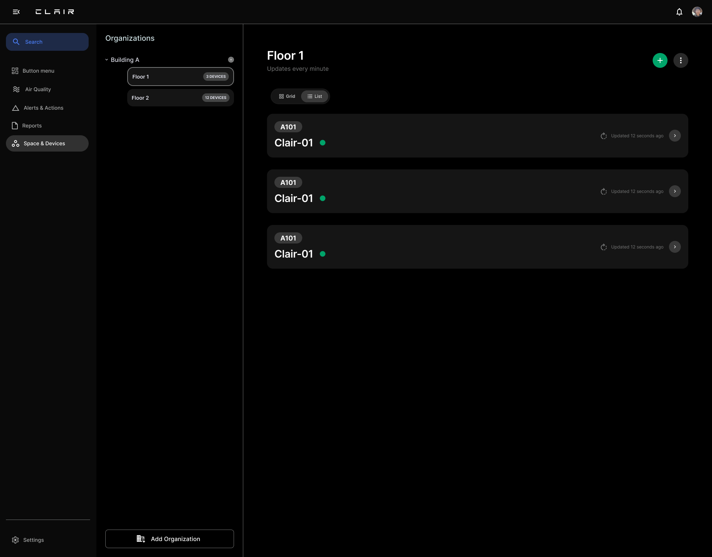

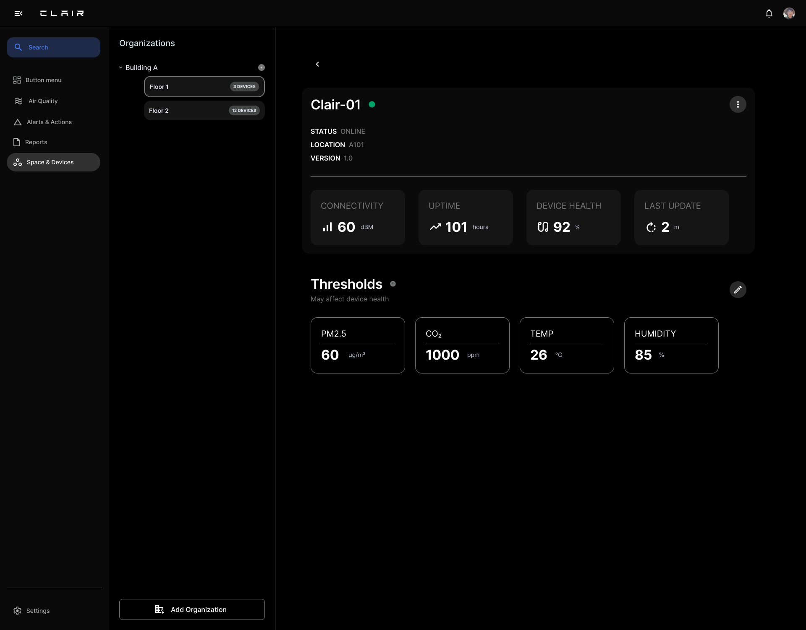

La interfaz de gestión de dispositivos se presenta con un estilo "dark mode" de alta fidelidad que optimiza la supervisión técnica de los activos. El diseño emplea una arquitectura modular mediante tarjetas interactivas que permiten alternar entre vistas de cuadrícula y lista, integrando un panel de detalle profundo para cada sensor donde se visualizan métricas de conectividad y umbrales operativos. Esta implementación logra una estética tecnológica sofisticada que facilita la administración jerárquica de espacios y organizaciones en el ecosistema Clair.

**Air Quality**

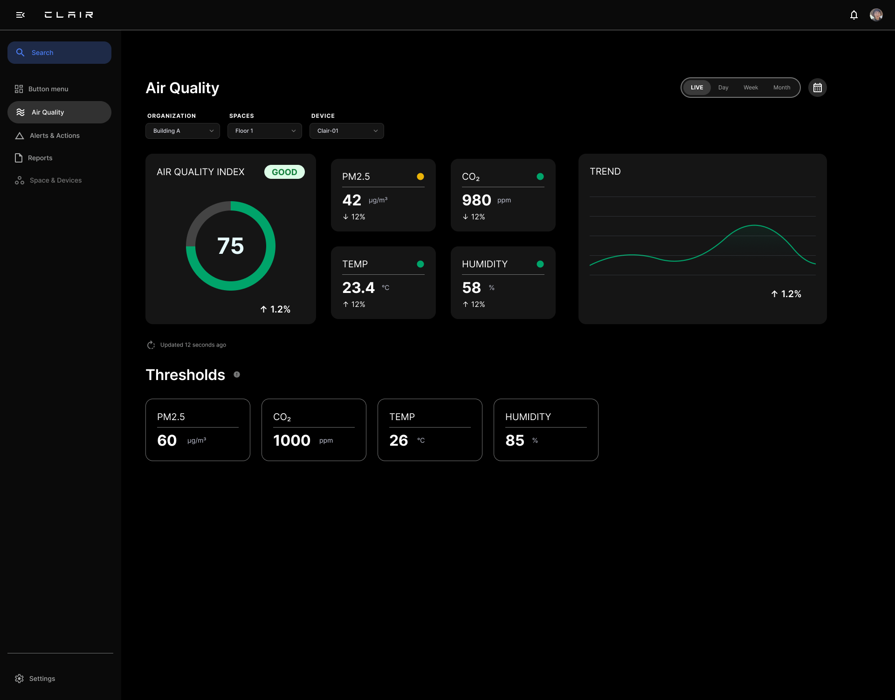

La interfaz de análisis ambiental presenta una implementación visual final sofisticada con un estilo "dark mode" que jerarquiza los datos mediante acentos de color y tipografía técnica. El mockup integra un gráfico circular progresivo para el índice de calidad de aire, tarjetas detalladas para parámetros específicos como $PM2.5$ y $CO_2$, y una sección de comparativa entre espacios, culminando en un centro de reportes especializado que refuerza la capacidad analítica y profesional del sistema Clair.

**Alerts & Actions**

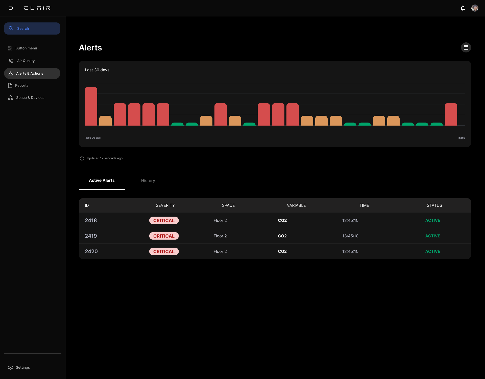

La interfaz de alertas presenta una implementación visual final sofisticada en "dark mode" que centraliza el monitoreo crítico y las respuestas automatizadas del sistema. El diseño destaca un gráfico de barras apiladas para la distribución de incidencias por severidad y una tabla de alertas activas con estados en tiempo real. La sección integra un constructor de reglas lógicas ("Rules Builder") y paneles laterales para la gestión de preferencias, detalles de eventos específicos con sugerencias de acciones automatizadas y un registro detallada de auditoría, consolidando una estética técnica y profesional para la gestión proactiva de Clair.

**Reports**

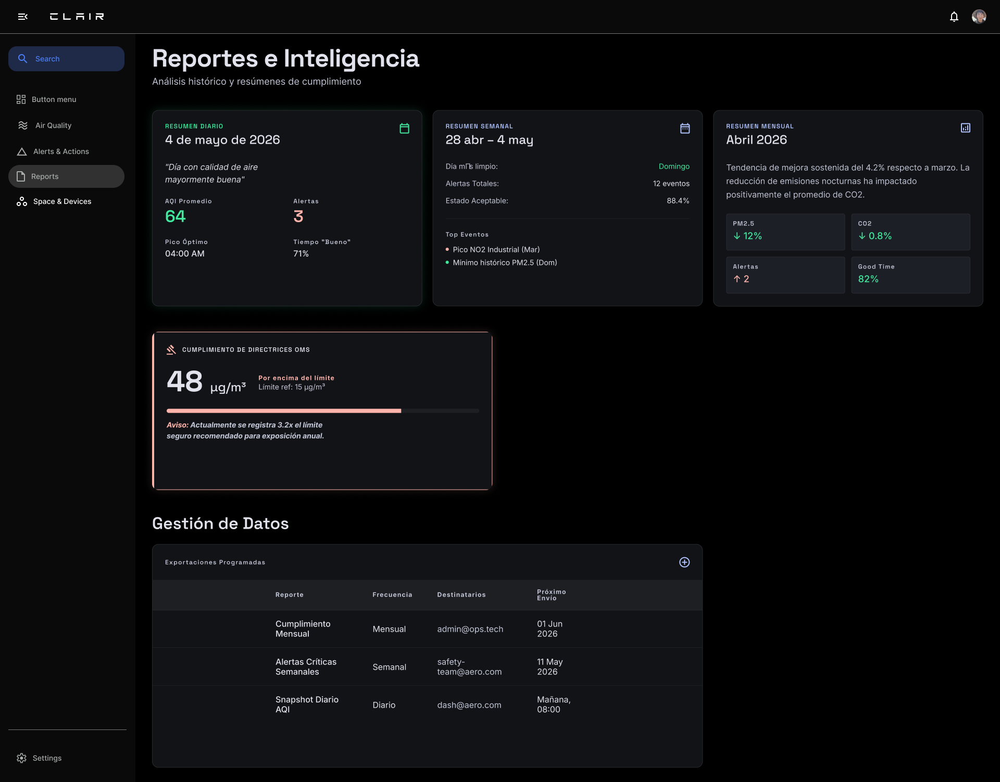

La sección presenta una implementación visual final sofisticada que transforma datos complejos en resúmenes estratégicos de cumplimiento. El diseño utiliza tarjetas de resumen temporal (diario, semanal y mensual) con tipografía técnica y acentos cromáticos para destacar tendencias de contaminantes como $CO_2$ y $PM2.5$. El mockup integra visualizaciones de correlación viento-partículas y un panel de gestión de exportaciones programadas, manteniendo una estética de "dark mode" profesional que refuerza el valor analítico del ecosistema Clair.

**Mobile Application**

**Login**

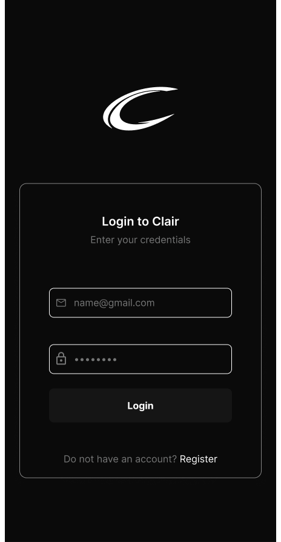

La pantalla de autenticación presenta una implementación visual final de estilo sobrio y corporativo, con fondo oscuro uniforme y el logotipo de Clair centrado en la parte superior. El mockup dispone campos de entrada de bordes redondeados con etiquetas flotantes o internas, acompañados de un botón de acción primaria ("Login") de color de contraste moderado que ocupa el ancho completo. Un enlace textual secundario ("Register") permite la navegación al flujo de creación de cuenta, manteniendo una estética limpia, profesional y alineada con la identidad tecnológica de la marca en el ecosistema móvil.

**Register**

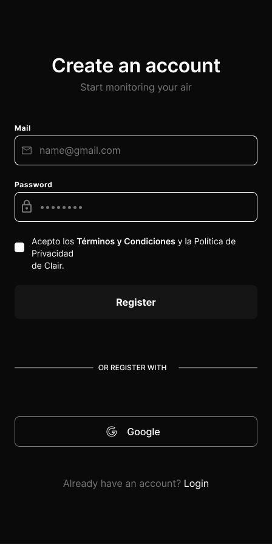

La interfaz de registro mantiene la coherencia visual con la pantalla de login, utilizando un fondo oscuro y una tarjeta central que organiza el contenido de forma vertical. El mockup integra campos de entrada para correo electrónico y contraseña, este último con un indicador visual de caracteres enmascarados ("●●●●●●●"), acompañados de un componente de verificación para la aceptación de términos y condiciones. El botón de registro principal se complementa con una opción de autenticación ("Google")mediante un contenedor secundario. Finalmente, un enlace "Login" dirige a los usuarios ya registrados, completando un flujo de alta eficiente y visualmente consistente.

**Dashboard**

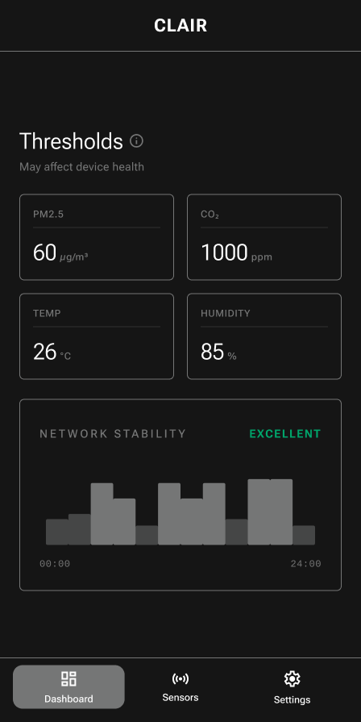

La pantalla principal de la aplicación presenta un tablero de control resumido que prioriza los indicadores críticos de calidad del aire. Este diseño permite una supervisión inmediata de la salud ambiental y de red desde el primer vistazo.

**Sensor Selection**

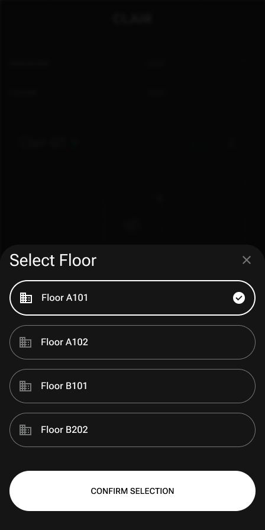

La interfaz de selección de piso o ubicación adopta un patrón de lista modal que cubre la mayor parte de la pantalla, facilitando la elección en contextos de navegación jerárquica. El mockup muestra un título superior "Select Floor" seguido de una serie de opciones textuales presentadas como botones o celdas de alto contraste y fácil pulsación. Un botón de acción primaria anclado en la parte inferior, "CONFIRM SELECTION", permite validar la elección y avanzar en el flujo. Este diseño es ideal para espacios con múltiples niveles o edificios, reduciendo pasos y errores en la selección.

**Sensor Detail**

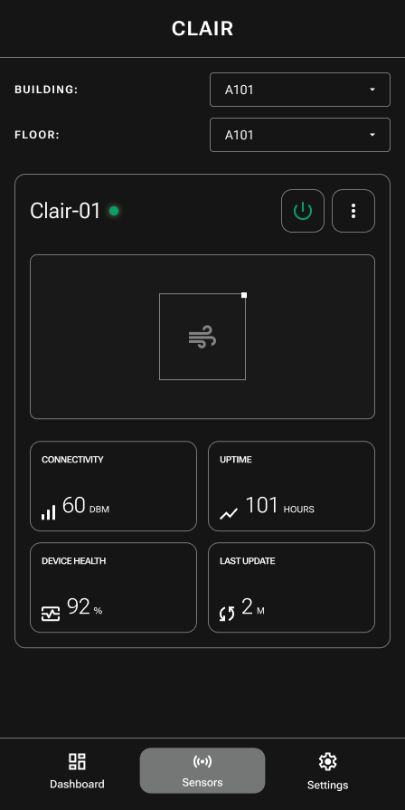

La vista de detalle de un sensor específico concentra información técnica operativa en una pantalla optimizada para diagnóstico rápido. Este diseño ofrece una experiencia de monitoreo técnico completa pero accesible en formato móvil.

**Settings**

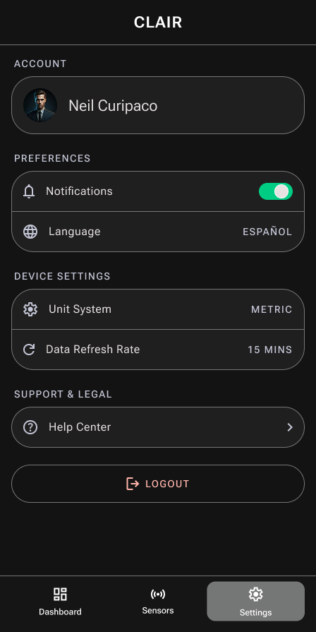

La pantalla de configuración sigue el estándar de plataformas móviles mediante una vista de lista desplazable (table view) agrupada por categorías funcionales. El mockup organiza las opciones en secciones claramente diferenciadas: "ACCOUNT", "PREFERENCES", "DEVICE SETTINGS" y "SUPPORT & LEGAL". Finalmente, un botón "LOGOUT" claramente diferenciado para el cierre la sesión. 

**Alerts**

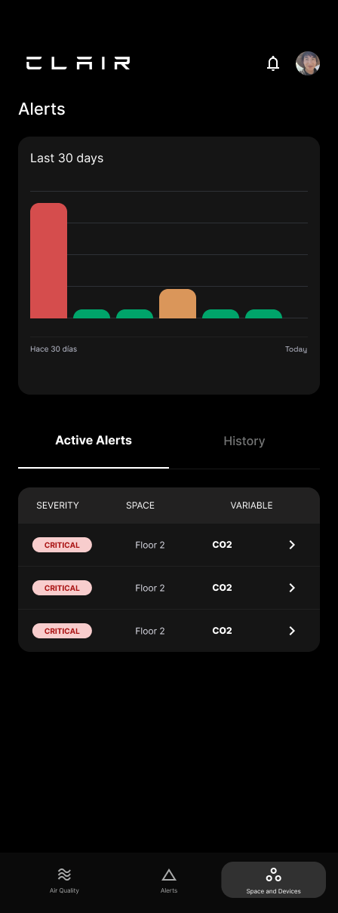

La pantalla de alertas consolida las notificaciones generadas por el sistema Clair. Cada alerta presenta un encabezado descriptivo, un mensaje contextual y un par de acciones rápidas que permiten responder de manera inmediata o ignorar la notificación. Refleja una arquitectura de notificaciones que equilibra la urgencia operativa con el mantenimiento programado, siguiendo las mejores prácticas de diseño de centros de control y monitoreo en aplicaciones móviles industriales o de seguridad.


### 5.4.4. Applications User Flow Diagrams.

Esta sección presenta los diagramas de flujo de usuario, que ilustran las rutas y procesos que siguen los usuarios dentro de las aplicaciones, facilitando la comprensión de la navegación y las interacciones clave

**Web Application UserFlow**

**User Flow: Gestión de alertas y acciones correctivas**

User Goals cubiertos:
| ID | User Goal |
|:---|:---|
| UG01 | Garantizar la salud ambiental: Mantener un aire fresco y libre de viciamento para que los clientes permanezcan más tiempo en el local |
| UG03 | Optimizar la productividad: Evitar que los empleados sufran de fatiga o pérdida de concentración por mala ventilación |

Ambos User Goals comparten el mismo flujo de interacción. El usuario recibe una alerta automática por niveles elevados de CO2 o VOC, accede a la pantalla Alerts & Actions, y activa una respuesta correctiva preconfigurada. La diferencia radica en el propósito (salud del cliente vs. productividad del empleado), pero la experiencia de usuario es idéntica.

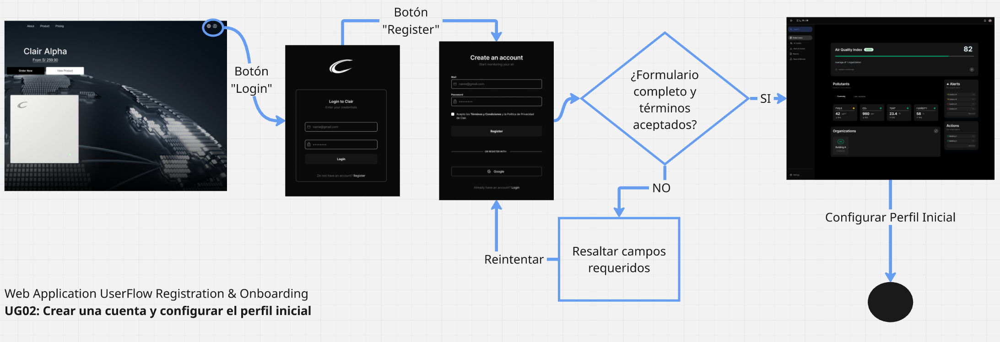

**User Flow: Generación y gestión de reportes**

User Goals cubiertos:
| ID | User Goal |
|:---|:---|
| UG02 | Demostrar salubridad: Contar con evidencia tangible (reportes) de que el local cumple con estándares de aire seguro para clientes y fiscalizaciones |
| UG05 | Validar acciones preventivas: Saber con certeza si sus hábitos de limpieza y ventilación están funcionando realmente para mejorar la calidad del aire |

Ambos User Goals comparten el mismo flujo de interacción. El usuario accede a la pantalla Reports, selecciona el tipo de reporte deseado (Diario AQI, Semanal Alertas, Mensual Cumplimiento), configura los parámetros (rango de fechas, zonas), genera el reporte y lo exporta. La diferencia radica en el propósito (UG02: evidencia para terceros / UG05: validación personal), pero la experiencia de usuario es idéntica.


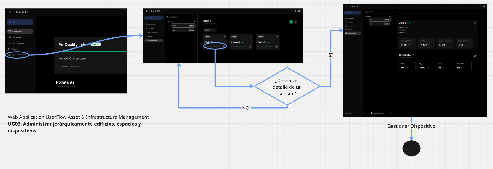

**User Flow: Configuración de umbrales personalizados (Rules Builder)**

User Goals cubiertos:

| ID | User Goal |
|:---|:---|
| UG04 | Controlar síntomas crónicos: Reducir la frecuencia de episodios de rinitis alérgica, asma o dolores de cabeza asociados al ambiente cargado |

El usuario accede a la pantalla Alerts & Actions, navega a la sección Rules Builder, y configura reglas personalizadas basadas en sus alergias o síntomas. Define una métrica (CO2, VOC, PM2.5, etc.), un operador (mayor que, menor que), un umbral específico, y una acción asociada (ej: enviar notificación, activar ventilación). El sistema monitorea continuamente los sensores y, cuando se supera el umbral definido, dispara la acción configurada y genera una alerta preventiva en el Dashboard y en Alerts & Actions.

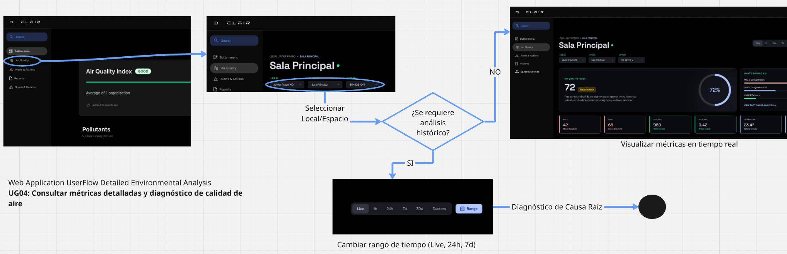

**User Flow: Verificación de calidad del aire y cumplimiento de estándares**

User Goals cubiertos:

| ID | User Goal |
|:---|:---|
| UG06 | Crear un refugio seguro: Garantizar que, a pesar de la contaminación exterior de la ciudad, el interior de su hogar sea un espacio de respiración pura |

El usuario accede a la pantalla Air Quality para visualizar el indicador AQI (Bueno/Moderado/Malo) y los registros de los sensores Clair (CO2, VOC, temperatura, humedad). Opcionalmente, puede navegar a la pantalla Reports para consultar el widget de cumplimiento de directrices OMS, que compara los valores actuales con los límites recomendados por la Organización Mundial de la Salud. Al verificar que el AQI es saludable y que se cumple con los estándares OMS, el usuario confirma que el interior de su hogar es un "refugio seguro".

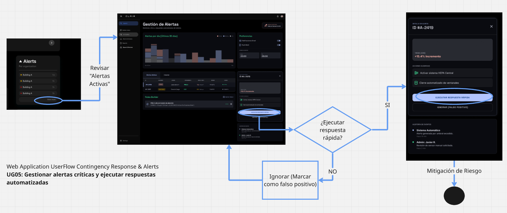


**Mobile Application UserFlow**

**User Flow: Gestión de alertas y activación de respuestas**

User Goals cubiertos:

| ID | User Goal |
|:---|:---|
| UG01 | Garantizar la salud ambiental: Mantener un aire fresco y libre de viciamento para que los clientes permanezcan más tiempo en el local |
| UG04 | Controlar síntomas crónicos: Reducir la frecuencia de episodios de rinitis alérgica, asma o dolores de cabeza asociados al ambiente cargado |

Ambos User Goals comparten el mismo flujo de interacción en Mobile Application. El usuario recibe una notificación emergente en el Dashboard cuando el sistema detecta una condición crítica (UG01) o la superación de un umbral personalizado (UG04). El usuario ingresa a la pantalla Alerts, visualiza la alerta destacada, y puede activar una respuesta preconfigurada (si está disponible desde Web App) o descartarla. La diferencia radica en el origen de la regla (UG01: reglas por defecto del sistema / UG04: reglas personalizadas configuradas desde Web App), pero la experiencia de usuario en mobile es idéntica.

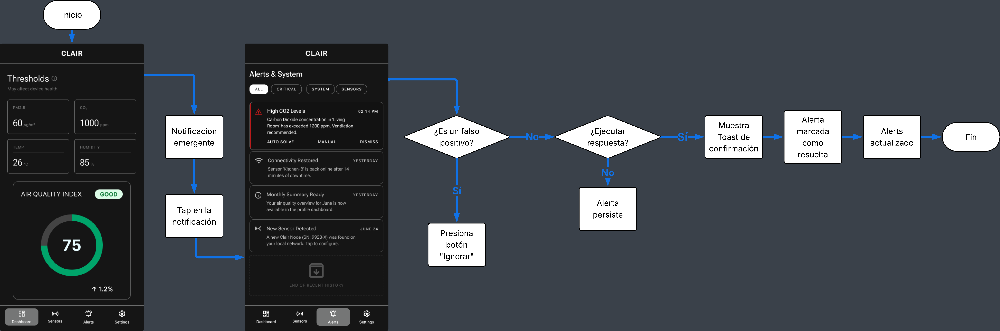

**User Flow: Verificación de calidad del aire (Refugio seguro)**

User Goals cubiertos:

| ID | User Goal |
|:---|:---|
| UG06 | Crear un refugio seguro: Garantizar que, a pesar de la contaminación exterior de la ciudad, el interior de su hogar sea un espacio de respiración pura |

El usuario accede al Dashboard de Mobile Application. En esta pantalla, se muestran los indicadores de calidad del aire (CO2, VOC, temperatura, humedad) y el indicador AQI (Bueno/Moderado/Malo). El usuario visualiza estos indicadores y verifica que el aire interior es saludable. Al observar que el AQI es "Bueno" o "Moderado" y que los valores están dentro de rangos saludables, el usuario confirma que su hogar es un "refugio seguro". No existe funcionalidad equivalente al widget de cumplimiento OMS en la versión mobile.

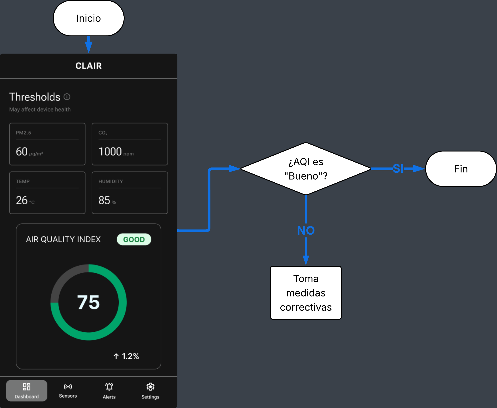

## 5.5. Applications Prototyping.

En esta sección se presentan los prototipos interactivos de las aplicaciones, que permiten visualizar y probar la experiencia de usuario antes del desarrollo final. Incluye enlaces a prototipos navegables para las versiones web y móvil.

**Web Application Prototype**

El prototipo de la aplicación web muestra la estructura general de navegación, el diseño de las principales vistas y las funcionalidades clave que tendrá la plataforma. Permite simular el flujo de navegación de los usuarios y visualizar cómo interactúan con los distintos módulos del sistema.

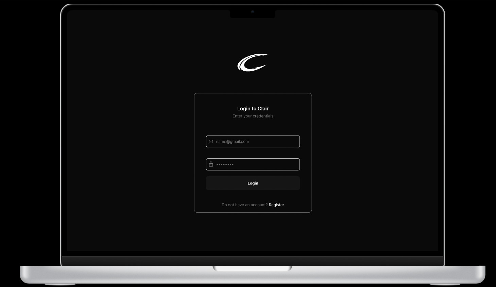

Web Application Prototype: https://sl1nk.com/1a68tor

**Mobile Application Prototype**

El prototipo de la aplicación móvil representa la materialización interactiva de los wireframes y mockups diseñados para dispositivos móviles. Este prototipo simula la experiencia táctil del usuario final, permitiendo validar la ergonomía y la coherencia entre las diferentes secciones operativas del sistema Clair en formato móvil.

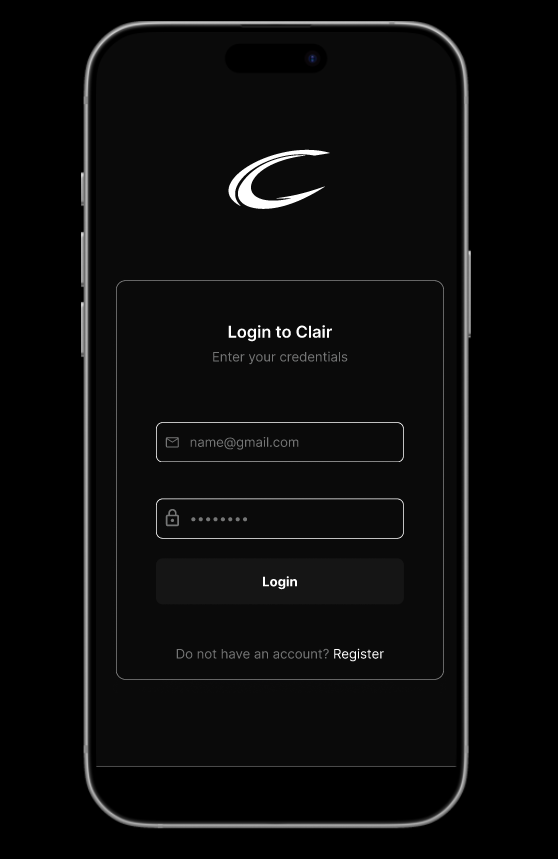

Mobile Application Prototype:  https://sl1nk.com/s0e7d73

## 5.6. IoT Device Design

El siguiente diagrama presenta el diseño inicial del dispositivo IoT Clair, representando la configuración física y las conexiones entre los componentes de hardware seleccionados para el prototipo.

<p align="center">
  
</p>

El esquema fue desarrollado en **Cirkit Designer** (https://app.cirkitdesigner.com/), una plataforma web para diseño de circuitos electrónicos que permitió visualizar las conexiones entre componentes antes de la implementación física.

**Componentes del Diseño:**

| Componente | Descripción | Especificaciones Técnicas |
|------------|-------------|---------------------------|
| **ESP32 DevKit** | Microcontrolador principal con WiFi/Bluetooth integrado | Dual-core 240MHz, 520KB SRAM, USB Tipo C |
| **Sensor MQ-135** | Sensor de calidad de aire para detección de CO2 y gases | 5V, salida analógica/digital, rango 10-1000ppm |
| **Display OLED 0.96"** | Pantalla local para visualización de métricas | I2C (SDA/SCL), 128x64 píxeles, 3.3V-5V |
| **LED Panel** | Panel de LEDs para indicadores visuales de estado | Requiere definición de bits/resolución específica |
| **Protoboards** | Placas de prototipado para conexiones | MB-102 (830 puntos) y 400 puntos |
| **Cables Dupont** | Conexiones hembra-hembra, macho-hembra, macho-macho | 20cm, 40 piezas cada tipo |

Es importante destacar que durante la fase de diseño y validación técnica, se identificaron las siguientes limitaciones críticas:

1. **Sensor MQ-135 - Limitaciones Funcionales:** Según la documentación oficial del fabricante y las especificaciones técnicas revisadas, el sensor MQ-135 presenta limitaciones significativas para la detección precisa de CO2 en aplicaciones de monitoreo ambiental profesional. El sensor está diseñado principalmente para detectar una mezcla de gases (NH3, NOx, alcohol, benzeno, humo) pero carece de la selectividad y precisión requeridas para mediciones fiables de CO2 en tiempo real.

2. **Uso como Placeholder:** A pesar de estas limitaciones documentadas, el equipo decidió utilizar el MQ-135 como componente placeholder en el prototipo inicial debido a que el hardware físico ya había sido adquirido por el equipo para el desarrollo del proyecto. Esto permitió avanzar con la integración del sistema, el desarrollo del firmware del ESP32, y la validación de la arquitectura de comunicación (Embedded→Edge→Cloud), mientras se evalúa la incorporación de sensores más precisos (como el Sensirion SCD30 o MHZ-19B) en iteraciones futuras.

3. **LED Panel - Especificaciones Pendientes:** El diseño incluye un panel de LEDs para indicadores visuales del estado del sistema (conexión WiFi, umbrales de calidad de aire). Sin embargo, las especificaciones exactas del panel (número de bits, resolución, protocolo de comunicación) requieren definición adicional para la implementación final.


El diseño representa la versión inicial de prototipado enfocada en validar la arquitectura de hardware y las conexiones básicas. Las pruebas preliminares confirman el funcionamiento de la comunicación I2C con el display OLED, la lectura analógica del ADC del ESP32, y la conectividad WiFi para transmisión de datos al Edge Station.