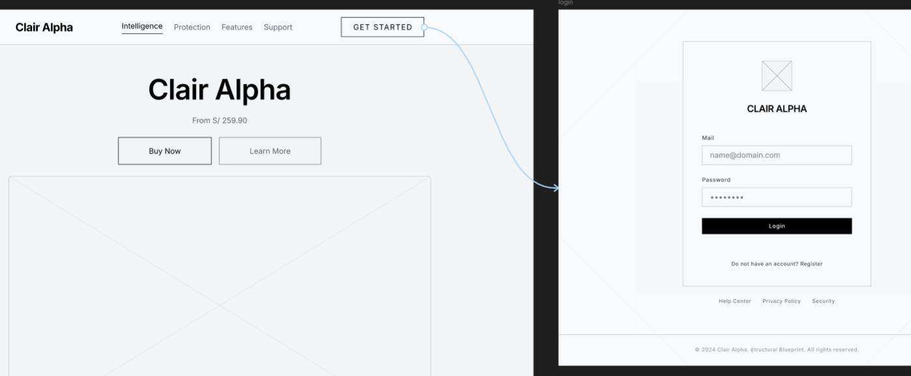
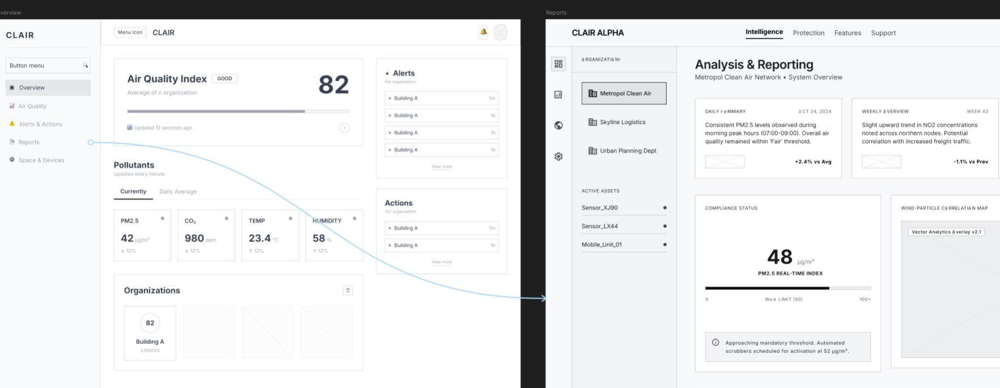
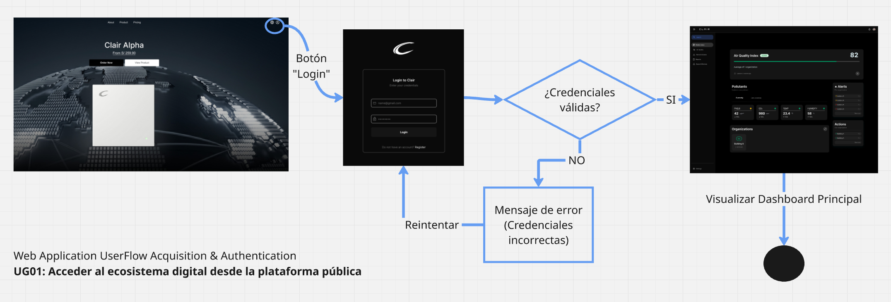
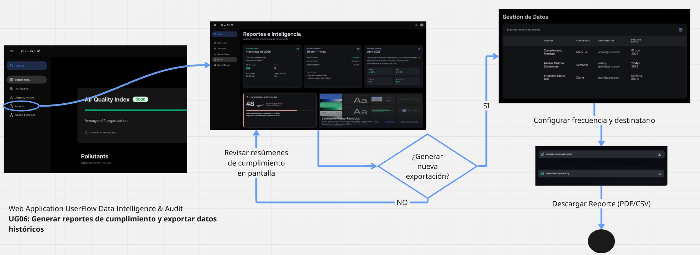

# Capítulo V: Solution UI/UX Design

## 5.1. Style Guidelines.

### 5.1.1. General Style Guidelines.

La identidad visual y la experiencia de usuario de Clair han sido diseñadas bajo un enfoque de minimalismo funcional, priorizando la claridad de la información ambiental y la eficiencia en la respuesta automática. Esta estrategia visual busca reducir la carga cognitiva del usuario, permitiéndole interpretar estados de calidad del aire complejos de manera instantánea. Para garantizar la consistencia en todas las interfaces, se ha tomado como referencia un sistema de diseño basado en principios de Material Design 3, adaptando sus componentes para reflejar una estética tecnológica, limpia y confiable.

 

**Branding y Concepto Visual**

El branding de la solución se fundamenta en la idea de "transparencia y pureza". Los elementos visuales utilizan bordes redondeados y superficies con elevaciones sutiles (*soft shadows*) para evocar una sensación de modernidad y cercanía. El logotipo y la iconografía siguen líneas geométricas simples, asegurando legibilidad incluso en dispositivos de dimensiones reducidas, como las pantallas integradas en el hardware o aplicaciones móviles en condiciones de baja luminosidad.

**Tipografía y Legibilidad**

Para el sistema tipográfico, se ha seleccionado una familia de fuentes de inter y Space Grotesk. La decisión se sustenta en la necesidad de presentar datos numéricos precisos (como niveles de $CO_2$ y PM2.5) que deben ser legibles de un solo vistazo. Se aplica una jerarquía visual estricta mediante variaciones de peso y escala: los valores críticos utilizan cuerpos tipográficos prominentes para atraer la atención inmediata, mientras que la información contextual y de soporte emplea pesos más ligeros para evitar el ruido visual.

**Paleta de Colores y Significado Semántico**

La paleta de colores de Clair no es solo estética, sino funcional y semántica. Se utiliza una base de tonos neutros (blancos técnicos y grises pizarra) para el fondo y la estructura, permitiendo que los colores de estado destaquen. El sistema emplea una escala cromática de seguridad: **verde** para niveles óptimos, **ámbar** para advertencias preventivas y **rojo** para niveles críticos. Estas decisiones de color se basan en convenciones universales de seguridad y salud, garantizando que tanto el **Home User** como el **Facility Admin** comprendan la urgencia de la situación sin necesidad de leer texto adicional.

**Espaciado y Retícula**

Se ha implementado un sistema de espaciado basado en una rejilla de **8px**, lo que garantiza una alineación matemática perfecta entre componentes y una distribución equilibrada del espacio negativo. El uso generoso de márgenes (*white space*) es una decisión deliberada para separar las diferentes métricas de los sensores, evitando la saturación visual en los dashboards de analítica. Este enfoque permite que el usuario se enfoque en los datos más relevantes, facilitando la navegación tanto en interfaces táctiles como de escritorio.

**Tono de Comunicación y Lenguaje**

El tono de comunicación adoptado para Clair se define como **Sereno, Formal y Respetuoso**. Dado que la solución gestiona información crítica relacionada con la salud y la seguridad de las personas, el lenguaje debe transmitir autoridad y precisión técnica sin generar pánico innecesario.

- **Formalidad:** Se utiliza un lenguaje directo y profesional en las notificaciones y reportes.
- **Serenidad:** Ante situaciones críticas, las instrucciones de mitigación se presentan de forma clara y accionable (ej. "Nivel de $CO_2$ elevado. Se recomienda ventilar el área"), manteniendo una comunicación que brinde seguridad al usuario sobre el control que el sistema ejerce sobre el ambiente.

### 5.1.2. Web, Mobile and IoT Style Guidelines.

- **Web Style Guidelines**

- **Mobile Style Guidelines**

- **IoT Style Guidelines**

Para establecer las guidelines de diseño IoT de Clair, es fundamental comprender la metodología de los 12 pasos de diseño de sistemas IoT, un marco de trabajo estructurado propuesto por investigadores de la Universidad de Sannio, Italia (Balestrieri et al., 2018). Esta metodología, presentada en el paper "Research challenges in Measurement for Internet of Things systems" publicado en Acta IMEKO, proporciona un enfoque sistemático y disciplinado para el desarrollo de soluciones IoT, abarcando desde la definición de requisitos del sistema hasta la implementación de interfaces de usuario. Basada en principios de arquitectura en capas (physical, exchange, information y application service layers), esta metodología garantiza la coherencia entre componentes físicos, de comunicación y aplicativos. El equipo de Vanana adopta estos 12 pasos como fundamento metodológico para asegurar que el diseño del hardware de Clair, incluyendo la selección de sensores PM2.5 y CO2, microcontroladores y radio transceivers, así como la experiencia de usuario de la plataforma, respondan a estándares internacionales de calidad, facilitando la escalabilidad, interoperabilidad y mantenibilidad del sistema de monitoreo de calidad del aire. 

 

A continuación, se presenta la aplicación detallada de los 12 pasos de diseño IoT para el prototipo de Clair, estructurada de forma clara y organizada:

**1. Definition of the System Requirements**

| Categoría | Especificación |
|-----------|----------------|
| **Objetivo Principal** | Monitorear calidad del aire interior en espacios comerciales de Lima Metropolitana |
| **Parámetros a Medir** | CO2, NH3, NOx, benzeno, compuestos orgánicos volátiles |
| **Requisitos Funcionales** | • Medición en tiempo real • Visualización local (OLED) • Transmisión WiFi a la nube • Alimentación estable 5V • Capacidad de expansión |
| **Requisitos No Funcionales** | • Tiempo de respuesta < 10 segundos • Consumo optimizado • Rango temperatura: 15-35°C |

**2. Selection of the IoT System Typology**

| Aspecto | Descripción |
|---------|-------------|
| **Tipo de Sistema** | WSN (Wireless Sensor Network) con arquitectura Edge-Cloud híbrida |
| **Topología** | Estrella extendida - múltiples nodos conectados a un punto de acceso WiFi |
| **Procesamiento** | Edge computing básico en ESP32 + Cloud para análisis avanzado |
| **Modo Offline** | Buffer local limitado con sincronización posterior |

**3. Definition of Physical Layer Requirements**

| Componente | Especificaciones Técnicas |
|------------|---------------------------|
| **Sensor MQ-135** | • Detección: CO2, NH3, NOx, alcohol, benzeno, humo • Rango: 10-1000 ppm (CO2) • Voltaje: 5V DC • Calentamiento: 20-30s para estabilización |
| **Display OLED 0.96"** | • Resolución: 128×64 píxeles • Interfaz: I2C (SDA/SCL) • Voltaje: 3.3V-5V • Ángulo visión: 160° |
| **Prototipado** | • 2× Protoboard MB-102 (830 puntos) • 2× Protoboard 400 puntos • Cables macho-macho/hembra-hembra |
| **Condiciones Ambientales** | • Temperatura: 0-50°C • Humedad: <85% sin condensación |

**4. Definition of Exchange Layer Requirements**

| Capa | Protocolo | Descripción |
|-----------|-----------|-------------|
| **Embedded → Edge** | HTTP/REST sobre red local | Comunicación directa entre ESP32 y Edge Station vía WiFi local |
| **Edge → Cloud** | HTTPS/REST (JSON) | Edge Station sincroniza con API Gateway vía Internet |
| **Conectividad** | WiFi 802.11 b/g/n | Integrado en ESP32, conexión al Edge Station local |
| **Formato Datos** | JSON | `device_id`, `timestamp`, `co2_ppm`, `aqi_index`, `status` |
| **Seguridad** | TLS 1.2 | Encriptación en tránsito Edge-Cloud |
| **Frecuencia Transmisión** | • Local HTTP: cada 5 segundos • Edge-Cloud: cada 60 segundos • Modo alerta: inmediato |

**5. Definition of Information Layer Requirements**

| Proceso | Detalle |
|---------|---------|
| **Adquisición Datos** | ADC 12 bits ESP32 (resolución 0.8mV) |
| **Filtrado** | Promedio móvil de 5 muestras |
| **Conversión** | Ecuación de calibración: `ppm = 116.6020682 × (Rs/Ro)^(-2.769034857)` |
| **Detección Umbrales** | CO2 > 1000 ppm = alerta crítica |
| **Estructura JSON** | `device_id`, `timestamp`, `co2_ppm`, `aqi_index`, `status` |
| **Buffer Local** | 100 lecturas en caso de desconexión WiFi |
| **Sincronización** | NTP (Network Time Protocol) |

**6. Definition of Application Service Layer Requirements**

| Interfaz | Funcionalidades |
|----------|----------------|
| **Display OLED Local** | • Valores CO2 ppm en tiempo real • Air Quality Index (AQI) con Air Quality State (OPTIMAL/MODERATE/CRITICAL) • Indicador estado WiFi |
| **Aplicación Web** | • Dashboard con gráficos históricos • Gestión umbrales de alerta • Exportación reportes PDF/Excel |
| **API REST** | • Recepción telemetría • Consulta datos históricos • Configuración remota dispositivo |
| **Roles Usuario** | Administrador de local / Usuario residencial |

**7. Selection of the Architectures of Data Exchange and Information Integration Layers**

| Componente | Tecnología | Función |
|------------|------------|---------|
| **API Gateway** | Spring Cloud Gateway | Enrutamiento, autenticación JWT, rate limiting, entry point único |
| **Platform API** | Spring Boot | Microservicios: IAM, Billing, Device & Space, Air Quality, Alerting, Analytics, Notifications |
| **Edge Station** | Flask (Python) | Gateway local: recepción HTTP de dispositivos, deduplicación, sincronización offline-first HTTPS |
| **Edge Database** | SQLite | Almacenamiento local telemetría, estados, cola de sincronización |
| **Cloud Database** | PostgreSQL | Datos persistentes: usuarios, dispositivos, telemetría, configuraciones |
| **Cache** | Redis | Sesiones, tokens, rate limits, datos temporales |
| **External Services** | Stripe, Resend, Google OAuth | Pagos, notificaciones email, autenticación social |

**8. Selection of the Sensors and the Actuators**

| Componente | Modelo | Especificaciones |
|------------|--------|------------------|
| **Sensor de Aire** | MQ-135 | • Detección: CO2, NH3, NOx, alcohol, benzeno, humo • Voltaje: 5V • Salida: Analógica (0-5V) + Digital (TTL) • Tiempo respuesta: < 10 segundos • Rango: 10-1000 ppm (CO2) • Calentamiento: 20-30s para estabilización |
| **Display Local** | OLED 0.96" I2C SSD1306 | • Resolución: 128×64 píxeles • Dirección I2C: 0x3C o 0x3D • Pines: SDA, SCL • Voltaje: 3.3V-5V tolerante |
| **Prototipado** | Protoboards + Cables | • 2× Protoboard MB-102 (830 puntos) • 2× Protoboard 400 puntos • Cables macho-macho, hembra-hembra, macho-hembra |
| **Actuadores Futuros** | Relés / HVAC Controller | Control ventiladores, actuadores de ventanas (no incluidos en prototipo inicial) |

**9. Selection of the Microcontroller and Radio Transceivers**

| Componente | Especificaciones Técnicas |
|------------|---------------------------|
| **Microcontrolador** | ESP32-WROOM-32 |
| **Procesador** | Dual-core Xtensa LX6 @ 240MHz |
| **Memoria** | 520KB SRAM / 4MB Flash |
| **Conectividad** | WiFi 802.11 b/g/n + Bluetooth 4.2/BLE |
| **GPIOs** | 34 programables |
| **ADC** | 12 bits, 18 canales |
| **Interfaces** | I2C, SPI, UART |
| **Alimentación** | USB Tipo C (5V) o VIN (7-12V) |
| **Radio Transceiver** | WiFi integrado (antena PCB 2dBi, rango 50m interiores) |

**10. Definition of the Data Processing for Each Node and in Cloud**

**Procesamiento en Embedded (C++ / ESP32):**

| Paso | Componente | Acción | Frecuencia |
|------|------------|--------|------------|
| 1 | embeddedIoAdapter | Lectura ADC del MQ-135 vía GPIO/I2C | 1 Hz |
| 2 | embeddedTelemetryService | Filtro promedio móvil (5 muestras) + validación rangos | Continuo |
| 3 | embeddedDomainModel | Conversión a ppm (ecuación calibración) | Cada lectura |
| 4 | embeddedDomainModel | Air Quality State Classification (OPTIMAL/MODERATE/CRITICAL) | Cada lectura |
| 5 | embeddedController | Actualización display OLED vía I2C | Cada 2 segundos |
| 6 | embeddedIoAdapter | Envío HTTP POST a Edge Station vía WiFi local | Cada 5 segundos / Inmediato en alerta |

**Procesamiento en Edge (Python / Flask):**

| Componente | Función | Almacenamiento |
|------------|---------|----------------|
| edgeIoAdapter | Recepción HTTP POST de Embedded, ingesta telemetría | - |
| edgeProcessingService | Ingesta, deduplicación, normalización de lecturas | SQLite (telemetría snapshots) |
| edgeDomainModel | Reglas de ingesta, validación, batching | SQLite (checkpoints) |
| edgeSyncService | Sincronización offline-first con Cloud vía HTTPS | SQLite (cola sincronización) |
| edgeController | Exposición HTTP endpoints para configuración local | - |

**Procesamiento en Cloud (Spring Boot):**

| Bounded Context | Función Principal | Persistencia |
|-----------------|-------------------|--------------|
| **IAM** | Autenticación, autorización, sesiones, OAuth2 | PostgreSQL + Redis |
| **Device & Space Management** | Gestión facilities, espacios, devices, ownership | PostgreSQL |
| **Air Quality Evaluation** | Evaluación telemetría, thresholds, métricas | PostgreSQL |
| **Alerting & Response** | Generación alertas, escalations, acciones correctivas | PostgreSQL |
| **Analytics** | Agregaciones, tendencias, reportes históricos | PostgreSQL |
| **Notifications** | Plantillas, enrutamiento, delivery email vía Resend | PostgreSQL |
| **Billing** | Suscripciones, pagos Stripe, facturas | PostgreSQL + Stripe API |

**Air Quality State Classification (Usado en todos los niveles):**

| CO2 Range (ppm) | Air Quality State | Threshold Level |
|-----------------|-------------------|-----------------|
| < 400 | Optimal | Normal |
| 400 - 1000 | Moderate | Warning |
| > 1000 | Critical | Critical Threshold Exceeded |

**Analysis of the Processing Time**

| Operación | Capa | Tiempo Estimado |
|-----------|------|----------------|
| Boot del ESP32 | Embedded | < 500 ms |
| Conexión WiFi (Embedded → Edge) | Embedded | 2-3 segundos |
| Lectura ADC MQ-135 | Embedded | < 10 ms |
| Conversión y validación | Embedded | < 5 ms |
| Actualización display OLED (I2C @400kHz) | Embedded | < 50 ms |
| Envío HTTP POST local (payload ~200 bytes) | Embedded → Edge | < 100 ms |
| Ingesta y procesamiento Edge | Edge | < 200 ms |
| Persistencia SQLite Edge | Edge | < 50 ms |
| Sincronización HTTPS Edge → Cloud | Edge → API Gateway | 1-3 segundos (depende red) |
| Procesamiento API Gateway + Bounded Context | Cloud | < 500 ms |
| Persistencia PostgreSQL | Cloud | < 100 ms |
| **Latencia total Embedded → Cloud** | End-to-end | 3-8 segundos |
| **Latencia Embedded → Edge (local)** | Local network | < 200 ms |
| **Respuesta ante alertas críticas** | End-to-end | < 10 segundos |
| Estabilización sensor MQ-135 | Hardware | 20-30 segundos |
| Frecuencia muestreo efectiva | Embedded | 1 lectura/segundo |
| Frecuencia sincronización Edge-Cloud | Edge | Cada 60 segundos / Inmediato alertas |

**12. Definition of the Graphical User Interface**

**Interfaz Embedded Local (Display OLED 0.96"):**

| Sección | Contenido |
|---------|-----------|
| **Área Superior** | Icono WiFi (estado conexión al Edge Station) |
| **Área Central** | Valor CO2 ppm grande (fuente 16px) + Air Quality State |
| **Área Inferior** | "Status: OPTIMAL/MODERATE/CRITICAL" + Timestamp |

**Navegación Display (futuro):**
- Current Reading (valores tiempo real)
- Time Series History (promedio última hora)
- Device Configuration

**Interfaz Edge Station (Configuración Local HTTP):**

| Endpoint | Funcionalidad |
|----------|--------------|
| `GET /health` | Estado del Edge Station y dispositivos conectados |
| `GET /telemetry/latest` | Últimas lecturas de todos los sensores |
| `POST /device/configure` | Configuración WiFi, umbrales, frecuencia muestreo |
| `GET /sync/status` | Estado de sincronización con Cloud |

**Interfaz Web Application (Angular):**

| Módulo | Funcionalidad |
|--------|--------------|
| **Dashboard** | Time Series History (gráficos líneas), métricas actuales, Facilities overview |
| **Heat Map** | Visualización espacial calidad del aire por Space |
| **Alerting & Response** | Historial Critical Alert, Alert Reminder, Corrective Action |
| **Configuration** | Custom Threshold, Default Threshold, Notification Preferences |
| **Device & Space Management** | Facility setup, Space creation, Device Registration, Device Pairing |
| **Analytics & Reporting** | Time Series History export, tendencias, reportes PDF |
| **Billing** | Trial Subscription, Premium Plan, Freemium Plan |

**Interfaz Mobile Application (Flutter):**

| Módulo | Funcionalidad |
|--------|--------------|
| **Home** | Current Reading, Air Quality State, alertas recientes |
| **History** | Time Series History simplificado (24h, 7 días) |
| **Devices** | Lista dispositivos, Device Pairing, Device Registration |
| **Settings** | Custom Threshold, Notification Preferences, perfil usuario |
| **Offline Support** | Lecturas cacheadas en SQLite local |

## 5.2. Information Architecture.

### 5.2.1. Organization Systems.

El equipo ha definido sistemas de organización diferenciados para cada componente de la plataforma, asegurando que la disposición del contenido responda a la naturaleza de la interacción del usuario. El objetivo es que la arquitectura sea capaz de manejar desde la simplicidad de una lectura doméstica hasta la complejidad de una red de sensores industriales, manteniendo siempre la coherencia y el orden lógico.

Para la organización visual y la categorización del contenido, se han tomado las siguientes decisiones:

- **Organización Jerárquica (Visual Hierarchy):** Se aplica de manera prioritaria en los dashboards de monitoreo en tiempo real. Se utiliza una jerarquía de "arriba hacia abajo", donde el estado general de la calidad del aire del establecimiento ocupa el nivel superior, seguido por el detalle individual de cada zona y, finalmente, las métricas específicas de cada sensor. Esto permite una rápida identificación de anomalías sin necesidad de navegar por menús profundos.
- **Organización Secuencial (Step-by-Step):** Este sistema se utiliza exclusivamente en los flujos operativos de configuración, tales como el **Onboarding de Dispositivos** y la **Configuración Inicial de Espacios**. Al guiar al usuario mediante una secuencia lógica de pasos, se minimizan los errores de emparejamiento entre el hardware y la aplicación, asegurando que el sistema quede operativo de forma correcta y sencilla.
- **Esquemas de Categorización Cronológica:** Es el método principal aplicado en el módulo de **Analytics & Reporting**. Los eventos de telemetría, el historial de alertas y los reportes semanales se organizan de forma temporal, permitiendo al usuario realizar un seguimiento histórico de la evolución de la calidad del aire e identificar patrones cíclicos de contaminación.
- **Esquemas por Tópicos:** Se implementa en la sección de configuraciones y soporte. La información se agrupa en temas específicos como "Gestión de Dispositivos", "Preferencias de Alertas" y "Seguridad de la Cuenta", facilitando la localización de funciones administrativas que no dependen de una secuencia temporal.
- **Esquemas según Audiencia (Grupos de Usuarios):** La plataforma adapta su contenido según el rol del usuario autenticado. Mientras que el **Home User** visualiza una interfaz simplificada centrada en el bienestar familiar, el **Facility Admin** accede a una organización de datos matricial que permite supervisar múltiples locales y dispositivos de manera simultánea, optimizando la gestión de grandes superficies.

### 5.2.2. Labeling Systems.

El sistema de etiquetado de Clair ha sido diseñado bajo el principio de máxima claridad con el mínimo de palabras, buscando eliminar cualquier ambigüedad técnica que pueda confundir al usuario en momentos de urgencia. Dado que el sistema maneja variables de salud ambiental, las etiquetas funcionan como indicadores semánticos inmediatos que permiten asociar los datos con acciones concretas. Se ha priorizado el uso de verbos de acción y sustantivos descriptivos estándar, asegurando que la terminología sea consistente tanto en el hardware físico como en las interfaces digitales.

Para garantizar una representación de datos simplificada y efectiva, se han definido las siguientes convenciones:

- **Etiquetado de Métricas Ambientales:** En lugar de utilizar nombres químicos complejos, se emplean acrónimos estándar y descripciones breves. Las etiquetas principales son **"CO2"** (Dióxido de Carbono) y **"PM2.5"** (Material Particulado), acompañadas de unidades de medida simplificadas (ppm y µg/m³). Esta asociación directa permite que el usuario relacione el número con el contaminante específico de forma instantánea.
- **Etiquetas de Estado y Salud:** Para representar la calidad del aire de manera cualitativa, se utiliza un sistema de etiquetas unívocas asociadas a rangos de seguridad: **"Óptimo"**, **"Aceptable"**, **"Riesgo"** y **"Crítico"**. Estas etiquetas actúan como el primer nivel de interpretación, permitiendo que el usuario comprenda la situación ambiental sin necesidad de analizar los valores numéricos brutos.
- **Nomenclatura de Navegación y Control:** Se utilizan etiquetas de un solo término para las secciones principales del sistema, tales como **"Inicio"**, **"Sensores"**, **"Zonas"**, **"Alertas"** y **"Planes"**. En los botones de acción, se emplean imperativos claros como **"Vincular"**, **"Editar"**, **"Exportar"** y **"Resolver"**, lo que reduce el tiempo de procesamiento mental durante la navegación.
- **Asociaciones de Identidad y Espacio:** Para la gestión de establecimientos, se establecen etiquetas de asociación lógica que vinculan el hardware con el entorno. Se utilizan términos como **"Local"** para la entidad principal y **"Espacio"** para las subdivisiones internas, permitiendo que el usuario organice su infraestructura bajo una jerarquía familiar y fácil de rastrear.

Este sistema de etiquetado asegura que la plataforma **Clair** hable el mismo lenguaje que sus usuarios, transformando datos sensores complejos en información accionable y comprensible.

### 5.2.3. SEO Tags and Meta Tags

La estrategia de visibilidad de **Clair** se centra en el posicionamiento de la marca como líder en soluciones IoT para la salud ambiental. Para el sitio web y la aplicación web, se han definido etiquetas SEO y Meta Tags que priorizan la relevancia semántica y la autoridad técnica. En el caso de las aplicaciones móviles, se aplican técnicas de ASO (App Store Optimization) diseñadas para mejorar la tasa de conversión y el descubrimiento orgánico en plataformas como Google Play Store y Apple App Store.

**SEO & Meta Tags (Landing Page y Web Application)**

Para las plataformas web, se han asignado valores específicos que buscan capturar el tráfico interesado en monitoreo de aire y automatización inteligente:

- **Title Tag:** `Clair | Smart Air Quality and CO2 Monitoring`
- **Meta Description:** `Protect your home and business health with Clair. A comprehensive CO2 and PM2.5 monitoring system with real-time alerts and smart automated responses.`
- **Meta Keywords:** `Air quality, CO2 sensor, PM2.5 monitoring, environmental health, IoT Peru, ventilation automation, smart air purification.`
- **Author:** `& Team Clair`
- **Robots Tag:** `index, follow`

**ASO Elements (Mobile Applications)**

Para garantizar que la aplicación móvil sea fácilmente localizable por los segmentos objetivo —administradores de establecimientos y personas preocupadas por la salud en el hogar— se han definido los siguientes elementos:

- **App Title:** `Clair: Air & CO2 Monitor`
- **App Subtitle:** `Air quality and IoT alerts.`
- **App Description:** `Clair is the ultimate solution for managing air quality in your spaces. Connect your smart sensors to visualize CO2 and PM2.5 particle levels in real time. Receive critical notifications, generate sanitary compliance reports, and configure automated responses to activate ventilation systems. Ideal for offices, schools, and homes that prioritize well-being and environmental safety.`
- **App Keywords:** `Air quality, CO2 meter, pollution sensor, home health, well-being, remote monitoring, sanitary safety, air purifier.`

Esta configuración asegura que la propuesta de valor de **Clair** sea comunicada con precisión desde el primer contacto del usuario en los resultados de búsqueda o en la tienda de aplicaciones, facilitando el crecimiento de la base de usuarios de manera orgánica.

### 5.2.4. Searching Systems.

El sistema de navegación de **Clair** ha sido diseñado para ser intuitivo y persistente, garantizando que el usuario siempre mantenga la noción de su ubicación dentro de la plataforma y pueda desplazarse hacia sus metas con el mínimo número de clics. La estrategia se basa en una estructura de navegación multidireccional que combina menús globales para la movilidad entre módulos y elementos de navegación contextual para la profundización en los datos ambientales. Se busca que la transición entre el Landing Page informativo y la aplicación operativa sea fluida, reforzando la confianza del usuario en el producto.

Para guiar el recorrido de los usuarios, se han implementado las siguientes técnicas y estructuras:

- **Global Navigation (Barra Principal):** Presente de forma constante en la parte superior o lateral de la interfaz. Permite el salto inmediato entre las funciones núcleo como el Dashboard de monitoreo, la gestión de dispositivos y el módulo de analítica. Esta barra actúa como el ancla del usuario, ofreciendo un camino de retorno siempre visible hacia la pantalla de inicio.
- **Contextual Navigation (Enlaces Internos):** Se utiliza dentro de las tarjetas de información y paneles de control. Por ejemplo, al visualizar el estado de una zona específica, el sistema ofrece enlaces directos para "Ver historial de alertas" o "Ajustar umbrales", permitiendo que el usuario navegue hacia funcionalidades relacionadas sin pasar por el menú principal.
- **Breadcrumbs (Migas de Pan):** Aplicado especialmente en la versión web y en la gestión de infraestructuras complejas por parte del **Facility Admin**. Este sistema permite visualizar la ruta jerárquica recorrida (ej. Local Principal > Piso 2 > Oficina Norte), facilitando el retroceso a niveles superiores de organización de manera lógica.
- **Scrolling Narrativo y CTAs (Landing Page):** En el sitio público, se emplea una navegación vertical guiada. A través de botones de "Llamada a la Acción" (Call to Action) estratégicamente ubicados, se conduce al visitante desde la comprensión del problema (Problem Statement) hacia la adquisición de la solución, eliminando puntos de fricción en el proceso de conversión.
- **Navegación Táctil y Gestos (Mobile Application):** En la aplicación móvil, se prioriza el uso de un menú de pestañas inferior (*Bottom Navigation Bar*) para facilitar el acceso con el pulgar. Además, se integran gestos intuitivos como el *swipe* para cambiar entre diferentes zonas de monitoreo, optimizando la experiencia en dispositivos móviles.

Este enfoque asegura que el recorrido por el contenido de **Clair** no solo sea funcional, sino que también actúe como un facilitador de la eficiencia operativa, permitiendo que la interacción con el sistema sea natural y satisfactoria.

### 5.2.5. Navigation Systems.

Dada la arquitectura de información simplificada y el enfoque en la visualización directa de datos de Clair, el equipo ha optado por un sistema de búsqueda basado en la navegación asistida y el filtrado por categorías en lugar de un motor de búsqueda global por texto. Esta decisión estratégica busca evitar que el usuario se sienta abrumado por un volumen excesivo de herramientas de búsqueda innecesarias, considerando que la interfaz ha sido diseñada para que cada dato sea localizable mediante la exploración lógica de los espacios configurados.

Para garantizar que el usuario nunca se sienta perdido, se han implementado las siguientes soluciones de localización de datos:

- **Segmentación Temporal en Reportes:** Para la consulta de datos históricos en el módulo de analítica, se ofrecen selectores de fecha predefinidos (Día, Semana, Mes). Esta forma de "búsqueda por tiempo" permite que los datos se presenten de forma agregada, facilitando la identificación de tendencias sin requerir consultas técnicas complejas.
- **Visualización de Resultados Pos-Búsqueda:** Una vez seleccionado un filtro o una zona específica, los datos se presentan en tarjetas informativas con una jerarquía visual clara. Los valores de telemetría más recientes (CO2 y PM2.5) se muestran de forma destacada, seguidos por el estado de conectividad del dispositivo, asegurando que la respuesta del sistema sea siempre visual y fácil de interpretar.
- **Landing Page Informativa:** En el sitio web estático, la información se distribuye de manera lineal y secuencial, eliminando la necesidad de un sistema de búsqueda interno. El visitante encuentra los contenidos mediante un flujo narrativo diseñado para cubrir todas sus dudas frecuentes de forma orgánica.

Este enfoque de búsqueda simplificada refuerza el compromiso de **Clair** con una experiencia de usuario directa y eficiente, donde la información no necesita ser buscada activamente porque ya se encuentra organizada de manera intuitiva dentro del flujo de trabajo diario.

## 5.3. Landing Page UI Design.

A continuación, se presentan los wireframes y mock-ups para la Landing Page de Clair, enfocada en comunicar de manera efectiva la propuesta de valor del producto y guiar al visitante hacia la conversión.

### 5.3.1. Landing Page Wireframe.

**Home**

Presentación principal de Clair Alpha. Incluye el hero section con llamados a la acción, una sección de "Sensory Intelligence" para métricas de aire (PM2.5, CO2) y bloques informativos sobre las capacidades de filtrado y protección del dispositivo.

**Product**

Detalle técnico y funcional del dispositivo. Clair Specs incluye el procesamiento central, sensores atmosféricos y detección láser de partículas, utilizando una estructura de cuadrícula para facilitar la lectura de características.

**Pricing**

Estructura de costos de los servicios de Clair Alpha. Presenta una comparativa entre el plan "Free" y el plan "Mesh Network" mediante tarjetas de precios claras.

**About**

Sección dedicada a la visión de la empresa y el equipo. Incluye una presentación del equipo y un bloque de "Nuestra Misión"

### 5.3.2. Landing Page Mock-up.

**Home**

Implementación visual final con un estilo minimalista y tecnológico. Se observa el uso de un fondo oscuro para resaltar el dispositivo y tipografía técnica.

**Product**

Diseño detallado que muestra los componentes internos del ecosistema. Se destacan el uso de arquitectura ESP32, sensores SCD41 para CO₂ y sensores láser PMS5003.

**Pricing**

Interfaz de suscripción con un enfoque limpio y directo. Se utilizan tarjetas con bordes definidos y botones de acción claros.

**About**

La sección presenta al equipo multidisciplinario con un diseño elegante que equilibra el espacio en blanco y el contenido textual.

## 5.4. Applications UX/UI Design.
Esta sección está dedicada al diseño de la experiencia de usuario (UX) y la interfaz de usuario (UI) de las aplicaciones que conforman la solución. El objetivo es crear interfaces funcionales, accesibles y visualmente coherentes que respondan a las necesidades y expectativas de los usuarios finales.

### 5.4.1. Applications Wireframes.

En esta sección se presentan los wireframes de las aplicaciones, que muestran el diseño estructural y la disposición de los elementos clave para la experiencia de usuario. 

**Web Application:**

**Login**

La interfaz de autenticación presenta un diseño centralizado y minimalista que prioriza la claridad funcional. El wireframe utiliza un contenedor de bordes definidos sobre un fondo neutro, integrando campos de entrada directos para credenciales y un botón de acción de alto contraste, lo que refuerza una estética tecnológica y ordenada coherente con el ecosistema de Clair.

**Register**

El diseño de registro mantiene la coherencia visual mediante una estructura vertical limpia que facilita el flujo de usuario. Este wireframe integra campos de entrada estándar, un selector para términos legales y una opción de autenticación social con Google, logrando un equilibrio entre simplicidad y funcionalidad bajo una estética técnica y minimalista.

**Overview**

La interfaz principal despliega un tablero de control avanzado con un estilo "dark mode" que resalta métricas críticas de calidad de aire mediante una jerarquía visual clara. El diseño utiliza tarjetas modulares para organizar contaminantes como PM2.5 y CO₂, integrando gráficos de barras de estado y paneles laterales de alertas en tiempo real, lo que ofrece una experiencia analítica, técnica y altamente funcional para la gestión de múltiples organizaciones.

**Space & Devices**

La interfaz de gestión de dispositivos presenta una estructura organizada mediante un panel de navegación jerárquico que facilita la administración de organizaciones y espacios. El diseño utiliza tarjetas de inventario detalladas y una vista individual para monitorear el estado técnico de cada sensor, integrando indicadores de conectividad, salud del dispositivo y umbrales personalizados bajo una estética limpia y profesional.

**Air Quality**

La interfaz de análisis ambiental presenta un tablero detallado que permite la visualización de métricas en tiempo real y periodos históricos mediante selectores de tiempo y ubicación. El diseño integra tarjetas de diagnóstico para múltiples contaminantes, un panel de análisis de causa raíz y una comparativa entre espacios, culminando en una sección de generación de reportes técnicos en formatos PDF y CSV que refuerza el enfoque profesional y orientado a datos del ecosistema Clair.

**Alerts & Actions**

La interfaz de gestión de alertas ofrece un centro de control operativo que combina el monitoreo crítico con la capacidad de respuesta inmediata. El diseño destaca un gráfico de distribución semanal de incidencias y una tabla detallada de alertas activas, integrando paneles laterales para la configuración de notificaciones, visualización de tendencias específicas por evento y un registro de auditoría, lo que permite una administración proactiva y técnica de las contingencias ambientales en el ecosistema Clair.

**Reports**

La interfaz de reportes presenta un panel analítico robusto diseñado para la interpretación de datos estratégicos y el cumplimiento normativo. El wireframe organiza la información mediante tarjetas de resumen diario, semanal y mensual, integrando visualizaciones de correlación de partículas y un gestor de exportaciones automatizado que detalla la frecuencia y el estado de los registros. Este diseño facilita una supervisión integral del ecosistema Clair, permitiendo desde el análisis técnico profundo hasta la generación de resúmenes ejecutivos con una estética limpia y profesional.

### 5.4.2. Applications Wireflow Diagrams.
Esta sección presenta los diagramas de flujo (wireflows) de las aplicaciones, que ilustran la navegación y las interacciones del usuario entre las diferentes pantallas, facilitando la comprensión del recorrido dentro del sistema.

**Web Application:**

**User Acquisition & Authentication Flow**

Este flujo representa la transición desde la propuesta de valor externa en la Landing Page hacia el acceso al ecosistema digital de Clair. El proceso se activa mediante un Call to Action (CTA) estratégico que redirige al usuario hacia la interfaz de Login, donde se validan las credenciales de seguridad bajo una estética minimalista y profesional. Es el punto de enlace crítico que transforma el interés comercial en una sesión activa, permitiendo al usuario ingresar al tablero de control centralizado para iniciar el monitoreo ambiental.

**Registration & Onboarding Flow**

Este recorrido modela la experiencia de los nuevos usuarios que se integran al ecosistema a través de la interfaz Register. El flujo se centra en la simplicidad funcional, guiando al usuario por la creación de cuenta, la validación de datos y la aceptación de términos legales antes de su primer acceso. Al completarse, el sistema facilita una transición fluida hacia el Overview, asegurando que el despliegue inicial de la red de monitoreo comience con una configuración de usuario clara y estructurada.

**Asset & Infrastructure Management Flow**

Este flujo describe la administración jerárquica de la infraestructura IoT de la organización a través de las vistas de Space & Devices. El usuario navega desde una visión macro de los edificios hacia el control detallado de cada espacio, permitiendo la supervisión técnica individual de dispositivos como los sensores SCD41 y PMS5003. La interfaz facilita el monitoreo de la conectividad y la salud del hardware, garantizando que el despliegue en áreas comerciales o residenciales mantenga una operatividad constante y profesional.

**Detailed Environmental Analysis Flow**

Este proceso conecta el tablero principal de Overview con el análisis profundo en la interfaz de Air Quality para diagnosticar la salud ambiental de un espacio específico. El usuario puede profundizar en métricas críticas como $CO_2$, $PM2.5$ y compuestos orgánicos volátiles ($VOCs$), utilizando selectores de tiempo para identificar tendencias históricas y causas raíz. El diseño permite comparar la calidad de aire entre distintos sectores de la organización, proporcionando una base científica para la toma de decisiones basada en datos precisos de sensores de alta fidelidad.

**Contingency Response & Alert Flow**

Este flujo operativo modela la detección y mitigación de anomalías ambientales a través de la interfaz de Alerts & Actions. Se activa ante un disparo de umbral crítico (como niveles altos de material particulado), dirigiendo al usuario a revisar la distribución de incidencias y la severidad del evento en tiempo real. El flujo culmina en la ejecución de acciones sugeridas o el uso del Rules Builder para automatizar respuestas, como la activación de purificadores, asegurando una gestión proactiva ante riesgos en la calidad del aire.

**Data Intelligence & Audit Flow**

Este flujo se especializa en la interpretación estratégica de datos y la generación de documentación técnica mediante la interfaz de Reports. El usuario interactúa con resúmenes de cumplimiento normativo y mapas de correlación de partículas para evaluar el impacto a largo plazo en la organización. El proceso incluye la configuración de exportaciones automatizadas en formatos PDF y CSV, proporcionando una herramienta de auditoría esencial para certificar que los espacios cumplen con las directrices de salud y seguridad ambiental vigentes.

### 5.4.3. Applications Mock-ups.

**Web Application:**

**Login**

La interfaz de inicio de sesión presenta una implementación visual final con un estilo sofisticado, minimalista y tecnológico. El mockup utiliza un fondo oscuro profundo que resalta un contenedor de bordes sutiles y el logotipo central de Clair, integrando campos de entrada oscuros con íconos descriptivos y un botón de acción principal de contraste moderado, logrando una estética sobria y profesional coherente con la identidad de la marca.

**Register**

La interfaz de creación de cuenta presenta una implementación visual final sofisticada, minimalista y tecnológica, en coherencia con el diseño de login. El mockup utiliza un fondo oscuro profundo que resalta un contenedor de bordes sutiles y el logotipo de Clair, integrando campos de entrada oscuros con íconos descriptivos y un botón de acción principal de contraste moderado. El diseño incorpora además selectores de términos legales y una opción de autenticación social con Google, logrando una estética sobria y profesional.

**Overview**

El tablero principal presenta una implementación visual final con un estilo minimalista y tecnológico, utilizando un fondo oscuro para resaltar los indicadores de calidad de aire. El diseño organiza métricas críticas como el índice de calidad de aire (AQI) y contaminantes específicos ($CO_2$, $PM2.5$) mediante tarjetas modulares de alto contraste, integrando paneles de alertas y acciones en tiempo real que refuerzan una estética técnica y funcional para el ecosistema Clair.

**Space & Devices**

La interfaz de gestión de dispositivos se presenta con un estilo "dark mode" de alta fidelidad que optimiza la supervisión técnica de los activos. El diseño emplea una arquitectura modular mediante tarjetas interactivas que permiten alternar entre vistas de cuadrícula y lista, integrando un panel de detalle profundo para cada sensor donde se visualizan métricas de conectividad y umbrales operativos. Esta implementación logra una estética tecnológica sofisticada que facilita la administración jerárquica de espacios y organizaciones en el ecosistema Clair.

**Air Quality**

La interfaz de análisis ambiental presenta una implementación visual final sofisticada con un estilo "dark mode" que jerarquiza los datos mediante acentos de color y tipografía técnica. El mockup integra un gráfico circular progresivo para el índice de calidad de aire, tarjetas detalladas para parámetros específicos como $PM2.5$ y $CO_2$, y una sección de comparativa entre espacios, culminando en un centro de reportes especializado que refuerza la capacidad analítica y profesional del sistema Clair.

**Alerts & Actions**

La interfaz de alertas presenta una implementación visual final sofisticada en "dark mode" que centraliza el monitoreo crítico y las respuestas automatizadas del sistema. El diseño destaca un gráfico de barras apiladas para la distribución de incidencias por severidad y una tabla de alertas activas con estados en tiempo real. La sección integra un constructor de reglas lógicas ("Rules Builder") y paneles laterales para la gestión de preferencias, detalles de eventos específicos con sugerencias de acciones automatizadas y un registro detallada de auditoría, consolidando una estética técnica y profesional para la gestión proactiva de Clair.

**Reports**

La sección presenta una implementación visual final sofisticada que transforma datos complejos en resúmenes estratégicos de cumplimiento. El diseño utiliza tarjetas de resumen temporal (diario, semanal y mensual) con tipografía técnica y acentos cromáticos para destacar tendencias de contaminantes como $CO_2$ y $PM2.5$. El mockup integra visualizaciones de correlación viento-partículas y un panel de gestión de exportaciones programadas, manteniendo una estética de "dark mode" profesional que refuerza el valor analítico del ecosistema Clair.

### 5.4.4. Applications User Flow Diagrams.

Esta sección presenta los diagramas de flujo de usuario, que ilustran las rutas y procesos que siguen los usuarios dentro de las aplicaciones, facilitando la comprensión de la navegación y las interacciones clave

**Web Application UserFlow :**

**Acquisition & Authentication**

UG01: Acceder al ecosistema digital desde la plataforma pública

El usuario accede a la Landing Page de Clair, donde visualiza la propuesta de valor y la arquitectura del sistema. Tras interactuar con el botón principal de "Get Started", es redirigido a la interfaz de Login. Una vez allí, ingresa sus credenciales de acceso para validar su identidad y acceder al panel de control centralizado de la organización.

**Registration & Onboarding**

UG02: Crear una cuenta y configurar el perfil inicial

El usuario nuevo selecciona la opción de registro desde la Landing Page y visualiza el formulario en CREATE-ACCOUNT. Completa los campos de correo y contraseña, acepta los términos y condiciones de Clair y opta por la autenticación social si lo prefiere. Tras confirmar sus datos, el sistema lo redirige al flujo de bienvenida para iniciar la configuración de su red de monitoreo.

**Asset & Infrastructure Management**

UG03: Administrar jerárquicamente edificios, espacios y dispositivos

El administrador accede a la sección "Space & Devices" desde el menú lateral para visualizar la lista de organizaciones. Selecciona un edificio específico (ej. Building A) y navega por los niveles hasta encontrar un espacio determinado, como se observa en wf-space1.png. Desde allí, elige un sensor individual (ej. Clair-01) para revisar su estado de conexión, salud técnica y configurar los umbrales operativos detallados en Space&Devices.

**Web Application UserFlow Detailed Environmental Analysis**

UG04: Consultar métricas detalladas y diagnóstico de calidad de aire

Desde el panel principal, el usuario selecciona la opción "Air Quality" para profundizar en el estado de un área específica. Utiliza los selectores para filtrar por local, espacio y dispositivo, visualizando el índice de calidad de aire en tiempo real y el impacto de contaminantes como $PM2.5$ y $CO_2$. Finalmente, revisa el análisis de causa raíz para comprender qué factores externos, como el tráfico o el sistema HVAC, están afectando el entorno.

**Web Application UserFlow Contingency Response & Alerts**

UG05: Gestionar alertas críticas y ejecutar respuestas automatizadas

El usuario ingresa a la sección de "Alerts & Response" para monitorear las anomalías detectadas en las últimas 24 horas. En la vista Alerts&Actions, revisa la severidad de las alertas activas y consulta el historial de eventos. Utiliza el "Rules Builder" para definir acciones automáticas (ej. activar purificadores ante exceso de $CO_2$) o ejecuta respuestas rápidas sugeridas por el sistema para mitigar riesgos ambientales de forma inmediata.

**Web Application UserFlow Data Intelligence & Audit**

UG06: Generar reportes de cumplimiento y exportar datos históricos

El usuario accede al módulo de "Reports" para evaluar el rendimiento histórico de la red de sensores. En la interfaz de Reports, analiza los resúmenes de cumplimiento diario, semanal y mensual, comparando los datos obtenidos con las directrices internacionales de salud. Posteriormente, configura la generación automática de archivos PDF o CSV para ser enviados a destinatarios específicos, asegurando la trazabilidad de los datos para auditorías legales.

## 5.5. Applications Prototyping.

En esta sección se presentan los prototipos interactivos de las aplicaciones, que permiten visualizar y probar la experiencia de usuario antes del desarrollo final. Incluye enlaces a prototipos navegables para las versiones web y móvil.

**Web Application :**

El prototipo de la aplicación web muestra la estructura general de navegación, el diseño de las principales vistas y las funcionalidades clave que tendrá la plataforma. Permite simular el flujo de navegación de los usuarios y visualizar cómo interactúan con los distintos módulos del sistema.

https://www.figma.com/proto/gcvrMwP0vh0zl1qC6EvO70/IOT?node-id=336-807&p=f&t=AbBhAlxWgDEKtucK-1&scaling=scale-down&content-scaling=fixed&page-id=336%3A806&starting-point-node-id=336%3A1792&show-proto-sidebar=1 

## 5.6. IoT Device Design

El siguiente diagrama presenta el diseño inicial del dispositivo IoT Clair, representando la configuración física y las conexiones entre los componentes de hardware seleccionados para el prototipo.

  

El esquema fue desarrollado en **Cirkit Designer** (https://app.cirkitdesigner.com/), una plataforma web para diseño de circuitos electrónicos que permitió visualizar las conexiones entre componentes antes de la implementación física.

**Componentes del Diseño:**

| Componente | Descripción | Especificaciones Técnicas |
|------------|-------------|---------------------------|
| **ESP32 DevKit** | Microcontrolador principal con WiFi/Bluetooth integrado | Dual-core 240MHz, 520KB SRAM, USB Tipo C |
| **Sensor MQ-135** | Sensor de calidad de aire para detección de CO2 y gases | 5V, salida analógica/digital, rango 10-1000ppm |
| **Display OLED 0.96"** | Pantalla local para visualización de métricas | I2C (SDA/SCL), 128x64 píxeles, 3.3V-5V |
| **LED Panel** | Panel de LEDs para indicadores visuales de estado | Requiere definición de bits/resolución específica |
| **Protoboards** | Placas de prototipado para conexiones | MB-102 (830 puntos) y 400 puntos |
| **Cables Dupont** | Conexiones hembra-hembra, macho-hembra, macho-macho | 20cm, 40 piezas cada tipo |

Es importante destacar que durante la fase de diseño y validación técnica, se identificaron las siguientes limitaciones críticas:

1. **Sensor MQ-135 - Limitaciones Funcionales:** Según la documentación oficial del fabricante y las especificaciones técnicas revisadas, el sensor MQ-135 presenta limitaciones significativas para la detección precisa de CO2 en aplicaciones de monitoreo ambiental profesional. El sensor está diseñado principalmente para detectar una mezcla de gases (NH3, NOx, alcohol, benzeno, humo) pero carece de la selectividad y precisión requeridas para mediciones fiables de CO2 en tiempo real.

2. **Uso como Placeholder:** A pesar de estas limitaciones documentadas, el equipo decidió utilizar el MQ-135 como componente placeholder en el prototipo inicial debido a que el hardware físico ya había sido adquirido por el equipo para el desarrollo del proyecto. Esto permitió avanzar con la integración del sistema, el desarrollo del firmware del ESP32, y la validación de la arquitectura de comunicación (Embedded→Edge→Cloud), mientras se evalúa la incorporación de sensores más precisos (como el Sensirion SCD30 o MHZ-19B) en iteraciones futuras.

3. **LED Panel - Especificaciones Pendientes:** El diseño incluye un panel de LEDs para indicadores visuales del estado del sistema (conexión WiFi, umbrales de calidad de aire). Sin embargo, las especificaciones exactas del panel (número de bits, resolución, protocolo de comunicación) requieren definición adicional para la implementación final.

El diseño representa la versión inicial de prototipado enfocada en validar la arquitectura de hardware y las conexiones básicas. Las pruebas preliminares confirman el funcionamiento de la comunicación I2C con el display OLED, la lectura analógica del ADC del ESP32, y la conectividad WiFi para transmisión de datos al Edge Station.