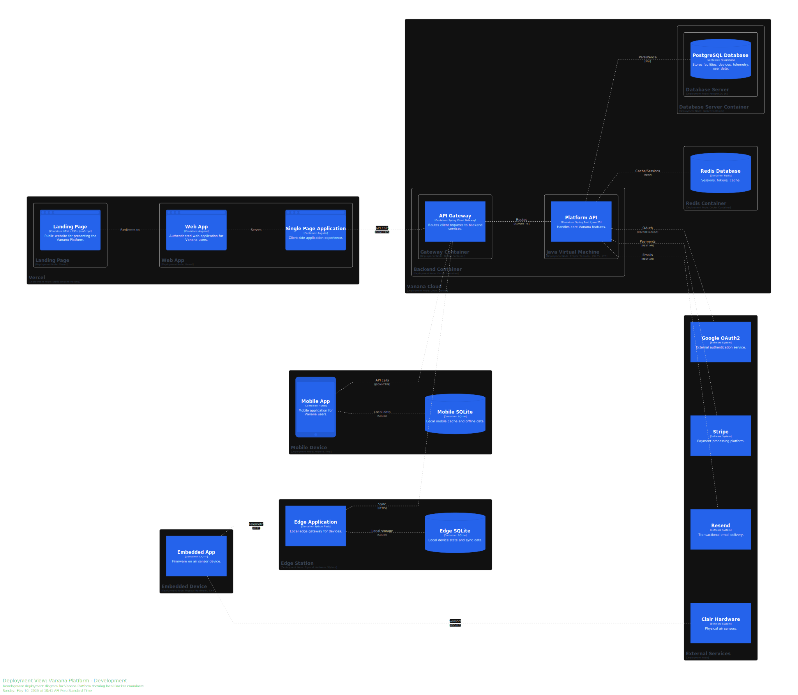
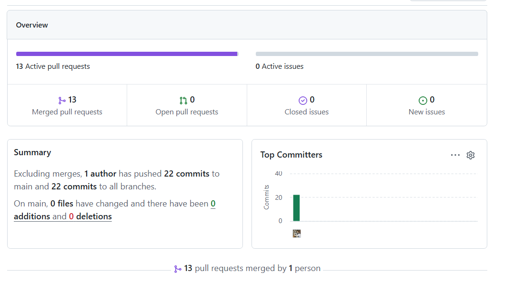
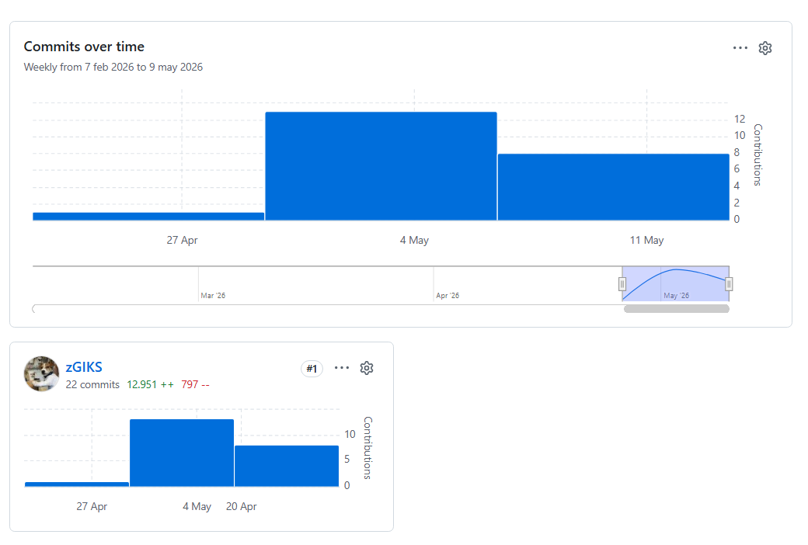
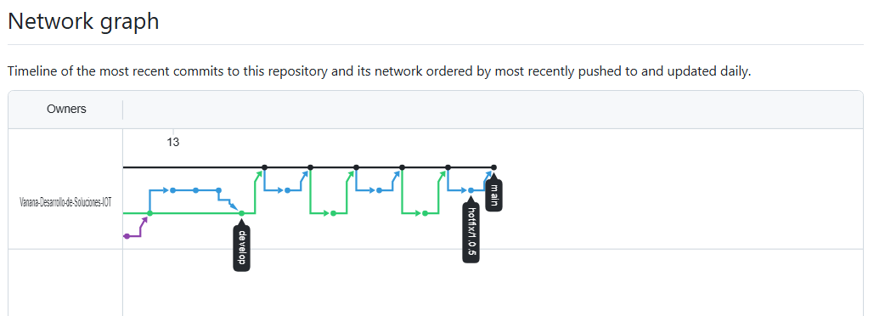
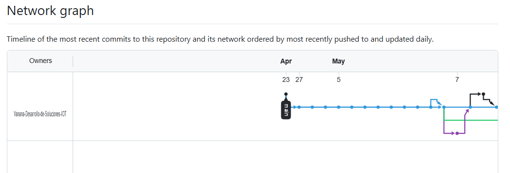

# Capítulo VI: Product Implementation, Validation & Deployment

## 6.1. Software Configuration Management.

### 6.1.1. Software Development Environment Configuration.

Esta sección establece el ecosistema de herramientas y servicios seleccionados para garantizar un flujo de trabajo estandarizado, facilitando la colaboración entre los miembros del equipo y la integración de los componentes IoT.

| **Nombre del Producto** | **Propósito de Uso** | **Descripción de Uso en el Proyecto** | **Ruta de Referencia / Descarga** |
| ----------------------- | ---------------------- | ------------------------------------------------------------ | ------------------------------------------------------------ |
| **Trello** | Project Management | Gestión de tareas mediante tableros Kanban y seguimiento de Sprints. | https://trello.com/ |
| **Figma** | Product UX/UI Design | Diseño de interfaces de usuario, wireframes y prototipos de alta fidelidad. | https://figma.com/ |
| **Git** | Software Development | Control de versiones distribuido para seguimiento de cambios en el código fuente. | https://git-scm.com/ |
| **GitHub** | Software Development | Alojamiento del repositorio de código fuente y colaboración en equipo. | https://github.com/ |
| **HTML / CSS / JavaScript** | Landing Page Development | Desarrollo de la landing page estática y componentes frontend básicos. | https://developer.mozilla.org/es/docs/Web |
| **Bruno** | API Testing | Alternativa ligera a Postman para validación de endpoints y pruebas de API REST. | https://www.usebruno.com/ |
| **Spring Boot (Java)** | Backend Development | Framework principal para el desarrollo de la API y lógica del negocio. | https://spring.io/projects/spring-boot |
| **OpenAPI / Swagger** | Software Documentation | Generación de documentación interactiva y técnica de los endpoints del backend. | https://swagger.io/ |
| **C++ (Arduino IDE)** | Embedded App | Programación de la lógica de sensores y conectividad en hardware físico. | https://www.arduino.cc/en/software |
| **Wokwi** | IoT Simulation | Simulador online para prototipado y pruebas de circuitos ESP32 y sensores sin hardware físico. | https://wokwi.com/ |
| **Cirkit Designer** | Circuit Design | Plataforma web para diseño de circuitos electrónicos y prototipos IoT. | https://app.cirkitdesigner.com |
| **Python** | Automation & Analytics | Scripts para análisis de datos ambientales y automatización de tareas. | https://www.python.org/downloads/ |
| **Flask** | Edge IoT Framework | Framework ligero para desarrollo del Edge Station, recepción de telemetría y sincronización con la nube. | https://flask.palletsprojects.com/ |
| **Google OAuth2** | Identity & Access | Servicio para la autenticación segura de usuarios mediante cuentas de Google. | https://console.cloud.google.com/ |
| **Stripe** | Billing & Subscription | Pasarela de pagos para la gestión de suscripciones y transacciones. | https://stripe.com/ |
| **Resend** | Notifications | Plataforma para el envío de correos electrónicos y alertas críticas a usuarios. | https://resend.com/ |
| **Postman** | Software Testing | Validación de endpoints y pruebas de integración de la API REST. | https://www.postman.com/downloads/ |
| **Docker** | Deployment | Contenedorización de microservicios para asegurar la portabilidad del sistema. | https://www.docker.com/products/docker-desktop |
| **Vercel** | Deployment | Plataforma de despliegue serverless para la landing page y aplicación web Angular. | https://vercel.com/ |
| **Cloudflare Tunnel** | Deployment | Túnel seguro para exponer la API Gateway y servicios Spring Boot sin IP pública. | https://www.cloudflare.com/products/tunnel/ |
| **Tailscale** | Networking | Red privada virtual (VPN) para conexión segura entre la API local y dispositivos IoT. | https://tailscale.com/ |
| **Azure IoT Hub** | IoT Cloud Platform | Servicio de Azure para conectividad, monitoreo y gestión de dispositivos IoT en la nube. | https://azure.microsoft.com/services/iot-hub/ |
| **Flutter SDK** | Mobile Development | Framework multiplataforma para el desarrollo de la aplicación móvil de Clair. | [docs.flutter.dev](https://docs.flutter.dev/get-started/install) |
| **Angular CLI** | Web Development | Herramienta de línea de comandos para la creación y gestión de la aplicación web. | https://angular.io/cli |
| **Material Design 3** | UI Framework | Librería de componentes y tokens de diseño para la interfaz de la web app. | https://m3.material.io/ |
| **Dart DevTools** | Debugging | Conjunto de herramientas para el perfilado y depuración de la app en Flutter. | https://dart.dev/tools/dart-devtools |

### 6.1.2. Source Code Management.

Para la gestión y seguimiento de las modificaciones del proyecto, el equipo utilizará GitHub como plataforma centralizada y sistema de control de versiones distribuido. A continuación, se detallan las rutas de acceso a los repositorios correspondientes a cada componente del sistema:

* Landing Page: https://github.com/Vanana-Desarrollo-de-Soluciones-IOT/site

* Web Services: https://github.com/Vanana-Desarrollo-de-Soluciones-IOT/clair-core 

(Este repositorio incluye el código fuente del API, así como las suites de pruebas unitarias, de integración y de aceptación).

* Frontend Web Applications: https://github.com/Vanana-Desarrollo-de-Soluciones-IOT/clair-ui

El equipo implementará el modelo GitFlow para gestionar el ciclo de vida del desarrollo. Se mantendrán dos ramas principales de larga duración: main, que alojará exclusivamente código en estado de producción, y develop, que servirá como rama de integración para el desarrollo activo. Para la implementación de nuevas funcionalidades, correcciones o preparaciones de versiones, se utilizarán ramas temporales que se fusionarán siguiendo la lógica del modelo de Vincent Driessen.

<p align="center">
 
</p>

Para garantizar la trazabilidad y el orden en el repositorio, se establecen las siguientes convenciones de nomenclatura:

* Feature Branches: Se utilizará el prefijo feature/ seguido de una descripción breve en minúsculas y guiones (ej. feature/user-authentication). Cada nueva característica deberá desarrollarse en su propia rama.

* Release Branches: Se utilizará el prefijo release/ seguido del número de versión correspondiente (ej. release/v1.0.0).

*   Hotfix Branches: Se utilizará el prefijo hotfix/ seguido de una descripción corta del error corregido (ej. hotfix/login-error).

El proyecto adoptará el estándar de Semantic Versioning 2.0.0 (SemVer) para el etiquetado de versiones, utilizando el formato MAYOR.MENOR.PARCHE (ej. v1.2.4). Asimismo, el registro de cambios en el historial de Git se realizará bajo la convención de Conventional Commits, estructurando los mensajes con un tipo descriptivo (feat, fix, docs, style, refactor, test, chore) seguido de una descripción concisa, facilitando así la lectura del historial y la generación automática de changelogs.

<p align="center">
 
</p>
### 6.1.3. Source Code Style Guide & Conventions.

Para garantizar la mantenibilidad, escalabilidad y legibilidad del ecosistema tecnológico de **Clair**, el equipo ha adoptado un conjunto de directrices estrictas basadas en estándares internacionales de la industria. Una decisión fundamental de diseño es que toda la nomenclatura (nombres de clases, variables, métodos y comentarios) se realizará exclusivamente en inglés, asegurando la consistencia técnica y facilitando la integración de servicios de terceros.

A continuación, se describen las convenciones y guías de estilo adoptadas para los lenguajes principales de la solución:

- **Java (Backend):** Se seguirá estrictamente la **Google Java Style Guide**. Se empleará *UpperCamelCase* para los nombres de clases y *lowerCamelCase* para métodos y variables. Al utilizar **Spring Boot**, se respetarán sus convenciones de estructura de paquetes orientada a dominios y el uso de anotaciones para la inyección de dependencias, garantizando un código limpio y desacoplado.
- **C++ (Embedded App):** Para la lógica de los dispositivos físicos, se aplican convenciones de nombrado claras que reflejen acciones físicas del hardware, como la captura de telemetría. Se utilizará *SCREAMING_SNAKE_CASE* para constantes y macros, manteniendo una estructura que facilite el rastreo de cambios en el código de sensores.
- **TypeScript & Angular (Web App):** Se implementará la **Angular Coding Style Guide** oficial. Se prioriza el uso de tipos estrictos en TypeScript y el nombrado de componentes siguiendo el patrón `nombre.component.ts`. La interfaz se construirá bajo los estándares de **Material Design 3**, utilizando sus tokens de diseño para garantizar la consistencia visual.
- **HTML & CSS:** Se implementará la **Google HTML/CSS Style Guide**. Las clases de estilo se nombrarán bajo la metodología BEM (Block Element Modifier) en inglés, buscando evitar la confusión visual y optimizar la reutilización de componentes de UI.
- **Dart & Flutter (Mobile App):** Se adoptan las **Effective Dart** guidelines. Se utilizará *UpperCamelCase* para clases y *lowerCamelCase* para variables y funciones. Para la estructura de archivos, se seguirá la convención de *snake_case* y se aplicará una arquitectura de estados limpia para asegurar la reactividad de la interfaz.
- **Python (Automation & Data):** Se seguirá el estándar **PEP 8** para todos los scripts de análisis y automatización. Esto asegura que las visualizaciones técnicas y el procesamiento de datos ambientales mantengan un estándar de calidad profesional.
- **Gherkin (.feature files):** Para la automatización de pruebas y especificación de requerimientos, se utilizarán las **Gherkin Conventions for Readable Specifications**. Todas las historias de usuario y criterios de aceptación se redactarán en inglés empleando las palabras clave *Given, When, Then* para describir el comportamiento esperado del sistema.

Esta uniformidad en todos los niveles del stack tecnológico permite que cualquier miembro del equipo pueda intervenir en los diferentes módulos de la solución con una curva de aprendizaje reducida, manteniendo siempre un estándar de calidad profesional en el repositorio de **GitHub**.

### 6.1.4. Software Deployment Configuration.

La configuración del despliegue de la plataforma Vanana se basa en una arquitectura de microservicios y contenedores orientada a garantizar la escalabilidad y la interoperabilidad entre los dispositivos IoT y la infraestructura en la nube. El sistema se distribuye en distintos entornos, desde servidores centralizados hasta dispositivos embebidos instalados en el sitio del usuario. Esta estrategia permite que componentes críticos, como el API Gateway y los servicios backend, operen en entornos Linux mediante contenedores Docker, facilitando la portabilidad, el aislamiento de procesos y una gestión eficiente de los recursos.

Para la lógica central de la solución, se utiliza un clúster backend que aloja la Platform API desarrollada en Java 25. Este entorno se integra con un API Gateway encargado de centralizar y redirigir el tráfico de red, asegurando una comunicación segura y fluida entre clientes y servicios internos. La persistencia de datos se gestiona de manera híbrida: PostgreSQL 16 almacena información transaccional, configuración de dispositivos y datos de usuario, mientras que Redis administra sesiones y memoria caché para optimizar los tiempos de respuesta.

Los productos orientados al usuario web, como la Landing Page y la Web Application desarrollada en Angular, se despliegan en plataformas especializadas para frontend como Vercel. Esta infraestructura permite distribuir globalmente los activos estáticos y la Single Page Application (SPA), reduciendo la latencia y mejorando la experiencia del usuario. Además, al desacoplar la capa de presentación del backend, se incrementa la resiliencia del sistema y se simplifican los procesos de actualización y despliegue de nuevas versiones.

En el ámbito móvil, la Mobile Application desarrollada en Flutter se distribuye para Android e iOS. La aplicación incorpora SQLite como base de datos local, permitiendo almacenar preferencias y telemetría histórica directamente en el dispositivo. Gracias a ello, la aplicación puede seguir operando incluso con conectividad limitada, sincronizando la información de manera asíncrona con el API Gateway cuando el acceso a internet se restablece.

La solución integra una capa de computación perimetral (Edge) y aplicaciones embebidas para la gestión directa del hardware. La Edge Station se despliega en nodos físicos locales utilizando Python y Flask, funcionando como un punto intermedio de procesamiento que deduplica y sincroniza la información capturada. Por otro lado, la aplicación embebida en C++ se distribuye como firmware dentro de los sensores físicos de Clair Hardware, permitiendo la captura de métricas ambientales en tiempo real. El ecosistema se complementa con servicios SaaS para autenticación mediante Google OAuth2, procesamiento de pagos con Stripe y mensajería transaccional a través de Resend.




# 6.2. Landing Page, Services & Applications Implementation.

### 6.2.1. Sprint 1

#### 6.2.1.1. Sprint Planning 1.

El Sprint Planning 1 marca el inicio del desarrollo formal de Clair. Durante esta sesión, el equipo se reunió para definir los objetivos y el alcance del primer sprint, priorizando la presentación pública del producto, la seguridad de acceso y la base visual de la plataforma. Las tareas se centraron en completar el 100% de la Landing Page para la captación de usuarios, desarrollar el módulo de Identity and Access Management (IAM) tanto en el backend como en el frontend web, y finalizar los mockups de alta fidelidad de la Web App. El desarrollo de la aplicación móvil se ha programado para iteraciones posteriores.

<table style="width: 100%; border-collapse: collapse;">
  <tr>
    <td style="border: 1px solid #ddd; padding: 8px; font-weight: bold;">Sprint #</td>
    <td style="border: 1px solid #ddd; padding: 8px;">Sprint 1</td>
  </tr>
  <tr>
    <td colspan="2" style="border: 1px solid #ddd; padding: 8px; font-weight: bold; text-align: center;">Sprint Planning Background</td>
  </tr>
  <tr>
    <td style="border: 1px solid #ddd; padding: 8px; font-weight: bold;">Date</td>
    <td style="border: 1px solid #ddd; padding: 8px;">06/04/2026</td>
  </tr>
  <tr>
    <td style="border: 1px solid #ddd; padding: 8px; font-weight: bold;">Time</td>
    <td style="border: 1px solid #ddd; padding: 8px;">10:00 AM</td>
  </tr>
  <tr>
    <td style="border: 1px solid #ddd; padding: 8px; font-weight: bold;">Location</td>
    <td style="border: 1px solid #ddd; padding: 8px;">Google Meet</td>
  </tr>
  <tr>
    <td style="border: 1px solid #ddd; padding: 8px; font-weight: bold;">Prepared By</td>
    <td style="border: 1px solid #ddd; padding: 8px;">Aleman Romano, Dante Mateo</td>
  </tr>
  <tr>
    <td style="border: 1px solid #ddd; padding: 8px; font-weight: bold;">Attendees (to planning meeting)</td>
    <td style="border: 1px solid #ddd; padding: 8px;">Contreras Peralta Fabrizio Alessandro; Macavilca Quispe Ian; Paiva Quispe Josue Gonzalo; Curipaco Huayllani Neil</td>
  </tr>
  <tr>
    <td style="border: 1px solid #ddd; padding: 8px; font-weight: bold;">Sprint n - 1 Review Summary</td>
    <td style="border: 1px solid #ddd; padding: 8px;">No hay resumen del sprint anterior debido a que este es el primer sprint.</td>
  </tr>
  <tr>
    <td style="border: 1px solid #ddd; padding: 8px; font-weight: bold;">Sprint n - 1 Retrospective Summary</td>
    <td style="border: 1px solid #ddd; padding: 8px;">No hay resumen del sprint anterior debido a que este es el primer sprint.</td>
  </tr>
  <tr>
    <td colspan="2" style="border: 1px solid #ddd; padding: 8px; font-weight: bold; text-align: center;">Sprint Goal & User Stories</td>
  </tr>
  <tr>
    <td style="border: 1px solid #ddd; padding: 8px; font-weight: bold;">Sprint 1 Goal</td>
    <td style="border: 1px solid #ddd; padding: 8px;">
      Our focus is on deploying the complete landing page, implementing the core authentication system (IAM), and defining the visual structure of the web application.<br><br>
      We believe it delivers a clear value proposition to potential customers, a secure access gateway for registered users, and a solid design foundation for the development team.<br><br>
      This will be confirmed when visitors can successfully access and read the landing page online, users can securely register and log in to the web platform, and the team officially approves the Web App mockups.
    </td>
  </tr>
  <tr>
    <td style="border: 1px solid #ddd; padding: 8px; font-weight: bold;">Sprint 1 Velocity</td>
    <td style="border: 1px solid #ddd; padding: 8px;">45</td>
  </tr>
  <tr>
    <td style="border: 1px solid #ddd; padding: 8px; font-weight: bold;">Sum of Story Points</td>
    <td style="border: 1px solid #ddd; padding: 8px;">45</td>
  </tr>
</table>
#### 6.2.1.2. Aspect Leaders and Collaborators.

En esta sección se detalla la **Leadership-and-Collaboration Matrix (LACX)** para el Sprint 1. El objetivo de esta matriz es delegar responsabilidades claras sobre los diferentes componentes de la solución, asegurando que cada aspecto técnico y funcional cuente con un referente directo (*Leader*) y el apoyo necesario de los demás integrantes (*Collaborator*). Para este sprint, los aspectos se han dividido en tres frentes críticos: la presencia pública y legal (Landing Page), la seguridad de acceso (IAM) y la integración fundamental del hardware (Embedded Core).

| **Team Member (Last Name, First Name)** | **GitHub Username** | **CVP (L/C)** | **DTB (L/C)** | **FAQ (L/C)** | **MLS (L/C)** | **PPT (L/C)** | **REG (L/C)** | **LOG (L/C)** | **PMI (L/C)** | **LDP (L/C)** |
| --------------------------------------- | ------------------- | ------------- | ------------- | ------------- | ------------- | ------------- | ------------- | ------------- | ------------- | ------------- |
| **Aleman Romano, Dante Mateo**          | zGIKS               | **L**         | C             | C             | C             | C             | **L**         | C             | C             | **L**         |
| **Contreras Peralta, Fabrizio**         | fabriziocpa         | C             | C             | **L**         | C             | C             | C             | C             | C             | C             |
| **Curipaco Huayllani, Neil A.**         | Neilcur7            | C             | C             | C             | C             | **L**         | C             | C             | **L**         | C             |
| **Macavilca Quispe, Ian**               | IanMQ               | C             | **L**         | C             | C             | C             | C             | **L**         | C             | C             |
| **Paiva Quispe, Josue Gonzalo**         | JosuePaiva02        | C             | C             | C             | **L**         | C             | C             | C             | C             | C             |

**Leyenda de Aspectos (Key):**

Para facilitar la lectura de la matriz, se han utilizado los siguientes acrónimos basados en las tareas del Sprint:

- **CVP:** Clair Value Proposition (Landing Page Content)
- **DTB:** Development Team Background (Landing Page Content)
- **FAQ:** FAQ & Help Center (Support & Documentation)
- **MLS:** Multi-language Support (Internationalization)
- **PPT:** Privacy Policies & Terms (Legal Compliance)
- **REG:** Register a New Account (Frontend/Backend Auth)
- **LOG:** Log in (Authentication Services)
- **PMI:** Particulate Matter Integration (UART Implementation)
- **LDP:** Local Data Persistence (SD Card Module)

> **L:** Leader (Responsable principal de la entrega y calidad del aspecto).
>
> **C:** Collaborator (Apoyo técnico, revisión de código y soporte en la implementación).


#### 6.2.1.3. Sprint Backlog 1.

El **Sprint Backlog** representa la selección de historias de usuario y tareas técnicas que el equipo de desarrollo se ha comprometido a completar durante la presente iteración. Para el **Sprint 1**, el esfuerzo se ha concentrado en establecer la infraestructura crítica de **Clair**, priorizando la visibilidad comercial del producto a través de la Landing Page y la seguridad de la información mediante el sistema de gestión de identidades y accesos (**IAM**). Esta fase inicial es fundamental para garantizar que las bases tecnológicas y visuales de la solución sean sólidas antes de proceder con el desarrollo de funcionalidades de monitoreo avanzado.

La gestión y el seguimiento del progreso se realizan de manera centralizada en la plataforma **Trello**, la cual permite una visibilidad en tiempo real del estado de cada unidad de trabajo. Este sistema de control facilita la descomposición de las historias de usuario en tareas técnicas específicas (*Work-items*), así como la gestión de actividades transversales relacionadas con la configuración del entorno y el cumplimiento de los estándares de diseño de **Material Design 3**. A continuación, se detalla el desglose de los elementos de trabajo seleccionados para este periodo.

<p align="center">
 
</p>


| **StoryID** | **Title**                        | **ID task** | **Título**                       | **Descripción**                                              | **Estimation (Hours)** | **Assigned To** | **Status** |
| :---------: | :------------------------------- | :---------- | :------------------------------- | :----------------------------------------------------------- | :--------------------- | :-------------- | :--------- |
|    US55     | Clair Value Proposition          | TA1         | Clair Value Proposition          | As a Visitor, I want to learn about the benefits of CO2 and PM2.5 monitoring, to understand how Clair improves health in indoor spaces. | 3                      | Mateo           | done       |
|    US56     | Development Team Background      | TA2         | Development Team Background      | As a Visitor, I want to know the technical background of the development team, to validate the scientific accuracy and technological reliability of the sensor. | 3                      | Ian             | done       |
|    US57     | FAQ & Help Center                | TA3         | FAQ & Help Center                | As a Visitor, I want to resolve doubts about Device installation and data privacy, to feel secure implementing the system in my home. | 3                      | Fabrizio        | done       |
|    US58     | Multi-language Support           | TA4         | Multi-language Support           | As a Visitor, I want the Landing Page to be available in English and Spanish, to understand the technical specifications in my preferred language. | 4                      | Josue           | done       |
|    US59     | Privacy Policies & Terms         | TA5         | Privacy Policies & Terms         | As a Visitor, I want to access the terms of service, to know the legal handling of my data and Clair's responsibilities regarding the hardware. | 2                      | Neil            | done       |
|    US01     | Register a new account           | TA7         | Register a new account           | As a Visitor, I want to create an account with my email and a password, so that I can access Clair as a registered Customer. | 3                      | Mateo           | done       |
|    US03     | Log in                           | TA9         | Log in                           | As a Customer, I want to authenticate with my credentials, so that I can access my personalized Clair workspace. | 3                      | Ian             | done       |
|    US61     | Arduino Core Setup               | TA10        | Arduino Core Setup               | As a Developer, I want to set up the Arduino/ESP32 framework and basic library dependencies, so that I can begin hardware-level programming. | 4                      | Fabrizio        | done       |
|    US62     | CO2 Sensor Integration           | TA11        | CO2 Sensor Integration           | As a Developer, I want to interface the CO2 sensor (e.g., SCD4x) via I2C, so that I can read atmospheric concentration levels. | 5                      | Josue           | done       |
|    US63     | Particulate Matter Integration   | TA12        | Particulate Matter Integration   | As a Developer, I want to interface the PM sensor (e.g., PMS7003) via UART, so that I can monitor air quality particles (PM2.5/PM10). | 4                      | Neil            | done       |
|    US64     | Local Data Persistence (SD Card) | TA13        | Local Data Persistence (SD Card) | As a Developer, I want to write readings to an SD card module, so that data is not lost if connectivity fails during early field tests. | 5                      | Mateo           | done       |
|    US65     | WiFi Connectivity & NTP Sync     | TA14        | WiFi Connectivity & NTP Sync     | As a Developer, I want to connect the device to WiFi and sync time via NTP, so that readings are correctly timestamped at the source. | 5                      | Ian             | done       |
|    US66     | Serial Debugging Interface       | TA15        | Serial Debugging Interface       | As a Developer, I want to output formatted sensor data to the Serial Monitor, so that I can verify sensor accuracy during laboratory testing. | 5                      | Fabrizio        | done       |
|    US67     | Deep Sleep Implementation        | TA16        | Deep Sleep Implementation        | As a Developer, I want to implement deep sleep cycles between readings, so that the device can operate on battery power for extended periods. | 4                      | Josue           | done       |

#### 6.2.1.4. Development Evidence for Sprint Review.

1. **Landing page**

La versión **Release 1.0.0** comprende la implementación completa de la solución **Clair Landing Page**, incluyendo todas las páginas definidas del proyecto (Landing Page y aplicaciones web relacionadas), así como funcionalidades complementarias orientadas a la experiencia de usuario, accesibilidad y escalabilidad de la plataforma.

El desarrollo de esta versión se realizó mediante **11 pull requests**, integrando un total de **16 ramas** y **49 commits**, reflejando un proceso de desarrollo colaborativo, estructurado y alineado con buenas prácticas de control de versiones.

**Componentes implementados**

1. **Landing Page (index.html)**
   Página principal de presentación de Clair, diseñada con una sección hero, visualización de sensores, mapa mundial interactivo y una estructura completamente responsive para distintos dispositivos.
2. **Página de Producto (product.html)**
   Sección dedicada a la presentación de las características y propuesta de valor del producto.
3. **Página de Precios (pricing.html)**
   Página orientada a la visualización de planes y precios disponibles de la solución.
4. **Página “About” (about.html)**
   Espacio informativo sobre el proyecto y el equipo responsable del desarrollo.
5. **Página de Privacidad (privacy.html)**
   Implementación de la política de privacidad y tratamiento de datos de la plataforma.
6. **Página de Contacto (contact.html)**
   Sección destinada a información de contacto y canales de comunicación.

**Características técnicas implementadas**

- Diseño responsive basado en enfoque **mobile-first**, garantizando compatibilidad en dispositivos móviles, tablets y escritorio.
- Implementación de soporte de **internacionalización (i18n)** para múltiples idiomas.
- Refactorización de la lógica de navegación y menú en un archivo independiente (`menu.js`) para mejorar mantenibilidad y reutilización.
- Integración de íconos mediante la librería Lucide.
- Gestión de recursos gráficos y logotipos en formato SVG.
- Visualización de mapa mundial con representación de datos por país.

En conjunto, esta versión establece la primera base funcional y visual de la plataforma Clair, consolidando tanto la identidad digital del proyecto como su arquitectura inicial de frontend.


| Branch                 | Commit Id                                | Commit Message                                               | Commit Message Body                                          | Committed on (Date) | User/RepositoryName  |
| ---------------------- | ---------------------------------------- | ------------------------------------------------------------ | ------------------------------------------------------------ | ------------------- | -------------------- |
| develop                | e9628e56a2a3f254f865ad11c231e5daf7b911cb | first commit                                                 | -                                                            | 2026-05-03          | zGIKS                |
| feature/add-section1   | 2666e868aa73b24449ea5ba9a27aae65d8e36160 | feat: enhance navigation for mobile and desktop; implement menu toggle functionality | -                                                            | 2026-05-04          | zGIKS                |
| feature/add-section1   | f0c3a859ee25921db144bf6ce82d9572e3bf1fd2 | feat: remove box-shadow from globe placeholder for cleaner design | -                                                            | 2026-05-04          | zGIKS                |
| feature/add-section1   | b35238082b76b2161d341e3cb5131f1d98787dca | feat: update header position and styling; add gradient background to hero section | -                                                            | 2026-05-04          | zGIKS                |
| feature/add-section1   | c1fe16339ebc0da63f6c9271e92274fbeb6fbcf3 | feat: update assets and HTML structure for sensor display    | -                                                            | 2026-05-04          | zGIKS                |
| feature/add-section1   | b68f73b3c484eb966a49427c5b634df3a3d7ac24 | feat: add countries data with regions and coordinates to countries.json | -                                                            | 2026-05-04          | zGIKS                |
| feature/add-section1   | 114358d0a2faf4fc47c6a851ec06c67d0e006d7b | feat: add sensor SVG asset and update index.html to include it | style: update nav link color to white for better visibility  | 2026-05-04          | zGIKS                |
| feature/add-section1   | d2c78dc47855b87e6802cf95f024ed072c3402eb | feat: add Clair banner image to the hero section             | -                                                            | 2026-05-04          | zGIKS                |
| feature/add-section1   | 6076a2779b7f5b63b5a52c2ccb7b03a63913172f | feat: add Clair logo SVG and sensor image, update styles and HTML structure | Added clair.svg logo to assets, introduced sensor-last.png, refactored CSS styles, integrated Lucide icons | 2026-05-04          | zGIKS                |
| feature/add-section1   | 483de8ed7369a83ef3ada0a85e4b0898875e6f65 | Refactor CSS structure and update HTML layout                | Added reset CSS, created responsive CSS, consolidated styles into sections.css | 2026-05-04          | zGIKS                |
| feature/add-section1   | 14a0d55d52f3d8bda8767ff87e4c906b07ac4445 | feat: add responsive layout and interactive world map visualization | -                                                            | 2026-05-04          | zGIKS                |
| feature/add-section1   | d091b1e9faeaefc0d04024f5746fcad0613e67df | refactor: restructure CSS and implement responsive mobile menu | -                                                            | 2026-05-04          | zGIKS                |
| feature/add-favicon    | 50189cf7509fbf821de23a3057f7db143e932f56 | feat: add SVG icon and update favicon link in HTML           | -                                                            | 2026-05-04          | zGIKS                |
| feature/add-favicon    | a9528dafb395832da52c1bc99cc9c8d5596c8d40 | feat: update favicon colors to improve visibility and change page title to 'Clair' | -                                                            | 2026-05-04          | zGIKS                |
| feature/footer-pages   | 9650963c5ffc02d6ddefca82634a25fd09988d87 | fix: errors                                                  | -                                                            | 2026-05-04          | JosuePaiva02         |
| feature/add-pricing    | 803d33150fd89eb1374b7b0acf2694da877ff870 | pricing seccion                                              | -                                                            | 2026-05-04          | Neilcuri7            |
| feature/add-pricing    | 6b2bd20288a3bb0ed20d29d1cfe391db12510067 | imagen agregada                                              | -                                                            | 2026-05-04          | Neilcuri7            |
| feature/product-page   | 039440afbd7806560d04c54f04f6c52316f54960 | feat: product page                                           | -                                                            | 2026-05-04          | Ian Macavilca Quispe |
| feature/product-page   | 22f11dcf8cd93cac1abbe714dc6fc96c3c599228 | feat: about page                                             | page routing, about page, product page fix                   | 2026-05-04          | Ian Macavilca Quispe |
| fix/price-page         | 604fa92ac1e1b3d1b54c21d74771b34d18c92aac | feat: update pricing section with product name, pricing display, and associated styles | -                                                            | 2026-05-05          | Neilcuri7            |
| feature/add-js-fix     | 1f081e8bccb34df99d88db12e4d2089266dcd372 | feat: refactor menu functionality into separate menu.js file | -                                                            | 2026-05-05          | zGIKS                |
| feature/footer-privacy | 0b31b18c3bd9c14919b5dec234d7881b5abdd795 | feat: added privacy page                                     | -                                                            | 2026-05-05          | JosuePaiva02         |
| feature/enhance-css    | fae1b1ad087c58d023599e5241a9e1e6100d925b | feat: add team image                                         | -                                                            | 2026-05-07          | fabriziocpa          |
| feature/enhance-css    | 21becfc0e85720e772baf0e7a830979192a70844 | feat: add team image                                         | -                                                            | 2026-05-07          | fabriziocpa          |
| feature/enhance-css    | 43406e3f2e1a1d41d5737acac16f7f8892fea05c | feat: update team image                                      | -                                                            | 2026-05-07          | fabriziocpa          |
| feature/enhance-css    | c43bfadb646dee70e18ca514ebdaf5042cf5acad | feat: update about us and navigation                         | -                                                            | 2026-05-07          | fabriziocpa          |
| feature/enhance-css    | 0c61494ec9f589d4eaad421f840c0ee3350ece06 | feat: update css                                             | -                                                            | 2026-05-07          | fabriziocpa          |
| feature/enhance-css    | c041bb8c79c76ed719173aaa43260a74560e0d90 | feat: update css                                             | -                                                            | 2026-05-09          | fabriziocpa          |
| develop                | 39fc1d87f02eced21620fc65fde2d3c4aac6b289 | feat: add i18n                                               | -                                                            | 2026-05-09          | fabriziocpa          |
| develop                | b78f35a1d72736e222d1fb3e9cedba03abf59677 | feat: added i18n consistency                                 | -                                                            | 2026-05-09          | fabriziocpa          |

2. **Web application**

| Branch                           | Commit Id                                | Commit Message                                               | Commit Message Body                                          | Committed on (Date) | User/RepositoryName |
| -------------------------------- | ---------------------------------------- | ------------------------------------------------------------ | ------------------------------------------------------------ | ------------------- | ------------------- |
| develop                          | 762a15b9a7660e21d908d84240615a18440dd860 | Merge pull request #6 from Vanana-Desarrollo-de-Soluciones-IOT/feature/add-google-oauth2 | Feature/add google oauth2                                    | 2026-05-09          | m.                  |
| feature/add-google-oauth2        | d924683d6fe5465280aca16babd07001880eccbd | feat: remove Google sign-in button and related styles; update registration form with terms acceptance and Google sign-in integration | -                                                            | 2026-05-09          | zGIKS               |
| feature/add-google-oauth2        | 4bfb7ef8e7d35a0278e1e716730a246d818b4515 | feat: implement Google OAuth2 sign-in flow with callback handling and UI integration | -                                                            | 2026-05-09          | zGIKS               |
| develop                          | 1b4030eede9d3fb94d3ede3588f8a1c822012b6e | Merge pull request #5 from Vanana-Desarrollo-de-Soluciones-IOT/feature/add-home-page-components | Feature/add home page components                             | 2026-05-09          | m.                  |
| feature/add-home-page-components | 6739a69518ad933dfe0f655d49f0dafa4ced16ff | feat: add new icon components for air quality, alerts actions, overview, reports, and space devices; update sidebar to use component-based icons | -                                                            | 2026-05-09          | zGIKS               |
| feature/add-home-page-components | cb05d5d33609fa323a48cb45d78eda53b375f756 | feat: add text-decoration property to nav-item for consistency | -                                                            | 2026-05-09          | zGIKS               |
| feature/add-home-page-components | cd0f55906a9ef5139a1688f316323a2ead78370b | feat: implement overview and settings pages with responsive layout and sidebar integration | -                                                            | 2026-05-09          | zGIKS               |
| feature/add-home-page-components | fe3bc41d24b6269c66b5c39dc20facb9b07ffeb2 | feat: enhance sidebar component with mobile responsiveness and navigation item click handling | -                                                            | 2026-05-09          | zGIKS               |
| feature/add-home-page-components | 118f2875341d33bf5043fcfa6ab28421d27d6c7d | feat: add sidebar component                                  | -                                                            | 2026-05-07          | zGIKS               |
| develop                          | 4a50bbcffa042f9be19e922704a84af873c8ccba | Merge pull request #4 from Vanana-Desarrollo-de-Soluciones-IOT/feature/add-remove-page-scroll | feat: Update page container styles to ensure consistent height and ov… | 2026-05-07          | m.                  |
| feature/add-remove-page-scroll   | 804a86a6dc0162f89824e94577026266b16f4f5a | feat: Update page container styles to ensure consistent height and overflow behavior across confirm, login, and register pages | -                                                            | 2026-05-07          | zGIKS               |
| develop                          | 9d9f20eaa9f0c4a169e8f7caf54120d03d4717f0 | Merge pull request #3 from Vanana-Desarrollo-de-Soluciones-IOT/feature/add-bearer-token | feat: Implement bearer token management with local storage integratio… | 2026-05-07          | m.                  |
| feature/add-bearer-token         | 02657c9421c2d154f27fb3812b35ae050dd29efb | feat: Implement bearer token management with local storage integration and update authentication services | -                                                            | 2026-05-07          | zGIKS               |
| develop                          | 00cb91c7e05eb62c236d12dcba883bb24cc648c7 | Merge pull request #2 from Vanana-Desarrollo-de-Soluciones-IOT/feature/add-logout-services | feat: Add sign-out functionality with command and service integration | 2026-05-05          | m.                  |
| feature/add-logout-services      | 5bc9837eceae2d1b6d25416ea79cbdc22d1bccd8 | feat: Add sign-out functionality with command and service integration | -                                                            | 2026-05-05          | zGIKS               |
| develop                          | 5e78b44a3f9fcfec3ee0dea123c5f4e2d4c3e5b2 | Merge pull request #1 from Vanana-Desarrollo-de-Soluciones-IOT/feature/add-iam-page | Feature/add iam page                                         | 2026-05-05          | m.                  |
| feature/add-iam-page             | 9e387309a66f2b0c48e04d1c2a53bd857150d6b1 | feat: Update styles and fonts for improved UI consistency and aesthetics | -                                                            | 2026-05-05          | zGIKS               |
| feature/add-iam-page             | 688d1f422f0921c7b15c0e199bfe4c773dc56710 | feat: Add Clair logo component and update login/register pages with logo integration | -                                                            | 2026-05-05          | zGIKS               |

3. **Web services**

| Branch                          | Commit Id                                | Commit Message                                               | Commit Message Body                                          | Committed on (Date) | User/RepositoryName |
| ------------------------------- | ---------------------------------------- | ------------------------------------------------------------ | ------------------------------------------------------------ | ------------------- | ------------------- |
| develop                         | ea498353adcd3f5428b958d9f29f1760ef676104 | Merge pull request #6 from Vanana-Desarrollo-de-Soluciones-IOT/feature/add-roles | feat: Add user plan retrieval and enhance Stripe webhook handling wit… | 2026-05-10          | Neilcuri7           |
| feature/add-roles               | d8e0ffe626664b13905d417ae0752be0df58cb22 | feat: Add user plan retrieval and enhance Stripe webhook handling with logging | -                                                            | 2026-05-10          | Neilcuri7           |
| develop                         | 556f75acabc64e51cff61cc03f6b59513d53e748 | Merge pull request #5 from Vanana-Desarrollo-de-Soluciones-IOT/feature/add-google-oauth2 | feat: Implement Google OAuth 2.0 authentication flow with user regist… | 2026-05-09          | zGIKS               |
| feature/add-google-oauth2       | 826a386ff76647dc098f4f0e414aaaeba46be322 | feat: Implement Google OAuth 2.0 authentication flow with user registration and sign-in | -                                                            | 2026-05-09          | zGIKS               |
| develop                         | bbcec1e5c2542a4217a189db1dad35202440a7b8 | Merge pull request #4 from Vanana-Desarrollo-de-Soluciones-IOT/feature/add-billing-context | Feature/add billing context                                  | 2026-05-07          | Neilcuri7           |
| feature/add-billing-context     | dc3dca52d28935c862df056b5b32551572ca80ea | feat: Enhance payment processing with user validation and result handling in CreatePaymentIntentCommand | -                                                            | 2026-05-07          | Neilcuri7           |
| feature/add-billing-context     | adb46cea5834124cf99dc180a4f15bd342a38579 | feat: Add CreatePaymentIntentCommand for payment processing with user validation | -                                                            | 2026-05-07          | Neilcuri7           |
| feature/add-billing-context     | 3ddd12405c8eb4040c2afbafd5cc1a1c1f87ddc1 | feat: Add subscription management with Stripe integration, including checkout session and payment intent creation | -                                                            | 2026-05-07          | Neilcuri7           |
| develop                         | c7a8fccee284c921602e0ed2650a98f399136f3b | Merge pull request #3 from Vanana-Desarrollo-de-Soluciones-IOT/feature/add-remove-rate-limiter | remove: rate limiter                                         | 2026-05-07          | zGIKS               |
| feature/add-remove-rate-limiter | f48b18640ebd1f4b9a407db8c6920dce5854265c | remove: rate limiter                                         | -                                                            | 2026-05-07          | zGIKS               |
| develop                         | 2572ca596f3922fbb85fc5df713bc015dc5285b8 | Merge pull request #2 from Vanana-Desarrollo-de-Soluciones-IOT/feature/add-spring-security | feat: add open api configuration and bearer config           | 2026-05-07          | zGIKS               |
| feature/add-spring-security     | 1dd0e01575917f6fae21ccbc6697d2db185e8880 | feat: add open api configuration and bearer config           | -                                                            | 2026-05-07          | zGIKS               |
| develop                         | 3ecbafef4eb07737672773d02b51dd4efe106784 | Merge pull request #1 from Vanana-Desarrollo-de-Soluciones-IOT/feature/add-iam | Feature/add iam                                              | 2026-05-05zGIKS     | zGIKS               |
| feature/add-iam                 | 195f03b16e2e55f81a3f1de116bc3ff984f75924 | feat: Add sign-out functionality to revoke all active tokens for a user | -                                                            | 2026-05-05          | zGIKS               |
| feature/add-iam                 | 17b63b4232053682ca8fbd797283b06322c3f887 | feat: Implement token management system with JWT support, including access and refresh token creation, validation, and rotation | -                                                            | 2026-05-05          | zGIKS               |
| feature/add-iam                 | 1ede23d2dcc820c8f903797d7bd506d7a0bc4c1b | feat: Update environment configuration, enhance JWT and CORS settings, and add Redis caching support | -                                                            | 2026-05-05          | zGIKS               |
| feature/add-iam                 | 35720f902dd3aedbbc6873b4dbb8d70fee0bd398 | feat: Refactor IAM commands, enhance JWT handling, and improve email logging | -                                                            | 2026-05-05          | zGIKS               |
| feature/add-iam                 | 3f633ef18414d93b252f9ab91cf7590de079ea3b | feat: Implement JWT authentication with refresh token support and enhance email notification logging | -                                                            | 2026-05-05          | zGIKS               |
| feature/add-iam                 | 476c622f357324866702c022ba5bddf10b576f77 | refactor: Remove deprecated IAM classes and configuration files | -                                                            | 2026-05-05          | zGIKS               |
| feature/add-iam                 | 9af7a6c91f61f41154e248cdd7fb95689dc3211c | feat: Add Redis configuration and implement registration flow with new command and resource classes | -                                                            | 2026-05-05          | zGIKS               |
| feature/add-iam                 | 8326f2f92e9e5174bbac51973a9a4a4565170348 | feat: add bc notifications and iam first flows               | -                                                            | 2026-04-27          | zGIKS               |
| main                            | 0341f90b31b35d8f30a64f4eadcf0e3025d48b5d | first commit                                                 | -                                                            | 2026-04-23          | zGIKS               |

#### 6.2.1.5. Testing Suite Evidence for Sprint Review.

#### 6.2.1.6. Execution Evidence for Sprint Review.

#### 6.2.1.7. Services Documentation Evidence for Sprint Review.

**Documentación de Web Services (OpenAPI)**

Durante este Sprint, logramos un avance significativo documentando nuestros Web Services con OpenAPI (Swagger) mediante `springdoc-openapi`. Se implementó seguridad centralizada (`BearerAuth` con JWT) para proteger los endpoints, y se documentaron exhaustivamente los controladores de **Autenticación** (registro, inicio de sesión, Google OAuth 2.0) y **Facturación** (suscripciones y Stripe). La interfaz interactiva resultante permite probar las integraciones directamente desde.

**Endpoints Principales y Acciones Soportadas**

A continuación, se resumen las principales operaciones implementadas y documentadas:

**1. Autenticación y Sesión**

* **Inicio de Sesión (`POST /api/v1/auth/sign-in`):**
  * **Input:** `email` y `password`.
  * **Output:** HTTP 200 OK con tokens JWT de acceso y refresco (o 401 si falla).
  * **Ejemplo de Respuesta:**
    ```json
    {
      "id": "8dc54a71-6ca1-4205-923c-c1a684585bc1",
      "email": "usuario@ejemplo.com",
      "token": "eyJhbGciOiJIUzI1NiIsInR5c...",
      "refreshToken": "d7a8fcc-45f8-4b72-826a..."
    }
    ```
* **Cierre de Sesión (`DELETE /api/v1/auth/sign-out`):**
  * **Input:** Cabecera `Authorization` con token Bearer.
  * **Output:** HTTP 204 No Content (sesión cerrada) o 401.
* **Otras operaciones:** Registro (`POST /api/v1/auth/sign-up`), Confirmación (`POST /api/v1/auth/confirm`), y Autenticación con Google (`POST /api/v1/auth/google/sign-in`).
**2. Gestión de Facturación y Suscripciones**

* **Consultar Plan de Usuario (`GET /api/v1/subscriptions/plans/{userId}`):**
  
  * **Output:** HTTP 200 OK con el tipo de plan y estado.
  * **Ejemplo de Respuesta:**
    ```json
    {
      "userId": "8dc54a71-6ca1-4205-923c-c1a684585bc1",
      "plan": "premium",
      "status": "ACTIVE"
    }
    ```
* **Crear Sesión Checkout en Stripe (`POST /api/v1/subscriptions/checkout-session`):**
  
  * **Input:** `userId`, `amount`, `currency`, `returnUrl`.
  * **Output:** HTTP 200 OK con la URL de redirección al pago.
  * **Ejemplo de Respuesta:**
    ```json
    {
      "checkoutUrl": "https://checkout.stripe.com/pay/cs_test_..."
    }
    ```

Evidencia de Interacción (Capturas Swagger UI)

<p align="center">
 
</p>

#### 6.2.1.8. Software Deployment Evidence for Sprint Review.

En esta sección se resume los procesos realizados en relación con el Deployment durante el Sprint 1. Las actividades abarcaron la creación y configuración de cuentas en plataformas de despliegue, la configuración de recursos en proveedores de nube, la configuración de proyectos de desarrollo para integración y automatización, así como el despliegue de todos los productos digitales que forman parte del alcance: Landing Page, Web Application y Web Services. A continuación, se describen los pasos realizados y las evidencias correspondientes.

**1. Landing Page**

Para el despliegue de la Landing Page, se creó una cuenta en **Vercel** y se configuró el proyecto vinculado al repositorio de GitHub (`Vanana-Desarrollo-de-Soluciones-IOT/site`). Se configuró el dominio personalizado y se establecieron las variables de entorno necesarias para la internacionalización (i18n). La Landing Page fue desplegada como sitio estático, aprovechando la infraestructura global de CDN de Vercel para garantizar baja latencia y alta disponibilidad. El sitio incluye múltiples **Call-to-Action (CTA)** estratégicamente ubicados para guiar a los visitantes hacia el registro.

**URL de producción:** https://clair-psi.vercel.app/

<p align="center">
 
</p>

**2. Web Application**

Para la Web Application desarrollada en Angular, se creó un proyecto en **Vercel** vinculado al repositorio (`Vanana-Desarrollo-de-Soluciones-IOT/clair-ui`). Se configuró el pipeline de despliegue automático a partir de la rama `develop`, de modo que cada fusión de código genera automáticamente una nueva versión en el entorno de producción. La aplicación se despliega como Single Page Application (SPA) con pre-rendering estático.

<p align="center">
 
</p>

**3. Web Services**

Los Web Services implementados durante este sprint comprenden el módulo de **Identity and Access Management (IAM)** y el contexto de **Billing**. Para el despliegue del backend, se creó y configuró una cuenta en **Contabo** para la contratación de un servidor dedicado donde se desplegaron los servicios Spring Boot mediante contenedores **Docker**. Adicionalmente, se configuró **Cloudflare Tunnel** para establecer un túnel seguro y encriptado que expone los servicios hacia internet sin necesidad de exponer directamente la dirección IP pública del servidor, protegiendo así la infraestructura backend.

Los servicios incluyen la integración con dos proveedores externos configurados durante este sprint:
- **Google OAuth2** para autenticación segura de usuarios mediante cuentas de Google.
- **Resend** para el envío de notificaciones y correos electrónicos transaccionales.

<p align="center">
 
</p>

2. **Web application**

   La Web Application desarrollada en Angular ha sido desplegada en Vercel, aprovechando su infraestructura global de CDN para la distribución de la Single Page Application (SPA). Esto garantiza baja latencia y alta disponibilidad para los usuarios que acceden a la plataforma web.

   **URL de producción:** https://clair-ui.vercel.app/

   <p align="center">
    
   </p>

3. **Web services**

   Los Web Services implementados durante este sprint comprenden el módulo de Identity and Access Management (IAM) y el contexto de Billing, desplegados en un servidor Contabo. Estos servicios incluyen la integración con dos proveedores externos: Google OAuth2 para autenticación de usuarios y Resend para el envío de notificaciones por correo electrónico. La exposición segura de los servicios hacia internet se realiza mediante Cloudflare Tunnel, el cual establece un túnel seguro y encriptado sin necesidad de exponer directamente la dirección IP pública del servidor, protegiendo así la infraestructura backend.

   <p align="center">
    
   </p>


#### 6.2.1.9. Team Collaboration Insights during Sprint.

1. **Landing page**

<p align="center">
 
</p>
<p align="center">
 
</p>
<p align="center">
 
</p>


3. **Web application**

Avance preliminar del UI de Clair, donde se implementó registro y login con autenticación Google OAuth2 y correo electrónico








4. **Web services**

El avance preliminar de los serivicios web es de los servicios genericos como IAM y Billing, para los proximos sprint se trabajara en los bounded context core de la aplicacion




### 6.2.2. Sprint 2

#### 6.2.2.1. Sprint Planning 2.

#### 6.2.2.2. Aspect Leaders and Collaborators.

#### 6.2.2.3. Sprint Backlog 2.

#### 6.2.2.4. Development Evidence for Sprint Review.

#### 6.2.2.5. Testing Suite Evidence for Sprint Review.

#### 6.2.2.6. Execution Evidence for Sprint Review.

#### 6.2.2.7. Services Documentation Evidence for Sprint Review.

#### 6.2.2.8. Software Deployment Evidence for Sprint Review.

#### 6.2.2.9. Team Collaboration Insights during Sprint.

### 6.2.3. Sprint 3

#### 6.2.3.1. Sprint Planning 3.

#### 6.2.3.2. Aspect Leaders and Collaborators.

#### 6.2.3.3. Sprint Backlog 3.

#### 6.2.3.4. Development Evidence for Sprint Review.

#### 6.2.3.5. Testing Suite Evidence for Sprint Review.

#### 6.2.3.6. Execution Evidence for Sprint Review.

#### 6.2.3.7. Services Documentation Evidence for Sprint Review.

#### 6.2.3.8. Software Deployment Evidence for Sprint Review.

#### 6.2.3.9. Team Collaboration Insights during Sprint.

### 6.2.4. Sprint 4

#### 6.2.4.1. Sprint Planning 4.

#### 6.2.4.2. Aspect Leaders and Collaborators.

#### 6.2.4.3. Sprint Backlog 4.

#### 6.2.4.4. Development Evidence for Sprint Review.

#### 6.2.4.5. Testing Suite Evidence for Sprint Review.

#### 6.2.4.6. Execution Evidence for Sprint Review.

#### 6.2.4.7. Services Documentation Evidence for Sprint Review.

#### 6.2.4.8. Software Deployment Evidence for Sprint Review.

#### 6.2.4.9. Team Collaboration Insights during Sprint.

## 6.3. Validation Interviews.

### 6.3.1. Diseño de Entrevistas.

### 6.3.2. Registro de Entrevistas.

### 6.3.3. Evaluaciones según heurísticas.

## 6.4. Video About-the-Product.