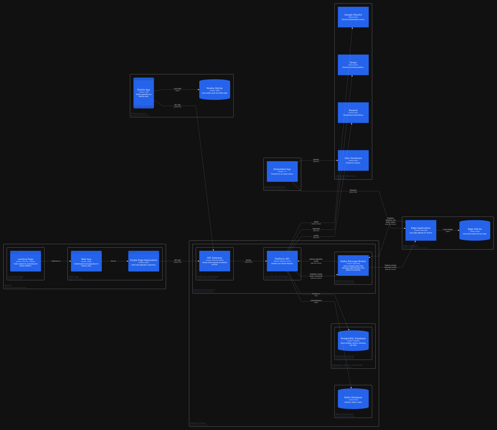

# Capítulo VI: Product Implementation, Validation & Deployment

## 6.1. Software Configuration Management.

### 6.1.1. Software Development Environment Configuration.

Esta sección establece el ecosistema de herramientas y servicios seleccionados para garantizar un flujo de trabajo estandarizado, facilitando la colaboración entre los miembros del equipo y la integración de los componentes IoT.

| **Nombre del Producto** | **Propósito de Uso** | **Descripción de Uso en el Proyecto** | **Ruta de Referencia / Descarga** |
| ----------------------- | ---------------------- | ------------------------------------------------------------ | ------------------------------------------------------------ |
| **Trello** | Project Management | Gestión de tareas mediante tableros Kanban y seguimiento de Sprints. | https://trello.com/ |
| **Figma** | Product UX/UI Design | Diseño de interfaces de usuario, wireframes y prototipos de alta fidelidad. | https://figma.com/ |
| **Git** | Software Development | Control de versiones distribuido para seguimiento de cambios en el código fuente. | https://git-scm.com/ |
| **GitHub** | Software Development | Alojamiento del repositorio de código fuente y colaboración en equipo. | https://github.com/ |
| **HTML / CSS / JavaScript** | Landing Page Development | Desarrollo de la landing page estática y componentes frontend básicos. | https://developer.mozilla.org/es/docs/Web |
| **Bruno** | API Testing | Cliente ligero para validación de endpoints y pruebas de integración de la API REST. | https://www.usebruno.com/ |
| **Spring Boot (Java)** | Backend Development | Framework principal para el desarrollo de la API y lógica del negocio. | https://spring.io/projects/spring-boot |
| **OpenAPI / Swagger** | Software Documentation | Generación de documentación interactiva y técnica de los endpoints del backend. | https://swagger.io/ |
| **C++ (Arduino IDE)** | Embedded App | Programación de la lógica de sensores y conectividad en hardware físico. | https://www.arduino.cc/en/software |
| **Wokwi** | IoT Simulation | Simulador online para prototipado y pruebas de circuitos ESP32 y sensores sin hardware físico. | https://wokwi.com/ |
| **Cirkit Designer** | Circuit Design | Plataforma web para diseño de circuitos electrónicos y prototipos IoT. | https://app.cirkitdesigner.com |
| **Python** | Automation & Analytics | Scripts para análisis de datos ambientales y automatización de tareas. | https://www.python.org/downloads/ |
| **Flask** | Edge IoT Framework | Framework ligero para desarrollo del Edge Station, recepción de telemetría y sincronización con la nube. | https://flask.palletsprojects.com/ |
| **Google OAuth2** | Identity & Access | Servicio para la autenticación segura de usuarios mediante cuentas de Google. | https://console.cloud.google.com/ |
| **Stripe** | Billing & Subscription | Pasarela de pagos para la gestión de suscripciones y transacciones. | https://stripe.com/ |
| **Resend** | Notifications | Plataforma para el envío de correos electrónicos y alertas críticas a usuarios. | https://resend.com/ |
| **OneSignal** | Push Notifications | Servicio de notificaciones push multiplataforma para el envío de alertas en tiempo real a dispositivos móviles. | https://onesignal.com/ |
| **Angular** | Web App Development | Framework principal para el desarrollo de la aplicación web SPA de Clair. | https://angular.dev/ |
| **TypeScript** | Web App Development | Lenguaje tipado utilizado en el desarrollo de la aplicación web Angular y lógica del frontend. | https://www.typescriptlang.org/ |
| **Bun** | JavaScript Runtime | Entorno de ejecución y gestor de paquetes ultrarrápido utilizado para el desarrollo de la aplicación web. | https://bun.sh/ |
| **Java** | Backend Development | Lenguaje de programación principal para el desarrollo del backend con Spring Boot. | https://www.oracle.com/java/technologies/downloads/ |
| **Maven** | Build Automation | Herramienta de gestión de dependencias y automatización de compilación del proyecto backend Java. | https://maven.apache.org/ |
| **Nix** | Environment Management | Gestor de paquetes y entornos reproducibles para garantizar consistencia en los entornos de desarrollo del equipo. | https://nixos.org/ |
| **PostgreSQL** | Database | Sistema de gestión de base de datos relacional utilizado para la persistencia de datos del monolito modular. | https://www.postgresql.org/ |
| **Redis** | Caching \& Messaging | Almacén de datos en memoria utilizado como caché y broker de mensajes para eventos en tiempo real. | https://redis.io/ |
| **Docker** | Deployment | Contenedorización de microservicios para asegurar la portabilidad del sistema. | https://www.docker.com/products/docker-desktop |
| **Vercel** | Deployment | Plataforma de despliegue serverless para la landing page y aplicación web Angular. | https://vercel.com/ |
| **Cloudflare Tunnel** | Deployment | Túnel seguro para exponer la API Gateway y servicios Spring Boot sin IP pública. | https://www.cloudflare.com/products/tunnel/ |
| **Tailscale** | Networking | Red privada virtual (VPN) para conexión segura entre la API local y dispositivos IoT. | https://tailscale.com/ |
| **Azure IoT Hub** | IoT Cloud Platform | Servicio de Azure para conectividad, monitoreo y gestión de dispositivos IoT en la nube. | https://azure.microsoft.com/services/iot-hub/ |
| **Flutter SDK** | Mobile Development | Framework multiplataforma para el desarrollo de la aplicación móvil de Clair. | [docs.flutter.dev](https://docs.flutter.dev/get-started/install) |
| **Angular CLI** | Web Development | Herramienta de línea de comandos para la creación y gestión de la aplicación web. | https://angular.io/cli |
| **Material Design 3** | UI Framework | Librería de componentes y tokens de diseño para la interfaz de la web app. | https://m3.material.io/ |
| **Dart DevTools** | Debugging | Conjunto de herramientas para el perfilado y depuración de la app en Flutter. | https://dart.dev/tools/dart-devtools |

### 6.1.2. Source Code Management.

Para la gestión y seguimiento de las modificaciones del proyecto, el equipo utilizará GitHub como plataforma centralizada y sistema de control de versiones distribuido. A continuación, se detallan las rutas de acceso a los repositorios correspondientes a cada componente del sistema:

* Landing Page: https://github.com/Vanana-Desarrollo-de-Soluciones-IOT/site

* Web Services: https://github.com/Vanana-Desarrollo-de-Soluciones-IOT/clair-core 

(Este repositorio incluye el código fuente del API, así como las suites de pruebas unitarias, de integración y de aceptación).

* Frontend Web Applications: https://github.com/Vanana-Desarrollo-de-Soluciones-IOT/clair-ui

El equipo implementará el modelo GitFlow para gestionar el ciclo de vida del desarrollo. Se mantendrán dos ramas principales de larga duración: main, que alojará exclusivamente código en estado de producción, y develop, que servirá como rama de integración para el desarrollo activo. Para la implementación de nuevas funcionalidades, correcciones o preparaciones de versiones, se utilizarán ramas temporales que se fusionarán siguiendo la lógica del modelo de Vincent Driessen.

<p align="center">
 
</p>

Para garantizar la trazabilidad y el orden en el repositorio, se establecen las siguientes convenciones de nomenclatura:

* Feature Branches: Se utilizará el prefijo feature/ seguido de una descripción breve en minúsculas y guiones (ej. feature/user-authentication). Cada nueva característica deberá desarrollarse en su propia rama.

* Release Branches: Se utilizará el prefijo release/ seguido del número de versión correspondiente (ej. release/v1.0.0).

*   Hotfix Branches: Se utilizará el prefijo hotfix/ seguido de una descripción corta del error corregido (ej. hotfix/login-error).

El proyecto adoptará el estándar de Semantic Versioning 2.0.0 (SemVer) para el etiquetado de versiones, utilizando el formato MAYOR.MENOR.PARCHE (ej. v1.2.4). Asimismo, el registro de cambios en el historial de Git se realizará bajo la convención de Conventional Commits, estructurando los mensajes con un tipo descriptivo (feat, fix, docs, style, refactor, test, chore) seguido de una descripción concisa, facilitando así la lectura del historial y la generación automática de changelogs.

<p align="center">
 
</p>
### 6.1.3. Source Code Style Guide & Conventions.

Para garantizar la mantenibilidad, escalabilidad y legibilidad del ecosistema tecnológico de **Clair**, el equipo ha adoptado un conjunto de directrices estrictas basadas en estándares internacionales de la industria. Una decisión fundamental de diseño es que toda la nomenclatura (nombres de clases, variables, métodos y comentarios) se realizará exclusivamente en inglés, asegurando la consistencia técnica y facilitando la integración de servicios de terceros.

A continuación, se describen las convenciones y guías de estilo adoptadas para los lenguajes principales de la solución:

- **Java (Backend):** Se seguirá estrictamente la **Google Java Style Guide**. Se empleará *UpperCamelCase* para los nombres de clases y *lowerCamelCase* para métodos y variables. Al utilizar **Spring Boot**, se respetarán sus convenciones de estructura de paquetes orientada a dominios y el uso de anotaciones para la inyección de dependencias, garantizando un código limpio y desacoplado.
- **C++ (Embedded App):** Para la lógica de los dispositivos físicos, se aplican convenciones de nombrado claras que reflejen acciones físicas del hardware, como la captura de telemetría. Se utilizará *SCREAMING_SNAKE_CASE* para constantes y macros, manteniendo una estructura que facilite el rastreo de cambios en el código de sensores.
- **TypeScript & Angular (Web App):** Se implementará la **Angular Coding Style Guide** oficial. Se prioriza el uso de tipos estrictos en TypeScript y el nombrado de componentes siguiendo el patrón `nombre.component.ts`. La interfaz se construirá bajo los estándares de **Material Design 3**, utilizando sus tokens de diseño para garantizar la consistencia visual.
- **HTML & CSS:** Se implementará la **Google HTML/CSS Style Guide**. Las clases de estilo se nombrarán bajo la metodología BEM (Block Element Modifier) en inglés, buscando evitar la confusión visual y optimizar la reutilización de componentes de UI.
- **Dart & Flutter (Mobile App):** Se adoptan las **Effective Dart** guidelines. Se utilizará *UpperCamelCase* para clases y *lowerCamelCase* para variables y funciones. Para la estructura de archivos, se seguirá la convención de *snake_case* y se aplicará una arquitectura de estados limpia para asegurar la reactividad de la interfaz.
- **Python (Automation & Data):** Se seguirá el estándar **PEP 8** para todos los scripts de análisis y automatización. Esto asegura que las visualizaciones técnicas y el procesamiento de datos ambientales mantengan un estándar de calidad profesional.
- **Gherkin (.feature files):** Para la automatización de pruebas y especificación de requerimientos, se utilizarán las **Gherkin Conventions for Readable Specifications**. Todas las historias de usuario y criterios de aceptación se redactarán en inglés empleando las palabras clave *Given, When, Then* para describir el comportamiento esperado del sistema.

Esta uniformidad en todos los niveles del stack tecnológico permite que cualquier miembro del equipo pueda intervenir en los diferentes módulos de la solución con una curva de aprendizaje reducida, manteniendo siempre un estándar de calidad profesional en el repositorio de **GitHub**.

### 6.1.4. Software Deployment Configuration.

La configuración del despliegue de la plataforma Vanana se basa en una arquitectura de microservicios y contenedores orientada a garantizar la escalabilidad y la interoperabilidad entre los dispositivos IoT y la infraestructura en la nube. El sistema se distribuye en distintos entornos, desde servidores centralizados hasta dispositivos embebidos instalados en el sitio del usuario. Esta estrategia permite que componentes críticos, como el API Gateway y los servicios backend, operen en entornos Linux mediante contenedores Docker, facilitando la portabilidad, el aislamiento de procesos y una gestión eficiente de los recursos.

Para la lógica central de la solución, se utiliza un clúster backend que aloja la Platform API desarrollada en Java 25. Este entorno se integra con un API Gateway encargado de centralizar y redirigir el tráfico de red, asegurando una comunicación segura y fluida entre clientes y servicios internos. La persistencia de datos se gestiona de manera híbrida: PostgreSQL 16 almacena información transaccional, configuración de dispositivos y datos de usuario, mientras que Redis administra sesiones y memoria caché para optimizar los tiempos de respuesta.

Los productos orientados al usuario web, como la Landing Page y la Web Application desarrollada en Angular, se despliegan en plataformas especializadas para frontend como Vercel. Esta infraestructura permite distribuir globalmente los activos estáticos y la Single Page Application (SPA), reduciendo la latencia y mejorando la experiencia del usuario. Además, al desacoplar la capa de presentación del backend, se incrementa la resiliencia del sistema y se simplifican los procesos de actualización y despliegue de nuevas versiones.

En el ámbito móvil, la Mobile Application desarrollada en Flutter se distribuye para Android e iOS. La aplicación incorpora SQLite como base de datos local, permitiendo almacenar preferencias y telemetría histórica directamente en el dispositivo. Gracias a ello, la aplicación puede seguir operando incluso con conectividad limitada, sincronizando la información de manera asíncrona con el API Gateway cuando el acceso a internet se restablece.

La solución integra una capa de computación perimetral (Edge) y aplicaciones embebidas para la gestión directa del hardware. La Edge Station se despliega en nodos físicos locales utilizando Python y Flask, funcionando como un punto intermedio de procesamiento que deduplica y sincroniza la información capturada. Por otro lado, la aplicación embebida en C++ se distribuye como firmware dentro de los sensores físicos de Clair Hardware, permitiendo la captura de métricas ambientales en tiempo real. El ecosistema se complementa con servicios SaaS para autenticación mediante Google OAuth2, procesamiento de pagos con Stripe y mensajería transaccional a través de Resend.




# 6.2. Landing Page, Services & Applications Implementation.

### 6.2.1. Sprint 1

#### 6.2.1.1. Sprint Planning 1.

El Sprint Planning 1 marca el inicio del desarrollo formal de Clair. Durante esta sesión, el equipo se reunió para definir los objetivos y el alcance del primer sprint, priorizando la presentación pública del producto, la seguridad de acceso y la base visual de la plataforma. Las tareas se centraron en completar el 100% de la Landing Page para la captación de usuarios, desarrollar el módulo de Identity and Access Management (IAM) tanto en el backend como en el frontend web, y finalizar los mockups de alta fidelidad de la Web App. El desarrollo de la aplicación móvil se ha programado para iteraciones posteriores.

<table style="width: 100%; border-collapse: collapse;">
  <tr>
    <td style="border: 1px solid #ddd; padding: 8px; font-weight: bold;">Sprint #</td>
    <td style="border: 1px solid #ddd; padding: 8px;">Sprint 1</td>
  </tr>
  <tr>
    <td colspan="2" style="border: 1px solid #ddd; padding: 8px; font-weight: bold; text-align: center;">Sprint Planning Background</td>
  </tr>
  <tr>
    <td style="border: 1px solid #ddd; padding: 8px; font-weight: bold;">Date</td>
    <td style="border: 1px solid #ddd; padding: 8px;">06/04/2026</td>
  </tr>
  <tr>
    <td style="border: 1px solid #ddd; padding: 8px; font-weight: bold;">Time</td>
    <td style="border: 1px solid #ddd; padding: 8px;">10:00 AM</td>
  </tr>
  <tr>
    <td style="border: 1px solid #ddd; padding: 8px; font-weight: bold;">Location</td>
    <td style="border: 1px solid #ddd; padding: 8px;">Google Meet</td>
  </tr>
  <tr>
    <td style="border: 1px solid #ddd; padding: 8px; font-weight: bold;">Prepared By</td>
    <td style="border: 1px solid #ddd; padding: 8px;">Aleman Romano, Dante Mateo</td>
  </tr>
  <tr>
    <td style="border: 1px solid #ddd; padding: 8px; font-weight: bold;">Attendees (to planning meeting)</td>
    <td style="border: 1px solid #ddd; padding: 8px;">Contreras Peralta Fabrizio Alessandro; Macavilca Quispe Ian; Paiva Quispe Josue Gonzalo; Curipaco Huayllani Neil</td>
  </tr>
  <tr>
    <td style="border: 1px solid #ddd; padding: 8px; font-weight: bold;">Sprint n - 1 Review Summary</td>
    <td style="border: 1px solid #ddd; padding: 8px;">No hay resumen del sprint anterior debido a que este es el primer sprint.</td>
  </tr>
  <tr>
    <td style="border: 1px solid #ddd; padding: 8px; font-weight: bold;">Sprint n - 1 Retrospective Summary</td>
    <td style="border: 1px solid #ddd; padding: 8px;">No hay resumen del sprint anterior debido a que este es el primer sprint.</td>
  </tr>
  <tr>
    <td colspan="2" style="border: 1px solid #ddd; padding: 8px; font-weight: bold; text-align: center;">Sprint Goal & User Stories</td>
  </tr>
  <tr>
    <td style="border: 1px solid #ddd; padding: 8px; font-weight: bold;">Sprint 1 Goal</td>
    <td style="border: 1px solid #ddd; padding: 8px;">
      Our focus is on deploying the complete landing page, implementing the core authentication system (IAM), and defining the visual structure of the web application.<br><br>
      We believe it delivers a clear value proposition to potential customers, a secure access gateway for registered users, and a solid design foundation for the development team.<br><br>
      This will be confirmed when visitors can successfully access and read the landing page online, users can securely register and log in to the web platform, and the team officially approves the Web App mockups.
    </td>
  </tr>
  <tr>
    <td style="border: 1px solid #ddd; padding: 8px; font-weight: bold;">Sprint 1 Velocity</td>
    <td style="border: 1px solid #ddd; padding: 8px;">45</td>
  </tr>
  <tr>
    <td style="border: 1px solid #ddd; padding: 8px; font-weight: bold;">Sum of Story Points</td>
    <td style="border: 1px solid #ddd; padding: 8px;">45</td>
  </tr>
</table>
#### 6.2.1.2. Aspect Leaders and Collaborators.

En esta sección se detalla la **Leadership-and-Collaboration Matrix (LACX)** para el Sprint 1. El objetivo de esta matriz es delegar responsabilidades claras sobre los diferentes componentes de la solución, asegurando que cada aspecto técnico y funcional cuente con un referente directo (*Leader*) y el apoyo necesario de los demás integrantes (*Collaborator*). Para este sprint, los aspectos se han dividido en tres frentes críticos: la presencia pública y legal (Landing Page), la seguridad de acceso (IAM) y la integración fundamental del hardware (Embedded Core).

| **Team Member (Last Name, First Name)** | **GitHub Username** | **CVP (L/C)** | **DTB (L/C)** | **FAQ (L/C)** | **MLS (L/C)** | **PPT (L/C)** | **REG (L/C)** | **LOG (L/C)** | **PMI (L/C)** | **LDP (L/C)** |
| --------------------------------------- | ------------------- | ------------- | ------------- | ------------- | ------------- | ------------- | ------------- | ------------- | ------------- | ------------- |
| **Aleman Romano, Dante Mateo**          | zGIKS               | **L**         | C             | C             | C             | C             | **L**         | C             | C             | **L**         |
| **Contreras Peralta, Fabrizio**         | fabriziocpa         | C             | C             | **L**         | C             | C             | C             | C             | C             | C             |
| **Curipaco Huayllani, Neil A.**         | Neilcur7            | C             | C             | C             | C             | **L**         | C             | C             | **L**         | C             |
| **Macavilca Quispe, Ian**               | IanMQ               | C             | **L**         | C             | C             | C             | C             | **L**         | C             | C             |
| **Paiva Quispe, Josue Gonzalo**         | JosuePaiva02        | C             | C             | C             | **L**         | C             | C             | C             | C             | C             |

**Leyenda de Aspectos (Key):**

Para facilitar la lectura de la matriz, se han utilizado los siguientes acrónimos basados en las tareas del Sprint:

- **CVP:** Clair Value Proposition (Landing Page Content)
- **DTB:** Development Team Background (Landing Page Content)
- **FAQ:** FAQ & Help Center (Support & Documentation)
- **MLS:** Multi-language Support (Internationalization)
- **PPT:** Privacy Policies & Terms (Legal Compliance)
- **REG:** Register a New Account (Frontend/Backend Auth)
- **LOG:** Log in (Authentication Services)
- **PMI:** Particulate Matter Integration (UART Implementation)
- **LDP:** Local Data Persistence (SD Card Module)

> **L:** Leader (Responsable principal de la entrega y calidad del aspecto).
>
> **C:** Collaborator (Apoyo técnico, revisión de código y soporte en la implementación).


#### 6.2.1.3. Sprint Backlog 1.

En el presente Sprint Backlog se detallan las Historias de Usuario correspondientes a la etapa inicial del proyecto, enfocándose principalmente en la construcción de la Landing Page informativa y la implementación de los módulos fundamentales de seguridad, gestión de identidad y control de sesiones (IAM) tanto en la aplicación web como en los servicios de backend.


| N | Story ID | Título | Descripción | Story Points |
|---|----------|--------|-------------|--------------|
| 1 | LP-US-01 | Conocer la propuesta de valor y precio base | Como Visitante, quiero conocer el nombre del dispositivo, su beneficio de sensado y su costo inicial, para que pueda comprender el propósito de Clair Alpha de inmediato. | 2 |
| 2 | LP-US-02 | Evaluar las especificaciones del dispositivo y su diseño | Como Visitante, quiero conocer el rendimiento de sensado y la ausencia de pantallas en el dispositivo, para que pueda evaluar su funcionalidad e integración estética en mi espacio. | 2 |
| 3 | LP-US-03 | Comparar las opciones de precios y suscripciones | Como Visitante, quiero comparar el costo de adquisición frente a los beneficios de los planes básico y multi-dispositivo, para que pueda elegir la opción que se ajuste a mi presupuesto y cantidad de sensores. | 3 |
| 4 | LP-US-04 | Conocer la trayectoria y los profesionales detrás del proyecto | Como Visitante, quiero conocer la misión de la marca y la experiencia del equipo de desarrollo, para que pueda confiar en la calidad del sensor. | 2 |
| 5 | LP-US-05 | Obtener canales de atención comercial y horarios | Como Visitante, quiero conocer los medios de contacto y disponibilidad del equipo de ventas, para que pueda planificar mis consultas preventa. | 2 |
| 6 | WA-US-01 | Registro con Correo y Contraseña | Como Visitante, quiero registrar una cuenta nueva proporcionando mi correo electrónico y una contraseña, para iniciar mi registro en la plataforma. | 3 |
| 7 | WA-US-02 | Verificación de Cuenta | Como Visitante, quiero introducir el código enviado a mi correo electrónico, para confirmar mi dirección y activar mi cuenta. | 2 |
| 8 | WA-US-03 | Inicio de Sesión con Credenciales | Como Visitante, quiero iniciar sesión con mi correo electrónico y contraseña, para acceder a la plataforma como Usuario. | 3 |
| 9 | WA-US-04 | Alternar Visibilidad de Contraseña | Como Visitante o Usuario, quiero poder visualizar u ocultar los caracteres de mi contraseña al escribirla, para verificar que es correcta. | 2 |
| 10 | WA-US-05 | Autenticación con Google (SSO) | Como Visitante, quiero iniciar sesión o registrarme usando mi cuenta de Google, para acceder a la plataforma de forma rápida. | 3 |
| 11 | WA-US-06 | Renovación Automática de Sesión | Como Usuario, quiero que mi sesión se renueve de forma automática antes de expirar, para poder continuar con mis actividades sin interrupciones. | 3 |
| 12 | WA-US-07 | Restricción de Acceso a Secciones Privadas | Como Usuario, quiero que las secciones de la plataforma estén protegidas contra accesos no autorizados, para asegurar que nadie pueda ver mi información sin iniciar sesión. | 2 |
| 13 | WA-US-08 | Cierre de Sesión Seguro | Como Usuario, quiero cerrar mi sesión activa, para asegurar que mis datos queden protegidos al dejar de usar la plataforma. | 2 |
| 14 | WS-US-01 | Iniciar Registro de Usuario | Como Desarrollador, quiero iniciar el registro de un nuevo usuario a través de una API, para crear una sesión de validación temporal y despachar un código de verificación. | 3 |
| 15 | WS-US-02 | Confirmar Registro de Usuario | Como Desarrollador, quiero confirmar un registro de usuario validando el código de verificación a través de una API, para persistir definitivamente la cuenta del usuario. | 3 |
| 16 | WS-US-03 | Iniciar Sesión con Contraseña | Como Desarrollador, quiero autenticar las credenciales de correo y contraseña a través de una API, para emitir los tokens de acceso JWT. | 3 |
| 17 | WS-US-04 | Autenticar mediante Token de Google | Como Desarrollador, quiero autenticar usuarios mediante su ID token de Google OAuth a través de una API, para permitir inicios de sesión directos federados. | 3 |
| 18 | WS-US-05 | Iniciar Flujo de Autorización de Google | Como Desarrollador, quiero iniciar el flujo de autorización de Google OAuth a través de una API, para redirigir al usuario al formulario de consentimiento oficial de Google. | 5 |
| 19 | WS-US-06 | Procesar Callback de Google OAuth | Como Desarrollador, quiero recibir y procesar el código devuelto por Google en el callback a través de una API, para generar las credenciales de acceso y devolver al usuario al frontend. | 2 |
| 20 | WS-US-07 | Cerrar Sesión del Usuario | Como Desarrollador, quiero revocar la validez de los tokens del usuario a través de una API, para asegurar el cierre de sesión de la cuenta. | 5 |
| 21 | WS-US-08 | Refrescar Token de Acceso | Como Desarrollador, quiero emitir un nuevo token de acceso a partir de un token de refresco válido a través de una API, para extender el tiempo de sesión del usuario. | 5 |
| 22 | WS-US-09 | Verificar Validez del Token | Como Desarrollador, quiero validar la vigencia de un token de acceso a través de una API, para permitir la verificación de sesiones en servicios externos. | 5 |

#### 6.2.1.4. Development Evidence for Sprint Review.

1. **Landing page**

La versión **Release 1.0.0** comprende la implementación completa de la solución **Clair Landing Page**, incluyendo todas las páginas definidas del proyecto (Landing Page y aplicaciones web relacionadas), así como funcionalidades complementarias orientadas a la experiencia de usuario, accesibilidad y escalabilidad de la plataforma.

El desarrollo de esta versión se realizó mediante **11 pull requests**, integrando un total de **16 ramas** y **49 commits**, reflejando un proceso de desarrollo colaborativo, estructurado y alineado con buenas prácticas de control de versiones.

**Componentes implementados**

1. **Landing Page (index.html)**
   Página principal de presentación de Clair, diseñada con una sección hero, visualización de sensores, mapa mundial interactivo y una estructura completamente responsive para distintos dispositivos.
2. **Página de Producto (product.html)**
   Sección dedicada a la presentación de las características y propuesta de valor del producto.
3. **Página de Precios (pricing.html)**
   Página orientada a la visualización de planes y precios disponibles de la solución.
4. **Página “About” (about.html)**
   Espacio informativo sobre el proyecto y el equipo responsable del desarrollo.
5. **Página de Privacidad (privacy.html)**
   Implementación de la política de privacidad y tratamiento de datos de la plataforma.
6. **Página de Contacto (contact.html)**
   Sección destinada a información de contacto y canales de comunicación.

**Características técnicas implementadas**

- Diseño responsive basado en enfoque **mobile-first**, garantizando compatibilidad en dispositivos móviles, tablets y escritorio.
- Implementación de soporte de **internacionalización (i18n)** para múltiples idiomas.
- Refactorización de la lógica de navegación y menú en un archivo independiente (`menu.js`) para mejorar mantenibilidad y reutilización.
- Integración de íconos mediante la librería Lucide.
- Gestión de recursos gráficos y logotipos en formato SVG.
- Visualización de mapa mundial con representación de datos por país.

En conjunto, esta versión establece la primera base funcional y visual de la plataforma Clair, consolidando tanto la identidad digital del proyecto como su arquitectura inicial de frontend.


| Branch                 | Commit Id                                | Commit Message                                               | Commit Message Body                                          | Committed on (Date) | User/RepositoryName  |
| ---------------------- | ---------------------------------------- | ------------------------------------------------------------ | ------------------------------------------------------------ | ------------------- | -------------------- |
| develop                | e9628e56a2a3f254f865ad11c231e5daf7b911cb | first commit                                                 | -                                                            | 2026-05-03          | zGIKS                |
| feature/add-section1   | 2666e868aa73b24449ea5ba9a27aae65d8e36160 | feat: enhance navigation for mobile and desktop; implement menu toggle functionality | -                                                            | 2026-05-04          | zGIKS                |
| feature/add-section1   | f0c3a859ee25921db144bf6ce82d9572e3bf1fd2 | feat: remove box-shadow from globe placeholder for cleaner design | -                                                            | 2026-05-04          | zGIKS                |
| feature/add-section1   | b35238082b76b2161d341e3cb5131f1d98787dca | feat: update header position and styling; add gradient background to hero section | -                                                            | 2026-05-04          | zGIKS                |
| feature/add-section1   | c1fe16339ebc0da63f6c9271e92274fbeb6fbcf3 | feat: update assets and HTML structure for sensor display    | -                                                            | 2026-05-04          | zGIKS                |
| feature/add-section1   | b68f73b3c484eb966a49427c5b634df3a3d7ac24 | feat: add countries data with regions and coordinates to countries.json | -                                                            | 2026-05-04          | zGIKS                |
| feature/add-section1   | 114358d0a2faf4fc47c6a851ec06c67d0e006d7b | feat: add sensor SVG asset and update index.html to include it | style: update nav link color to white for better visibility  | 2026-05-04          | zGIKS                |
| feature/add-section1   | d2c78dc47855b87e6802cf95f024ed072c3402eb | feat: add Clair banner image to the hero section             | -                                                            | 2026-05-04          | zGIKS                |
| feature/add-section1   | 6076a2779b7f5b63b5a52c2ccb7b03a63913172f | feat: add Clair logo SVG and sensor image, update styles and HTML structure | Added clair.svg logo to assets, introduced sensor-last.png, refactored CSS styles, integrated Lucide icons | 2026-05-04          | zGIKS                |
| feature/add-section1   | 483de8ed7369a83ef3ada0a85e4b0898875e6f65 | Refactor CSS structure and update HTML layout                | Added reset CSS, created responsive CSS, consolidated styles into sections.css | 2026-05-04          | zGIKS                |
| feature/add-section1   | 14a0d55d52f3d8bda8767ff87e4c906b07ac4445 | feat: add responsive layout and interactive world map visualization | -                                                            | 2026-05-04          | zGIKS                |
| feature/add-section1   | d091b1e9faeaefc0d04024f5746fcad0613e67df | refactor: restructure CSS and implement responsive mobile menu | -                                                            | 2026-05-04          | zGIKS                |
| feature/add-favicon    | 50189cf7509fbf821de23a3057f7db143e932f56 | feat: add SVG icon and update favicon link in HTML           | -                                                            | 2026-05-04          | zGIKS                |
| feature/add-favicon    | a9528dafb395832da52c1bc99cc9c8d5596c8d40 | feat: update favicon colors to improve visibility and change page title to 'Clair' | -                                                            | 2026-05-04          | zGIKS                |
| feature/footer-pages   | 9650963c5ffc02d6ddefca82634a25fd09988d87 | fix: errors                                                  | -                                                            | 2026-05-04          | JosuePaiva02         |
| feature/add-pricing    | 803d33150fd89eb1374b7b0acf2694da877ff870 | pricing seccion                                              | -                                                            | 2026-05-04          | Neilcuri7            |
| feature/add-pricing    | 6b2bd20288a3bb0ed20d29d1cfe391db12510067 | imagen agregada                                              | -                                                            | 2026-05-04          | Neilcuri7            |
| feature/product-page   | 039440afbd7806560d04c54f04f6c52316f54960 | feat: product page                                           | -                                                            | 2026-05-04          | Ian Macavilca Quispe |
| feature/product-page   | 22f11dcf8cd93cac1abbe714dc6fc96c3c599228 | feat: about page                                             | page routing, about page, product page fix                   | 2026-05-04          | Ian Macavilca Quispe |
| fix/price-page         | 604fa92ac1e1b3d1b54c21d74771b34d18c92aac | feat: update pricing section with product name, pricing display, and associated styles | -                                                            | 2026-05-05          | Neilcuri7            |
| feature/add-js-fix     | 1f081e8bccb34df99d88db12e4d2089266dcd372 | feat: refactor menu functionality into separate menu.js file | -                                                            | 2026-05-05          | zGIKS                |
| feature/footer-privacy | 0b31b18c3bd9c14919b5dec234d7881b5abdd795 | feat: added privacy page                                     | -                                                            | 2026-05-05          | JosuePaiva02         |
| feature/enhance-css    | fae1b1ad087c58d023599e5241a9e1e6100d925b | feat: add team image                                         | -                                                            | 2026-05-07          | fabriziocpa          |
| feature/enhance-css    | 21becfc0e85720e772baf0e7a830979192a70844 | feat: add team image                                         | -                                                            | 2026-05-07          | fabriziocpa          |
| feature/enhance-css    | 43406e3f2e1a1d41d5737acac16f7f8892fea05c | feat: update team image                                      | -                                                            | 2026-05-07          | fabriziocpa          |
| feature/enhance-css    | c43bfadb646dee70e18ca514ebdaf5042cf5acad | feat: update about us and navigation                         | -                                                            | 2026-05-07          | fabriziocpa          |
| feature/enhance-css    | 0c61494ec9f589d4eaad421f840c0ee3350ece06 | feat: update css                                             | -                                                            | 2026-05-07          | fabriziocpa          |
| feature/enhance-css    | c041bb8c79c76ed719173aaa43260a74560e0d90 | feat: update css                                             | -                                                            | 2026-05-09          | fabriziocpa          |
| develop                | 39fc1d87f02eced21620fc65fde2d3c4aac6b289 | feat: add i18n                                               | -                                                            | 2026-05-09          | fabriziocpa          |
| develop                | b78f35a1d72736e222d1fb3e9cedba03abf59677 | feat: added i18n consistency                                 | -                                                            | 2026-05-09          | fabriziocpa          |

2. **Web application**

| Branch                           | Commit Id                                | Commit Message                                               | Commit Message Body                                          | Committed on (Date) | User/RepositoryName |
| -------------------------------- | ---------------------------------------- | ------------------------------------------------------------ | ------------------------------------------------------------ | ------------------- | ------------------- |
| develop                          | 762a15b9a7660e21d908d84240615a18440dd860 | Merge pull request #6 from Vanana-Desarrollo-de-Soluciones-IOT/feature/add-google-oauth2 | Feature/add google oauth2                                    | 2026-05-09          | m.                  |
| feature/add-google-oauth2        | d924683d6fe5465280aca16babd07001880eccbd | feat: remove Google sign-in button and related styles; update registration form with terms acceptance and Google sign-in integration | -                                                            | 2026-05-09          | zGIKS               |
| feature/add-google-oauth2        | 4bfb7ef8e7d35a0278e1e716730a246d818b4515 | feat: implement Google OAuth2 sign-in flow with callback handling and UI integration | -                                                            | 2026-05-09          | zGIKS               |
| develop                          | 1b4030eede9d3fb94d3ede3588f8a1c822012b6e | Merge pull request #5 from Vanana-Desarrollo-de-Soluciones-IOT/feature/add-home-page-components | Feature/add home page components                             | 2026-05-09          | m.                  |
| feature/add-home-page-components | 6739a69518ad933dfe0f655d49f0dafa4ced16ff | feat: add new icon components for air quality, alerts actions, overview, reports, and space devices; update sidebar to use component-based icons | -                                                            | 2026-05-09          | zGIKS               |
| feature/add-home-page-components | cb05d5d33609fa323a48cb45d78eda53b375f756 | feat: add text-decoration property to nav-item for consistency | -                                                            | 2026-05-09          | zGIKS               |
| feature/add-home-page-components | cd0f55906a9ef5139a1688f316323a2ead78370b | feat: implement overview and settings pages with responsive layout and sidebar integration | -                                                            | 2026-05-09          | zGIKS               |
| feature/add-home-page-components | fe3bc41d24b6269c66b5c39dc20facb9b07ffeb2 | feat: enhance sidebar component with mobile responsiveness and navigation item click handling | -                                                            | 2026-05-09          | zGIKS               |
| feature/add-home-page-components | 118f2875341d33bf5043fcfa6ab28421d27d6c7d | feat: add sidebar component                                  | -                                                            | 2026-05-07          | zGIKS               |
| develop                          | 4a50bbcffa042f9be19e922704a84af873c8ccba | Merge pull request #4 from Vanana-Desarrollo-de-Soluciones-IOT/feature/add-remove-page-scroll | feat: Update page container styles to ensure consistent height and ov… | 2026-05-07          | m.                  |
| feature/add-remove-page-scroll   | 804a86a6dc0162f89824e94577026266b16f4f5a | feat: Update page container styles to ensure consistent height and overflow behavior across confirm, login, and register pages | -                                                            | 2026-05-07          | zGIKS               |
| develop                          | 9d9f20eaa9f0c4a169e8f7caf54120d03d4717f0 | Merge pull request #3 from Vanana-Desarrollo-de-Soluciones-IOT/feature/add-bearer-token | feat: Implement bearer token management with local storage integratio… | 2026-05-07          | m.                  |
| feature/add-bearer-token         | 02657c9421c2d154f27fb3812b35ae050dd29efb | feat: Implement bearer token management with local storage integration and update authentication services | -                                                            | 2026-05-07          | zGIKS               |
| develop                          | 00cb91c7e05eb62c236d12dcba883bb24cc648c7 | Merge pull request #2 from Vanana-Desarrollo-de-Soluciones-IOT/feature/add-logout-services | feat: Add sign-out functionality with command and service integration | 2026-05-05          | m.                  |
| feature/add-logout-services      | 5bc9837eceae2d1b6d25416ea79cbdc22d1bccd8 | feat: Add sign-out functionality with command and service integration | -                                                            | 2026-05-05          | zGIKS               |
| develop                          | 5e78b44a3f9fcfec3ee0dea123c5f4e2d4c3e5b2 | Merge pull request #1 from Vanana-Desarrollo-de-Soluciones-IOT/feature/add-iam-page | Feature/add iam page                                         | 2026-05-05          | m.                  |
| feature/add-iam-page             | 9e387309a66f2b0c48e04d1c2a53bd857150d6b1 | feat: Update styles and fonts for improved UI consistency and aesthetics | -                                                            | 2026-05-05          | zGIKS               |
| feature/add-iam-page             | 688d1f422f0921c7b15c0e199bfe4c773dc56710 | feat: Add Clair logo component and update login/register pages with logo integration | -                                                            | 2026-05-05          | zGIKS               |

3. **Web services**

| Branch                          | Commit Id                                | Commit Message                                               | Commit Message Body                                          | Committed on (Date) | User/RepositoryName |
| ------------------------------- | ---------------------------------------- | ------------------------------------------------------------ | ------------------------------------------------------------ | ------------------- | ------------------- |
| develop                         | ea498353adcd3f5428b958d9f29f1760ef676104 | Merge pull request #6 from Vanana-Desarrollo-de-Soluciones-IOT/feature/add-roles | feat: Add user plan retrieval and enhance Stripe webhook handling wit… | 2026-05-10          | Neilcuri7           |
| feature/add-roles               | d8e0ffe626664b13905d417ae0752be0df58cb22 | feat: Add user plan retrieval and enhance Stripe webhook handling with logging | -                                                            | 2026-05-10          | Neilcuri7           |
| develop                         | 556f75acabc64e51cff61cc03f6b59513d53e748 | Merge pull request #5 from Vanana-Desarrollo-de-Soluciones-IOT/feature/add-google-oauth2 | feat: Implement Google OAuth 2.0 authentication flow with user regist… | 2026-05-09          | zGIKS               |
| feature/add-google-oauth2       | 826a386ff76647dc098f4f0e414aaaeba46be322 | feat: Implement Google OAuth 2.0 authentication flow with user registration and sign-in | -                                                            | 2026-05-09          | zGIKS               |
| develop                         | bbcec1e5c2542a4217a189db1dad35202440a7b8 | Merge pull request #4 from Vanana-Desarrollo-de-Soluciones-IOT/feature/add-billing-context | Feature/add billing context                                  | 2026-05-07          | Neilcuri7           |
| feature/add-billing-context     | dc3dca52d28935c862df056b5b32551572ca80ea | feat: Enhance payment processing with user validation and result handling in CreatePaymentIntentCommand | -                                                            | 2026-05-07          | Neilcuri7           |
| feature/add-billing-context     | adb46cea5834124cf99dc180a4f15bd342a38579 | feat: Add CreatePaymentIntentCommand for payment processing with user validation | -                                                            | 2026-05-07          | Neilcuri7           |
| feature/add-billing-context     | 3ddd12405c8eb4040c2afbafd5cc1a1c1f87ddc1 | feat: Add subscription management with Stripe integration, including checkout session and payment intent creation | -                                                            | 2026-05-07          | Neilcuri7           |
| develop                         | c7a8fccee284c921602e0ed2650a98f399136f3b | Merge pull request #3 from Vanana-Desarrollo-de-Soluciones-IOT/feature/add-remove-rate-limiter | remove: rate limiter                                         | 2026-05-07          | zGIKS               |
| feature/add-remove-rate-limiter | f48b18640ebd1f4b9a407db8c6920dce5854265c | remove: rate limiter                                         | -                                                            | 2026-05-07          | zGIKS               |
| develop                         | 2572ca596f3922fbb85fc5df713bc015dc5285b8 | Merge pull request #2 from Vanana-Desarrollo-de-Soluciones-IOT/feature/add-spring-security | feat: add open api configuration and bearer config           | 2026-05-07          | zGIKS               |
| feature/add-spring-security     | 1dd0e01575917f6fae21ccbc6697d2db185e8880 | feat: add open api configuration and bearer config           | -                                                            | 2026-05-07          | zGIKS               |
| develop                         | 3ecbafef4eb07737672773d02b51dd4efe106784 | Merge pull request #1 from Vanana-Desarrollo-de-Soluciones-IOT/feature/add-iam | Feature/add iam                                              | 2026-05-05zGIKS     | zGIKS               |
| feature/add-iam                 | 195f03b16e2e55f81a3f1de116bc3ff984f75924 | feat: Add sign-out functionality to revoke all active tokens for a user | -                                                            | 2026-05-05          | zGIKS               |
| feature/add-iam                 | 17b63b4232053682ca8fbd797283b06322c3f887 | feat: Implement token management system with JWT support, including access and refresh token creation, validation, and rotation | -                                                            | 2026-05-05          | zGIKS               |
| feature/add-iam                 | 1ede23d2dcc820c8f903797d7bd506d7a0bc4c1b | feat: Update environment configuration, enhance JWT and CORS settings, and add Redis caching support | -                                                            | 2026-05-05          | zGIKS               |
| feature/add-iam                 | 35720f902dd3aedbbc6873b4dbb8d70fee0bd398 | feat: Refactor IAM commands, enhance JWT handling, and improve email logging | -                                                            | 2026-05-05          | zGIKS               |
| feature/add-iam                 | 3f633ef18414d93b252f9ab91cf7590de079ea3b | feat: Implement JWT authentication with refresh token support and enhance email notification logging | -                                                            | 2026-05-05          | zGIKS               |
| feature/add-iam                 | 476c622f357324866702c022ba5bddf10b576f77 | refactor: Remove deprecated IAM classes and configuration files | -                                                            | 2026-05-05          | zGIKS               |
| feature/add-iam                 | 9af7a6c91f61f41154e248cdd7fb95689dc3211c | feat: Add Redis configuration and implement registration flow with new command and resource classes | -                                                            | 2026-05-05          | zGIKS               |
| feature/add-iam                 | 8326f2f92e9e5174bbac51973a9a4a4565170348 | feat: add bc notifications and iam first flows               | -                                                            | 2026-04-27          | zGIKS               |
| main                            | 0341f90b31b35d8f30a64f4eadcf0e3025d48b5d | first commit                                                 | -                                                            | 2026-04-23          | zGIKS               |

#### 6.2.1.5. Testing Suite Evidence for Sprint Review.

En esta sección se presenta la evidencia de las pruebas automatizadas diseñadas para validar el correcto funcionamiento, la seguridad y la fiabilidad de los servicios desarrollados durante el Sprint actual. La implementación de este conjunto de pruebas asegura que las funcionalidades clave del sistema, específicamente las relacionadas con la gestión de identidades y accesos (IAM), cumplan con los criterios de aceptación establecidos y mantengan la integridad del producto a medida que este evoluciona.

Para la validación de los requerimientos, se han diseñado pruebas bajo el enfoque de Behavior-Driven Development (BDD), permitiendo una comunicación clara entre los objetivos del negocio y la implementación técnica. A continuación, se detallan los archivos `.feature` elaborados en lenguaje Gherkin, los cuales se relacionan directamente con los User Stories del Sprint (US01, US02 y US03). Asimismo, se expone la tabla de control de versiones que documenta la integración continua de estas pruebas tanto en el repositorio del backend (`clair-core`) como en el del frontend (`clair-ui`).

**Control de Versiones de Testing**

La siguiente tabla consolida los *commits* realizados en los repositorios del proyecto, evidenciando el avance en la configuración del entorno Cucumber y la implementación de los escenarios de prueba para el módulo de autenticación:

```gherkin
Feature: Register a new account
  As a Visitor, I want to create an account with my email and a password, so that I can access Clair as a registered Customer.

  Scenario: Successful registration
    Given the Visitor is on the sign-up page and has no existing account with the submitted email
    When the Visitor submits a valid email, a password meeting the strength policy, and accepts the terms
    Then a Customer account is created in an "unverified" state
    And a verification email is dispatched
    And the Visitor is informed that verification is required to continue

  Scenario: Duplicate email
    Given an account already exists for the submitted email
    When the Visitor attempts to register
    Then registration is rejected with a clear, non-revealing message

```

```gherkin
Feature: Verify email address
  As a Customer, I want to confirm ownership of my email through a verification link, so that my account is activated and I can log in.

  Scenario: Valid verification token
    Given the Customer received a verification email with a unique, unexpired token
    When the Customer follows the verification link
    Then the account is marked as verified
    And the Customer is redirected to the login page

  Scenario: Expired or reused token
    Given the verification token is expired or has already been consumed
    When the Customer follows the link
    Then verification fails
    And the Customer is offered to request a new verification email

```

```gherkin
Feature: Log in
  As a Customer, I want to authenticate with my credentials, so that I can access my personalized Clair workspace.

  Scenario: Successful login
    Given the Customer's account is verified and the credentials match
    When the Customer submits email and password
    Then a session is established
    And the Customer is routed to their dashboard

  Scenario: Invalid credentials
    Given the submitted credentials do not match any verified account
    When the Customer attempts to log in
    Then access is denied with a generic error that does not reveal which field is wrong

  Scenario: Unverified account
    Given the account exists but has not been verified
    When the Customer attempts to log in
    Then access is denied
    And the Customer is offered to resend the verification email
```


| Repository                                     | Branch             | Commit Id | Commit Message                                              | Commit Message Body                                          | Commited on (Date) |
| ---------------------------------------------- | ------------------ | --------- | ----------------------------------------------------------- | ------------------------------------------------------------ | ------------------ |
| Vanana-Desarrollo-de-Soluciones-IOT/clair-core | test/Testing-Suite | c26f0e0   | test(iam): configure BDD environment and step definitions   | Set up Cucumber dependencies in pom.xml and implement step definitions for IAM bounded context tests | 13/05/2026         |
| Vanana-Desarrollo-de-Soluciones-IOT/clair-core | test/Testing-Suite | 3ea2e69   | test(iam): add BDD scenario for US01 Register a new account | Implement cucumber feature file for US01 to validate new account registration | 13/05/2026         |
| Vanana-Desarrollo-de-Soluciones-IOT/clair-core | test/Testing-Suite | f027fe4   | test(iam): add BDD scenario for US02 Verify email address   | Implement cucumber feature file for US02 to validate email verification process | 13/05/2026         |
| Vanana-Desarrollo-de-Soluciones-IOT/clair-core | test/Testing-Suite | 946de87   | test(iam): add BDD scenario for US03 Log in                 | Implement cucumber feature file for US03 to validate user login and session establishment | 13/05/2026         |
| Vanana-Desarrollo-de-Soluciones-IOT/clair-ui   | test/Testing-Suite | ddbfc1c   | test: add US01 register account feature and cucumber setup  | Add cucumber setup and implement feature file for US01 to validate new account registration | 13/05/2026         |
| Vanana-Desarrollo-de-Soluciones-IOT/clair-ui   | test/Testing-Suite | 43fc634   | test: add US02 verify email address feature                 | Implement cucumber feature file for US02 to validate email verification process | 13/05/2026         |
| Vanana-Desarrollo-de-Soluciones-IOT/clair-ui   | test/Testing-Suite | 69bea66   | test: add US03 log in feature                               | Implement cucumber feature file for US03 to validate user login and session establishment | 13/05/2026         |


#### 6.2.1.6. Execution Evidence for Sprint Review.

En el Execution Evidence se muestra el desarrollo de los principales entregables correspondientes al Sprint 1 del proyecto. Se evidencia la implementación de la Landing Page, el primer avance de la Web Application y la integración inicial de los Web Services como parte de la arquitectura del sistema.

Respecto a la Landing Page, se presentan las diferentes secciones implementadas para la plataforma, incluyendo la página principal, información sobre el producto, descripción del proyecto, presentación del equipo, página de precios, contacto y políticas de privacidad. Asimismo, se evidencia que la interfaz fue desarrollada completamente en inglés y que cuenta con soporte de internacionalización mediante i18n para futuros cambios de idioma.

También se muestra la estructura del modelo SaaS basado en suscripciones, donde los usuarios podrán acceder a métricas relacionadas con el sistema IoT desarrollado por el equipo. Dentro de las evidencias presentadas, se visualizan las especificaciones del producto, contenido multimedia referencial y los distintos call to action que permiten la navegación hacia la aplicación web.

Por otro lado, se evidencia la implementación del sistema de autenticación de usuarios. El proyecto incorpora registro e inicio de sesión mediante proveedor de correo electrónico con validación por código, así como autenticación utilizando Google OAuth API. Adicionalmente, el sistema verifica la aceptación de términos y condiciones antes de permitir el acceso o registro de nuevos usuarios.

Finalmente, se muestra el primer avance funcional de la Web Application, donde se implementaron componentes base como el overview principal, sidebar de navegación, header y módulo de settings para cierre de sesión. Estos elementos representan la estructura inicial de la experiencia de usuario y servirán como base para el desarrollo de futuras funcionalidades en los siguientes sprints.

<p align="center">   </p>

Evidencia de ejecución disponible en Anexo: https://bit.ly/4wzn8Jl

#### 6.2.1.7. Services Documentation Evidence for Sprint Review.

**Documentación de Web Services (OpenAPI)**

Durante este Sprint, logramos un avance significativo documentando nuestros Web Services con OpenAPI (Swagger) mediante `springdoc-openapi`. Se implementó seguridad centralizada (`BearerAuth` con JWT) para proteger los endpoints, y se documentaron exhaustivamente los controladores de **Autenticación** (registro, inicio de sesión, Google OAuth 2.0) y **Facturación** (suscripciones y Stripe). La interfaz interactiva resultante permite probar las integraciones directamente desde.

**Endpoints Principales y Acciones Soportadas**

A continuación, se resumen las principales operaciones implementadas y documentadas:

**1. Autenticación y Sesión**

| endpoint                      | verbo http | descripción                                                            | parámetros                                                 | request body                      | response body                        | explicación                                                                                             |
|-------------------------------|------------|------------------------------------------------------------------------|------------------------------------------------------------|-----------------------------------|--------------------------------------|---------------------------------------------------------------------------------------------------------|
| /api/v1/auth/sign-up          | POST       | Registra un nuevo usuario en el sistema.                               | —                                                          | `{ email, password }`             | `{ sessionId, message }`             | Inicia el proceso de registro enviando un código de verificación al correo del usuario.                 |
| /api/v1/auth/sign-in          | POST       | Autentica a un usuario previamente registrado.                         | —                                                          | `{ email, password }`             | `{ id, email, token, refreshToken }` | Permite iniciar sesión y obtener los tokens necesarios para acceder a recursos protegidos.              |
| /api/v1/auth/refresh          | POST       | Genera un nuevo token de acceso usando un refresh token válido.        | —                                                          | `{ refreshToken }`                | `{ id, email, token, refreshToken }` | Permite renovar la sesión del usuario sin necesidad de volver a autenticarse.                           |
| /api/v1/auth/google/sign-in   | POST       | Autentica o registra usuarios mediante Google OAuth 2.0.               | —                                                          | `{ idToken }`                     | `{ id, email, token, refreshToken }` | Permite iniciar sesión utilizando una cuenta de Google y obtener los tokens de acceso de la aplicación. |
| /api/v1/auth/confirm          | POST       | Confirma el registro de un usuario mediante un código de verificación. | —                                                          | `{ sessionId, verificationCode }` | `{ id, email }`                      | Finaliza el proceso de registro y crea la cuenta del usuario una vez validado el código recibido.       |
| /api/v1/auth/verify           | GET        | Verifica la validez de un token de acceso.                             | `Authorization` (header)                                   | —                                 | `{ valid, userId, expiresAt }`       | Permite comprobar si el token sigue siendo válido y obtener información básica sobre su vigencia.       |
| /api/v1/auth/google/callback  | GET        | Procesa la respuesta de Google OAuth después de la autenticación.      | `code` (query), `state` (query), `error` (query, opcional) | —                                 | Redirección al frontend.             | Intercambia el código de autorización por tokens y redirige al usuario a la aplicación cliente.         |
| /api/v1/auth/google/authorize | GET        | Inicia el flujo de autenticación mediante Google OAuth 2.0.            | —                                                          | —                                 | Redirección a Google OAuth.          | Redirige al usuario a la pantalla de consentimiento de Google para autorizar el acceso.                 |
| /api/v1/auth/sign-out         | DELETE     | Cierra la sesión del usuario y revoca los tokens activos.              | `Authorization` (header)                                   | —                                 | —                                    | Finaliza la sesión actual e invalida los tokens asociados al usuario autenticado.                       |

**2. Notificaciones**

| endpoint                   | verbo http | descripción                                                          | parámetros               | request body | response body                                                                                           | explicación                                                                                                                                             |
|----------------------------|------------|----------------------------------------------------------------------|--------------------------|--------------|---------------------------------------------------------------------------------------------------------|---------------------------------------------------------------------------------------------------------------------------------------------------------|
| /api/v1/notifications/push | GET        | Obtiene el historial de notificaciones push del usuario autenticado. | `page` (query, opcional) | —            | Página de notificaciones con información de envío, alertas asociadas y estado de entrega de las mismas. | Permite consultar las notificaciones push enviadas al usuario, incluyendo si fueron entregadas correctamente o si ocurrió algún error durante el envío. |


#### 6.2.1.8. Software Deployment Evidence for Sprint Review.

En esta sección se resume los procesos realizados en relación con el Deployment durante el Sprint 1. Las actividades abarcaron la creación y configuración de cuentas en plataformas de despliegue, la configuración de recursos en proveedores de nube, la configuración de proyectos de desarrollo para integración y automatización, así como el despliegue de todos los productos digitales que forman parte del alcance: Landing Page, Web Application y Web Services. A continuación, se describen los pasos realizados y las evidencias correspondientes.

**1. Landing Page**

Para el despliegue de la Landing Page, se creó una cuenta en **Vercel** y se configuró el proyecto vinculado al repositorio de GitHub (`Vanana-Desarrollo-de-Soluciones-IOT/site`). Se configuró el dominio personalizado y se establecieron las variables de entorno necesarias para la internacionalización (i18n). La Landing Page fue desplegada como sitio estático, aprovechando la infraestructura global de CDN de Vercel para garantizar baja latencia y alta disponibilidad. El sitio incluye múltiples **Call-to-Action (CTA)** estratégicamente ubicados para guiar a los visitantes hacia el registro.

**URL de producción:** https://clair-psi.vercel.app/

<p align="center">
 
</p>

**2. Web Application**

Para la Web Application desarrollada en Angular, se creó un proyecto en **Vercel** vinculado al repositorio (`Vanana-Desarrollo-de-Soluciones-IOT/clair-ui`). Se configuró el pipeline de despliegue automático a partir de la rama `develop`, de modo que cada fusión de código genera automáticamente una nueva versión en el entorno de producción. La aplicación se despliega como Single Page Application (SPA) con pre-rendering estático.

<p align="center">
 
</p>

**3. Web Services**

Los Web Services implementados durante este sprint comprenden el módulo de **Identity and Access Management (IAM)** y el contexto de **Billing**. Para el despliegue del backend, se creó y configuró una cuenta en **Contabo** para la contratación de un servidor dedicado donde se desplegaron los servicios Spring Boot mediante contenedores **Docker**. Adicionalmente, se configuró **Cloudflare Tunnel** para establecer un túnel seguro y encriptado que expone los servicios hacia internet sin necesidad de exponer directamente la dirección IP pública del servidor, protegiendo así la infraestructura backend.

Los servicios incluyen la integración con dos proveedores externos configurados durante este sprint:
- **Google OAuth2** para autenticación segura de usuarios mediante cuentas de Google.
- **Resend** para el envío de notificaciones y correos electrónicos transaccionales.

<p align="center">
 
</p>

2. **Web application**

   La Web Application desarrollada en Angular ha sido desplegada en Vercel, aprovechando su infraestructura global de CDN para la distribución de la Single Page Application (SPA). Esto garantiza baja latencia y alta disponibilidad para los usuarios que acceden a la plataforma web.

   **URL de producción:** https://clair-ui.vercel.app/

   <p align="center">
    
   </p>

3. **Web services**

   Los Web Services implementados durante este sprint comprenden el módulo de Identity and Access Management (IAM) y el contexto de Billing, desplegados en un servidor Contabo. Estos servicios incluyen la integración con dos proveedores externos: Google OAuth2 para autenticación de usuarios y Resend para el envío de notificaciones por correo electrónico. La exposición segura de los servicios hacia internet se realiza mediante Cloudflare Tunnel, el cual establece un túnel seguro y encriptado sin necesidad de exponer directamente la dirección IP pública del servidor, protegiendo así la infraestructura backend.

   <p align="center">
    
   </p>


#### 6.2.1.9. Team Collaboration Insights during Sprint.

1. **Landing page**

<p align="center">
 
</p>
<p align="center">
 
</p>
<p align="center">
 
</p>


3. **Web application**

Avance preliminar del UI de Clair, donde se implementó registro y login con autenticación Google OAuth2 y correo electrónico


4. **Web services**

El avance preliminar de los servicios web es de los servicios genericos como IAM y Billing, para los proximos sprint se trabajara en los bounded context core de la aplicacion


### 6.2.2. Sprint 2

#### 6.2.2.1. Sprint Planning 2.

El Sprint Planning 2 tuvo como propósito definir el alcance de las funcionalidades core del sistema Clair, priorizando la integración completa del hardware de sensado ambiental, la telemetría en tiempo real y su visualización en las aplicaciones cliente. Durante esta sesión, el equipo revisó los avances del Sprint 1 y acordó enfocar los esfuerzos en completar la lectura de sensores de aire (CO₂, material particulado, temperatura y humedad), la transmisión de estos datos hacia los Web Services y su presentación tanto en la aplicación móvil como en la aplicación web.

<table style="width: 100%; border-collapse: collapse;">
  <tr>
    <td style="border: 1px solid #ddd; padding: 8px; font-weight: bold;">Sprint #</td>
    <td style="border: 1px solid #ddd; padding: 8px;">Sprint 2</td>
  </tr>
  <tr>
    <td colspan="2" style="border: 1px solid #ddd; padding: 8px; font-weight: bold; text-align: center;">Sprint Planning Background</td>
  </tr>
  <tr>
    <td style="border: 1px solid #ddd; padding: 8px; font-weight: bold;">Date</td>
    <td style="border: 1px solid #ddd; padding: 8px;">20/04/2026</td>
  </tr>
  <tr>
    <td style="border: 1px solid #ddd; padding: 8px; font-weight: bold;">Time</td>
    <td style="border: 1px solid #ddd; padding: 8px;">10:00 AM</td>
  </tr>
  <tr>
    <td style="border: 1px solid #ddd; padding: 8px; font-weight: bold;">Location</td>
    <td style="border: 1px solid #ddd; padding: 8px;">Google Meet</td>
  </tr>
  <tr>
    <td style="border: 1px solid #ddd; padding: 8px; font-weight: bold;">Prepared By</td>
    <td style="border: 1px solid #ddd; padding: 8px;">Aleman Romano, Dante Mateo</td>
  </tr>
  <tr>
    <td style="border: 1px solid #ddd; padding: 8px; font-weight: bold;">Attendees (to planning meeting)</td>
    <td style="border: 1px solid #ddd; padding: 8px;">Contreras Peralta Fabrizio Alessandro; Macavilca Quispe Ian; Paiva Quispe Josue Gonzalo; Curipaco Huayllani Neil</td>
  </tr>
  <tr>
    <td style="border: 1px solid #ddd; padding: 8px; font-weight: bold;">Sprint n - 1 Review Summary</td>
    <td style="border: 1px solid #ddd; padding: 8px;">En el Sprint 1 se completó exitosamente la Landing Page con todas sus secciones (Home, Product, Pricing, About, Privacy, Contact), incluyendo soporte de internacionalización (i18n) y diseño responsive. También se implementó el módulo de Identity and Access Management (IAM) tanto en el backend (registro, login, JWT, Google OAuth2) como en el frontend web, permitiendo a los usuarios registrarse, verificar su correo e iniciar sesión de forma segura. Finalmente, se aprobaron los mockups de alta fidelidad de la Web App y se configuró la infraestructura de despliegue inicial en Vercel y Contabo.</td>
  </tr>
  <tr>
    <td style="border: 1px solid #ddd; padding: 8px; font-weight: bold;">Sprint n - 1 Retrospective Summary</td>
    <td style="border: 1px solid #ddd; padding: 8px;">El equipo reconoció que la entrega de la Landing Page y el sistema IAM fue exitosa dentro del tiempo planificado. Se identificó como punto positivo el uso de GitFlow y Conventional Commits, que facilitó la integración continua. Como área de mejora, se sugirió anticipar la configuración de variables de entorno y credenciales de servicios externos (como Google OAuth2 y Resend) antes del inicio del desarrollo para evitar bloqueos. Se acordó mantener la comunicación diaria mediante el canal de Discord y actualizar el tablero de Trello con mayor frecuencia.</td>
  </tr>
  <tr>
    <td colspan="2" style="border: 1px solid #ddd; padding: 8px; font-weight: bold; text-align: center;">Sprint Goal & User Stories</td>
  </tr>
  <tr>
    <td style="border: 1px solid #ddd; padding: 8px; font-weight: bold;">Sprint 2 Goal</td>
    <td style="border: 1px solid #ddd; padding: 8px;">
      Our focus is on completing the core air quality sensing functionality by implementing the full suite of environmental sensors (CO₂, particulate matter, temperature, humidity), enabling real-time transmission of telemetry data to the web services, and surfacing these metrics through the mobile and web application dashboards.<br><br>
      We believe it delivers actionable environmental visibility to end users, a reliable data pipeline from edge devices to the cloud, and a unified user experience across platforms.<br><br>
      This will be confirmed when the embedded device successfully reads and displays air quality metrics on its OLED screen, the edge station and web services ingest and persist telemetry in real time, and users can view live sensor data, historical trends, thresholds, and alerts on both the mobile app and the web dashboard.
    </td>
  </tr>
  <tr>
    <td style="border: 1px solid #ddd; padding: 8px; font-weight: bold;">Sprint 2 Velocity</td>
    <td style="border: 1px solid #ddd; padding: 8px;">419</td>
  </tr>
  <tr>
    <td style="border: 1px solid #ddd; padding: 8px; font-weight: bold;">Sum of Story Points</td>
    <td style="border: 1px solid #ddd; padding: 8px;">419</td>
  </tr>
</table>

#### 6.2.2.2. Aspect Leaders and Collaborators.

En esta sección se detalla la **Leadership-and-Collaboration Matrix (LACX)** para el Sprint 2. Dado que el objetivo de este sprint se centra en las funcionalidades core de monitoreo ambiental, la matriz distribuye la responsabilidad sobre nueve aspectos críticos: la gestión jerárquica de organizaciones y espacios, el emparejamiento y administración de dispositivos, la ingestión de telemetría, la configuración de alertas y umbrales, la visualización analítica en dashboards, el sistema de suscripciones y pagos, la experiencia de la aplicación móvil, el firmware embebido de sensores y la conectividad perimetral (Edge).

| **Team Member (Last Name, First Name)** | **GitHub Username** | **ORG (L/C)** | **DEV (L/C)** | **TEL (L/C)** | **ALR (L/C)** | **DSH (L/C)** | **SUB (L/C)** | **MOB (L/C)** | **EMB (L/C)** | **EDG (L/C)** |
| --------------------------------------- | ------------------- | ------------- | ------------- | ------------- | ------------- | ------------- | ------------- | ------------- | ------------- | ------------- |
| **Aleman Romano, Dante Mateo**          | zGIKS               | C             | **L**         | C             | C             | C             | C             | **L**         | C             | C             |
| **Contreras Peralta, Fabrizio**         | fabriziocpa         | C             | C             | C             | C             | **L**         | C             | C             | C             | C             |
| **Curipaco Huayllani, Neil A.**         | Neilcur7            | C             | C             | C             | C             | C             | **L**         | C             | C             | C             |
| **Macavilca Quispe, Ian**               | IanMQ               | C             | C             | **L**         | C             | C             | C             | C             | **L**         | C             |
| **Paiva Quispe, Josue Gonzalo**         | JosuePaiva02        | **L**         | C             | C             | **L**         | C             | C             | C             | C             | **L**         |

**Leyenda de Aspectos (Key):**

Para facilitar la lectura de la matriz, se han utilizado los siguientes acrónimos basados en las tareas del Sprint:

- **ORG:** Organization & Space Management (Gestión jerárquica de organizaciones y espacios físicos)
- **DEV:** Device Pairing & Management (Emparejamiento, reclamo y administración de dispositivos IoT)
- **TEL:** Telemetry Ingestion & Real-time Metrics (Ingesta de telemetría y métricas en tiempo real desde los sensores)
- **ALR:** Alerts & Thresholds Configuration (Configuración de umbrales y gestión de alertas ambientales)
- **DSH:** Dashboard & Analytics Visualization (Visualización de analíticas, tendencias históricas y resúmenes globales)
- **SUB:** Subscriptions & Billing (Gestión de suscripciones, pagos e integración con Stripe)
- **MOB:** Mobile Application Core (Funcionalidades core de la aplicación móvil Flutter)
- **EMB:** Embedded Sensors & Hardware (Firmware embebido, lectura de sensores CO₂, PM, temperatura y humedad)
- **EDG:** Edge Station & Connectivity (Estación perimetral, autenticación de dispositivos, comandos y sincronización con la nube)

> **L:** Leader (Responsable principal de la entrega y calidad del aspecto).
>
> **C:** Collaborator (Apoyo técnico, revisión de código y soporte en la implementación).

#### 6.2.2.3. Sprint Backlog 2.

Para este segundo Sprint, el Backlog engloba las funcionalidades core de la plataforma Clair. Se incluyen todas las historias restantes relacionadas con la gestión jerárquica de dispositivos, organizaciones y espacios, el procesamiento analítico y telemetría, el sistema de facturación y suscripciones, así como la integración con la aplicación móvil y los componentes físicos (Edge y Embedded).


| N | Story ID | Título | Descripción | Story Points |
|---|----------|--------|-------------|--------------|
| 1 |WA-US-09|Crear Organización|Como Usuario, quiero crear una organización nueva proporcionando un nombre, para agrupar mis espacios y dispositivos bajo una entidad.|3|
| 2 |WA-US-10|Renombrar Organización|Como Usuario, quiero actualizar el nombre de una de mis organizaciones, para mantener precisa la información de mi cuenta.|2|
| 3 |WA-US-11|Eliminar Organización|Como Usuario, quiero eliminar una organización de mi cuenta, para quitar las agrupaciones que ya no son necesarias.|2|
| 4 |WA-US-12|Ver Mis Organizaciones|Como Usuario, quiero obtener el listado de mis organizaciones asociadas, para poder seleccionar sobre cuál navegar y trabajar.|2|
| 5 |WA-US-13|Crear Espacio|Como Usuario, quiero crear un espacio físico dentro de una organización, para agrupar mis dispositivos por área o sala de monitoreo.|3|
| 6 |WA-US-14|Renombrar Espacio|Como Usuario, quiero modificar el nombre de un espacio físico existente, para mantener actualizada la información de mis ubicaciones.|2|
| 7 |WA-US-15|Eliminar Espacio|Como Usuario, quiero eliminar un espacio físico de mi organización, para quitar las ubicaciones que ya no utilizo.|2|
| 8 |WA-US-16|Ver Espacios por Organización|Como Usuario, quiero consultar los espacios físicos que pertenecen a una organización, para poder seleccionar uno de ellos y ver sus dispositivos.|2|
| 9 |WA-US-17|Reclamar Dispositivo para un Espacio|Como Usuario, quiero reclamar un dispositivo utilizando un token de reclamo y asignarlo a un espacio, para registrarlo en mi cuenta y comenzar a monitorear la calidad del aire.|3|
| 10 |WA-US-18|Emparejar Dispositivo por ID de Hardware|Como Usuario, quiero vincular un dispositivo físico utilizando su identificador de hardware, para registrarlo en la plataforma.|3|
| 11 |WA-US-19|Renombrar Dispositivo|Como Usuario, quiero cambiar el nombre de un dispositivo registrado, para poder identificarlo fácilmente por su ubicación o función.|2|
| 12 |WA-US-20|Eliminar Dispositivo|Como Usuario, quiero dar de baja un dispositivo registrado en la plataforma, para quitar del sistema los sensores que ya no utilizo.|2|
| 13 |WA-US-21|Restablecer Asignación de Espacio del Dispositivo|Como Usuario, quiero desvincular un dispositivo de su espacio actual sin eliminarlo de la plataforma, para poder reasignarlo a otro espacio en el futuro.|2|
| 14 |WA-US-22|Ver Dispositivos por Espacio|Como Usuario, quiero obtener el listado de dispositivos registrados en un espacio físico determinado, para conocer qué sensores están asignados a dicha área.|2|
| 15 |WA-US-23|Ver Detalles del Dispositivo|Como Usuario, quiero consultar la configuración y los parámetros del sistema de un dispositivo registrado, para evaluar sus detalles técnicos.|2|
| 16 |WA-US-24|Monitorear el Estado en Tiempo Real del Dispositivo|Como Usuario, quiero conocer el estado de conexión actual de un dispositivo en tiempo real, para saber si está activo, inactivo o en falla.|2|
| 17 |WA-US-25|Ver Reporte de Telemetría de Dispositivo|Como Usuario, quiero obtener las lecturas de telemetría de comunicación más recientes de un dispositivo, para evaluar la calidad de su señal Wi-Fi y su estado de salud de hardware.|2|
| 18 |WA-US-26|Ver Consolidado de Telemetría para Dispositivos de un Espacio|Como Usuario, quiero obtener un resumen de telemetría de todos los dispositivos asignados a un espacio, para identificar rápidamente sensores con problemas de conexión o de hardware.|2|
| 19 |WA-US-27|Cambiar Dispositivo a Standby|Como Usuario, quiero enviar un comando de reposo a un dispositivo activo, para reducir su consumo de energía cuando no se requiera monitoreo.|3|
| 20 |WA-US-28|Despertar Dispositivo de Standby|Como Usuario, quiero enviar un comando de activación a un dispositivo en reposo, para reanudar el monitoreo ambiental.|3|
| 21 |WA-US-29|Reiniciar Dispositivo|Como Usuario, quiero enviar un comando de reinicio a un dispositivo, para intentar recuperarlo de un estado de error o falta de respuesta.|3|
| 22 |WA-US-30|Crear Umbral para Métrica del Dispositivo|Como Usuario, quiero configurar un límite de alerta para una métrica del aire en un dispositivo, para que el sistema controle las condiciones ambientales de forma automática.|3|
| 23 |WA-US-31|Actualizar Umbral de Métrica del Dispositivo|Como Usuario, quiero modificar un límite de alerta configurado previamente, para ajustar las reglas de monitoreo ambiental.|3|
| 24 |WA-US-32|Eliminar Umbral de Métrica del Dispositivo|Como Usuario, quiero borrar una regla de umbral configurada en un dispositivo, para quitar reglas de alertas obsoletas.|2|
| 25 |WA-US-33|Ver Umbrales del Dispositivo|Como Usuario, quiero consultar todas las reglas de umbrales configuradas en un dispositivo, para revisar las reglas de alerta activas para PM2.5, CO₂, temperatura y humedad.|2|
| 26 |WA-US-34|Ver Alertas Activas|Como Usuario, quiero consultar las alertas que se encuentran activas en la plataforma, para identificar qué dispositivos están superando actualmente los límites de calidad del aire configurados.|2|
| 27 |WA-US-35|Identificar la Gravedad de la Alerta|Como Usuario, quiero conocer el nivel de gravedad de las alertas del sistema, para priorizar mi atención en las anomalías más críticas de la calidad del aire.|2|
| 28 |WA-US-36|Navegar por la Lista de Alertas|Como Usuario, quiero paginar los registros de la lista de alertas, para poder revisar todos los eventos cuando el volumen total supere la capacidad de visualización del sistema.|2|
| 29 |WA-US-37|Ver Historial de Alertas Resueltas|Como Usuario, quiero consultar las alertas que han vuelto a condiciones normales y se encuentran resueltas, para evaluar el histórico de incidentes ambientales.|2|
| 30 |WA-US-38|Distinguir Alertas Activas de Resueltas|Como Usuario, quiero alternar mis consultas entre alertas activas e historial de alertas resueltas, para separar las tareas pendientes de atención de los registros pasados.|2|
| 31 |WA-US-39|Ver Resumen Diario de Alertas|Como Usuario, quiero obtener un resumen diario del recuento de alertas generadas en la plataforma, para identificar de forma global los patrones de anomalías a lo largo de los días.|2|
| 32 |WA-US-40|Ver Resumen Global de ICA|Como Usuario, quiero obtener el Índice de Calidad del Aire (ICA) promedio y los valores agregados de todos mis dispositivos, para conocer la calidad del aire global.|2|
| 33 |WA-US-41|Ver Resumen de Infraestructura|Como Usuario, quiero obtener los recuentos totales de mi despliegue de IoT, para conocer la escala de mi infraestructura en la plataforma.|2|
| 34 |WA-US-42|Ver ICA por Espacio|Como Usuario, quiero consultar el estado de la calidad del aire clasificado por cada uno de mis espacios físicos y organizaciones, para detectar áreas críticas de contaminación.|2|
| 35 |WA-US-43|Ver Alertas Activas en el Consolidado|Como Usuario, quiero obtener la lista de las alertas críticas activas más recientes de mi plataforma, para estar enterado de anomalías en curso sin necesidad de ir a la sección de alertas.|2|
| 36 |WA-US-44|Identificar la Frescura de los Datos|Como Usuario, quiero conocer qué tan recientes son los datos analíticos calculados, para evaluar la confiabilidad de la información presentada.|2|
| 37 |WA-US-45|Ver Métricas Agregadas para un Dispositivo|Como Usuario, quiero consultar las métricas de calidad del aire agregadas para un dispositivo en un período de tiempo determinado, para comprender su comportamiento.|2|
| 38 |WA-US-46|Consultar Variación Porcentual de Métricas|Como Usuario, quiero conocer la variación porcentual de cada métrica en comparación con el período de tiempo anterior, para evaluar si las condiciones del aire están mejorando o empeorando.|2|
| 39 |WA-US-47|Clasificar la Calidad del Aire por Métrica|Como Usuario, quiero que el sistema categorice de forma lógica el nivel de seguridad de cada métrica de calidad de aire en base a umbrales, para saber si los parámetros individuales están en rangos saludables.|3|
| 40 |WA-US-48|Actualización Automática de Datos|Como Usuario, quiero que los cálculos analíticos del dispositivo se actualicen periódicamente de forma automática, para disponer de datos actualizados de calidad del aire.|3|
| 41 |WA-US-49|Obtener Tendencia de Métricas Históricas|Como Usuario, quiero obtener las series temporales de datos históricos de un dispositivo para un período de tiempo, para analizar la evolución temporal de la calidad del aire.|3|
| 42 |WA-US-50|Segmentar Tendencia por Métrica Específica|Como Usuario, quiero solicitar el histórico del dispositivo filtrando por un único indicador, para focalizar mi análisis en una métrica específica de la calidad del aire.|3|
| 43 |WA-US-51|Filtrar Tendencias por Rango Predefinido|Como Usuario, quiero solicitar el histórico del dispositivo utilizando rangos de tiempo predefinidos (en vivo, día, semana, mes), para simplificar la consulta de datos comunes.|3|
| 44 |WA-US-52|Filtrar Tendencias por Rango de Fechas Personalizado|Como Usuario, quiero definir fechas de inicio y fin específicas para consultar el histórico del dispositivo, para analizar la calidad del aire en ventanas de tiempo precisas.|3|
| 45 |WA-US-53|Consultar Último Reporte de Telemetría|Como Usuario, quiero obtener la telemetría más reciente registrada por el dispositivo, para evaluar su estado de comunicación física e integridad actual en paralelo a los datos históricos.|5|
| 46 |WA-US-54|Filtrar Analíticas por Organización|Como Usuario, quiero seleccionar una organización para limitar las búsquedas analíticas a sus elementos relacionados, para gestionar mi información de forma ordenada.|8|
| 47 |WA-US-55|Filtrar Analíticas por Espacio Físico|Como Usuario, quiero seleccionar un espacio físico perteneciente a la organización activa, para limitar las búsquedas analíticas a los sensores de esa zona.|8|
| 48 |WA-US-56|Seleccionar Dispositivo para Análisis|Como Usuario, quiero seleccionar un dispositivo específico perteneciente al espacio físico activo, para cargar toda su información de métricas y tendencias.|3|
| 49 |WA-US-57|Ver Planes Disponibles|Como Usuario, quiero ver los planes de suscripción disponibles en el sistema, para comparar sus características y precios antes de tomar una decisión.|2|
| 50 |WA-US-58|Revisar Características del Plan Free|Como Usuario, quiero revisar las características del plan Free, para comprender qué capacidades de monitoreo puedo acceder sin costo.|2|
| 51 |WA-US-59|Revisar Características del Plan Premium|Como Usuario, quiero revisar las características del plan Premium, para evaluar si las capacidades adicionales justifican el coste mensual.|2|
| 52 |WA-US-60|Iniciar Proceso de Suscripción Premium|Como Usuario, quiero iniciar el proceso de suscripción al plan Premium, para proceder al pago y activar mi cuenta.|5|
| 53 |WA-US-61|Confirmar Resumen del Pedido|Como Usuario, quiero verificar el resumen de mi suscripción antes de realizar el pago, para confirmar el nombre del plan, el coste y el monto total debido.|5|
| 54 |WA-US-62|Ver Fecha de Auto-Renovación|Como Usuario, quiero conocer la fecha en la que se renovará mi suscripción, para prever los cargos automáticos.|2|
| 55 |WA-US-63|Proporcionar Información de Pago|Como Usuario, quiero ingresar los detalles de mi tarjeta de pago de manera segura, para proceder con la transacción de suscripción.|5|
| 56 |WA-US-64|Completar Pago de Suscripción Premium|Como Usuario, quiero completar la transacción de pago, para activar mi suscripción Premium de inmediato.|5|
| 57 |WA-US-65|Control de Fallos en el Pago|Como Usuario, quiero recibir detalles sobre fallos en mi transacción de pago, para poder corregir la información o utilizar otro medio.|5|
| 58 |WA-US-66|Consultar Plan de Usuario Actual|Como Usuario, quiero comprobar mi tipo de plan activo y su estado de validez, para saber si mi cuenta se encuentra en el nivel Free, Freemium o Premium.|3|
| 59 |WS-US-10|Pair Physical Device|Como Desarrollador, quiero emparejar un dispositivo físico a través de una API, para que esté disponible para el flujo de inicialización del dispositivo.|3|
| 60 |WS-US-11|Claim Device Ownership|Como Desarrollador, quiero reclamar la propiedad de un dispositivo emparejado a través de una API, para poder asignarlo a un espacio del usuario.|3|
| 61 |WS-US-12|Retrieve Space Devices|Como Desarrollador, quiero obtener la lista de dispositivos de un espacio a través de una API, para que las aplicaciones clientes puedan renderizar los dispositivos activos.|3|
| 62 |WS-US-13|View Device Details|Como Desarrollador, quiero consultar los detalles de un dispositivo por su ID a través de una API, para inspeccionar su configuración y atributos.|3|
| 63 |WS-US-14|Monitor Device Status|Como Desarrollador, quiero consultar el estado de conexión de un dispositivo a través de una API, para verificar si se encuentra en línea.|3|
| 64 |WS-US-15|Update Device Name|Como Desarrollador, quiero actualizar el nombre de un dispositivo a través de una API, para poder reflejar cambios de identificación en el sistema.|3|
| 65 |WS-US-16|Reset Device Assignment|Como Desarrollador, quiero desasignar un dispositivo de su espacio actual a través de una API, para dejarlo disponible para futuras configuraciones.|3|
| 66 |WS-US-17|View Device Thresholds|Como Desarrollador, quiero recuperar todos los umbrales de métricas asociados a un dispositivo a través de una API, para evaluar las reglas activas de alerta.|3|
| 67 |WS-US-18|Create Device Threshold|Como Desarrollador, quiero registrar un nuevo umbral de métrica para un dispositivo a través de una API, para establecer alertas automatizadas de calidad del aire.|3|
| 68 |WS-US-19|Update Device Threshold|Como Desarrollador, quiero actualizar un umbral de métrica existente para un dispositivo a través de una API, para modificar los límites de alerta.|3|
| 69 |WS-US-20|Remove Device Threshold|Como Desarrollador, quiero eliminar un umbral de métrica de un dispositivo a través de una API, para desactivar el monitoreo de esa métrica en particular.|2|
| 70 |WS-US-21|Create Device Command|Como Desarrollador, quiero enviar comandos de control a un dispositivo a través de una API, para habilitar operaciones remotas de hardware.|5|
| 71 |WS-US-22|Retrieve Device Command|Como Desarrollador, quiero consultar el estado de un comando por su ID a través de una API, para verificar el estado de ejecución en el hardware.|5|
| 72 |WS-US-23|Retrieve Latest Command|Como Desarrollador, quiero obtener el último comando enviado a un dispositivo a través de una API, para comprobar la instrucción activa más reciente.|3|
| 73 |WS-US-24|Create Organization|Como Desarrollador, quiero crear una organización a través de una API, para poder estructurar y segmentar los espacios de trabajo de los usuarios.|3|
| 74 |WS-US-25|Retrieve Organization Details|Como Desarrollador, quiero obtener los detalles de una organización por su ID a través de una API, para inspeccionar sus atributos de auditoría y propiedad.|3|
| 75 |WS-US-26|Retrieve User Organizations|Como Desarrollador, quiero listar las organizaciones pertenecientes a un usuario a través de una API, para permitir la navegación multi-inquilino en la aplicación cliente.|3|
| 76 |WS-US-27|Delete Organization|Como Desarrollador, quiero eliminar una organización a través de una API, para poder depurar espacios obsoletos.|2|
| 77 |WS-US-28|Update Organization Name|Como Desarrollador, quiero renombrar una organización a través de una API, para mantener actualizada su identificación en la plataforma.|2|
| 78 |WS-US-29|Create Space|Como Desarrollador, quiero crear un espacio físico dentro de una organización a través de una API, para agrupar y ubicar los dispositivos sensores.|3|
| 79 |WS-US-30|Retrieve Space Details|Como Desarrollador, quiero obtener los detalles de un espacio específico a través de una API, para validar su relación de pertenencia organizacional.|3|
| 80 |WS-US-31|Retrieve Spaces by Organization|Como Desarrollador, quiero obtener la lista de espacios asociados a una organización a través de una API, para estructurar los selectores en las pantallas de administración.|3|
| 81 |WS-US-32|Delete Space|Como Desarrollador, quiero eliminar un espacio a través de una API, para permitir la limpieza de zonas de monitoreo inactivas.|2|
| 82 |WS-US-33|Update Space Name|Como Desarrollador, quiero cambiar el nombre de un espacio a través de una API, para corregir o actualizar la etiqueta de ubicación física.|3|
| 83 |WS-US-34|Obtener Alertas del Usuario|Como Desarrollador, quiero obtener la lista de alertas del usuario autenticado a través de una API, para poder visualizarlas en el panel de notificaciones principal.|3|
| 84 |WS-US-35|Obtener Resumen Diario de Alertas del Usuario|Como Desarrollador, quiero obtener un resumen diario de ocurrencia de alertas del usuario a través de una API, para alimentar gráficos de volumen de fallos históricos.|3|
| 85 |WS-US-36|Obtener Alertas por Dispositivo|Como Desarrollador, quiero obtener las alertas pertenecientes a un dispositivo específico a través de una API, para permitir diagnósticos detallados por hardware en la aplicación cliente.|5|
| 86 |WS-US-37|Obtener Alertas por Espacio|Como Desarrollador, quiero obtener las alertas de un espacio a través de una API, para que los usuarios puedan identificar problemas en ubicaciones físicas particulares.|3|
| 87 |WS-US-38|Obtener Resumen Diario de Alertas por Espacio|Como Desarrollador, quiero obtener el resumen diario agregador de alertas de un espacio a través de una API, para alimentar los gráficos de métricas físicas locales.|3|
| 88 |WS-US-39|Obtener Métricas en Tiempo Real|Como Desarrollador, quiero obtener las métricas clave de rendimiento en tiempo real a través de una API, para poder renderizar inmediatamente los valores de telemetría en el panel de control.|5|
| 89 |WS-US-40|Transmitir Telemetría en Vivo mediante SSE|Como Desarrollador, quiero establecer un canal de Server-Sent Events (SSE) para un dispositivo a través de una API, para transmitir flujos de datos en tiempo real al navegador.|5|
| 90 |WS-US-41|Obtener Métricas Históricas|Como Desarrollador, quiero consultar métricas de rendimiento históricas agrupadas por períodos a través de una API, para permitir análisis retrospectivos del entorno físico.|3|
| 91 |WS-US-42|Obtener Tendencias Históricas del Dispositivo|Como Desarrollador, quiero recuperar series temporales de datos históricos de un dispositivo a través de una API, para alimentar los gráficos de tendencias temporales en el frontend.|3|
| 92 |WS-US-43|Obtener Resumen General de Analíticas|Como Desarrollador, quiero obtener una vista global unificada de espacios, dispositivos y alertas recientes a través de una API, para renderizar la página principal del dashboard del usuario.|8|
| 93 |WS-US-44|Crear Intento de Pago en Stripe|Como Desarrollador, quiero crear un intento de pago en Stripe a través de una API, para iniciar flujos de pago integrados directos.|3|
| 94 |WS-US-45|Obtener Suscripciones del Usuario|Como Desarrollador, quiero consultar el historial de suscripciones de un usuario a través de una API, para poder renderizar su estado de pagos en su perfil.|5|
| 95 |WS-US-46|Obtener Plan del Usuario|Como Desarrollador, quiero resolver el plan de servicios activo de un usuario a través de una API, para validar sus límites de uso en otros módulos.|2|
| 96 |WS-US-47|Degradación de Plan a Freemium|Como Desarrollador, quiero degradar manualmente o por vencimiento el plan de un usuario a Freemium a través de una API, para suspender los beneficios premium.|3|
| 97 |WS-US-48|Procesar Notificaciones de Stripe mediante Webhook|Como Desarrollador, quiero procesar los eventos de confirmación de pago de Stripe mediante una API de webhook, para activar o extender de forma automatizada las suscripciones de los usuarios.|5|
| 98 |WS-US-49|Registrar Telemetría del Dispositivo|Como Desarrollador, quiero almacenar y evaluar lecturas de sensores de un dispositivo en el borde a través de una API, para registrar la calidad del aire histórica y el estado de salud del hardware.|3|
| 99 |WS-US-50|Obtener Historial de Evaluaciones de Telemetría|Como Desarrollador, quiero obtener una lista paginada de registros de telemetría de un dispositivo a través de una API, para permitir la auditoría e inspección de reportes previos.|5|
| 100 |WS-US-51|Obtener Último Registro de Telemetría|Como Desarrollador, quiero recuperar la lectura de telemetría más reciente de un dispositivo a través de una API, para mostrar el estado instantáneo actual de la calidad del aire.|5|
| 101 |WS-US-52|Obtener Historial de Notificaciones Push del Usuario|Como Desarrollador, quiero recuperar la lista paginada de registros de notificaciones push enviadas a un usuario a través de una API, para mostrar su historial de alertas en el panel de control.|3|
| 102 |WS-US-53|Generar Resúmenes Diarios de Calidad del Aire|Como Desarrollador, quiero que el sistema calcule y persista diariamente un resumen consolidado de calidad del aire para cada dispositivo, para evitar procesar lecturas brutas repetidamente.|5|
| 103 |WS-US-54|Obtener Reporte Diario de Calidad del Aire|Como Desarrollador, quiero obtener el resumen diario de calidad del aire de un dispositivo a través de una API, para renderizar reportes diarios históricos en el cliente.|3|
| 104 |WS-US-55|Generar Resúmenes Mensuales de Calidad del Aire|Como Desarrollador, quiero que el sistema cascade y consolide mensualmente los resúmenes diarios de cada dispositivo, para mantener un histórico de largo plazo eficiente.|5|
| 105 |WS-US-56|Obtener Reporte Mensual de Calidad del Aire|Como Desarrollador, quiero obtener el reporte mensual de calidad del aire de un dispositivo a través de una API, para permitir a los usuarios premium analizar tendencias mensuales.|5|
| 106 |MA-US-01|Iniciar Registro de Cuenta|Como Visitante, quiero iniciar mi registro proporcionando mis datos básicos, para que el sistema comience mi proceso de alta en la plataforma.|3|
| 107 |MA-US-02|Confirmar Registro con Código|Como Visitante, quiero ingresar mi código de verificación recibido, para que mi cuenta de usuario quede activada de manera definitiva.|3|
| 108 |MA-US-03|Iniciar Sesión con Correo y Contraseña|Como Visitante, quiero iniciar sesión con mi correo electrónico y contraseña, para que pueda acceder de forma segura a mi cuenta.|3|
| 109 |MA-US-04|Autenticar con Cuenta de Google|Como Visitante, quiero iniciar sesión usando mi cuenta de Google, para que pueda acceder de forma simplificada sin recordar contraseñas adicionales.|3|
| 110 |MA-US-05|Cerrar Sesión|Como Usuario, quiero cerrar mi sesión activa, para que mis credenciales se invaliden y se evite el acceso no autorizado en mi dispositivo.|3|
| 111 |MA-US-06|Crear Organización|Como Usuario, quiero crear una organización, para que pueda comenzar a organizar mis espacios y dispositivos bajo un grupo dedicado.|3|
| 112 |MA-US-07|Actualizar Nombre de Organización|Como Usuario, quiero actualizar el nombre de una organización, para que pueda mantener su etiqueta de grupo de manera precisa.|3|
| 113 |MA-US-08|Eliminar Organización|Como Usuario, quiero eliminar una organización, para que pueda remover grupos que ya no son necesarios.|2|
| 114 |MA-US-09|Crear Espacio|Como Usuario, quiero crear un espacio en una organización, para que pueda agrupar dispositivos en una ubicación física o lógica.|3|
| 115 |MA-US-10|Actualizar Nombre de Espacio|Como Usuario, quiero actualizar el nombre de un espacio, para que pueda renombrar ubicaciones y reflejar mejor su uso.|2|
| 116 |MA-US-11|Eliminar Espacio|Como Usuario, quiero eliminar un espacio, para que pueda remover ubicaciones que ya no están en uso.|2|
| 117 |MA-US-12|Vincular Dispositivo|Como Usuario, quiero vincular un dispositivo a mi cuenta usando su ID de hardware y token de vinculación, para que pueda ser authorized y registrado.|5|
| 118 |MA-US-13|Reclamar Dispositivo a un Espacio|Como Usuario, quiero reclamar un dispositivo a un espacio específico usando su token de reclamo, para que el dispositivo quede enlazado a una ubicación física.|5|
| 119 |MA-US-14|Actualizar Nombre de Dispositivo|Como Usuario, quiero actualizar el nombre de un dispositivo, para que pueda identificarlo fácilmente.|3|
| 120 |MA-US-15|Eliminar Dispositivo|Como Usuario, quiero eliminar un dispositivo, para que pueda darlo de baja o removerlo de mi espacio.|2|
| 121 |MA-US-16|Configurar Umbral de Métrica de Dispositivo|Como Usuario, quiero establecer una configuración de umbral para una métrica de dispositivo, para que pueda definir rangos operativos seguros para las lecturas de telemetría.|3|
| 122 |MA-US-17|Remover Umbral de Métrica de Dispositivo|Como Usuario, quiero remover un umbral de una métrica de dispositivo, para que la métrica ya no esté restringida a rangos operativos específicos.|2|
| 123 |MA-US-18|Enviar Comando de Control a Dispositivo|Como Usuario, quiero encolar un comando para un dispositivo, para que pueda activar acciones como actualizar su estado de energía.|3|
| 124 |MA-US-19|Ver Lista Completa de Alertas|Como Usuario, quiero ver la lista completa de alertas generadas en mi plataforma, para que pueda conocer todas las notificaciones de problemas en mis dispositivos.|2|
| 125 |MA-US-20|Filtrar Alertas por Dispositivo o Espacio|Como Usuario, quiero filtrar las alertas por un dispositivo o espacio específico, para que pueda enfocar mi atención en áreas particulares del sistema.|3|
| 126 |MA-US-21|Ver Resumen Diario de Alertas|Como Usuario, quiero ver un resumen diario del conteo de alertas generadas, para que pueda comprender la frecuencia y evolución de las incidencias en el tiempo.|2|
| 127 |MA-US-22|Reconocer Alerta Activa|Como Usuario, quiero reconocer una alerta activa en el sistema, para que quede registrado que la incidencia ha sido revisada o atendida.|2|
| 128 |MA-US-23|Ver Métricas Actuales del Dashboard|Como Usuario, quiero ver las métricas actuales de calidad del aire del dispositivo, para que pueda conocer el estado actual de mi entorno de manera rápida.|2|
| 129 |MA-US-24|Monitorear Telemetría en Tiempo Real|Como Usuario, quiero ver lecturas de telemetría en tiempo real con un indicador en vivo, para que pueda reaccionar ante cambios inmediatos en el entorno.|2|
| 130 |MA-US-25|Visualizar Gráfico de Tendencias|Como Usuario, quiero ver un gráfico de tendencias de las métricas del dispositivo, para que pueda identificar patrones o anomalías visualmente.|2|
| 131 |MA-US-26|Filtrar Tendencias por Rango de Fechas|Como Usuario, quiero seleccionar un rango de fechas para el gráfico de tendencias, para que pueda analizar datos históricos en un intervalo específico de tiempo.|3|
| 132 |MA-US-27|Ver Lista de Notificaciones|Como Usuario, quiero ver el listado de mis notificaciones recibidas, para que pueda enterarme de los avisos del sistema y eventos ocurridos.|2|
| 133 |ES-US-01|Autenticación de Credenciales de Dispositivo|Como Desarrollador, quiero que el sistema valide el identificador de hardware y la clave de API del dispositivo físico, para que la autenticación esté disponible al construir solicitudes seguras para mis aplicaciones.|5|
| 134 |ES-US-02|Monitoreo de Presencia y Transición de Estado a Fuera de Línea|Como Desarrollador, quiero que el sistema identifique dispositivos inactivos en segundo plano y publique sus cambios de estado, para que los eventos de conectividad actualizados estén disponibles para mis aplicaciones.|3|
| 135 |ES-US-03|Sincronizar Evento de Aprovisionamiento de Dispositivos|Como Desarrollador, quiero que el sistema consuma y procese eventos de cambio de dispositivos desde un tema de Kafka, para que la información del dispositivo esté disponible para mis aplicaciones en el caché local.|5|
| 136 |ES-US-04|Ingestar Telemetría de Dispositivos|Como Desarrollador, quiero enviar datos de telemetría a través de la API REST, para que estén disponibles al construir funcionalidades en mis aplicaciones.|5|
| 137 |ES-US-05|Obtener Comandos Pendientes|Como Desarrollador, quiero obtener la lista de comandos pendientes de un dispositivo a través de la API REST, para que el dispositivo edge pueda consultar las acciones que debe ejecutar.|3|
| 138 |ES-US-06|Confirmar Ejecución de Comando|Como Desarrollador, quiero enviar una confirmación de ejecución de comando a través de la API REST, para que el estado de ejecución quede registrado y disponible para las aplicaciones.|3|
| 139 |ES-US-07|Consultar Estado de Conexión del Dispositivo|Como Desarrollador, quiero consultar el estado de conexión de un dispositivo a través de la API REST, para verificar si un equipo está en línea o fuera de línea al construir paneles de control.|3|
| 140 |EMB-US-01|Leer Datos de CO2 y Clima|Como Usuario, quiero que el dispositivo mida el CO2, la temperatura y la humedad relativa a intervalos periódicos, para poder monitorear los indicadores estándar de la calidad del aire interior.|3|
| 141 |EMB-US-02|Leer Material Particulado|Como Usuario, quiero que el dispositivo mida los niveles de concentración de polvo fino (PM1.0, PM2.5 y PM10) a intervalos periódicos, para poder monitorear la contaminación por partículas respirables.|3|
| 142 |EMB-US-03|Visualizar Métricas en Pantalla|Como Usuario, quiero ver las últimas lecturas de los sensores en la pantalla OLED, para poder conocer el estado ambiental a simple vista sin tener que ingresar a un panel web.|2|
| 143 |EMB-US-04|Parpadear LED por Incidentes Activos|Como Usuario, quiero que una luz de advertencia parpadee cuando se detecten incidentes activos de calidad del aire, para recibir una notificación visual directa aunque no esté mirando la pantalla OLED.|3|
| 144 |EMB-US-05|Conectar a Red WiFi Local|Como Administrador, quiero ingresar las credenciales de WiFi en el dispositivo, para permitir la comunicación remota con el servidor de la plataforma.|3|
| 145 |EMB-US-06|Sincronizar Hora con Servidor NTP|Como Administrador, quiero que el sistema obtenga la hora de un servidor NTP, para que el historial de telemetría de mi dispositivo tenga marcas de tiempo exactas.|5|
| 146 |EMB-US-07|Activar y Desactivar Modo Standby|Como Usuario, quiero que el dispositivo entre en un estado de bajo consumo donde la pantalla y el LED de alarma estén apagados, para que el dispositivo no me perturbe durante la noche.|3|
| 147 |EMB-US-08|Solicitar Reporte de Telemetría en Tiempo Real|Como Administrador, quiero forzar el envío inmediato de un reporte de telemetría bajo demanda, para poder verificar el estado del entorno de manera instantánea.|5|
| 148 |EMB-US-09|Visualizar Estado de Salud del Dispositivo|Como Administrador, ver el estado de salud calculado del dispositivo en el panel de control, para identificar rápidamente unidades que tengan problemas de conexión o fallas en los sensores.|2|

#### 6.2.2.4. Development Evidence for Sprint Review.

#### 6.2.2.5. Testing Suite Evidence for Sprint Review.

#### 6.2.2.6. Execution Evidence for Sprint Review.

#### 6.2.2.7. Services Documentation Evidence for Sprint Review.

En el sprint 2 se completó en su totalidad la implementación de Clair Core, a continuación se documentan los endpoints implementados

**Devices:** Represetación de los dispositivos físicos Clair

| endpoint                          | verbo http | descripción                                                | parámetros                                        | request body              | response body                             | explicación                                                                                                                                                        |
|-----------------------------------|------------|------------------------------------------------------------|---------------------------------------------------|---------------------------|-------------------------------------------|--------------------------------------------------------------------------------------------------------------------------------------------------------------------|
| /api/v1/devices/pair              | POST       | Inicia el proceso de vinculación de un dispositivo físico. | —                                                 | `{ hardwareId }`          | `{ deviceId, claimToken }`                | Permite registrar un dispositivo Clair utilizando su identificador de hardware y generar un token temporal para asociarlo posteriormente a un espacio monitoreado. |
| /api/v1/devices/claim             | POST       | Asigna un dispositivo a un espacio del usuario.            | —                                                 | `{ claimToken, spaceId }` | Datos completos del dispositivo asignado. | Permite incorporar un dispositivo Clair a un espacio específico para comenzar el monitoreo de calidad del aire y la recolección de mediciones ambientales.         |
| /api/v1/devices/{deviceId}        | GET        | Obtiene la información de un dispositivo específico.       | `deviceId` (path)                                 | —                         | Datos detallados del dispositivo.         | Permite consultar la configuración, estado y datos generales de un dispositivo instalado en un espacio monitoreado.                                                |
| /api/v1/devices/{deviceId}        | DELETE     | Restablece la asignación de un dispositivo.                | `deviceId` (path)                                 | —                         | —                                         | Permite desvincular un dispositivo de un espacio para su reubicación, mantenimiento o nueva configuración.                                                         |
| /api/v1/devices/{deviceId}        | PATCH      | Actualiza el nombre visible de un dispositivo.             | `deviceId` (path)                                 | `{ name }`                | Dispositivo actualizado.                  | Permite personalizar el nombre con el que se identifica el dispositivo dentro de la plataforma Clair.                                                              |
| /api/v1/devices/{deviceId}/name   | PATCH      | Actualiza el nombre visible de un dispositivo.             | `deviceId` (path)                                 | `{ name }`                | Dispositivo actualizado.                  | Permite modificar la identificación visual del dispositivo para facilitar su reconocimiento dentro de un espacio monitoreado.                                      |
| /api/v1/devices                   | GET        | Obtiene los dispositivos asociados a un espacio.           | `spaceId` (query), `page` (query), `size` (query) | —                         | Lista paginada de dispositivos.           | Permite visualizar todos los dispositivos Clair instalados en un espacio determinado y gestionar su estado de monitoreo.                                           |
| /api/v1/devices/{deviceId}/status | GET        | Obtiene el estado actual de un dispositivo.                | `deviceId` (path)                                 | —                         | `{ deviceId, status, lastSeenAt }`        | Permite verificar si el dispositivo se encuentra conectado y transmitiendo datos ambientales correctamente a la plataforma.                                        |


**Device Commands:** Maneja las instrucciones y consulta de las mismas sobre un dispositivo Clair

| endpoint                                        | verbo http | descripción                                         | parámetros                            | request body        | response body                   | explicación                                                                                                                                                                           |
|-------------------------------------------------|------------|-----------------------------------------------------|---------------------------------------|---------------------|---------------------------------|---------------------------------------------------------------------------------------------------------------------------------------------------------------------------------------|
| /api/v1/devices/{deviceId}/commands             | POST       | Crea un comando para un dispositivo específico.     | `deviceId` (path)                     | `{ type, payload }` | Datos del comando creado.       | Permite enviar instrucciones a un dispositivo Clair para modificar su comportamiento operativo, como cambiar de estado, aplicar configuraciones o ejecutar acciones de mantenimiento. |
| /api/v1/devices/{deviceId}/commands/{commandId} | GET        | Obtiene la información de un comando específico.    | `deviceId` (path), `commandId` (path) | —                   | Datos detallados del comando.   | Permite verificar el estado de ejecución de una instrucción enviada a un dispositivo, incluyendo si fue procesada correctamente o si ocurrió algún error.                             |
| /api/v1/devices/{deviceId}/commands/latest      | GET        | Obtiene el último comando enviado a un dispositivo. | `deviceId` (path)                     | —                   | Datos del comando más reciente. | Permite consultar la última instrucción enviada al dispositivo para conocer su estado actual de procesamiento y validar que la acción solicitada haya sido recibida.                  |


**Device Thresholds:** Limites que el usuario puede configurar a su preferencia sobre las métricas (PM2.5, CO₂, temperatura o humedad)

| endpoint                                       | verbo http | descripción                                                  | parámetros                         | request body                 | response body                   | explicación                                                                                                                                                                               |
|------------------------------------------------|------------|--------------------------------------------------------------|------------------------------------|------------------------------|---------------------------------|-------------------------------------------------------------------------------------------------------------------------------------------------------------------------------------------|
| /api/v1/devices/{deviceId}/thresholds          | GET        | Obtiene todos los umbrales configurados para un dispositivo. | `deviceId` (path)                  | —                            | Lista de umbrales configurados. | Permite consultar los límites establecidos para las métricas ambientales monitoreadas por el dispositivo, como PM2.5, CO₂, temperatura y humedad.                                         |
| /api/v1/devices/{deviceId}/thresholds          | POST       | Crea un nuevo umbral para una métrica específica.            | `deviceId` (path)                  | `{ metric, value, enabled }` | Datos del umbral creado.        | Permite definir valores máximos aceptables para una métrica ambiental, de modo que Clair pueda detectar condiciones potencialmente perjudiciales y generar alertas cuando sean superadas. |
| /api/v1/devices/{deviceId}/thresholds          | PUT        | Actualiza un umbral existente para una métrica específica.   | `deviceId` (path)                  | `{ metric, value, enabled }` | Datos del umbral actualizado.   | Permite ajustar los criterios de monitoreo según las necesidades del ambiente, modificando los valores que activan alertas de calidad del aire.                                           |
| /api/v1/devices/{deviceId}/thresholds/{metric} | DELETE     | Elimina el umbral configurado para una métrica específica.   | `deviceId` (path), `metric` (path) | —                            | —                               | Permite retirar una regla de monitoreo para que las mediciones de esa métrica ya no generen alertas basadas en límites configurados por el usuario.                                       |


**Spaces:** Representación de los ambientes físicos donde se ubica un dispositivo Clair

| endpoint                      | verbo http | descripción                                        | parámetros               | request body | response body                   | explicación                                                                                                                                  |
|-------------------------------|------------|----------------------------------------------------|--------------------------|--------------|---------------------------------|----------------------------------------------------------------------------------------------------------------------------------------------|
| /api/v1/spaces                | GET        | Obtiene los espacios asociados a una organización. | `organizationId` (query) | —            | Lista de espacios registrados.  | Permite visualizar todos los ambientes monitoreados dentro de una organización para gestionar la calidad del aire en diferentes ubicaciones. |
| /api/v1/spaces                | POST       | Crea un nuevo espacio.                             | `organizationId` (query) | `{ name }`   | Datos del espacio creado.       | Permite registrar un nuevo ambiente que será monitoreado por dispositivos Clair para el seguimiento de las condiciones ambientales.          |
| /api/v1/spaces/{spaceId}      | GET        | Obtiene la información de un espacio específico.   | `spaceId` (path)         | —            | Datos detallados del espacio.   | Permite consultar la información de un ambiente monitoreado y su relación con la organización a la que pertenece.                            |
| /api/v1/spaces/{spaceId}      | DELETE     | Elimina un espacio registrado.                     | `spaceId` (path)         | —            | —                               | Permite remover un ambiente de la plataforma cuando ya no requiere monitoreo, siempre que no tenga dispositivos asociados.                   |
| /api/v1/spaces/{spaceId}      | PATCH      | Actualiza el nombre de un espacio.                 | `spaceId` (path)         | `{ name }`   | Datos actualizados del espacio. | Permite modificar la identificación de un ambiente monitoreado para reflejar cambios en su uso o ubicación.                                  |
| /api/v1/spaces/{spaceId}/name | PATCH      | Actualiza el nombre de un espacio.                 | `spaceId` (path)         | `{ name }`   | Datos actualizados del espacio. | Permite cambiar el nombre visible de un ambiente dentro de la plataforma para facilitar su administración.                                   |


**Organizations:** Representación del local o entidad donde se encuentran diversos dispositivos Clair en Spaces diferentes

| endpoint                                    | verbo http | descripción                                                  | parámetros              | request body | response body                          | explicación                                                                                                                                         |
|---------------------------------------------|------------|--------------------------------------------------------------|-------------------------|--------------|----------------------------------------|-----------------------------------------------------------------------------------------------------------------------------------------------------|
| /api/v1/organizations                       | GET        | Obtiene las organizaciones asociadas al usuario autenticado. | —                       | —            | Lista de organizaciones registradas.   | Permite visualizar las organizaciones que administra el usuario y desde las cuales se gestionan los espacios y dispositivos de monitoreo ambiental. |
| /api/v1/organizations                       | POST       | Crea una nueva organización.                                 | —                       | `{ name }`   | Datos de la organización creada.       | Permite registrar una nueva organización dentro de Clair para centralizar la gestión de espacios, dispositivos y métricas de calidad del aire.      |
| /api/v1/organizations/{organizationId}      | GET        | Obtiene la información de una organización específica.       | `organizationId` (path) | —            | Datos detallados de la organización.   | Permite consultar la información de una organización y acceder a su estructura de monitoreo ambiental.                                              |
| /api/v1/organizations/{organizationId}      | DELETE     | Elimina una organización registrada.                         | `organizationId` (path) | —            | —                                      | Permite remover una organización de la plataforma cuando ya no requiere monitoreo, siempre que no existan recursos asociados que dependan de ella.  |
| /api/v1/organizations/{organizationId}      | PATCH      | Actualiza el nombre de una organización.                     | `organizationId` (path) | `{ name }`   | Datos actualizados de la organización. | Permite modificar la identificación de una organización para reflejar cambios administrativos o de denominación.                                    |
| /api/v1/organizations/{organizationId}/name | PATCH      | Actualiza el nombre de una organización.                     | `organizationId` (path) | `{ name }`   | Datos actualizados de la organización. | Permite cambiar el nombre visible de una organización dentro de la plataforma Clair.                                                                |


**Analytics:** Transforma mediciones en indicadores, tendencias e información sobre un Space

| endpoint                                    | verbo http | descripción                                                        | parámetros                                                                  | request body | response body                                                | explicación                                                                                                                                                                                                                                      |
|---------------------------------------------|------------|--------------------------------------------------------------------|-----------------------------------------------------------------------------|--------------|--------------------------------------------------------------|--------------------------------------------------------------------------------------------------------------------------------------------------------------------------------------------------------------------------------------------------|
| /api/v1/analytics/devices/{deviceId}/trends | GET        | Obtiene datos históricos de tendencias para un dispositivo.        | `deviceId` (path), `period` (query), `startDate` (query), `endDate` (query) | —            | Serie temporal de mediciones ambientales.                    | Permite visualizar la evolución de indicadores como AQI, PM2.5, CO₂, temperatura y humedad a lo largo del tiempo para identificar patrones, variaciones y posibles problemas recurrentes en la calidad del aire.                                 |
| /api/v1/analytics/devices/{deviceId}/live   | GET        | Obtiene indicadores clave de desempeño (KPIs) para un dispositivo. | `deviceId` (path), `period` (query), `startDate` (query), `endDate` (query) | —            | Métricas agregadas y estado actual del ambiente monitoreado. | Permite consultar un resumen de las condiciones ambientales de un espacio, incluyendo el índice de calidad del aire (AQI), promedios de CO₂, PM2.5, temperatura y humedad, así como las variaciones porcentuales respecto a periodos anteriores. |


**Evaluations:** Registros de telemetría registrada por un Device

| endpoint                                      | verbo http | descripción                                                        | parámetros                                        | request body | response body                              | explicación                                                                                                                                                                                                                  |
|-----------------------------------------------|------------|--------------------------------------------------------------------|---------------------------------------------------|--------------|--------------------------------------------|------------------------------------------------------------------------------------------------------------------------------------------------------------------------------------------------------------------------------|
| /api/v1/evaluations/devices/{deviceId}        | GET        | Obtiene el historial de registros de telemetría de un dispositivo. | `deviceId` (path), `page` (query), `size` (query) | —            | Lista paginada de registros de telemetría. | Permite consultar las mediciones históricas capturadas por un dispositivo Clair, incluyendo indicadores de calidad del aire, material particulado, condiciones ambientales, conectividad y estado operativo del dispositivo. |
| /api/v1/evaluations/devices/{deviceId}/latest | GET        | Obtiene el registro de telemetría más reciente de un dispositivo.  | `deviceId` (path)                                 | —            | Último registro de telemetría almacenado.  | Permite conocer las condiciones ambientales más recientes detectadas por el dispositivo, así como su estado de funcionamiento y conectividad en tiempo real.                                                                 |


**Alerts:** Notifica amenazas en la calidad del aire del ambiente detectadas por un Device

| endpoint                                      | verbo http | descripción                                                  | parámetros                                                          | request body | response body                                        | explicación                                                                                                                                                                                                    |
|-----------------------------------------------|------------|--------------------------------------------------------------|---------------------------------------------------------------------|--------------|------------------------------------------------------|----------------------------------------------------------------------------------------------------------------------------------------------------------------------------------------------------------------|
| /api/v1/spaces/{spaceId}/alerts               | GET        | Obtiene las alertas registradas para un espacio específico.  | `spaceId` (path), `page` (query), `size` (query), `status` (query)  | —            | Lista paginada de alertas.                           | Permite consultar los eventos generados cuando las mediciones ambientales de los dispositivos instalados en un espacio superan los umbrales configurados para métricas como PM2.5, CO₂, temperatura o humedad. |
| /api/v1/spaces/{spaceId}/alerts/daily-summary | GET        | Obtiene un resumen diario de alertas para un espacio.        | `spaceId` (path), `days` (query)                                    | —            | Lista de fechas con cantidad de alertas registradas. | Permite analizar la frecuencia de incidentes relacionados con la calidad del aire y detectar tendencias o periodos con mayor ocurrencia de alertas ambientales.                                                |
| /api/v1/devices/{deviceId}/alerts             | GET        | Obtiene las alertas generadas por un dispositivo específico. | `deviceId` (path), `page` (query), `size` (query), `status` (query) | —            | Lista paginada de alertas del dispositivo.           | Permite identificar qué dispositivo detectó una condición ambiental anómala y revisar el historial de eventos asociados a sus mediciones.                                                                      |


**Subscriptions:** Gestiona los planes de suscripción y los procesos de pago asociados a Clair.

| endpoint                                 | verbo http | descripción                                                  | parámetros      | request body                                | response body                                 | explicación                                                                                                                                                                                |
|------------------------------------------|------------|--------------------------------------------------------------|-----------------|---------------------------------------------|-----------------------------------------------|--------------------------------------------------------------------------------------------------------------------------------------------------------------------------------------------|
| /api/v1/subscriptions/payment-intent     | POST       | Crea una intención de pago mediante Stripe.                  | —               | `userId`, `amount`, `currency`, `returnUrl` | Información de la intención de pago generada. | Permite iniciar el proceso de pago para la contratación o renovación de servicios premium dentro de Clair, preparando la transacción que será procesada por Stripe.                        |
| /api/v1/subscriptions/checkout-session   | POST       | Crea una sesión de pago en Stripe.                           | —               | `userId`, `amount`, `currency`, `returnUrl` | Información de la sesión de pago creada.      | Permite redirigir al usuario a una experiencia de pago segura para completar la suscripción a planes premium y habilitar funcionalidades avanzadas de monitoreo ambiental.                 |
| /api/v1/subscriptions/downgrade/{userId} | POST       | Cambia el plan de un usuario a FREEMIUM.                     | `userId` (path) | —                                           | Confirmación de la operación.                 | Permite cancelar los beneficios premium y regresar al plan gratuito, ajustando el acceso del usuario a las funcionalidades disponibles dentro de Clair.                                    |
| /api/v1/subscriptions/user/{userId}      | GET        | Obtiene el historial de suscripciones y pagos de un usuario. | `userId` (path) | —                                           | Lista de suscripciones registradas.           | Permite consultar las transacciones y suscripciones realizadas por el usuario, facilitando el seguimiento de pagos, renovaciones y estados de facturación asociados a la plataforma.       |
| /api/v1/subscriptions/plans/{userId}     | GET        | Obtiene el plan actual de un usuario.                        | `userId` (path) | —                                           | Información del plan y estado de suscripción. | Permite verificar si el usuario dispone de un plan FREEMIUM o PREMIUM, determinando el acceso a funcionalidades avanzadas relacionadas con el monitoreo y análisis de la calidad del aire. |


**Webhooks:** Procesa eventos enviados por Stripe para sincronizar el estado de pagos y suscripciones dentro de Clair.

| endpoint                | verbo http | descripción                                 | parámetros                  | request body                     | response body            | explicación                                                                                                                                                                                                                                  |
|-------------------------|------------|---------------------------------------------|-----------------------------|----------------------------------|--------------------------|----------------------------------------------------------------------------------------------------------------------------------------------------------------------------------------------------------------------------------------------|
| /api/v1/webhooks/stripe | POST       | Recibe eventos webhook enviados por Stripe. | `Stripe-Signature` (header) | Evento enviado por Stripe (JSON) | Mensaje de confirmación. | Permite que Clair reciba notificaciones automáticas cuando ocurre un evento de pago o suscripción en Stripe, asegurando que el estado de las membresías Premium se mantenga sincronizado con la plataforma de pagos sin intervención manual. |


#### 6.2.2.8. Software Deployment Evidence for Sprint Review.

#### 6.2.2.9. Team Collaboration Insights during Sprint.

### 6.2.3. Sprint 3

#### 6.2.3.1. Sprint Planning 3.

#### 6.2.3.2. Aspect Leaders and Collaborators.

#### 6.2.3.3. Sprint Backlog 3.

#### 6.2.3.4. Development Evidence for Sprint Review.

#### 6.2.3.5. Testing Suite Evidence for Sprint Review.

#### 6.2.3.6. Execution Evidence for Sprint Review.

#### 6.2.3.7. Services Documentation Evidence for Sprint Review.

#### 6.2.3.8. Software Deployment Evidence for Sprint Review.

#### 6.2.3.9. Team Collaboration Insights during Sprint.

## 6.3. Validation Interviews.

### 6.3.1. Diseño de Entrevistas.

### 6.3.2. Registro de Entrevistas.

### 6.3.3. Evaluaciones según heurísticas.

## 6.4. Video About-the-Product.

El video About-the-Product es una herramienta de comunicación audiovisual diseñada para presentar la propuesta de valor, el modelo de negocio y el funcionamiento de la solución Clair. Este recurso audiovisual está dirigido a dos audiencias principales:

1. **Visitantes del Landing Page:** Administradores y propietarios de locales comerciales (gimnasios, restaurantes, coworkings) interesados en comprender el valor de negocio de Clair, sus beneficios competitivos y las características clave del producto.
2. **Usuarios de las Aplicaciones:** Clientes y operadores finales que buscan interactuar con el sistema de monitoreo en tiempo real, visualizar indicadores de CO2 y PM2.5, y ejecutar acciones preventivas basadas en las notificaciones del sistema.

| Detalle Técnico | Información / Recurso |
| --- | --- |
| **Duración total (Timing)** | 46 segundos |
| **Enlace del video** | https://bit.ly/4olR1cf |
| **Screenshot del Video** |  |